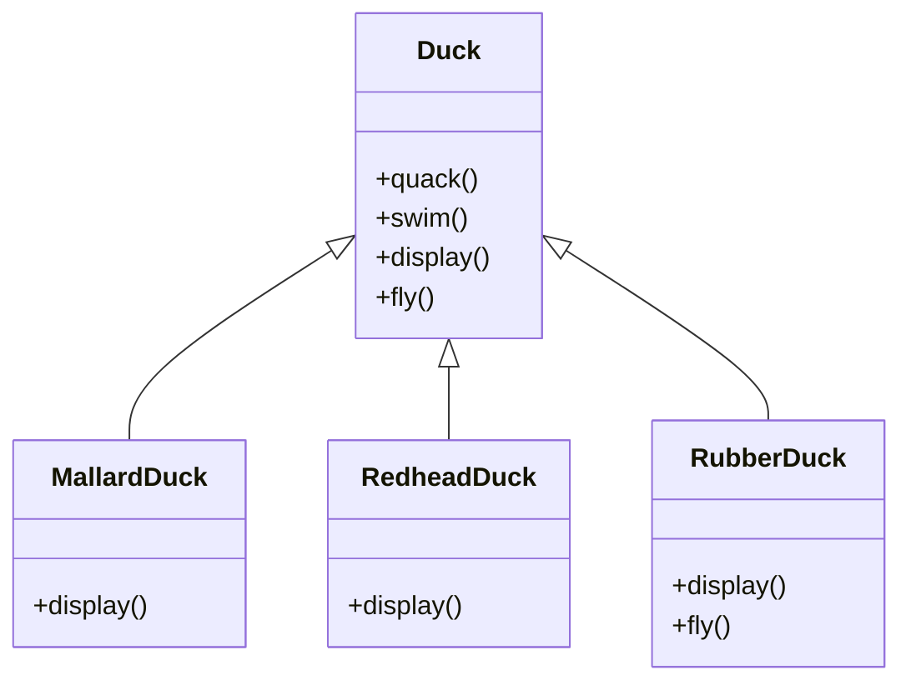

### The Scenario: The SimUDuck App

Imagine a simulation game with various types of ducks: **Mallard Ducks**, **Redhead Ducks**, **Rubber Ducks**, and **Decoy Ducks**.

### The Initial "Is-A" Approach

The most intuitive object-oriented approach is **Inheritance**. You create a Superclass called `Duck` and put shared behavior there to achieve code reuse.

### The Pitfalls of Inheritance

While this looks clean initially, it falls apart as requirements change.

#### 1. The Rubber Duck Problem (Unwanted Behavior)

The requirements change: We need the ducks to fly.

- **Action:** You add a `fly()` method to the `Duck` superclass.
- **Result:** All ducks inherit `fly()`.
- **Problem:** **Rubber Ducks** start flying around the screen. This is a bug. Rubber ducks should not fly.

#### 2. The "Overriding" Trap

You might think: _"I'll just override `fly()` in the `RubberDuck` class to do nothing."_

- **Problem:** You are now writing code to _remove_ behavior. This violates the **Liskov Substitution Principle**.
- **Maintenance Nightmare:** What happens when you add a `DecoyDuck` (wooden)? It doesn't fly _and_ it doesn't quack. Now you have to override `fly()` _and_ `quack()` to do nothing. Every new subclass requires you to audit every single method from the superclass to ensure it doesn't accidentally inherit unwanted behavior.

#### 3. The Horizontal Code Reuse Problem

This is the most critical failure of inheritance.
Imagine we have two special ducks:

1.  **Mountain Duck** (Flies using high-altitude gliding).
2.  **Cloud Duck** (Also flies using high-altitude gliding).
3.  **Mallard Duck** (Flies by flapping).

The `MountainDuck` and `CloudDuck` share the **exact same** flying code, but they are different branches of the hierarchy.

- If you put the code in the `Duck` superclass, the `Mallard` inherits the wrong flying style.
- If you implement it in `MountainDuck`, you have to copy-paste that code into `CloudDuck`.

**Inheritance allows sharing code vertically (parent to child), but not horizontally (between siblings or cousins).**

### Why this matters

> "The solution to problems with inheritance is rarely _more_ inheritance." — Sandy Metz

When behavior varies (different ducks fly differently) and overlaps in complex ways (some unrelated ducks fly the same way), inheritance leads to **code duplication** or **rigid hierarchies** that are impossible to maintain.
