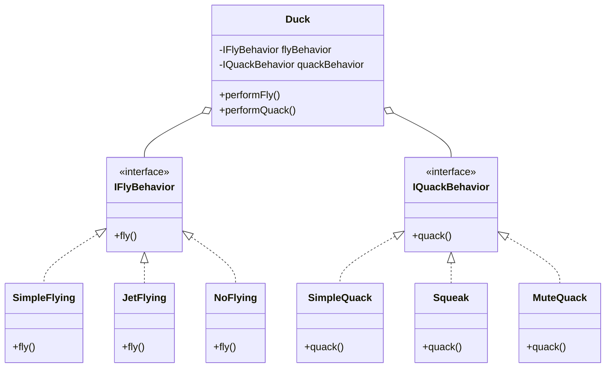

### The Core Principle

To solve the inheritance limitations, we apply a specific design principle:

> **Identify the aspects of your application that vary and separate them from what stays the same.**

In the Duck example:

- **Stays the same:** Ducks generally swim and have a general appearance logic.
- **Varies:** How they **Fly** and how they **Quack**.

### Implementing "Has-A" Relationships

Instead of a Duck _being_ a specific type of flyer (Is-A), a Duck _has_ a flying behavior (Has-A).

We extract the behaviors into **Interfaces**.

### Key Components

1.  ** The Client (Duck):**
    The Duck class no longer holds the logic for flying. It holds a variable of type `IFlyBehavior`. It delegates the task. When you call `duck.fly()`, the Duck internally calls `flyBehavior.fly()`.

2.  **The Interface (Strategy):**
    `IFlyBehavior` defines the contract. It usually has one method, e.g., `fly()`.

3.  **The Concrete Strategies:**
    These are the actual implementations:
    - `SimpleFlying`: Implements standard flapping.
    - `JetFlying`: Implements rocket-powered flight.
    - `NoFlying`: Implements an empty method (does nothing) - used for Rubber Ducks.

### Solving the Previous Problems

- **Rubber Ducks:** We simply give the Rubber Duck the `NoFlying` strategy. No need to override methods or break the inheritance chain.
- **Code Reuse (Horizontal Sharing):** If `MountainDuck` and `CloudDuck` both fly using high-altitude gliding, we create one class called `HighAltitudeFlying`. Both ducks are given an instance of this class. The code exists in **one place** only.
