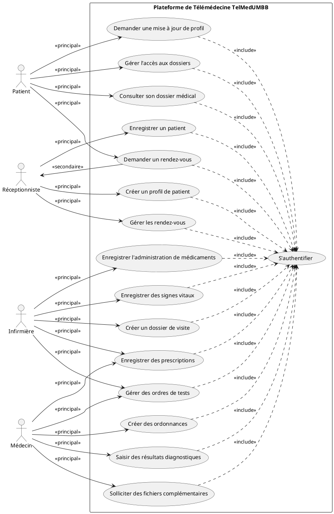
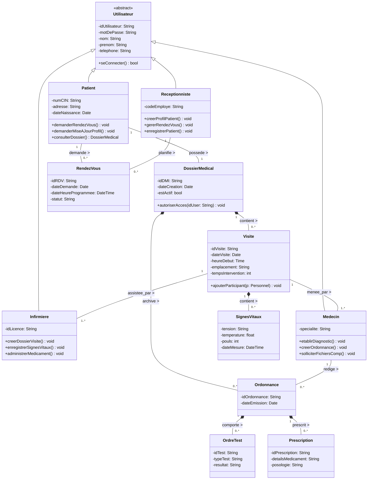
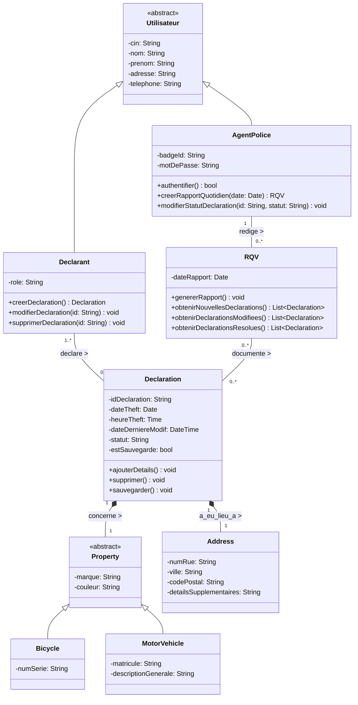
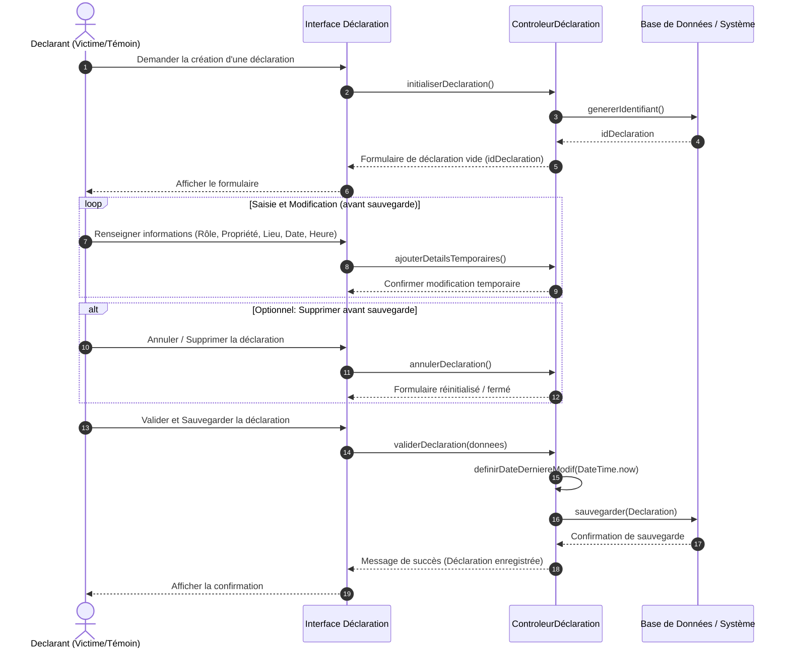
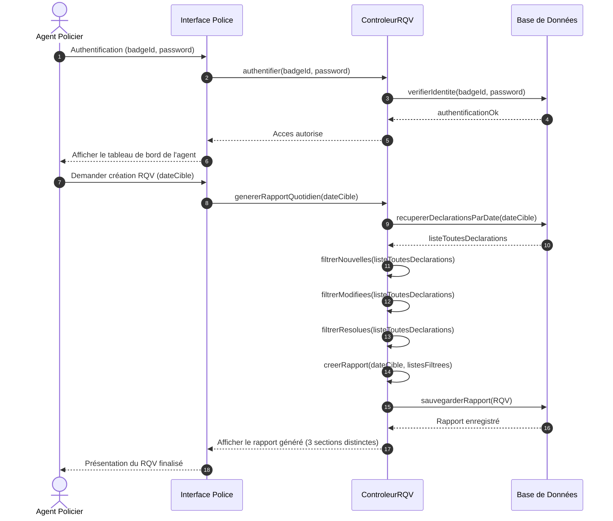

# Part 1: Continuous Assessment MCA — Telemedicine Platform "TelMedUMBB"

## 1. Use Case Diagram (Functional Requirements View)

### Methodological Rules Applied (From Lecture Slides)
* **Naming Convention**: Every Use Case is named with an infinitive verb followed by a direct object/complement (e.g., *Consulter dossier*, *Planifier rendez-vous*).
* **Actor Identification**:
  * **Principal Actors** (Slide 11): Those who directly interact with the system to initiate and benefit from a use case (e.g., `Patient`, `Réceptionniste`, `Infirmière`, `Médecin`).
  * **Secondary Actors** (Slide 11): Those who are requested by the system to perform a transaction or provide information.
* **Stereotyped Associations**: When secondary actors are introduced, associations are stereotyped as `<<principal>>` or `<<secondaire>>` (Slide 11).
* **Include Relationship (`<<include>>`)**: Applied for mandatory dependencies (e.g., authentication `S'authentifier` is an absolute pre-requisite for accessing and modifying the EHR/DMI).

### PlantUML Use Case Code
Below is the clean PlantUML specification. You can copy this code directly into any PlantUML rendering engine or Obsidian PlantUML block.

---

## 2. Class Diagram (Logical View)

### Methodological Rules Applied (From Lecture Slides)
* **Encapsulation & Visibility**: Attributes are declared private (`-`), operations are public (`+`) (Slide 11).
* **Typing**: Attributes and methods are strictly typed with standard types (e.g., `String`, `Date`, `bool`, `void`) (Slide 12).
* **Multiplicity**: Annotated on every association end (e.g., `0..*`, `1`) to denote limits precisely (Slide 28).
* **Inheritance/Generalization**: The logical view sets up an inheritance tree where clinic personnel and patients inherit generic identification attributes from an abstract class `Utilisateur` (Slide 59).

---

# Part 2: Evaluation 2 — Daily Flight Theft Reports System ("Rapports Quotidiens de Vol - RQV")

## 1. Structural Class Diagram

### Methodological Rules Applied (From Lecture Slides)
* **Inheritance on Entities**: Stolen property (`Property`) is modeled using generalization/specialization into `Bicycle` and `MotorVehicle` (Slide 59) because they have distinct identifiers (`numero de serie` vs `matricule`).
* **Attributes Grouping**: Addresses are grouped into an object structure class (`Address`) to avoid bloated attributes in the `Declaration` class.
* **Association Class / Qualifier Options**: The direct mapping shows a clear dependency where declarations are linked to the daily reports (RQV).

---

## 2. Sequence Diagrams

### a) Creating a New Declaration (Créer une nouvelle déclaration)

---

### b) Creating a Daily Flight Report (Créer un rapport quotidien de vol - RQV)

