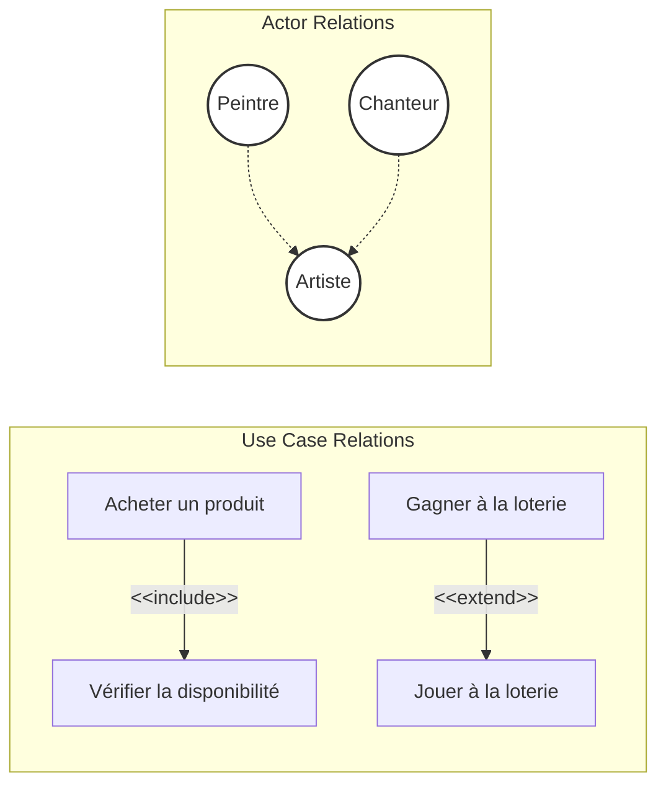
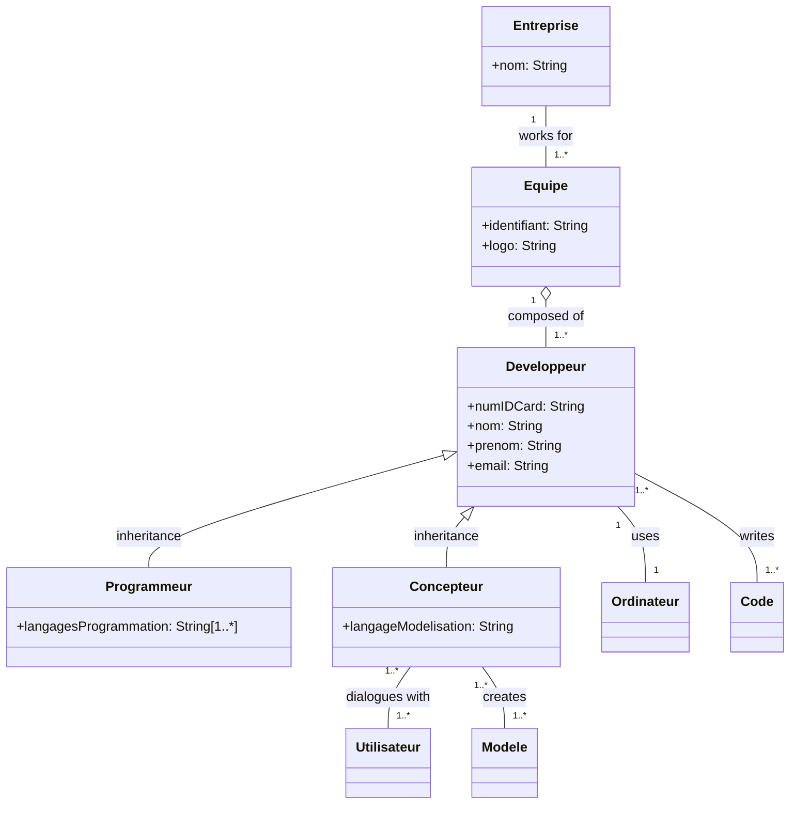
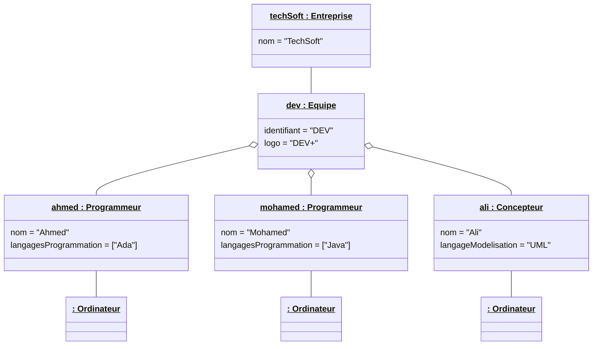
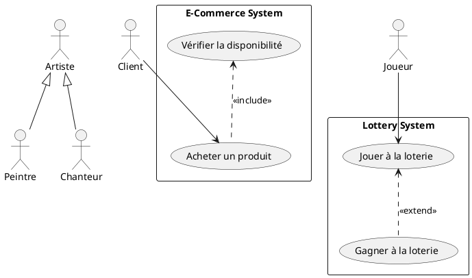
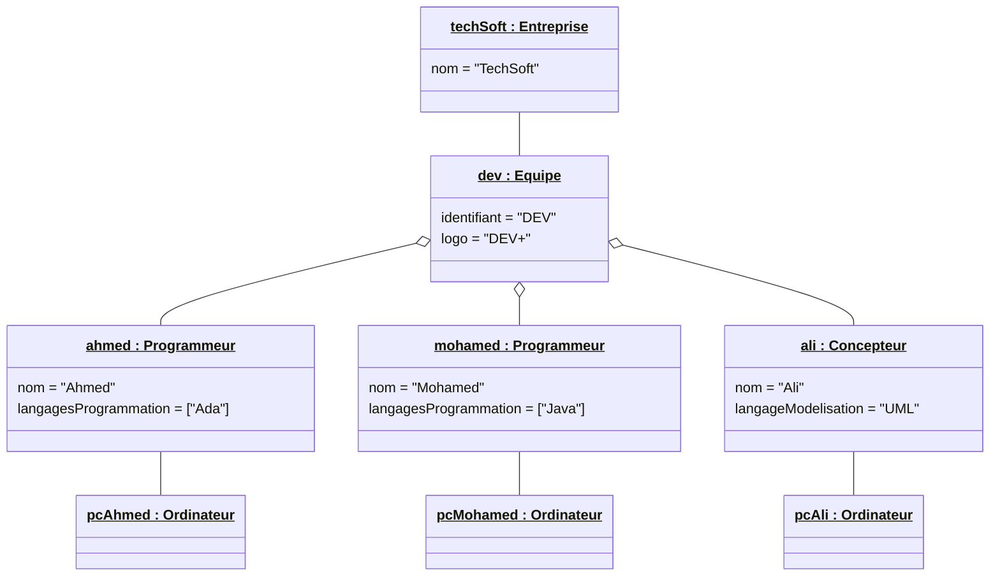
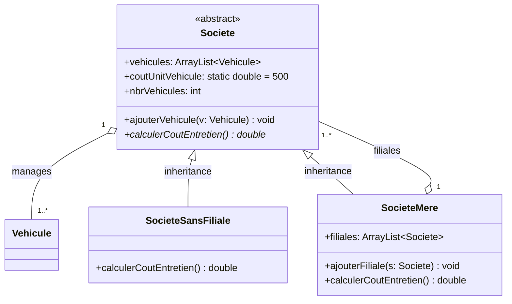
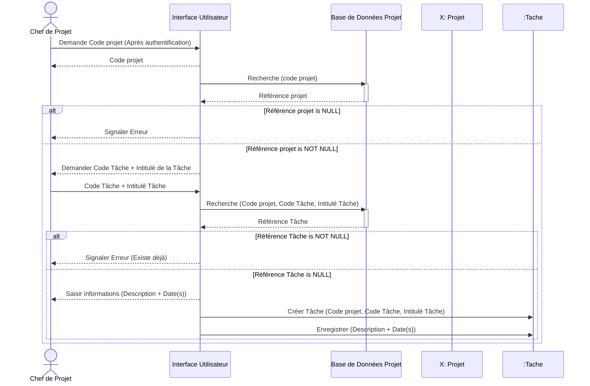

### **Exercise 1: Use Case and Actor Relations**

#### **1. Use Case "Acheter un produit" (Buy a product) and "Vérifier la disponibilité du produit" (Verify product availability)**
*   **Relationship**: **Inclusion (`<<include>>`)**
*   **Direction**: `Acheter un produit` $\rightarrow$ `Vérifier la disponibilité du produit`.
*   **Justification**: According to **Slide 18**, an inclusion is a **mandatory** dependency used to factor out a shared sub-step from a use case. Since buying a product strictly requires checking if the item is available first, the verification step is a mandatory part of the buying process. This aligns with the slide definition: *"B is a mandatory part of A, read as A includes B (in the direction of the arrow)"*.

#### **2. Actor "Peintre" (Painter), "Artiste" (Artist), and "Chanteur" (Singer)**
*   **Relationship**: **Generalization / Specialization**
*   **Direction**: Hollow triangle arrows pointing from `Peintre` and `Chanteur` toward `Artiste`.
*   **Justification**: According to **Slide 16**, generalization is the *only possible relationship* between two actors. "Artiste" is the generalized actor, while "Peintre" and "Chanteur" are specialized profiles. As defined on Slide 16: *"Actor 1 is a generalization of Actor 2, and Actor 2 is a specialization of Actor 1"*.

#### **3. Use Case "Jouer à la loterie" (Play the lottery) and "Gagner à la loterie" (Win the lottery)**
*   **Relationship**: **Extension (`<<extend>>`)** [[Qs2]]
*   **Direction**: `Gagner à la loterie` $\rightarrow$ `Jouer à la loterie`.
*   **Justification**: According to **Slide 18**, an extension is an **optional** dependency, typically subject to a specific condition. Winning the lottery is an optional outcome of playing that only occurs under a specific condition (e.g., matching the drawn numbers). This aligns with the slide definition: *"B is an optional part of A, read as B extends A (in the direction of the arrow)"*.



---

### **Exercise 2: Class and Object Diagrams**

#### **Q1. Class Diagram**

**Methodology & Analysis (following Slide guidelines):**
1.  **Classes & Attributes Identification (Slides 3, 7, 10):**
    *   `Equipe` (Team): "Une équipe... travaille pour une entreprise et possède un identifiant et un logo" $\rightarrow$ Attributes: `identifiant: String`, `logo: String`. (The verb *possède* is singular, meaning these attributes belong directly to the Team).
    *   `Entreprise` (Company): "travaille pour une entreprise" $\rightarrow$ Attribute: `nom: String` (implied by "TechSoft" in Q2).
    *   `Developpeur` (Developer): "caractérisé par le numéro de sa carte d'identité, son nom, son prénom et son émail" $\rightarrow$ Attributes: `numIDCard: String`, `nom: String`, `prenom: String`, `email: String`.
    *   `Ordinateur` (Computer): "utilise un ordinateur personnel". No explicit attributes.
    *   `Programmeur` (Programmer): Inherits from `Developpeur`. Attribute: `langagesProgrammation: String[1..*]` (Slide 19 array notation for "one or more languages").
    *   `Concepteur` (Designer): Inherits from `Developpeur`. Attribute: `langageModelisation: String`.
    *   `Code`: "Les développeurs écrivent le code".
    *   `Utilisateur` (User): "Les concepteurs dialoguent avec les utilisateurs".
    *   `Modele` (Model): "et créent les modèles".

2.  **Relationships & Multiplicities Identification (Slides 26, 29, 61, 65):**
    *   `Equipe` / `Developpeur`: "Une équipe... est composée de développeurs". Since a developer exists as an individual outside the team, this represents a weak whole-part relation, modelled as an **Aggregation** (white diamond on the `Equipe` side, Slide 61). Multiplicity: 1 Team contains `1..*` Developers.
    *   `Equipe` / `Entreprise`: "Elle travaille pour une entreprise". Multiplicity: 1 Team works for 1 Company.
    *   `Developpeur` / `Ordinateur`: "il utilise un ordinateur qui lui est personnel". This is a 1-to-1 association. Multiplicity: `1` Developer uses `1` Computer.
    *   `Developpeur` / `Programmeur` / `Concepteur`: "Un développeur peut être un programmeur... ou un concepteur". This is **Inheritance (Generalization)** (Slide 65). `Developpeur` is the superclass.
    *   `Developpeur` / `Code`: Association ("écrivent"). Multiplicity: `1..*` Developers write `1..*` Code.
    *   `Concepteur` / `Utilisateur`: Association ("dialoguent"). Multiplicity: `1..*` Designers dialogue with `1..*` Users.
    *   `Concepteur` / `Modele`: Association ("créent"). Multiplicity: `1..*` Designers create `1..*` Models.



---

#### **Q2. Object Diagram**

**Methodology & Analysis (following Slide 77):**
*   Objects are represented with underlined headers containing: `objectName : ClassName` (or `: ClassName` for anonymous instances).
*   Attributes inside show assigned values.
*   Links represent instantiated associations (no multiplicities on links).

**1. Instance Extraction:**
*   *Company*: `techSoft : Entreprise` (nom = "TechSoft").
*   *Team*: `dev : Equipe` (identifiant = "DEV", logo = "DEV+").
*   *Programmers*:
    *   `ahmed : Programmeur` (nom = "Ahmed", langagesProgrammation = ["Ada"]).
    *   `mohamed : Programmeur` (nom = "Mohamed", langagesProgrammation = ["Java"]).
*   *Designer*:
    *   `ali : Concepteur` (nom = "Ali", langageModelisation = "UML").
*   *Computers*: Three anonymous instances of `Ordinateur` (since each developer uses their own personal computer): `: Ordinateur`, `: Ordinateur`, `: Ordinateur`.

**2. Link Instances:**
*   `dev` is linked to `techSoft`.
*   `ahmed`, `mohamed`, and `ali` are linked to `dev` via aggregation links.
*   Each of `ahmed`, `mohamed`, and `ali` is linked to one of the anonymous `: Ordinateur` objects.




# Section 1: Test N°1 (MCA) Solution

---

## Exercice 1: Use Case and Actor Relations

### 1. "Acheter un produit" and "Vérifier la disponibilité du produit"
* **Relation**: **Inclusion (`<<include>>`)**
* **Direction**: From `Acheter un produit` to `Vérifier la disponibilité du produit`.
* **Justification (Slide 18)**: According to the slides, an inclusion represents a mandatory step: *"B is a mandatory part of A, read as A includes B (in the direction of the arrow)"*. To buy a product, the system must perform the verification check first.

### 2. "Peintre", "Artiste", and "Chanteur"
* **Relation**: **Generalization (Inheritance)**
* **Direction**: Hollow triangle arrows pointing from `Peintre` and `Chanteur` to `Artiste`.
* **Justification (Slide 16)**: Generalization is the only valid relationship between two actors. `Artiste` represents the general concept, while `Peintre` and `Chanteur` are specialized actor roles inheriting from it.

### 3. "Jouer à la loterie" and "Gagner à la loterie"
* **Relation**: **Extension (`<<extend>>`)**
* **Direction**: From `Gagner à la loterie` to `Jouer à la loterie`.
* **Justification (Slide 18)**: An extension represents an optional step subject to a condition: *"B is an optional part of A, read as B extends A (in the direction of the arrow)"*. Gagner (winning) is an optional branch of Jouer (playing).

---

### Use Case Diagrams

#### PlantUML Format


#### Mermaid Format

```mermaid
flowchart TD
    %% Styling
    classDef actorNode fill:#ffffff,stroke:#333333,stroke-width:2px;
    classDef usecaseNode fill:#f0f8ff,stroke:#005b96,stroke-width:2px;

    %% Actor Hierarchy
    subgraph ActorGeneralization [Actor Generalization]
        artiste["  웃  <br><b>Artiste</b>"]:::actorNode
        peintre["  웃  <br><b>Peintre</b>"]:::actorNode
        chanteur["  웃  <br><b>Chanteur</b>"]:::actorNode
        
        peintre -->|Généralisation| artiste
        chanteur -->|Généralisation| artiste
    end

    %% Systems & Use Cases
    subgraph ECommerceBoundary [System: Product Management]
        direction LR
        client["  웃  <br><b>Client</b>"]:::actorNode
        acheter(["<b>Acheter un produit</b>"]):::usecaseNode
        verifier(["<b>Vérifier la disponibilité</b>"]):::usecaseNode
        
        client --- acheter
        acheter -.->|&lt;&lt;include&gt;&gt;| verifier
    end

    subgraph LotteryBoundary [System: Lottery Game]
        direction LR
        joueur["  웃  <br><b>Joueur</b>"]:::actorNode
        jouer(["<b>Jouer à la loterie</b>"]):::usecaseNode
        gagner(["<b>Gagner à la loterie</b>"]):::usecaseNode
        
        joueur --- jouer
        gagner -.->|&lt;&lt;extend&gt;&gt;| jouer
    end

    style ActorGeneralization fill:#fafafa,stroke:#cccccc,stroke-width:1px,stroke-dasharray: 5 5;
    style ECommerceBoundary fill:#ffffff,stroke:#002244,stroke-width:2px;
    style LotteryBoundary fill:#ffffff,stroke:#002244,stroke-width:2px;
```


---

## Exercice 2: Class & Object Diagrams (IT Developer Team)

### Q1. Class Diagram
* **Aggregation**: An `Equipe` (Team) is composed of `Developpeurs`. Since developers can exist independently of a specific team, this is represented by an aggregation (white diamond) on the `Equipe` side.
* **Generalization**: `Programmeur` and `Concepteur` inherit from the superclass `Developpeur`.


---

### Q2. Object Diagram (Ahmed, Mohamed, and Ali)
* Instantiates the class architecture with concrete data.
* Objects are represented in the standard underlined format: `objectName : ClassName`.



---
---

# Section 2: Examen MCA (M1-S2) - Gaceb (FS, UMBB)

## Exercice 1: Course Questions (5 pts)

### 1. Package Relations
* **Merge (`<<merge>>`)**: Represents the fusion of two packages into a single package. The contents of the target package are integrated into the source package.
* **Access (`<<access>>`)**: Allows a package to access all public elements of another target package. However, these elements keep a **private** visibility inside the accessing package (non-transitive).
* **Import (`<<import>>`)**: Represents the import of all public elements of the target package. These imported elements obtain a **public** visibility inside the importing package (transitive to other importing packages).

### 2. RUP Process
* **a) 8 Test Types**:
  1. Benchmark
  2. Configuration
  3. Functioning (*Fonctionnement*)
  4. Installation
  5. Integrity (*Intégrité*)
  6. Load (*Charge*)
  7. Performance
  8. Stress
* **b) Definition of an Artefact**: An artefact is any piece of information produced, modified, or consumed by the process. They represent the concrete deliverables or products of the project.
* **c) 4 Objectives of the Transition Phase**:
  1. Execute beta tests to validate usability.
  2. Train users and system maintainers.
  3. Prepare the deployment site.
  4. Prepare the final launch and obtain stakeholder sign-off.

### 3. CASE Tool (AGL) Integration Levels
The three levels of CASE tool integration are:
1. **Data Integration** (*Intégrité/Intégration des données*)
2. **User Interface Integration** (*Intégration de l'interface utilisateur*)
3. **Activity Integration** (*Intégration des activités*)

---

## Exercice 2: Composite Pattern (Vehicle Fleet) (5 pts)

### A) Class Diagram
The **Composite Pattern** allows treating single objects (`SocieteSansFiliale`) and compositions of objects (`SocieteMere`) uniformly under the abstract component (`Societe`).



---

### B) Java Code Implementation
```java
import java.util.*;

class Vehicule { }

abstract class Societe {
    public ArrayList<Vehicule> vehicules = new ArrayList<Vehicule>();
    public static double coutUnitVehicule = 500;
    public int nbrVehicules;

    public abstract double calculerCoutEntretien();

    public void ajouterVehicule(Vehicule v) {
        this.vehicules.add(v);
    }
}

class SocieteSansFiliale extends Societe {
    public double calculerCoutEntretien() {
        return nbrVehicules * coutUnitVehicule;
    }
}

class SocieteMere extends Societe {
    public ArrayList<Societe> filiales = new ArrayList<Societe>();

    public void ajouterFiliale(Societe f) {
        filiales.add(f);
    }

    public double calculerCoutEntretien() {
        double cout = 0.0;
        for (Societe f : filiales) {
            cout += f.calculerCoutEntretien();
        }
        return cout + nbrVehicules * coutUnitVehicule;
    }
}
```

---

## Exercice 3: Task Creation Sequence Diagram (3 pts)

Recreation of the hand-drawn project sequence diagram from **Page 3**:



---

## Exercice 4: Complex Project Management Class Diagram (4 pts)

Reconstruction of the comprehensive structural class diagram shown on **Page 4**:

```mermaid
classDiagram
    class Projet {
        +id: String
        +nom: String
    }

    class Equipe {
        +idEquipe: String
    }

    class Agent {
        -matricule: String
        -nom: String
        -prenom: String
        -dateRecrutement: Date
        -qualification: String
    }

    class Tâche {
        +intitulé: String
        +description: String
        +dateDebut: Date
        +dateFin: Date
        +dateEffective: Date
        +datePlanification: Date
    }

    class Ressource {
        <<abstract>>
        +idRessource: String
    }

    class OutilLogiciel {
        +licence: String
    }

    class OutilMatériel {
        +numSerie: String
    }

    class Produit {
        <<abstract>>
        +nomProduit: String
    }

    class CahierDeCharges
    class DocConception
    class RapportDeTest
    class CodeSource

    class Réunion {
        +dateReunion: Date
    }

    class ProblèmeDécision {
        +description: String
        +solution: String
    }

    class Rapport {
        +tauxRealisation: float
        +typeRapport: String
    }

    class Période {
        +dateDebut: Date
        +dateFin: Date
    }

    %% Inheritance Trees
    Ressource <|-- Agent
    Ressource <|-- OutilLogiciel
    Ressource <|-- OutilMatériel

    Produit <|-- CahierDeCharges
    Produit <|-- DocConception
    Produit <|-- RapportDeTest
    Produit <|-- CodeSource

    %% Associations & Aggregations
    Projet "1" *-- "0..*" Equipe : structured by
    Projet "1" *-- "1..*" Tâche : contains
    Projet "1" -- "1" Agent : Responsable de Projet
    
    Equipe "1" *-- "0..*" Agent : composed of
    (Equipe, Agent) .. Période : active during

    Tâche "0..*" -- "1..*" Ressource : uses
    Tâche "1" -- "0..*" Produit : Cree
    Tâche "1" -- "0..*" Produit : Consomme
    Tâche "1" --> "0..*" Tâche : Précédence

    Ressource "1..*" -- "0..*" Réunion : Concerne
    Réunion "1" *-- "0..*" ProblèmeDécision : génère

    Projet "1" -- "0..*" Rapport : produces
```