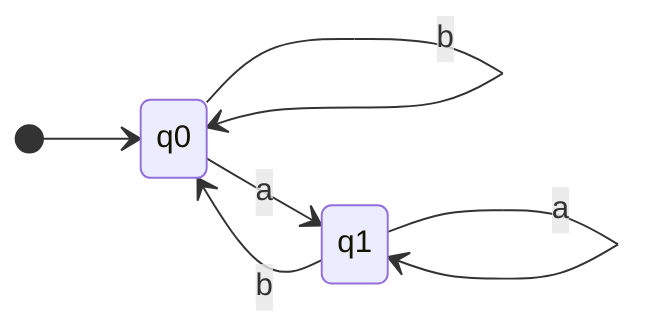
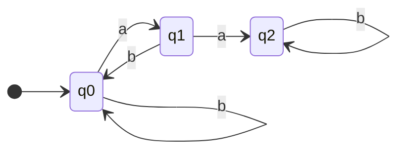
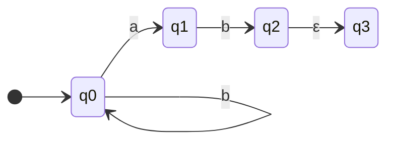
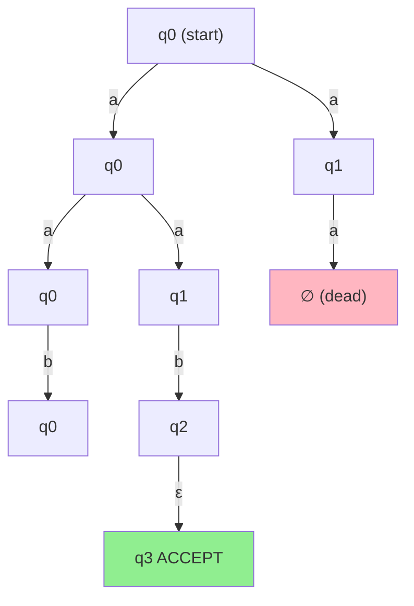
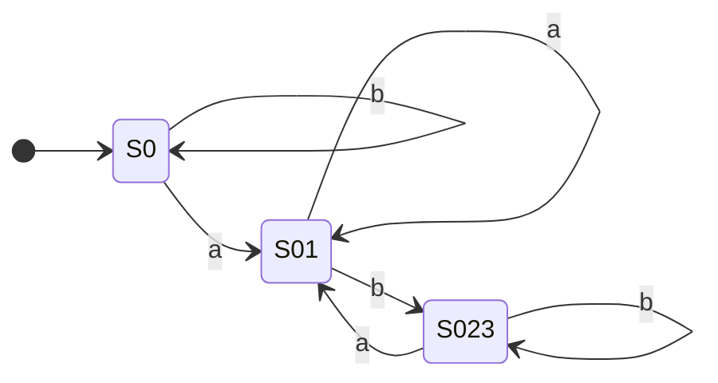
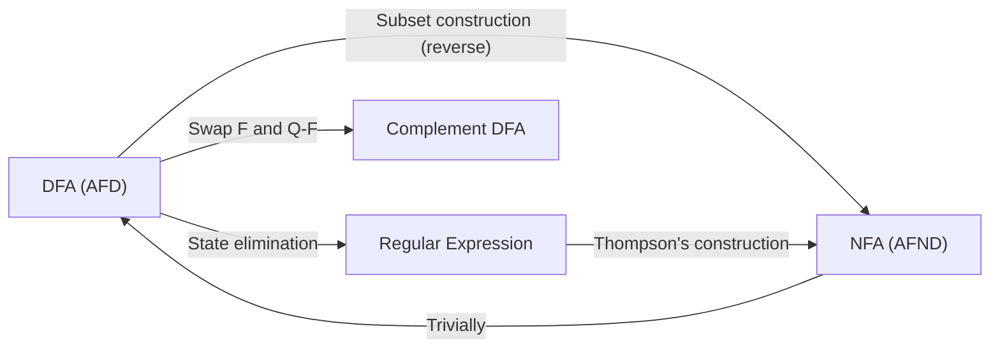

# 1. Finite Automata and Regular Languages

> [!important] Chapter Overview
> This chapter introduces the foundational model of computation known as **finite automata** (automates finis) and the class of languages they recognize: **regular languages** (langages rationnels). Finite automata are the simplest computational model in the Chomsky hierarchy, yet they capture a rich and practically important class of languages. Understanding them deeply is essential before tackling pushdown automata, Turing machines, and decidability in later chapters.

> [!info] French Terminology
> In the French mathematical tradition (and in this course):
> - **DFA** = **AFD** (Automate Fini Déterministe)
> - **NFA** = **AFND** (Automate Fini Non-Déterministe)
> - **Regular language** = **Langage rationnel**
> - **Regular expression** = **Expression rationnelle**
> - **Transition function** = **Fonction de transition**
> - **Start state** = **État initial**
> - **Accepting/final state** = **État final / État acceptant**
> - **Alphabet** = **Alphabet**
> - **Word/string** = **Mot**
> - **Empty word** = **Mot vide** (denoted $\varepsilon$)

---

## 1.1 Formal Definition of a Deterministic Finite Automaton (DFA / AFD)

> [!definition] Deterministic Finite Automaton (DFA / AFD)
> A **Deterministic Finite Automaton** is a 5-tuple $A = (Q, \Sigma, \delta, s, F)$ where:
>
> 1. $Q$ is a **finite** set of states (états)
> 2. $\Sigma$ is a **finite** alphabet of input symbols
> 3. $\delta: Q \times \Sigma \to Q$ is the **transition function** (fonction de transition)
> 4. $s \in Q$ is the **start state** (état initial) — there is exactly one
> 5. $F \subseteq Q$ is the set of **accepting** (or **final**) states (états finaux)

Let us now examine each component in exhaustive detail.

### 1.1.1 The Set of States Q

The set $Q$ is a finite, non-empty set of states. Each state represents a "memory configuration" of the automaton. The crucial property of a **finite** automaton is that this set is finite — the machine can only remember a bounded amount of information about what it has read so far. This is what makes finite automata strictly less powerful than Turing machines.

> [!tip] Intuition for States
> Think of each state as a "summary" of the relevant information the automaton has gathered from the input read so far. For example, if we want to detect whether a word contains "bb", we need to remember whether we just saw a "b" (and are "halfway" to seeing "bb") or whether we have already seen "bb". This is why 3 states suffice for that language.

> [!warning] Common Pitfall
> Students sometimes confuse "finite set of states" with "fixed number of states." The set $Q$ can have any finite cardinality — it could have 1 state, 5 states, or 1,000,000 states. What matters is that it is finite (not infinite). The number of states depends on the complexity of the language being recognized.

### 1.1.2 The Alphabet Sigma

The alphabet $\Sigma$ is a finite, non-empty set of symbols. Common examples include:
- $\Sigma = \{a, b\}$ — binary alphabet (often used in exercises)
- $\Sigma = \{0, 1\}$ — bit alphabet
- $\Sigma = \{a, b, c, \ldots, z\}$ — the Latin lowercase alphabet

A **word** (mot) over $\Sigma$ is a finite sequence of symbols from $\Sigma$. The set of all words over $\Sigma$ is denoted $\Sigma^*$ (this includes the empty word $\varepsilon$). A **language** (langage) over $\Sigma$ is any subset $L \subseteq \Sigma^*$.

> [!info] Notation
> - $\Sigma^*$ = all finite words over $\Sigma$, including $\varepsilon$
> - $\Sigma^+$ = all finite non-empty words over $\Sigma$ (i.e., $\Sigma^* \setminus \{\varepsilon\}$)
> - $|w|$ = length of word $w$
> - $|\varepsilon| = 0$

### 1.1.3 The Transition Function delta

The transition function $\delta: Q \times \Sigma \to Q$ is the "engine" of the automaton. Given a current state $q \in Q$ and an input symbol $a \in \Sigma$, the function $\delta(q, a)$ returns the **unique** next state. There are two critical properties encoded in the type signature $\delta: Q \times \Sigma \to Q$:

1. **Complete**: For every pair $(q, a) \in Q \times \Sigma$, the value $\delta(q, a)$ is defined. There are no "missing" transitions. The automaton always has somewhere to go.

2. **Deterministic**: For every pair $(q, a) \in Q \times \Sigma$, the value $\delta(q, a)$ is a **single** state (not a set of states). There is never a choice about where to go.

> [!warning] Completeness is Essential for Complement
> The completeness property (every transition defined) is crucial when we want to take the **complement** of a DFA. The complement operation (swapping final and non-final states) only produces a correct result when the original DFA is complete. If some transitions were missing, swapping final/non-final states would not correctly recognize the complement language, because words that "fall off" the automaton (undefined transitions) would not be handled properly.
>
> In practice, if a DFA diagram shows some transitions as "going to a dead state" or "sink state," this sink state must be explicitly included as a member of $Q$ to ensure completeness.

**Representing the transition function as a table:**

The transition function is often represented as a table where rows correspond to states and columns correspond to symbols:

|       | a     | b     |
|-------|-------|-------|
| q0    | q0    | q1    |
| q1    | q0    | q2    |
| q2    | q2    | q2    |

This table completely specifies $\delta$. For instance, $\delta(q_0, a) = q_0$ and $\delta(q_1, b) = q_2$.

### 1.1.4 The Start State s

The start state $s \in Q$ is the state in which the automaton begins processing the input. There is **exactly one** start state (this is a key difference from NFAs, which may have multiple). In diagrams, the start state is conventionally indicated by an arrow coming from "nowhere" (a small arrow pointing into the state from the left).

### 1.1.5 The Set of Final States F

The set $F \subseteq Q$ is the set of accepting (final) states. When the automaton finishes reading the entire input word and is currently in a state $q \in F$, the word is **accepted**. If the final state is $q \notin F$, the word is **rejected**. In diagrams, final states are drawn with a double circle.

$F$ can be empty (the automaton accepts nothing), or $F$ can equal $Q$ (the automaton accepts everything, including $\varepsilon$ if $s \in F$).

### 1.1.6 Word Acceptance

> [!definition] Word Acceptance by a DFA
> A word $w = w_1 w_2 \cdots w_n \in \Sigma^*$ is **accepted** by a DFA $A = (Q, \Sigma, \delta, s, F)$ if there exists a sequence of states $r_0, r_1, \ldots, r_n$ such that:
> 1. $r_0 = s$ (we start in the start state)
> 2. $r_{i+1} = \delta(r_i, w_{i+1})$ for all $0 \leq i < n$ (each transition is valid)
> 3. $r_n \in F$ (we end in an accepting state)
>
> The **language recognized** by $A$ is $L(A) = \{ w \in \Sigma^* \mid w \text{ is accepted by } A \}$.

The key insight is that the sequence of states $r_0, r_1, \ldots, r_n$ is **uniquely determined** by the input word (because the automaton is deterministic). There is no ambiguity about whether a word is accepted or rejected — either the unique path ends in $F$ or it does not.

> [!tip] The Empty Word
> The empty word $\varepsilon$ is accepted if and only if $s \in F$ (the start state is also a final state). When we process $\varepsilon$, we read zero symbols, so we stay in the start state. If the start state happens to be accepting, then $\varepsilon \in L(A)$.

### 1.1.7 The Extended Transition Function

> [!definition] Extended Transition Function
> The **extended transition function** $\delta^*: Q \times \Sigma^* \to Q$ extends $\delta$ from single symbols to entire words. It is defined recursively:
>
> - **Base case:** $\delta^*(q, \varepsilon) = q$ (reading nothing leaves you where you are)
> - **Recursive step:** $\delta^*(q, wa) = \delta(\delta^*(q, w), a)$ for all $w \in \Sigma^*$, $a \in \Sigma$
>
> In other words, to compute $\delta^*(q, w)$, we process the symbols of $w$ one at a time from left to right, applying $\delta$ at each step.

Using $\delta^*$, we can restate acceptance more concisely: a word $w$ is accepted by $A$ if and only if $\delta^*(s, w) \in F$.

**Example:** Suppose $\delta(q_0, a) = q_0$ and $\delta(q_0, b) = q_1$. Then:
- $\delta^*(q_0, \varepsilon) = q_0$
- $\delta^*(q_0, b) = \delta(\delta^*(q_0, \varepsilon), b) = \delta(q_0, b) = q_1$
- $\delta^*(q_0, ab) = \delta(\delta^*(q_0, a), b) = \delta(q_0, b) = q_1$
- $\delta^*(q_0, aab) = \delta(\delta^*(q_0, aa), b) = \delta(q_0, b) = q_1$

### 1.1.8 DFA vs NFA (AFD vs AFND)

The difference between a DFA and an NFA lies in the transition function:

| Property | DFA (AFD) | NFA (AFND) |
|----------|-----------|------------|
| Transition function | $\delta: Q \times \Sigma \to Q$ | $\delta: Q \times (\Sigma \cup \{\varepsilon\}) \to \mathcal{P}(Q)$ |
| Number of next states | Exactly one | A set (possibly empty, possibly many) |
| Epsilon transitions | Not allowed | Allowed |
| Start state | Exactly one | Exactly one |
| Acceptance | The unique path ends in F | At least one path ends in F |

Where $\mathcal{P}(Q)$ denotes the power set of $Q$ (the set of all subsets of $Q$).

> [!important] Fundamental Equivalence
> Despite the apparent extra flexibility of NFAs, **DFAs and NFAs recognize exactly the same class of languages**: the regular languages. For every NFA, there exists an equivalent DFA (constructed via the subset construction), and every DFA is trivially an NFA. However, NFAs can be exponentially more compact — an NFA with $n$ states may require up to $2^n$ states as an equivalent DFA.

---

## 1.2 Analyzing an Existing DFA (Exos-AFD Exercise 1)

In Exercise 1 of the exercise sheet (Exos-AFD), you are given an AFD $A_1$ and asked to:
1. Describe the language $L(A_1)$ in natural language
2. Find a regular expression for $L(A_1)$
3. Verify using JFLAP

Since the specific DFA diagram from the PDF is not reproduced here, we explain the **general methodology** for analyzing any given DFA, then provide a complete worked example.

### 1.2.1 How to Read a DFA Diagram

A DFA diagram (also called a state transition diagram or state diagram) is a directed graph where:

- **Nodes** (circles) represent states, labeled with their names ($q_0, q_1, q_2, \ldots$)
- **Edges** (arrows) represent transitions, labeled with the input symbol that triggers them
- An **arrow from nowhere** pointing to a state indicates the start state
- A **double circle** indicates a final/accepting state

> [!tip] Reading Strategy
> When you first look at a DFA diagram, do the following:
> 1. Identify the start state (arrow from nowhere)
> 2. Identify the final states (double circles)
> 3. Trace several example words through the automaton by hand — both words that should be accepted and words that should be rejected
> 4. Look for structural patterns: "trap states" (states with all transitions looping back to themselves), "counting" behavior, "memory" of recent symbols, etc.
> 5. Try to describe in English (or French) what property a word must have to reach a final state

### 1.2.2 Extracting the Formal Definition from a Diagram

Given a diagram, you can mechanically extract the 5-tuple:

1. **Q**: List all states shown in the diagram (each circle is a state)
2. **$\Sigma$**: Collect all symbols that appear on transitions (if a symbol never appears on any transition, it is not in the alphabet)
3. **$\delta$**: Read off every arrow: an arrow from state $p$ to state $q$ labeled $a$ means $\delta(p, a) = q$. Create a table.
4. **s**: The state with the arrow from nowhere
5. **F**: All states with double circles

### 1.2.3 Describing the Accepted Language in Natural Language

This is often the hardest part. General strategies:

- **Trace words**: Run several words through the automaton. For each, note whether it is accepted or rejected.
- **Characterize states**: Try to understand what each state "remembers." Give each state an English description.
- **Identify the pattern**: What do all accepted words have in common? What property must a word satisfy?
- **Test boundary cases**: The empty word $\varepsilon$, single-symbol words, long words with specific patterns.

### 1.2.4 Worked Example: Words Over a,b Containing the Substring "bb"

Let us construct and analyze a DFA that accepts all words over $\Sigma = \{a, b\}$ that contain the substring "bb".

**Step 1: Identify the states and their meaning**

We need to track how many consecutive b's we have seen most recently:
- $q_0$: "I have not seen any b recently (or the last character was a, resetting the count)"
- $q_1$: "I have seen exactly one b at the end of what I have read so far"
- $q_2$: "I have seen two or more consecutive b's — I have found 'bb'!"

**Step 2: Formal definition**

$A = (Q, \Sigma, \delta, s, F)$ where:
- $Q = \{q_0, q_1, q_2\}$
- $\Sigma = \{a, b\}$
- $s = q_0$
- $F = \{q_2\}$

**Transition function table:**

|       | a     | b     |
|-------|-------|-------|
| q0    | q0    | q1    |
| q1    | q0    | q2    |
| q2    | q2    | q2    |

Let us verify each entry:
- $\delta(q_0, a) = q_0$: reading an 'a' resets the count of consecutive b's
- $\delta(q_0, b) = q_1$: reading a 'b' means we have seen one consecutive b
- $\delta(q_1, a) = q_0$: reading an 'a' resets the count (the streak of b's is broken)
- $\delta(q_1, b) = q_2$: reading another 'b' means we have seen "bb" — success!
- $\delta(q_2, a) = q_2$: once we have seen "bb", we stay accepting forever (it does not matter what comes after)
- $\delta(q_2, b) = q_2$: same reasoning

Notice that $q_2$ is a **trap state** (also called a **sink state**) — once entered, the automaton can never leave. It is an accepting trap state.

**Step 3: Mermaid state diagram**

> [!info] Reading the Mermaid Diagram
> - `[*] --> q0` indicates that $q_0$ is the start state
> - The transitions are labeled with the symbol that triggers them
> - In JFLAP and in standard notation, $q_2$ would be drawn with a double circle to indicate it is a final state. Mermaid's stateDiagram does not natively support double circles, so we note it explicitly: **$q_2$ is the final state**.

**Step 4: Language description**

$L(A) = \{ w \in \{a, b\}^* \mid w \text{ contains the substring } bb \}$

In plain English: "The set of all words over $\{a, b\}$ that contain at least one occurrence of two consecutive b's."

**Step 5: Regular expression**

The regular expression for this language is:

$$(a \cup b)^* bb (a \cup b)^*$$

> [!warning] Common Pitfall — Why the Prefix is Necessary
> A very common mistake is to write the regular expression as just $bb(a \cup b)^*$ or even just $bb$. This is **wrong** because:
>
> - $bb(a \cup b)^*$ only matches words that **start** with "bb" (or have "bb" right at the beginning after any prefix of the Kleene star is empty). But the word $abb$ is in the language (it contains "bb" at the end) and would not be matched.
> - $bb$ only matches the single word "bb" itself. But $abbabba$ is also in the language.
>
> The prefix $(a \cup b)^*$ is essential because "bb" can appear **anywhere** in the word — at the beginning, in the middle, or at the end. The prefix $(a \cup b)^*$ allows any characters before the "bb", and the suffix $(a \cup b)^*$ allows any characters after. Together, they ensure that the substring "bb" appears **somewhere** in the word, with arbitrary context on both sides.

**Step 6: Trace some examples**

| Word    | Path of states       | Final state | Accepted? |
|---------|----------------------|-------------|-----------|
| $\varepsilon$ | $q_0$           | $q_0$       | No        |
| $a$     | $q_0 \to q_0$        | $q_0$       | No        |
| $b$     | $q_0 \to q_1$        | $q_1$       | No        |
| $bb$    | $q_0 \to q_1 \to q_2$ | $q_2$       | Yes       |
| $abba$  | $q_0 \to q_0 \to q_1 \to q_2 \to q_2$ | $q_2$ | Yes |
| $aba$   | $q_0 \to q_0 \to q_1 \to q_0$ | $q_0$ | No  |
| $bbab$  | $q_0 \to q_1 \to q_2 \to q_2 \to q_2$ | $q_2$ | Yes |

### 1.2.5 Using JFLAP to Build and Test a DFA

JFLAP is an interactive software tool for experimenting with formal languages and automata. Here is how to use it for this example:

1. **Launch JFLAP** and select "Finite Automaton" from the main menu
2. **Add states**: Click the "State Creator" tool and click on the canvas to place states $q_0$, $q_1$, $q_2$
3. **Set start state**: Right-click $q_0$ and select "Initial"
4. **Set final state**: Right-click $q_2$ and select "Final"
5. **Add transitions**: Click the "Transition Creator" tool. Click on the source state and drag to the destination state. Enter the symbol for the transition. Repeat for all 6 transitions.
6. **Test inputs**: Select "Input > Multiple Run" from the menu. Enter test words one per line and click "Run Inputs." JFLAP will show which words are accepted and which are rejected.
7. **Step through**: Select "Input > Step by State" to watch the automaton process a word step by step, moving through states visually.

### 1.2.6 Converting FA to RE in JFLAP

JFLAP provides an automated tool to convert a finite automaton to a regular expression:

1. Open your FA in JFLAP
2. Select "Convert > Convert FA to RE" from the menu
3. JFLAP will guide you through the **state elimination** method:
   - The algorithm works by eliminating states one at a time, updating transition labels to be regular expressions that capture the paths through the eliminated state
   - You can choose which state to eliminate next (or let JFLAP do it automatically)
   - When all states except the start state and a single final state are eliminated, the label on the remaining transition is the regular expression
4. Click "Do Step" repeatedly to watch the elimination, or "Do All" for the complete conversion

> [!tip] JFLAP Conversion Tip
> The regular expression produced by JFLAP may look different from what you would write by hand — it is often longer and more complex because the algorithm is mechanical. However, it is guaranteed to be correct. You can simplify it manually if needed.

---

## 1.3 Building DFAs from Language Descriptions (Exos-AFD Exercise 2)

Exercise 2 asks you to construct DFAs for specific languages. This is the inverse problem from Section 1.2: instead of being given a DFA and asked to describe its language, you are given a language description and must design a DFA that recognizes it.

### 1.3.1 General Methodology for Constructing DFAs

When constructing a DFA for a given language description, follow these steps:

1. **Understand the language**: Write down several example words that are in the language and several that are not. Make sure you understand the boundary.

2. **Identify what needs to be remembered**: Since a DFA has finite memory (its states), determine what information about the input read so far is relevant for determining acceptance. This will tell you how many states you need.

3. **Assign meaning to states**: Give each state a clear English/French description of what it represents. This makes the construction logical and verifiable.

4. **Define transitions**: For each state and each symbol, determine where the automaton should go based on the meaning you assigned to states.

5. **Determine final states**: Based on the meaning of each state, decide which ones correspond to "the word read so far should be accepted."

6. **Verify**: Test your DFA on multiple inputs, including edge cases (empty word, single symbols, long words).

### 1.3.2 Part A: Words Ending with at Least One a

**Language**: $L_A = \{ w \in \{a, b\}^* \mid w \text{ ends with at least one } a \}$

Equivalently: $L_A = \{ w \in \{a, b\}^* \mid \text{the last symbol of } w \text{ is } a \}$

Note: This means $\varepsilon \notin L_A$ (the empty word has no last symbol, so it cannot end with 'a'), and $b \notin L_A$, but $a \in L_A$ and $ba \in L_A$ and $aab \notin L_A$.

**Step 1: What do we need to remember?**

The only thing that matters for determining whether a word ends with 'a' is the **last character** we read. We need to track:
- Was the last character an 'a'? (Then we are in an accepting state)
- Was the last character a 'b', or have we read nothing yet? (Then we are in a rejecting state)

Since reading 'a' and reading 'b' lead to different situations, and reading nothing (the start) is the same as having last seen 'b' (neither ends with 'a'), we need exactly **2 states**.

**Step 2: Assign meaning to states**

- $q_0$: "The last character I read was 'b', or I have not read anything yet" — this is the start state, and it is **not** accepting (because the word does not end with 'a')
- $q_1$: "The last character I read was 'a'" — this is an **accepting** state (because the word does end with 'a')

**Step 3: Formal definition**

$A = (Q, \Sigma, \delta, s, F)$ where:
- $Q = \{q_0, q_1\}$
- $\Sigma = \{a, b\}$
- $s = q_0$
- $F = \{q_1\}$

**Transition function:**

|       | a     | b     |
|-------|-------|-------|
| q0    | q1    | q0    |
| q1    | q1    | q0    |

Explanation:
- $\delta(q_0, a) = q_1$: reading 'a' from the "last was b" state moves to "last was a"
- $\delta(q_0, b) = q_0$: reading 'b' from the "last was b" state stays in "last was b"
- $\delta(q_1, a) = q_1$: reading 'a' from the "last was a" state stays in "last was a"
- $\delta(q_1, b) = q_0$: reading 'b' from the "last was a" state moves to "last was b"

**Step 4: Mermaid state diagram**

**$q_1$ is the final (accepting) state.**

**Step 5: Regular expression**

$$L_A = (a \cup b)^* a$$

The reasoning: any word ending with 'a' consists of an arbitrary prefix (any combination of a's and b's) followed by a final 'a'. The Kleene star $(a \cup b)^*$ generates the arbitrary prefix, and the trailing $a$ ensures the word ends with 'a'.

> [!tip] Testing Methodology with JFLAP
> When testing your DFA in JFLAP, always test:
> 1. The empty word $\varepsilon$ (should be **rejected** for this language)
> 2. Single-symbol words: $a$ (accepted), $b$ (rejected)
> 3. Short words: $aa$ (accepted), $ab$ (rejected), $ba$ (accepted), $bb$ (rejected)
> 4. Longer words: $aaba$ (accepted), $aabab$ (rejected)
> 5. Edge cases specific to the language description

**Step 6: Verification trace**

| Word    | Path              | Final state | Accepted? |
|---------|-------------------|-------------|-----------|
| $\varepsilon$ | $q_0$        | $q_0$       | No        |
| $a$     | $q_0 \to q_1$     | $q_1$       | Yes       |
| $b$     | $q_0 \to q_0$     | $q_0$       | No        |
| $ba$    | $q_0 \to q_0 \to q_1$ | $q_1$  | Yes       |
| $ab$    | $q_0 \to q_1 \to q_0$ | $q_0$  | No        |
| $aa$    | $q_0 \to q_1 \to q_1$ | $q_1$  | Yes       |
| $bba$   | $q_0 \to q_0 \to q_0 \to q_1$ | $q_1$ | Yes |

All results match the expected behavior. The DFA is correct.

### 1.3.3 Part B: Words that Do NOT Contain Two Consecutive a's

**Language**: $L_B = \{ w \in \{a, b\}^* \mid w \text{ does not contain } aa \}$

This includes $\varepsilon$, $a$, $b$, $ab$, $ba$, $aba$, $bab$, $abab$, etc. It excludes $aa$, $baa$, $aab$, $abaaab$, etc.

**Strategy: The Complement Approach**

Rather than constructing a DFA for $L_B$ directly, we use a powerful technique: **build a DFA for the complement language and then swap final and non-final states**.

The complement language is:
$$\overline{L_B} = \{ w \in \{a, b\}^* \mid w \text{ contains } aa \}$$

This is similar to the "contains bb" example from Section 1.2.4, but with 'a' instead of 'b'.

**Step 1: Build DFA for "contains aa"**

States and their meanings:
- $q_0$: "No consecutive a's seen recently; last character was not 'a' (or nothing read yet)"
- $q_1$: "Exactly one 'a' seen at the end; we are one step away from seeing 'aa'"
- $q_2$: "We have seen 'aa' — the word contains the forbidden substring"

$A' = (Q, \Sigma, \delta', s, F')$ where:
- $Q = \{q_0, q_1, q_2\}$
- $\Sigma = \{a, b\}$
- $s = q_0$
- $F' = \{q_2\}$

**Transition function for "contains aa":**

|       | a     | b     |
|-------|-------|-------|
| q0    | q1    | q0    |
| q1    | q2    | q0    |
| q2    | q2    | q2    |

Explanation:
- $\delta'(q_0, a) = q_1$: saw one 'a', move to "one a seen" state
- $\delta'(q_0, b) = q_0$: saw 'b', stay in "clean" state
- $\delta'(q_1, a) = q_2$: saw second consecutive 'a' — "aa" found!
- $\delta'(q_1, b) = q_0$: saw 'b', streak of a's is broken, go back to clean state
- $\delta'(q_2, a) = q_2$: already found "aa", stay in trap state
- $\delta'(q_2, b) = q_2$: already found "aa", stay in trap state

**Step 2: Apply complement — swap F and Q minus F**

The complement of a DFA $A' = (Q, \Sigma, \delta', s, F')$ is $A = (Q, \Sigma, \delta', s, Q \setminus F')$.

So our new DFA for "does NOT contain aa" is:
- $A = (Q, \Sigma, \delta', s, F)$ where $F = Q \setminus F' = \{q_0, q_1\}$

Notice: the only non-accepting state in the complement DFA is $q_2$ (the trap state that was accepting before). States $q_0$ and $q_1$ are now accepting.

> [!warning] Complement Only Works on Complete DFAs
> The complement operation (swapping final and non-final states) produces a correct result **only** when applied to a **complete DFA**. It does **not** work correctly on NFAs or incomplete automata. Here is why:
>
> - **On an NFA**: An NFA accepts a word if at least one path leads to a final state. Swapping final and non-final states would give you a different (wrong) language, because the NFA could still accept through other paths. The complement of an NFA's language is not obtained by simply swapping states.
> - **On an incomplete DFA**: If some transitions are undefined (the automaton "crashes" on certain inputs), then words that cause a crash are implicitly rejected by the original automaton. After swapping, they would still be rejected (they crash before reaching any state), but they should be accepted (since the original rejected them). This gives the wrong answer.
>
> **Always ensure your DFA is complete before applying complement.** Our DFA above is complete (every transition is defined), so the complement operation is valid.

**Step 3: Mermaid state diagram of the complement DFA**

**Final states are $q_0$ and $q_1$. The only rejecting state is $q_2$ (the trap state).**

**Step 4: Verify with examples**

| Word    | Path of states              | Final state | In $L_B$? | Accepted? |
|---------|-----------------------------|-------------|-----------|-----------|
| $\varepsilon$ | $q_0$                | $q_0 \in F$ | Yes       | Yes       |
| $a$     | $q_0 \to q_1$               | $q_1 \in F$ | Yes       | Yes       |
| $b$     | $q_0 \to q_0$               | $q_0 \in F$ | Yes       | Yes       |
| $aa$    | $q_0 \to q_1 \to q_2$       | $q_2 \notin F$ | No    | No        |
| $ab$    | $q_0 \to q_1 \to q_0$       | $q_0 \in F$ | Yes       | Yes       |
| $aba$   | $q_0 \to q_1 \to q_0 \to q_1$ | $q_1 \in F$ | Yes    | Yes       |
| $baa$   | $q_0 \to q_0 \to q_1 \to q_2$ | $q_2 \notin F$ | No  | No        |
| $bab$   | $q_0 \to q_0 \to q_1 \to q_0$ | $q_0 \in F$ | Yes    | Yes       |
| $abaa$  | $q_0 \to q_1 \to q_0 \to q_1 \to q_2$ | $q_2 \notin F$ | No | No |

All results are correct.

**Step 5: Regular expression for "does not contain aa"**

The regular expression for this language is:

$$(b \cup ab)^* (\varepsilon \cup a)$$

Explanation:
- Any word without "aa" consists of blocks that are either $b$ or $ab$ (note: $ab$ is safe because it starts with $a$ but is followed by $b$, breaking the streak)
- After all such blocks, we may optionally have a single trailing $a$ (which does not create "aa" because there is no 'a' after it, or there is nothing after it)
- The $\varepsilon$ in the union accounts for words that end with 'b' (or the empty word)

Alternative derivation: this can also be written as $b^*(ab^+)^* \cup b^*(ab^+)^*a$, but the compact form above is cleaner.

> [!tip] Deriving Regular Expressions for Complement Languages
> Deriving a regular expression for the complement of a regular language can be done by:
> 1. Converting the original DFA to a regular expression (using state elimination)
> 2. The complement language's regular expression is often not simply the "negation" of the original RE — regular expressions do not have a direct complement operator
> 3. It is often easier to build the complement DFA (by swapping final states) and then convert that DFA to a regular expression
>
> This is exactly the approach we used above.

---

## 1.4 Non-Deterministic Finite Automata (AFND) (Exos-AFD Exercise 3)

### 1.4.1 Formal Definition of an NFA

> [!definition] Non-Deterministic Finite Automaton (NFA / AFND)
> A **Non-Deterministic Finite Automaton** is a 5-tuple $N = (Q, \Sigma, \delta, s, F)$ where:
>
> 1. $Q$ is a finite set of states
> 2. $\Sigma$ is a finite alphabet
> 3. $\delta: Q \times (\Sigma \cup \{\varepsilon\}) \to \mathcal{P}(Q)$ is the transition function (maps to **sets of states**)
> 4. $s \in Q$ is the start state
> 5. $F \subseteq Q$ is the set of final states
>
> Where $\mathcal{P}(Q)$ is the power set of $Q$ (the set of all subsets of $Q$).

The key difference from a DFA is the transition function: $\delta(q, a)$ now returns a **set** of states rather than a single state. This means:
- The automaton can transition to **multiple** states simultaneously
- The automaton can have **zero** transitions for a given (state, symbol) pair ($\delta(q, a) = \emptyset$)
- The automaton can have **epsilon transitions** ($\delta(q, \varepsilon) \neq \emptyset$), which are transitions that occur without consuming any input symbol

### 1.4.2 NFA Acceptance

> [!definition] NFA Acceptance
> A word $w \in \Sigma^*$ is **accepted** by an NFA $N = (Q, \Sigma, \delta, s, F)$ if there **exists** at least one sequence of states and transitions (including epsilon transitions) starting from $s$, consuming all of $w$, and ending in a state in $F$.
>
> More formally, define the **epsilon closure** $\text{ECLOSE}(q)$ as the set of all states reachable from $q$ by following zero or more epsilon transitions. Then $w = w_1 w_2 \cdots w_n$ is accepted if there exist states $r_0, r_1, \ldots, r_n$ such that:
> 1. $r_0 \in \text{ECLOSE}(s)$
> 2. $r_{i+1} \in \text{ECLOSE}(\delta(r_i, w_{i+1}))$ for each $i$
> 3. $r_n \in F$

The crucial phrase is **"there exists at least one."** Unlike a DFA, an NFA can explore multiple paths simultaneously. A word is accepted if **any** path leads to acceptance, even if other paths lead to rejection. This existential quantifier is what makes non-determinism powerful.

### 1.4.3 The Execution Tree Concept

When processing a word, an NFA can be visualized as a **tree** of computations:
- The root of the tree is the start state (or the epsilon closure of the start state)
- At each step, each active state branches into multiple states based on the transition function
- The word is accepted if **any leaf** of the tree (after all symbols are consumed) is a final state

This is different from a DFA, which follows a single path (a "line" rather than a "tree").

### 1.4.4 Worked Example: Tracing an NFA

Consider the following NFA over $\Sigma = \{a, b\}$:

$N = (Q, \Sigma, \delta, s, F)$ where:
- $Q = \{q_0, q_1, q_2, q_3\}$
- $\Sigma = \{a, b\}$
- $s = q_0$
- $F = \{q_3\}$

**Transition function:**

|        | a          | b          | $\varepsilon$    |
|--------|------------|------------|--------------|
| q0     | $\{q_0, q_1\}$ | $\{q_0\}$   | $\emptyset$  |
| q1     | $\emptyset$    | $\{q_2\}$   | $\emptyset$  |
| q2     | $\emptyset$    | $\emptyset$     | $\{q_3\}$    |
| q3     | $\emptyset$    | $\emptyset$     | $\emptyset$  |

**Mermaid state diagram:**

**$q_3$ is the final (accepting) state.**

**Trace the input $w = aab$:**

Let us build the execution tree step by step.

**After reading nothing (start):** Active states = $\{q_0\}$

**After reading first 'a':**
- From $q_0$ on 'a': go to $q_0$ or $q_1$
- Active states = $\{q_0, q_1\}$

**After reading second 'a':**
- From $q_0$ on 'a': go to $q_0$ or $q_1$
- From $q_1$ on 'a': $\delta(q_1, a) = \emptyset$ — dead end
- Active states = $\{q_0, q_1\}$

**After reading 'b':**
- From $q_0$ on 'b': go to $q_0$
- From $q_1$ on 'b': go to $q_2$
- Active states = $\{q_0, q_2\}$

**Apply epsilon closures:**
- $\text{ECLOSE}(q_0) = \{q_0\}$ (no epsilon transitions from $q_0$)
- $\text{ECLOSE}(q_2) = \{q_2, q_3\}$ (there is an epsilon transition from $q_2$ to $q_3$)
- Active states = $\{q_0, q_2, q_3\}$

Since $q_3 \in F$, the word **"aab" is accepted**.

**Execution tree as a Mermaid diagram:**

The green node $q_3$ shows that at least one path reaches a final state, so "aab" is accepted even though other paths end in non-final states (e.g., the path that stays in $q_0$ the whole time).

### 1.4.5 Converting NFA to DFA: Subset Construction

> [!definition] Subset Construction (Construction par sous-ensembles)
> Given an NFA $N = (Q, \Sigma, \delta, s, F)$, we construct an equivalent DFA $D = (Q', \Sigma, \delta', s', F')$ where:
>
> - $Q' = \mathcal{P}(Q)$ — each state of $D$ is a **subset** of states of $N$
> - $s' = \text{ECLOSE}(s)$ — the start state of $D$ is the epsilon closure of the start state of $N$
> - $F' = \{ S \in Q' \mid S \cap F \neq \emptyset \}$ — a state of $D$ is accepting if it contains at least one accepting state of $N$
> - $\delta'(S, a) = \text{ECLOSE}\left(\bigcup_{q \in S} \delta(q, a)\right)$ — the transition from subset $S$ on symbol $a$ is the epsilon closure of the union of all states reachable from any state in $S$ on symbol $a$

**Key insight**: Each state of the new DFA represents a **set of states** the NFA could simultaneously be in after reading a certain prefix. The DFA simulates "all possible paths" of the NFA in parallel.

**Exponential blowup**: The DFA can have up to $2^{|Q|}$ states, since there are $2^{|Q|}$ possible subsets. In practice, many subsets are unreachable and never appear, so the actual number of states is often much smaller.

**Example applied to our NFA above:**

The NFA has states $\{q_0, q_1, q_2, q_3\}$. We build the DFA:

- Start state: $s' = \text{ECLOSE}(\{q_0\}) = \{q_0\}$

- $\delta'(\{q_0\}, a) = \text{ECLOSE}(\delta(q_0, a)) = \text{ECLOSE}(\{q_0, q_1\}) = \{q_0, q_1\}$
- $\delta'(\{q_0\}, b) = \text{ECLOSE}(\delta(q_0, b)) = \text{ECLOSE}(\{q_0\}) = \{q_0\}$

- $\delta'(\{q_0, q_1\}, a) = \text{ECLOSE}(\delta(q_0, a) \cup \delta(q_1, a)) = \text{ECLOSE}(\{q_0, q_1\} \cup \emptyset) = \{q_0, q_1\}$
- $\delta'(\{q_0, q_1\}, b) = \text{ECLOSE}(\delta(q_0, b) \cup \delta(q_1, b)) = \text{ECLOSE}(\{q_0\} \cup \{q_2\}) = \text{ECLOSE}(\{q_0, q_2\}) = \{q_0, q_2, q_3\}$

Since $\{q_0, q_2, q_3\}$ contains $q_3 \in F$, it is a final state.

- $\delta'(\{q_0, q_2, q_3\}, a) = \text{ECLOSE}(\{q_0, q_1\} \cup \emptyset \cup \emptyset) = \{q_0, q_1\}$
- $\delta'(\{q_0, q_2, q_3\}, b) = \text{ECLOSE}(\{q_0\} \cup \{q_2\} \cup \emptyset) = \{q_0, q_2, q_3\}$

No new subsets are generated. The complete DFA has 3 states: $\{q_0\}$, $\{q_0, q_1\}$, $\{q_0, q_2, q_3\}$.

Where:
- $S_0 = \{q_0\}$ — not accepting
- $S_{01} = \{q_0, q_1\}$ — not accepting
- $S_{023} = \{q_0, q_2, q_3\}$ — **accepting** (contains $q_3$)

### 1.4.6 JFLAP Testing Methodology for NFAs

1. **Building the NFA in JFLAP**: Select "Finite Automaton" from the main menu. You can create an NFA the same way as a DFA — the difference is that JFLAP allows multiple transitions with the same label from the same state, and allows epsilon transitions (enter $\lambda$ in JFLAP for the epsilon symbol).

2. **Testing inputs**: Use "Input > Multiple Run" as before. JFLAP handles non-determinism automatically — it will tell you the word is accepted if any path accepts it.

3. **Step through with non-determinism**: Use "Input > Step by State" — JFLAP will show you all current states at each step, highlighting the non-deterministic branching.

4. **Convert NFA to DFA**: Use "Convert > Convert to DFA" in JFLAP. This performs the subset construction. JFLAP will show you the resulting DFA with states labeled as subsets of the original NFA's states.

> [!tip] JFLAP Tip for NFA
> When you convert an NFA to a DFA in JFLAP, the resulting DFA can be very large. JFLAP shows only the reachable states by default. You can also use "Convert > Minimize DFA" afterward to reduce the number of states.

---

## 1.5 Regular Expressions and Conversions

### 1.5.1 Formal Definition of Regular Expressions

> [!definition] Regular Expression (Expression rationnelle)
> Let $\Sigma$ be an alphabet. The set of **regular expressions** over $\Sigma$ is defined recursively:
>
> **Base cases:**
> 1. $\emptyset$ is a regular expression denoting the empty language $\emptyset$
> 2. $\varepsilon$ is a regular expression denoting the language $\{\varepsilon\}$ (the language containing only the empty word)
> 3. For each $a \in \Sigma$, the symbol $a$ is a regular expression denoting the language $\{a\}$
>
> **Inductive cases** (if $R$ and $S$ are regular expressions):
> 4. $R \cup S$ (union / alternation) denotes $L(R) \cup L(S)$
> 5. $RS$ or $R \cdot S$ (concatenation) denotes $L(R) \cdot L(S) = \{uv \mid u \in L(R), v \in L(S)\}$
> 6. $R^*$ (Kleene star) denotes $L(R)^* = \bigcup_{n=0}^{\infty} L(R)^n$ where $L(R)^0 = \{\varepsilon\}$ and $L(R)^{n+1} = L(R)^n \cdot L(R)$
>
> **Operator precedence** (highest to lowest): Kleene star > concatenation > union

**Important properties and notations:**

- $R^+ = R \cdot R^*$ = "one or more" (positive Kleene closure) — this is shorthand, not a new operator
- $R? = R \cup \varepsilon$ = "zero or one" — also shorthand
- $\Sigma^*$ = $(a_1 \cup a_2 \cup \cdots \cup a_n)^*$ = "any word over $\Sigma$"

> [!warning] Common Pitfalls with Regular Expressions
>
> 1. **$\emptyset$ vs $\varepsilon$**: $\emptyset$ denotes the empty **language** (no words at all), while $\varepsilon$ denotes the language containing the empty **word**. These are different: $|\emptyset| = 0$ but $|\{\varepsilon\}| = 1$.
>
> 2. **$\emptyset^* = \{\varepsilon\}$**: The Kleene star of the empty language is $\{\varepsilon\}$, not $\emptyset$. This is because the Kleene star always includes the zero-repetition case, which is $\varepsilon$. So $\emptyset^* = \emptyset^0 = \{\varepsilon\}$.
>
> 3. **$R \cup \emptyset = R$**: Union with the empty language changes nothing.
>
> 4. **$R \cdot \emptyset = \emptyset$**: Concatenation with the empty language gives the empty language (no words can be formed).
>
> 5. **$R \cdot \varepsilon = R$**: Concatenation with the empty word changes nothing.
>
> 6. **$R^* = \varepsilon \cup R^+$**: The Kleene star includes zero repetitions. So $a^*$ includes $\varepsilon$, while $a^+$ does not.
>
> 7. **Forgetting parentheses**: The expression $a \cup b^*$ means $a \cup (b^*)$, not $(a \cup b)^*$. These are very different languages! $a \cup b^* = \{a, \varepsilon, b, bb, bbb, \ldots\}$ while $(a \cup b)^* = \Sigma^* = \{\text{all words over } \{a,b\}\}$.

### 1.5.2 Kleene's Theorem: Equivalence of Regular Expressions and Finite Automata

> [!important] Kleene's Theorem (Théorème de Kleene)
> A language $L$ is **regular** (i.e., recognized by some finite automaton, DFA or NFA) if and only if $L$ can be described by a **regular expression**.
>
> This means:
> - For every regular expression, there exists an NFA (and hence a DFA) that recognizes the same language
> - For every DFA (or NFA), there exists a regular expression that describes the same language
>
> The two formalisms — finite automata and regular expressions — are **equally expressive**.

The proof of Kleene's theorem has two directions:

1. **RE → NFA**: Proved by **Thompson's construction** — build an NFA for each base case and each operator, then compose them.

2. **DFA → RE**: Proved by the **state elimination method** — systematically eliminate states from the DFA while updating transition labels to be regular expressions.

### 1.5.3 Converting DFA to RE: State Elimination Method

The state elimination method converts a DFA to a regular expression through the following steps:

**Step 1: Preprocessing**
- Add a new start state $s_{new}$ with an $\varepsilon$-transition to the original start state $s$
- Add a new single final state $f_{new}$ with $\varepsilon$-transitions from every original final state to $f_{new}$
- Remove all final state markings from the original final states; now $f_{new}$ is the only final state
- This ensures we have exactly one start state (with no incoming transitions) and one final state (with no outgoing transitions)

**Step 2: Eliminate states one at a time**
- Choose a non-start, non-final state $q_{rip}$ to eliminate
- For every pair of states $q_i$ (predecessor) and $q_j$ (successor) where there is a path $q_i \to q_{rip} \to q_j$, update the label on the direct transition from $q_i$ to $q_j$:

$$\text{New label}(q_i, q_j) = \text{Old label}(q_i, q_j) \cup \text{Old label}(q_i, q_{rip}) \cdot (\text{Old label}(q_{rip}, q_{rip}))^* \cdot \text{Old label}(q_{rip}, q_j)$$

This formula captures all paths that go through $q_{rip}$ (including looping at $q_{rip}$ any number of times) and adds them to the direct transition.

- Remove $q_{rip}$ and all its transitions

**Step 3: Repeat** until only $s_{new}$ and $f_{new}$ remain

**Step 4: The regular expression** is the label on the single remaining transition from $s_{new}$ to $f_{new}$

> [!tip] State Elimination Order Matters
> The order in which you eliminate states affects the complexity (but not the correctness) of the resulting regular expression. Different elimination orders can produce different (but equivalent) regular expressions. A good heuristic is to eliminate states with the fewest connections first, as this tends to produce simpler expressions.

### 1.5.4 Converting RE to NFA: Thompson's Construction

Thompson's construction builds an NFA for each component of a regular expression and then combines them:

**Base cases:**

1. For $\emptyset$: An NFA with two states, no transitions (the start state is not final)
2. For $\varepsilon$: An NFA with two states, an epsilon transition from start to the final state
3. For a symbol $a$: An NFA with two states, a transition labeled $a$ from start to the final state

**Inductive cases:**

4. For $R \cup S$ (union): Create a new start state with epsilon transitions to the start states of the NFAs for $R$ and $S$. Create a new final state with epsilon transitions from the final states of both NFAs.

5. For $RS$ (concatenation): Connect the final state of the NFA for $R$ to the start state of the NFA for $S$ via an epsilon transition. The overall start state is the start of $R$'s NFA, and the overall final state is the final state of $S$'s NFA.

6. For $R^*$ (Kleene star): Create a new start state and a new final state. Add epsilon transitions: new start to old start, old final to old start (for the loop), old final to new final, and new start to new final (for the zero-repetition case).

> [!info] Properties of Thompson's Construction
> - The NFA produced has exactly one start state and one final state
> - The final state has no outgoing transitions
> - For an RE of size $n$ (number of symbols and operators), the NFA has $O(n)$ states
> - The NFA has no transitions labeled with anything other than single symbols or $\varepsilon$

### 1.5.5 JFLAP Conversion Tools Summary

JFLAP provides the following conversion tools relevant to this chapter:

| From | To | JFLAP Menu |
|------|----|------------|
| DFA | RE | Convert > Convert FA to RE |
| NFA | DFA | Convert > Convert to DFA |
| RE | NFA | Convert > Convert RE to NFA |
| DFA | Minimized DFA | Convert > Minimize DFA |

> [!tip] Workflow for Verifying Your Answers
> A recommended workflow when working on exercises:
>
> 1. Design your DFA/NFA by hand
> 2. Test it in JFLAP with multiple inputs
> 3. If asked for a regular expression, derive it by hand
> 4. Verify your regular expression using JFLAP's "Convert FA to RE" feature
> 5. Compare — if they differ, check whether they are equivalent (they might be different but correct)
> 6. If you have a regular expression and want to check it matches your automaton, convert the RE to an NFA in JFLAP, then convert both to minimized DFAs and compare

### 1.5.6 Common Pitfalls Summary

> [!warning] Comprehensive List of Common Pitfalls
>
> **DFA Construction:**
> - Forgetting to make the DFA **complete** (every state must have a transition for every symbol). Missing transitions are not allowed in a DFA. If a transition seems "unnecessary," it should go to a non-accepting sink/dead state.
> - Having multiple start states (a DFA has exactly one start state)
> - Confusing the direction of transitions in a diagram
>
> **NFA Understanding:**
> - Thinking non-determinism means "randomness" or "probability" — it does not. Non-determinism means **multiple choices are explored simultaneously**, and acceptance requires only that **one** choice succeeds.
> - Forgetting about epsilon transitions when tracing execution
> - Forgetting that a word is accepted if **at least one** path accepts — even if most paths reject
>
> **Complement Operation:**
> - Trying to take the complement of an NFA by swapping final/non-final states — this does **not** work. You must first convert to a DFA (ensuring it is complete), then swap.
>
> **Regular Expressions:**
> - Writing $a \cup b^*$ when you mean $(a \cup b)^*$
> - Writing $bb$ when you mean $(a \cup b)^* bb (a \cup b)^*$
> - Confusing $\emptyset$ (empty language) with $\varepsilon$ (empty word)
> - Forgetting that $R^*$ includes $\varepsilon$ (zero repetitions)
> - Not respecting operator precedence: star > concatenation > union
>
> **Subset Construction:**
> - Forgetting to compute epsilon closures at each step
> - Forgetting that the empty set $\emptyset$ is a valid state of the resulting DFA (it is a non-accepting sink state — all transitions from it lead back to $\emptyset$)
> - Missing reachable subsets by not exploring all transitions

---

## 1.6 Summary and Key Results

> [!important] Key Results of This Chapter
>
> 1. A **DFA** (AFD) is a 5-tuple $(Q, \Sigma, \delta, s, F)$ with a deterministic and complete transition function
> 2. An **NFA** (AFND) allows non-deterministic transitions (multiple or zero next states) and epsilon transitions
> 3. **DFAs and NFAs are equivalent** in expressive power — they both recognize exactly the **regular languages**
> 4. The **subset construction** converts any NFA to an equivalent DFA (potentially with exponentially more states)
> 5. **Regular expressions** are an alternative notation for regular languages, equivalent in expressive power to finite automata (Kleene's theorem)
> 6. The **complement** of a regular language is regular — construct it by swapping final/non-final states of a complete DFA
> 7. The **state elimination method** converts a DFA to a regular expression
> 8. **Thompson's construction** converts a regular expression to an NFA

This diagram shows the key conversion relationships between the three formalisms. Note that every arrow represents a constructive algorithm — given the input, we can algorithmically produce the output. The equivalence of all three formalisms is guaranteed by Kleene's theorem.

> [!info] What Comes Next
> In the following chapters, we will study:
> - **Pumping lemma** for regular languages — a tool for proving that certain languages are NOT regular
> - **Context-free languages** and pushdown automata — a more powerful class
> - **Turing machines** and the limits of computation (calculabilité)
> - **Decidability and undecidability** — problems that no algorithm can solve
>
> The regular languages and finite automata studied in this chapter form the base of the Chomsky hierarchy and provide the foundation for understanding these more powerful models.

---

> [!tip] Exercise Checklist
> Before moving on, make sure you can:
> - [ ] Write the formal 5-tuple definition of a DFA from a diagram
> - [ ] Describe the language of a given DFA in natural language
> - [ ] Construct a DFA for a given language description
> - [ ] Apply the complement operation correctly (only on complete DFAs)
> - [ ] Trace the execution of an NFA on a given input, building the execution tree
> - [ ] Perform the subset construction to convert an NFA to a DFA
> - [ ] Write regular expressions for simple languages
> - [ ] Convert between the three formalisms (DFA, NFA, RE)
> - [ ] Use JFLAP to build, test, and convert automata
