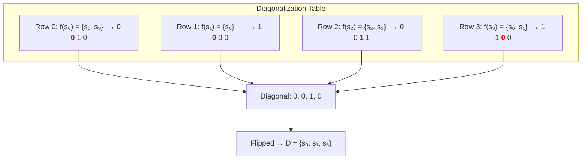
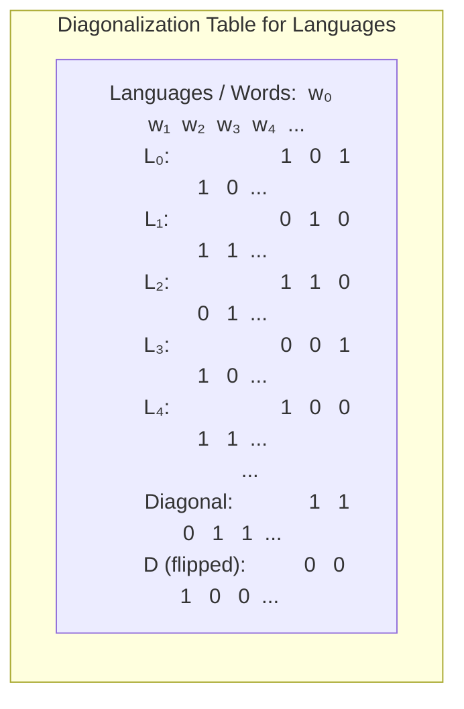
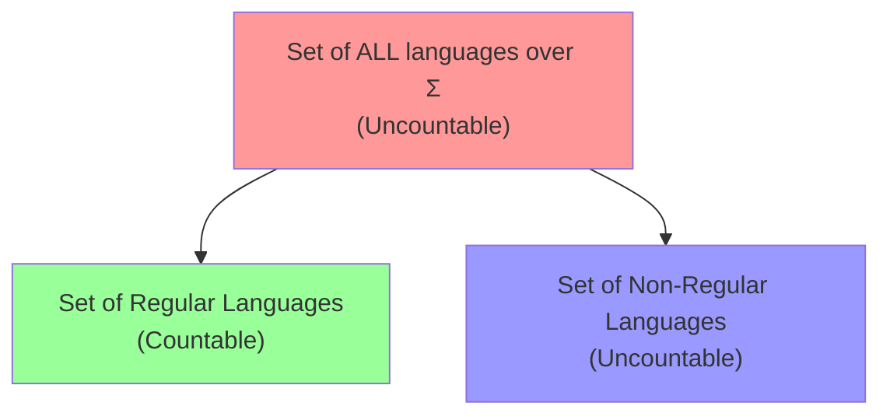
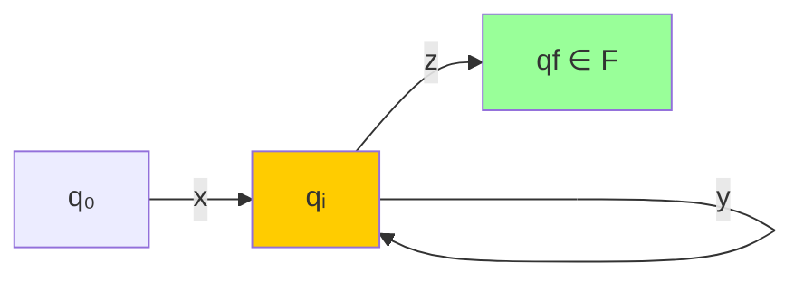
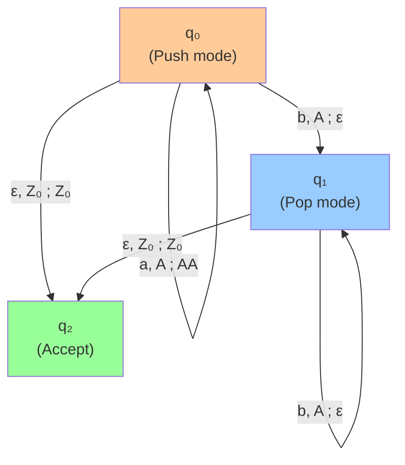
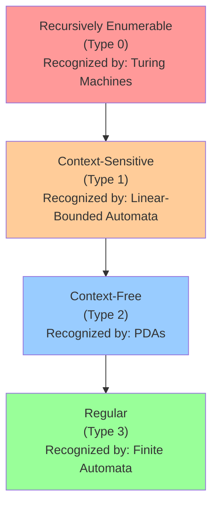
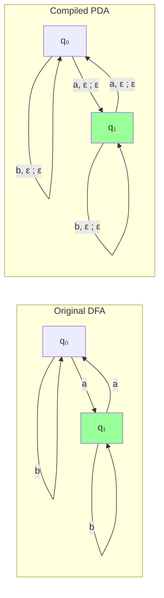
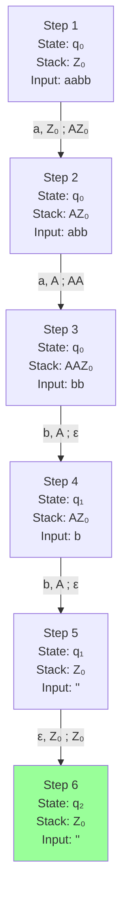
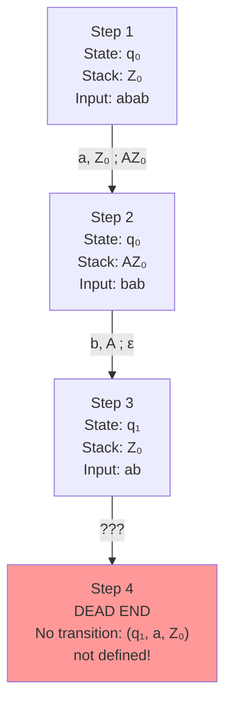
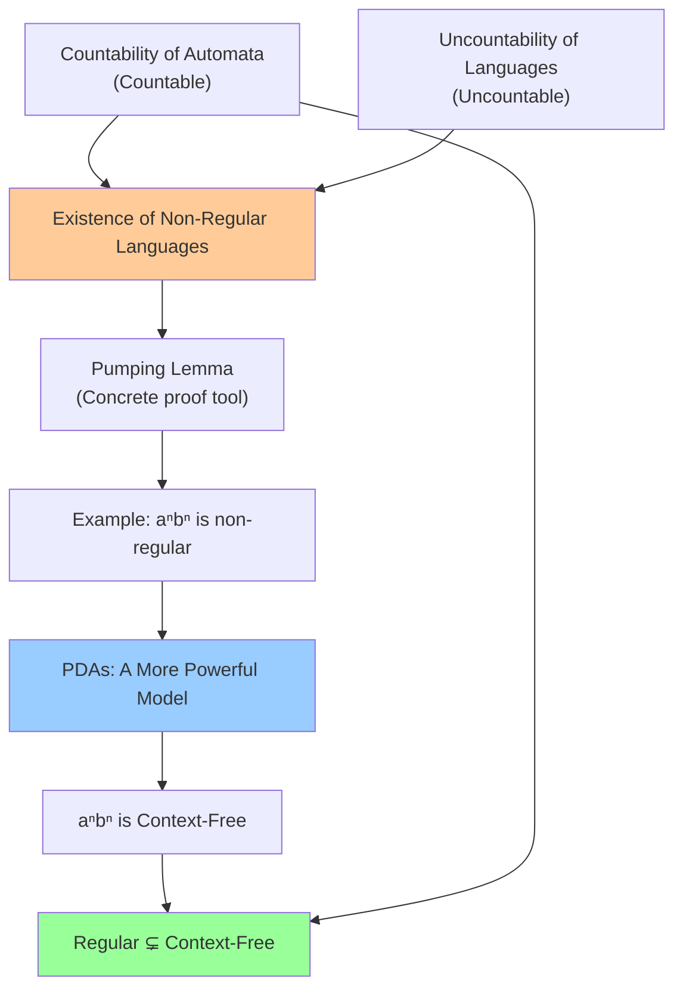

# 2. Countability and Pushdown Automata

> [!info] Chapter Overview
> This chapter bridges two fundamental concepts in computability theory. First, we use **countability arguments** to prove that non-regular languages must exist — there are simply too many languages and too few automata. Second, we introduce **Pushdown Automata (PDAs)**, a more powerful model of computation that can recognize languages beyond the reach of finite automata, such as the canonical non-regular language $L = \{a^n b^n \mid n \geq 0\}$.
>
> **Key theme:** The gap between "how many languages exist" and "how many machines exist" is the engine that drives many impossibility results in theoretical computer science.

---

## 2.1 Foundations of Countability

### 2.1.1 What Does Countable Mean?

> [!definition] Countable Set (Ensemble dénombrable)
> A set $S$ is **countable** (dénombrable) if there exists a **bijection** between $S$ and $\mathbb{N}$ (or a subset of $\mathbb{N}$). Equivalently, $S$ is countable if its elements can be arranged into a list $s_0, s_1, s_2, \ldots$ such that every element of $S$ appears at some finite position in the list.

There are two sub-cases:

- A set is **finite** if there is a bijection with $\{0, 1, \ldots, n\}$ for some $n \in \mathbb{N}$. For example, $\{a, b, c\}$ is finite (bijection with $\{0, 1, 2\}$).
- A set is **countably infinite** if there is a bijection with $\mathbb{N}$ itself. For example, $\mathbb{Z}$ is countably infinite.

> [!tip] Intuitive Test for Countability
> If you can "line up" the elements of a set and count them off — first, second, third, ... — and every element eventually gets a number, then the set is countable. You never run out of natural numbers, but every element of the set must be reachable at some finite step.

**Examples of countable sets:**

| Set | Why it is countable | Enumeration |
|---|---|---|
| $\mathbb{N}$ | Identity bijection with itself | $0, 1, 2, 3, \ldots$ |
| $\mathbb{Z}$ | Interleave positive and negative | $0, 1, -1, 2, -2, 3, -3, \ldots$ |
| $\mathbb{Q}$ | Cantor's pairing function (diagonal enumeration of $\mathbb{N} \times \mathbb{N}$, skip duplicates) | $0, 1, -1, \frac{1}{2}, -\frac{1}{2}, 2, -2, \ldots$ |
| $\Sigma^*$ (all finite strings over a finite alphabet $\Sigma$) | Enumerate by length, then lexicographically within each length | $\varepsilon, 0, 1, 00, 01, 10, 11, 000, \ldots$ |

> [!warning] Common Pitfall — The Rational Numbers
> Many students incorrectly believe $\mathbb{Q}$ is uncountable because it "looks dense" on the number line. Density and countability are different concepts! $\mathbb{Q}$ is dense in $\mathbb{R}$ (between any two rationals there is another rational), but it is still countable — you can enumerate all rationals systematically.

**Examples of uncountable sets:**

| Set | Why it is uncountable |
|---|---|
| $\mathbb{R}$ | Cantor's diagonalization argument (see below) |
| $\mathcal{P}(\mathbb{N})$ (the power set of $\mathbb{N}$) | Cantor's theorem: $\|\mathcal{P}(S)\| > \|S\|$ for any set $S$ |
| The set of all languages over $\Sigma$ | Languages are subsets of $\Sigma^*$; since $\Sigma^*$ is countably infinite, this is $\mathcal{P}(\Sigma^*)$, which has the same cardinality as $\mathcal{P}(\mathbb{N})$ |
| The set of all infinite binary sequences $\{0,1\}^{\omega}$ | Each such sequence defines a subset of $\mathbb{N}$, and vice versa |

### 2.1.2 Key Theorems

#### Cantor's Diagonalization Argument

Cantor's diagonalization is one of the most important proof techniques in all of mathematics and computer science. It appears repeatedly: in proving the uncountability of $\mathbb{R}$, the existence of non-regular languages, the unsolvability of the halting problem, and Gödel's incompleteness theorems.

> [!definition] Cantor's Theorem (1891)
> For any set $S$, the power set $\mathcal{P}(S)$ has strictly greater cardinality than $S$ itself. That is, $\|\mathcal{P}(S)\| > \|S\|$. In particular, there is no surjection from $S$ onto $\mathcal{P}(S)$.

**Proof sketch (the diagonalization method):**

Suppose for contradiction that there exists a surjection $f : S \to \mathcal{P}(S)$. This means every subset of $S$ is $f(s)$ for some $s \in S$. Now define the **diagonal set**:

$$D = \{s \in S \mid s \notin f(s)\}$$

Since $D \subseteq S$, and $f$ is a surjection, there must exist some $d \in S$ such that $f(d) = D$. Now ask: **is $d \in D$?**

- If $d \in D$, then by definition of $D$, we need $d \notin f(d) = D$. Contradiction.
- If $d \notin D$, then by definition of $D$, we need $d \notin f(d)$, which means $d \in D$. Contradiction.

Either way we get a contradiction, so no such surjection exists. $\square$

> [!important] Why "Diagonal"?
> Imagine arranging the subsets of $S = \{s_0, s_1, s_2, \ldots\}$ in a table where row $i$ corresponds to $f(s_i)$ and column $j$ corresponds to element $s_j$. The entry in cell $(i, j)$ is 1 if $s_j \in f(s_i)$ and 0 otherwise. The diagonal set $D$ is constructed by reading down the main diagonal and **flipping** each bit: if the diagonal entry is 1, put 0 in $D$; if it is 0, put 1. This guarantees $D$ differs from every row in at least one position.

The following Mermaid diagram illustrates the diagonalization table for a hypothetical enumeration of subsets of $\{s_0, s_1, s_2, s_3\}$:

> [!tip] The Diagonal Trick in Context
> The diagonalization technique is a template. Whenever someone claims "I can list all objects of type X," you construct an object of type X that differs from the $i$-th listed object in at least the $i$-th position. This new object cannot be on the list, so the list is incomplete. We will use this exact template to prove that the set of all languages is uncountable.

#### The Set of All Finite Binary Strings Is Countable

This is a crucial result that we will use repeatedly.

**Claim:** $\{0,1\}^*$ (the set of all finite binary strings) is countable.

**Proof:** Enumerate by length first, then lexicographically within each length:

$$\varepsilon,\; 0,\; 1,\; 00,\; 01,\; 10,\; 11,\; 000,\; 001,\; 010,\; 011,\; 100,\; \ldots$$

This gives a bijection with $\mathbb{N}$: position 0 maps to $\varepsilon$, position 1 to $0$, position 2 to $1$, position 3 to $00$, etc. Every finite binary string eventually appears at some finite position. $\square$

> [!info] Generalization
> For any finite alphabet $\Sigma$, the set $\Sigma^*$ of all finite strings over $\Sigma$ is countable. The same argument works: enumerate by length, then lexicographically.

> [!warning] Crucial Distinction
> The set of **finite** binary strings $\{0,1\}^*$ is countable, but the set of **infinite** binary sequences $\{0,1\}^{\omega}$ is uncountable. This distinction is the entire reason why some languages cannot be recognized by any finite automaton.

---

## 2.2 Countability of the Set of All Finite Automata (Exercise 4, Question 1)

> [!important] Theorem
> The set of all finite automata (deterministic or non-deterministic) is **countable**.

### Detailed Proof

We must show that we can list all possible finite automata: $A_0, A_1, A_2, \ldots$, with every automaton appearing at some finite position.

**Step 1: A finite automaton is a finite mathematical object.**

Recall that a finite automaton is a tuple $A = (Q, \Sigma, \delta, s, F)$ where:
- $Q$ is a **finite** set of states
- $\Sigma$ is a **finite** input alphabet
- $\delta$ is a **finite** set of transitions (each transition is a triple or quadruple)
- $s \in Q$ is the start state
- $F \subseteq Q$ is a **finite** set of accepting states

Every component is finite. The entire automaton is specified by a finite amount of data.

**Step 2: Encoding an automaton as a finite string.**

We can encode any automaton as a finite string over some fixed alphabet. Here is one concrete encoding scheme:

1. **Encode the states:** Rename states as $q_0, q_1, \ldots, q_{n-1}$ where $n = |Q|$. Encode the number $n$ in binary.
2. **Encode the alphabet:** Similarly, encode $|\Sigma|$ and list the symbols.
3. **Encode the transitions:** For each transition $\delta(q_i, a) = q_j$ (in the DFA case), write the triple $(i, a, j)$. Encode the entire list of transitions.
4. **Encode the start state:** Write the index of $s$.
5. **Encode the accepting states:** Write the list of indices of states in $F$.

For example, consider a simple DFA with 2 states $\{q_0, q_1\}$, alphabet $\{a\}$, transitions $\delta(q_0, a) = q_1$, $\delta(q_1, a) = q_0$, start state $q_0$, accepting state $q_1$. We could encode this as:

$$\text{2,1,(0,a,1),(1,a,0),0,1}$$

This is a finite string over the alphabet $\{0, 1, 2, 3, 4, 5, 6, 7, 8, 9, (, ), a, ,, \}$.

**Step 3: Map each encoding to a finite binary string.**

Since the encoding alphabet is finite, we can convert each character to a fixed-length binary code (e.g., using ASCII or a simpler scheme). Every automaton thus corresponds to a **unique finite binary string**.

**Step 4: Conclude countability.**

We have an injection from the set of all finite automata into the set of all finite binary strings $\{0,1\}^*$. Since $\{0,1\}^*$ is countable (proven in Section 2.1.2), and any subset of a countable set is countable, the set of all finite automata is countable. $\square$

> [!tip] Key Insight
> The fundamental reason automata are countable is that each one is **finitely describable**. Any object that can be completely described by a finite amount of text belongs to a countable set, because there are only countably many finite descriptions. This same reasoning applies to Turing machines, computer programs, and any other finitely specifiable computational device.

> [!warning] Watch Out — Different Automata, Same Language
> Many different automata can recognize the same language. For example, you can always add unreachable states to an automaton without changing the language it recognizes. So the mapping from automata to languages is **not** injective. This means the set of regular languages could potentially be much smaller than the set of automata. We will see that it is at most countable.

### Key Consequence

> [!important] Corollary
> The set of all **regular languages** is **at most countable**.

**Reasoning:** Each regular language is recognized by at least one finite automaton. The mapping from automata to the languages they recognize is a surjection from the set of all automata onto the set of all regular languages. Since the set of automata is countable, the image (the set of regular languages) is at most countable. (It could be finite in principle, but it is in fact countably infinite, since there are infinitely many distinct regular languages: $\{a\}$, $\{aa\}$, $\{aaa\}$, etc.)

---

## 2.3 Uncountability of the Set of All Languages (Exercise 4, Question 2)

> [!important] Theorem
> The set of all languages over a non-empty alphabet $\Sigma$ is **uncountable**.

### Detailed Proof Using Cantor's Diagonalization

**Step 1: $\Sigma^*$ is countable.**

Since $\Sigma$ is a finite alphabet, $\Sigma^*$ (the set of all finite words over $\Sigma$) is countable. We can enumerate all words: $w_0, w_1, w_2, \ldots$

For $\Sigma = \{a, b\}$, the enumeration would be:

$$w_0 = \varepsilon,\; w_1 = a,\; w_2 = b,\; w_3 = aa,\; w_4 = ab,\; w_5 = ba,\; w_6 = bb,\; w_7 = aaa,\; \ldots$$

**Step 2: Represent each language as an infinite binary sequence.**

A language $L$ is a subset of $\Sigma^*$. For each word $w_i \in \Sigma^*$, either $w_i \in L$ or $w_i \notin L$. This gives us the **characteristic function** (or indicator function) of $L$:

$$\chi_L(w_i) = \begin{cases} 1 & \text{if } w_i \in L \\ 0 & \text{if } w_i \notin L \end{cases}$$

We can represent any language $L$ as an infinite binary sequence:

$$\chi_L = \chi_L(w_0)\,\chi_L(w_1)\,\chi_L(w_2)\,\chi_L(w_3)\,\cdots$$

For example:
- $L = \Sigma^*$ (all words) → $111111\ldots$
- $L = \emptyset$ (no words) → $000000\ldots$
- $L = \{a, aa\}$ → $011000\ldots$ (using the enumeration above: $\varepsilon \notin L$, $a \in L$, $b \notin L$, $aa \in L$, rest are not in $L$)

This gives a bijection between the set of all languages over $\Sigma$ and the set of all infinite binary sequences $\{0,1\}^{\omega}$.

**Step 3: Suppose for contradiction that the set of all languages is countable.**

Then we could list all languages: $L_0, L_1, L_2, \ldots$ and every language would appear somewhere in this list. We can arrange their characteristic sequences in a table:

**Step 4: Construct the diagonal language $D$.**

Define:

$$D = \{w_i \mid w_i \notin L_i\}$$

In terms of the characteristic function:

$$\chi_D(w_i) = 1 - \chi_{L_i}(w_i) = \begin{cases} 1 & \text{if } \chi_{L_i}(w_i) = 0 \\ 0 & \text{if } \chi_{L_i}(w_i) = 1 \end{cases}$$

We "flip" the diagonal of the table.

**Step 5: $D$ is a language, but it is not in the list.**

$D$ is a subset of $\Sigma^*$, so it is a language. But:

- $D \neq L_0$ because $w_0 \in L_0 \iff w_0 \notin D$ (they disagree on $w_0$)
- $D \neq L_1$ because $w_1 \in L_1 \iff w_1 \notin D$ (they disagree on $w_1$)
- In general, $D \neq L_i$ because $w_i \in L_i \iff w_i \notin D$ (they disagree on $w_i$)

So $D$ differs from every language in the list. But we assumed the list contained **all** languages. Contradiction!

**Step 6: Conclusion.**

The assumption that the set of all languages is countable leads to a contradiction. Therefore, the set of all languages over $\Sigma$ is **uncountable**. $\square$

> [!tip] Understanding the Flip
> The power of the diagonalization argument comes from the "flip" — by ensuring that $D$ disagrees with $L_i$ specifically on $w_i$, we guarantee that $D$ is different from $L_i$ in a way that depends on $i$ itself. There is no way to "patch" the list by inserting $D$ somewhere, because for any position $i$ you might put $D$ in, it would disagree with the language originally at position $i$ on $w_i$, and inserting $D$ just shifts the problem.

> [!warning] Common Misconception
> Some students think: "But I can just add $D$ to the list!" This does not help. If you add $D$ to the list, creating a new list $L_0, L_1, \ldots, D, L_0', L_1', \ldots$, you can apply the same diagonalization argument to the **new** list and construct a new diagonal language $D'$ that is not on the new list. The argument shows that **no list can contain all languages**.

---

## 2.4 Existence of Non-Regular Languages (Exercise 4, Questions 3 and 4)

### 2.4.1 The Counting Argument

We have now established two facts:

1. The set of all regular languages is **at most countable** (Section 2.2).
2. The set of all languages over $\Sigma$ is **uncountable** (Section 2.3).

> [!important] Theorem
> There exist languages that are **not regular**. In fact, **uncountably many** languages are non-regular.

**Proof:** Suppose for contradiction that every language is regular. Then the set of all languages equals the set of regular languages. But the set of all languages is uncountable and the set of regular languages is at most countable. An uncountable set cannot equal an at-most-countable set. Contradiction. $\square$

Moreover, since the set of all languages is uncountable and the set of regular languages is countable, the set of **non-regular** languages must be uncountable (removing a countable set from an uncountable set leaves an uncountable set).

> [!info] "Almost All" Languages Are Non-Regular
> This is a profound statement. If you were to pick a language "at random" (in a suitable sense), with probability 1 it would be non-regular. Regular languages are an extremely tiny, exceptional subset of all possible languages. This is analogous to how "almost all" real numbers are irrational, even though we encounter rationals more often in practice.

### 2.4.2 The Pumping Lemma for Regular Languages

The counting argument proves that non-regular languages **exist**, but it does not tell us **which** languages are non-regular. For that, we need a more concrete tool: the **Pumping Lemma**.

> [!definition] Pumping Lemma for Regular Languages
> If $L$ is a regular language, then there exists a constant $p \geq 1$ (the **pumping length**) such that for every string $s \in L$ with $|s| \geq p$, there exists a decomposition $s = xyz$ satisfying:
>
> 1. **$|y| \geq 1$** (the "pumpable" part $y$ is non-empty)
> 2. **$|xy| \leq p$** (the pumpable part appears within the first $p$ characters)
> 3. **$xy^iz \in L$ for all $i \geq 0$** (pumping $y$ any number of times keeps the string in $L$)

**Intuition behind the Pumping Lemma:**

If $L$ is regular, it is recognized by some DFA with $n$ states. Set $p = n$. Any string $s$ of length $\geq n$ must visit at least $n+1$ states (including the start state before reading any character). By the **pigeonhole principle**, some state must be visited at least twice during the processing of the first $n$ characters. This creates a "loop" — a sequence of transitions that starts and ends at the same state. This loop is the "pumpable" part $y$. Going around the loop zero times (removing $y$) or multiple times (repeating $y$) still leads to the same state, so the resulting string is still accepted (or still rejected, depending on whether the final state is accepting).

> [!tip] How to Use the Pumping Lemma
> The Pumping Lemma is used **contrapositively** to prove a language is **not** regular. The contrapositive says:
>
> If for every $p \geq 1$ there exists a string $s \in L$ with $|s| \geq p$ such that for **every** decomposition $s = xyz$ with $|y| \geq 1$ and $|xy| \leq p$, there exists some $i \geq 0$ with $xy^iz \notin L$, then $L$ is **not** regular.
>
> In practice, you:
> 1. Let the adversary choose $p$.
> 2. Choose a clever string $s$ (depending on $p$) that is in $L$ and has length $\geq p$.
> 3. Consider all possible decompositions $s = xyz$ satisfying conditions 1 and 2.
> 4. For each decomposition, find an $i$ such that $xy^iz \notin L$.
> 5. Conclude $L$ is not regular.

### 2.4.3 Exhibiting a Non-Regular Language: $L = \{a^n b^n \mid n \geq 0\}$

> [!important] Theorem
> $L = \{a^n b^n \mid n \geq 0\}$ is **not** a regular language.

**Proof using the Pumping Lemma:**

**Step 1:** Let $p$ be an arbitrary pumping length chosen by the adversary.

**Step 2:** Choose $s = a^p b^p$. Clearly $s \in L$ and $|s| = 2p \geq p$.

**Step 3:** Consider any decomposition $s = xyz$ with $|y| \geq 1$ and $|xy| \leq p$.

Since $|xy| \leq p$ and the string starts with $p$ a's, both $x$ and $y$ consist entirely of a's. Specifically, $y = a^k$ for some $k$ with $1 \leq k \leq p$.

**Step 4:** Choose $i = 0$. Then:

$$xy^0z = xz = a^{p-k}b^p$$

Since $k \geq 1$, we have $p - k < p$, so the number of a's ($p-k$) is strictly less than the number of b's ($p$). Therefore $a^{p-k}b^p \notin L$.

**Step 5:** We have shown that for any pumping length $p$, there exists a string $s \in L$ such that no decomposition of $s$ satisfies all three conditions of the Pumping Lemma. Therefore $L$ is not regular. $\square$

> [!tip] Why This Intuitively Makes Sense
> A DFA has finitely many states. To recognize $L = \{a^n b^n\}$, the machine would need to "count" the number of a's and then verify that the number of b's matches. But $n$ can be arbitrarily large, and no finite machine can count to arbitrarily large numbers. The stack of a PDA, as we will see, provides the unbounded memory needed for this counting.

### 2.4.4 Another Example: $L = \{a^{n^2} \mid n \geq 0\}$

**Claim:** $L = \{a^{n^2} \mid n \geq 0\} = \{\varepsilon, a, aaaa, aaaaaaaaa, \ldots\}$ (strings of a's whose length is a perfect square) is not regular.

**Proof using the Pumping Lemma:**

**Step 1:** Let $p$ be an arbitrary pumping length.

**Step 2:** Choose $s = a^{p^2}$. Then $s \in L$ (since $p^2$ is a perfect square) and $|s| = p^2 \geq p$.

**Step 3:** Any decomposition $s = xyz$ with $|y| \geq 1$ and $|xy| \leq p$ has $y = a^k$ for some $1 \leq k \leq p$.

**Step 4:** Consider $i = 2$. Then $|xy^2z| = p^2 + k$. Since $1 \leq k \leq p$:

$$p^2 < p^2 + k \leq p^2 + p < p^2 + 2p + 1 = (p+1)^2$$

So $p^2 + k$ is strictly between two consecutive perfect squares ($p^2$ and $(p+1)^2$), hence it is not a perfect square. Therefore $xy^2z \notin L$.

**Step 5:** The Pumping Lemma conditions cannot be satisfied, so $L$ is not regular. $\square$

> [!warning] Common Pitfall in Pumping Lemma Proofs
> A very common mistake is to choose $i = 0$ without checking that the resulting string is not in the language. For $L = \{a^{n^2}\}$, choosing $i = 0$ gives $|xz| = p^2 - k$, which might still be a perfect square for some values of $k$. Always verify that your chosen $i$ actually produces a string outside the language for **all** valid decompositions.

---

## 2.5 Introduction to Pushdown Automata (PDA) (Exercise 5)

### 2.5.1 What is a Pushdown Automaton?

A **Pushdown Automaton** (PDA, or *automate à pile* in French) extends the finite automaton model by adding an **unbounded stack** (pile). This stack provides a form of unbounded memory that allows the PDA to recognize languages beyond the reach of finite automata.

> [!definition] Pushdown Automaton
> A PDA is a 7-tuple $M = (Q, \Sigma, \Gamma, \delta, s, Z_0, F)$ where:
>
> - $Q$: finite set of **states**
> - $\Sigma$: finite **input alphabet**
> - $\Gamma$: finite **stack alphabet** (symbols that can be pushed/popped)
> - $\delta$: **transition function** — $\delta : Q \times (\Sigma \cup \{\varepsilon\}) \times (\Gamma \cup \{\varepsilon\}) \to \mathcal{P}(Q \times (\Gamma \cup \{\varepsilon\}))$
> - $s \in Q$: **start state**
> - $Z_0 \in \Gamma$: **initial stack symbol** (the stack starts with this symbol)
> - $F \subseteq Q$: set of **accepting states**

**Understanding the transition function:**

A transition $\delta(q, a, X) \ni (q', Y)$ means:

> In state $q$, reading input symbol $a$ (or $\varepsilon$ for an ε-transition), and with $X$ on top of the stack (or $\varepsilon$ meaning "don't check the stack"), go to state $q'$ and replace $X$ with $Y$ on the stack.

More specifically:
- If $X \neq \varepsilon$ and $Y \neq \varepsilon$: **pop** $X$ and **push** $Y$ (replace top of stack)
- If $X \neq \varepsilon$ and $Y = \varepsilon$: **pop** $X$ (remove top of stack)
- If $X = \varepsilon$ and $Y \neq \varepsilon$: **push** $Y$ (add to top of stack, without removing anything)
- If $X = \varepsilon$ and $Y = \varepsilon$: **no stack operation** (just move between states, like a FA)

> [!tip] Notation Convention
> Transitions are often written in the compact form:
>
> $(q, a, X) \to (q', Y)$
>
> This is read as: "From state $q$, reading $a$ from input and $X$ from stack, go to state $q'$ and write $Y$ to stack."
>
> In JFLAP, transitions are shown as: `a, X ; Y` (read `a` from input, pop `X`, push `Y`).

> [!warning] Important — Non-Determinism in PDAs
> PDAs are inherently **non-deterministic** machines. The transition function maps to a **set** of possible actions, not a single action. A PDA can have multiple transitions from the same state with the same input symbol and stack symbol. It can also make ε-transitions (without consuming input) and ε-stack-transitions (without checking the top of the stack). A string is accepted if **there exists** at least one computation path that leads to an accepting state with the input fully consumed.

### 2.5.2 Why PDAs Are More Powerful Than FAs

The key difference between finite automata and PDAs is the **stack**. A finite automaton has only finitely many states, so its memory is bounded. A PDA's stack can grow arbitrarily large, providing unbounded memory.

> [!important] Fundamental Insight
> Finite automata **cannot count** — they cannot remember an arbitrary number and use it later. PDAs **can count** using the stack: they push symbols to "remember" a count, and pop symbols to "recall" it.

**Example: $L = \{a^n b^n \mid n \geq 0\}$ is recognized by a PDA.**

The PDA works as follows:

1. **Push phase:** For each $a$ read, push $A$ onto the stack. This "counts" the number of a's.
2. **Switch phase:** When the first $b$ is encountered (or ε-transition), switch to a "popping" state.
3. **Pop phase:** For each $b$ read, pop $A$ from the stack. This verifies that the number of b's matches the number of a's.
4. **Accept:** If the input is fully consumed and the stack contains only $Z_0$ (the bottom marker), accept.

Formally, the PDA $M = (Q, \Sigma, \Gamma, \delta, q_0, Z_0, F)$:

- $Q = \{q_0, q_1, q_2\}$ (push state, pop state, accept state)
- $\Sigma = \{a, b\}$
- $\Gamma = \{A, Z_0\}$
- $F = \{q_2\}$
- Transitions:
  - $(q_0, a, Z_0) \to (q_0, AZ_0)$ — read $a$, push $A$ on top of $Z_0$
  - $(q_0, a, A) \to (q_0, AA)$ — read $a$, push $A$ on top of $A$
  - $(q_0, \varepsilon, Z_0) \to (q_2, Z_0)$ — empty string case: accept immediately
  - $(q_0, b, A) \to (q_1, \varepsilon)$ — read first $b$, pop one $A$
  - $(q_1, b, A) \to (q_1, \varepsilon)$ — read subsequent $b$, pop one $A$
  - $(q_1, \varepsilon, Z_0) \to (q_2, Z_0)$ — all $b$'s read, stack back to $Z_0$, accept

> [!info] Trace of the PDA on Input "aabb"
> 1. Start: state $q_0$, stack = $Z_0$, remaining input = "aabb"
> 2. Read 'a', apply $(q_0, a, Z_0) \to (q_0, AZ_0)$: state $q_0$, stack = $AZ_0$, remaining = "abb"
> 3. Read 'a', apply $(q_0, a, A) \to (q_0, AA)$: state $q_0$, stack = $AAZ_0$, remaining = "bb"
> 4. Read 'b', apply $(q_0, b, A) \to (q_1, \varepsilon)$: state $q_1$, stack = $AZ_0$, remaining = "b"
> 5. Read 'b', apply $(q_1, b, A) \to (q_1, \varepsilon)$: state $q_1$, stack = $Z_0$, remaining = ""
> 6. Apply $(q_1, \varepsilon, Z_0) \to (q_2, Z_0)$: state $q_2$, stack = $Z_0$, remaining = ""
> 7. Input consumed, in accepting state $q_2$. **Accept!** 

> [!info] Trace of the PDA on Input "abab"
> 1. Start: state $q_0$, stack = $Z_0$, remaining input = "abab"
> 2. Read 'a', apply $(q_0, a, Z_0) \to (q_0, AZ_0)$: state $q_0$, stack = $AZ_0$, remaining = "bab"
> 3. Read 'b', apply $(q_0, b, A) \to (q_1, \varepsilon)$: state $q_1$, stack = $Z_0$, remaining = "ab"
> 4. No transition from $q_1$ reads 'a' with $Z_0$ on stack. **Dead end!** 
> 5. No other computation paths lead to acceptance. **Reject!** 

### 2.5.3 Context-Free Languages

> [!definition] Context-Free Language (Langage algébrique / hors-contexte)
> A language is **context-free** if and only if it is recognized by some PDA. The class of context-free languages is also exactly the class of languages generated by **context-free grammars** (Type 2 in the Chomsky hierarchy).

The Chomsky hierarchy organizes languages by their generative power:

**Key relationships:**

| Hierarchy Level | Language Type | Recognizing Machine | Example |
|---|---|---|---|
| Type 3 | Regular | DFA / NFA | $a^* b^*$ |
| Type 2 | Context-Free | PDA | $\{a^n b^n\}$ |
| Type 1 | Context-Sensitive | LBA | $\{a^n b^n c^n\}$ |
| Type 0 | Recursively Enumerable | Turing Machine | Halting problem |

> [!important] Strict Inclusions
> Every regular language is context-free, but not every context-free language is regular. The inclusion is **strict**: $\text{Regular} \subsetneq \text{Context-Free}$.
>
> Proof of strictness: $L = \{a^n b^n \mid n \geq 0\}$ is context-free (recognized by the PDA above) but not regular (proven by the Pumping Lemma).

**Additional examples of context-free (but not regular) languages:**

- $\{ww^R \mid w \in \{a,b\}^*\}$ — palindromes (where $w^R$ is the reverse of $w$)
- $\{a^n b^{2n} \mid n \geq 0\}$ — a variant of the matching language
- The language of balanced parentheses: $\{(^^n )^n \mid n \geq 0\}$
- Most programming language syntax (hence why parsers use pushdown-based algorithms)

**Examples of languages that are NOT context-free (but are context-sensitive):**

- $\{a^n b^n c^n \mid n \geq 0\}$ — requires matching three counts
- $\{ww \mid w \in \{a,b\}^*\}$ — duplication (not reversal!)
- $\{a^{n^2} \mid n \geq 0\}$ — perfect squares

> [!tip] The Pumping Lemma for Context-Free Languages
> There is also a pumping lemma for CFLs (the Ogden/Bader-Moore pumping lemma), which can be used to prove that certain languages are not context-free. The idea is similar but more complex: if $L$ is a CFL, then any sufficiently long string in $L$ can be decomposed as $uvwxy$ where $|vwx| \leq p$, $|vx| \geq 1$, and $uv^iwx^iy \in L$ for all $i \geq 0$. Two "pumpable" regions replace the single pumpable region from the regular pumping lemma.

### 2.5.4 Compiling a Finite Automaton to a PDA (Exercise 5, Question 3)

Since every regular language is also context-free, any finite automaton can be **compiled** (converted) into a PDA that recognizes the same language.

> [!important] Theorem
> For every finite automaton $A$, there exists a PDA $M$ such that $L(M) = L(A)$.

**Conversion method: The PDA simply ignores its stack.**

Given a DFA $A = (Q, \Sigma, \delta, s, F)$, construct a PDA $M = (Q, \Sigma, \{Z_0\}, \delta', s, Z_0, F)$ where:

$$\delta'(q, a, \varepsilon) = \{(\delta(q, a), \varepsilon)\} \quad \text{for all } q \in Q, a \in \Sigma$$

The transition reads $a$ from input, does not read from the stack ($\varepsilon$ for the stack read), and does not write to the stack ($\varepsilon$ for the stack write). The stack just sits there with $Z_0$ on it, completely unused.

**For an NFA** $A = (Q, \Sigma, \delta, s, F)$:

$$\delta'(q, a, \varepsilon) = \{(q', \varepsilon) \mid q' \in \delta(q, a)\} \quad \text{for all } q \in Q, a \in \Sigma$$

$$\delta'(q, \varepsilon, \varepsilon) = \{(q', \varepsilon) \mid q' \in \delta(q, \varepsilon)\} \quad \text{for all } q \in Q$$

**Example:**

Consider a DFA with states $\{q_0, q_1\}$, alphabet $\{a, b\}$, transitions:
- $\delta(q_0, a) = q_1$
- $\delta(q_0, b) = q_0$
- $\delta(q_1, a) = q_0$
- $\delta(q_1, b) = q_1$
- Start state: $q_0$, Accept state: $q_1$

The compiled PDA has the same states and the following transitions:
- $(q_0, a, \varepsilon) \to (q_1, \varepsilon)$
- $(q_0, b, \varepsilon) \to (q_0, \varepsilon)$
- $(q_1, a, \varepsilon) \to (q_0, \varepsilon)$
- $(q_1, b, \varepsilon) \to (q_1, \varepsilon)$

> [!tip] Key Observation
> The PDA compilation is **trivial** — just add $\varepsilon$ in the stack positions of every transition. This shows that PDAs are a **generalization** of FAs: they can do everything FAs can do, plus more. The stack is optional; a PDA that never uses its stack is essentially a finite automaton.

> [!warning] The Reverse Is Not True
> While every FA can be converted to a PDA, not every PDA can be converted to an FA. PDAs that actually use their stack in an essential way (like the $a^n b^n$ PDA) recognize languages that no FA can recognize. The stack is not just decorative in general — it provides genuine additional computational power.

### 2.5.5 JFLAP and PDA Testing

JFLAP is an interactive tool for designing and testing automata. Here is how to build and test a PDA in JFLAP.

#### Building a PDA in JFLAP

1. **Launch JFLAP** and select "Pushdown Automaton" from the main menu.
2. **Create states** by right-clicking on the canvas. Designate one as the initial state (right-click → "Initial") and one or more as final states (right-click → "Final").
3. **Create transitions** by clicking and dragging from one state to another (or to itself for a loop). The transition label format is:
   - `input, pop ; push`
   - For example: `a, Z₀ ; AZ₀` means "read `a` from input, pop `Z₀` from stack, push `AZ₀` onto stack"
   - Use `λ` (lambda) for ε (empty) in any of the three positions
4. **Set the initial stack symbol:** By default, JFLAP uses `Z` as the initial stack symbol.

#### Testing a PDA with "Step with Closure"

JFLAP provides several simulation modes. The most useful for understanding PDA behavior is **"Step with Closure"**:

1. Go to **Input → Step with Closure**
2. Enter the input string (e.g., `aabb` or `abab`)
3. Click **"Step"** repeatedly to watch the computation unfold
4. At each step, you can see:
   - The current configuration (state, remaining input, stack contents)
   - All possible next transitions (due to non-determinism, there may be multiple)
   - The current "closure" — all configurations reachable via ε-transitions

#### Testing the PDA for $a^n b^n$

**Test with input "aabb" (should accept):**

**Test with input "abab" (should reject):**

> [!tip] JFLAP Testing Tips
> - When a PDA has multiple possible transitions at a step, JFLAP will show you all of them. You need to explore each path to determine if any leads to acceptance.
> - Use **"Multiple Run"** (Input → Multiple Run) to test several inputs at once and quickly see which are accepted and rejected.
> - If you see a "DEAD END" configuration, it means no transitions are possible. This does not necessarily mean rejection — there might be other computation paths to explore.
> - The PDA **accepts** if there exists at least **one** computation path that ends in an accepting state with the input fully consumed. This is non-deterministic acceptance.

#### Testing the PDA from the Course (Page 95)

The course PDF (page 95) provides a specific PDA. When testing it in JFLAP:

1. Recreate the PDA exactly as shown in the diagram, including all states and transitions.
2. Pay careful attention to the transition labels — a single misplaced `ε` or stack symbol can completely change the behavior.
3. Test with both strings that should be accepted and strings that should be rejected to verify correctness.
4. Use "Step with Closure" to trace through the computation and verify that the stack operations match what you expect.

> [!warning] Common JFLAP Pitfalls
> - **Forgetting the initial stack symbol:** By default, JFLAP uses `Z`. If your PDA relies on a different initial symbol (like `Z₀`), make sure to set it correctly.
> - **Confusing pop and push order:** In the transition `a, X ; YZ`, JFLAP pushes `Z` first, then `Y` on top. So `Y` ends up on top of the stack. This is the opposite of what some textbooks assume.
> - **ε-transitions in the wrong place:** A transition like `a, λ ; λ` (read `a`, no stack operation) is different from `λ, λ ; A` (no input consumed, push `A`). Double-check that ε's are in the correct positions.

---

## 2.6 Summary and Connections

### Key Results at a Glance

| Result | Statement | Method |
|---|---|---|
| Finite automata are countable | There are only countably many DFAs/NFAs | Encoding as finite strings |
| All languages are uncountable | $\mathcal{P}(\Sigma^*)$ is uncountable | Cantor's diagonalization |
| Non-regular languages exist | Uncountably many languages are non-regular | Counting argument (countable vs. uncountable) |
| $\{a^n b^n\}$ is not regular | No FA can recognize it | Pumping Lemma |
| $\{a^n b^n\}$ IS context-free | A PDA can recognize it | Explicit PDA construction |
| FAs compile to PDAs | Every regular language is context-free | PDA ignores its stack |

### The Big Picture

> [!important] The Deep Connection
> The countability argument tells us **that** non-regular languages exist, but not **which** ones. The Pumping Lemma tells us **which** specific languages are non-regular. PDAs tell us that there is a natural, more powerful model that can handle many of these non-regular languages. This pattern — abstract existence proof, concrete characterization, more powerful model — repeats throughout computability theory (e.g., with Turing machines and undecidable problems).

### Exam Strategy

1. **For countability proofs:** Always start by asking "Can this object be encoded as a finite string?" If yes, the set of such objects is countable. If you need to prove uncountability, use diagonalization.
2. **For Pumping Lemma proofs:** Remember the game structure — the adversary picks $p$, you pick $s$, the adversary picks the decomposition, you pick $i$. Your strategy must work against **all** possible decompositions.
3. **For PDA design:** Think about what needs to be "counted" or "remembered." The stack is your unbounded memory. Push symbols when you need to remember something, pop them when you need to recall it.
4. **For FA-to-PDA conversion:** Just add $\varepsilon$ in the stack positions. It is trivial by design.

> [!tip] Quick Reference: Key Inequalities
> - $\|\text{Regular Languages}\| \leq \aleph_0$ (at most countable)
> - $\|\text{All Languages}\| = 2^{\aleph_0}$ (uncountable)
> - $\|\text{Non-Regular Languages}\| = 2^{\aleph_0}$ (uncountable)
> - $\|\text{Context-Free Languages}\| = \aleph_0$ (countable — there are countably many PDAs/CFGs)
> - Therefore: Regular $\subsetneq$ Context-Free $\subsetneq$ All Languages (strict inclusions at every level)

---

> [!info] Further Reading
> - **Sipser, *Introduction to the Theory of Computation***: Chapter 1 for countability and diagonalization, Chapter 2 for context-free languages and PDAs.
> - **Hopcroft, Motwani, Ullman, *Introduction to Automata Theory, Languages, and Computation***: Chapter 3 for regular languages and the pumping lemma, Chapter 6 for PDAs and CFLs.
> - **Course PDF (Exos-AFD-MT-JFLAP.pdf)**: Exercises 4 and 5 for the specific problems covered in this chapter.
