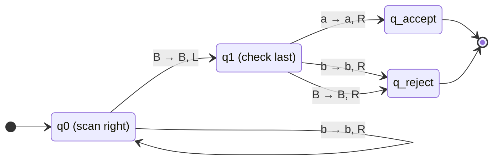
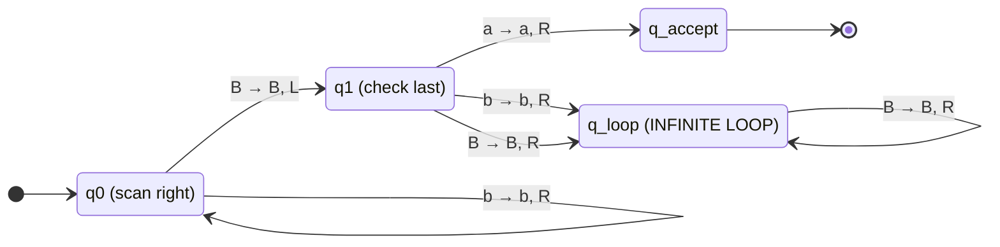
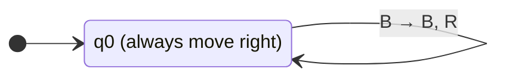
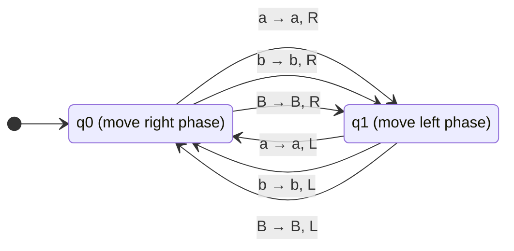
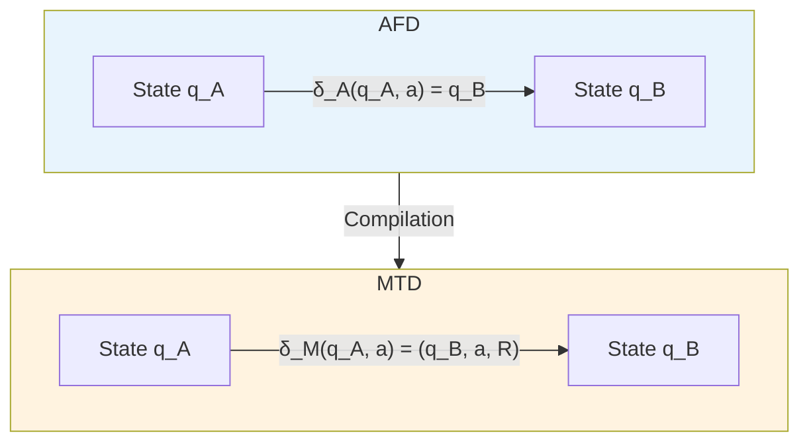
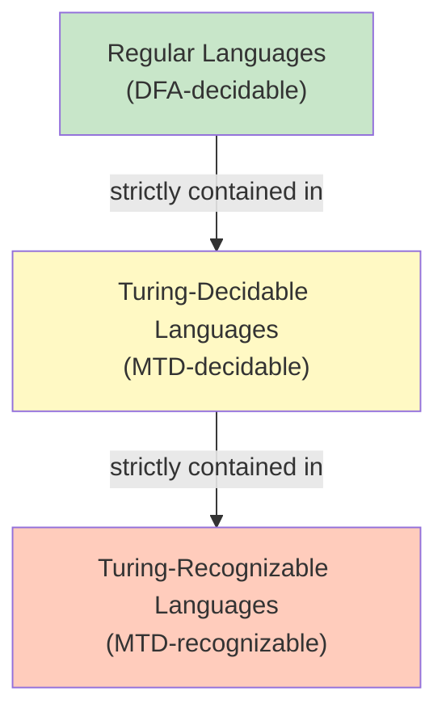
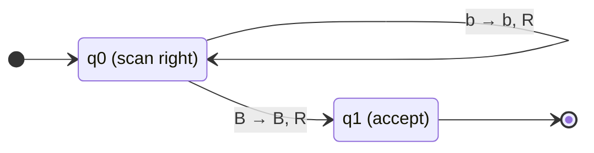
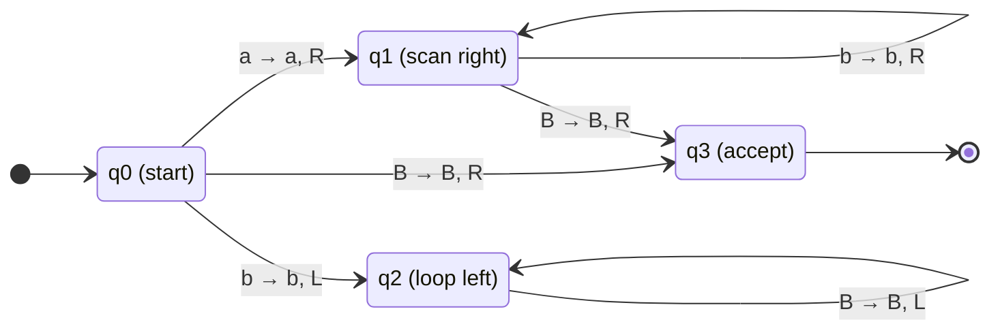
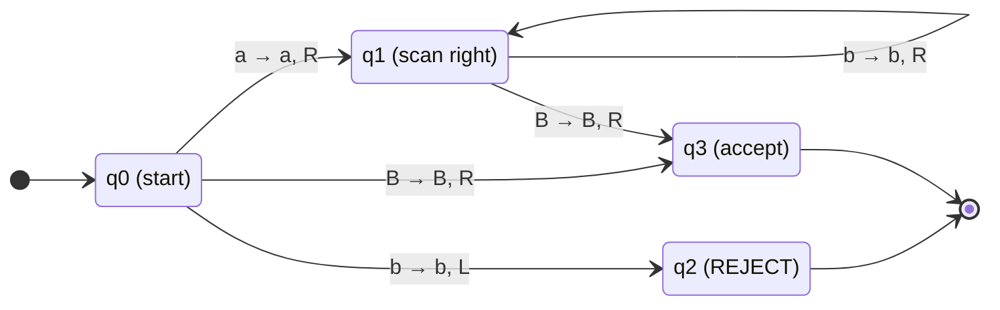
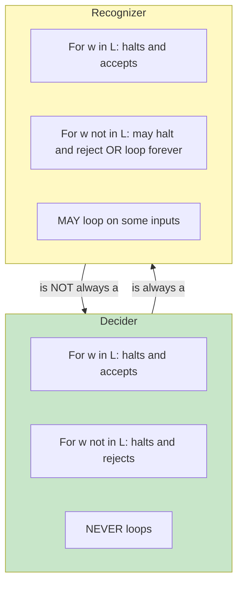

# 3. Turing Machines Basics and Formal Definitions

> [!info] Chapter Overview
> This chapter introduces the most fundamental model of computation: the **Turing Machine** (Machine de Turing, MT). Unlike finite automata (AFD/AFN) which have limited memory, and pushdown automata which have a stack, Turing Machines have an **unbounded tape** that serves as both input and working memory. This seemingly simple extension gives Turing Machines extraordinary computational power — they can compute anything that any algorithm can. Understanding the formal definition, how to construct machines, and the critical distinction between **acceptance** and **decidability** is the foundation for everything that follows in this course: undecidability, reducibility, and the limits of computation.

> [!tip] Prerequisites
> Before studying this chapter, you should be comfortable with:
> - Deterministic Finite Automata (AFD) — see [[1. Finite Automata and Regular Languages]]
> - Set notation and formal languages
> - Basic proof techniques (contradiction, construction)

---

## 3.1 Formal Definition of a Deterministic Turing Machine (MTD)

> [!definition] Deterministic Turing Machine (MTD)
> A **Deterministic Turing Machine** is a 7-tuple $M = (Q, \Gamma, \Sigma, \delta, s, B, F)$ where:
> - **Q** is a finite set of **states**
> - **Γ** (Gamma) is the **tape alphabet** — the finite set of all symbols that can appear on the tape
> - **Σ** (Sigma) is the **input alphabet**, with $\Sigma \subset \Gamma$
> - **δ** (Delta) is the **transition function**: $\delta : Q \times \Gamma \to Q \times \Gamma \times \{L, R\}$
> - **s** is the **start state**, with $s \in Q$
> - **B** is the **blank symbol**, with $B \in \Gamma \setminus \Sigma$
> - **F** is the **set of final (accepting/halting) states**, with $F \subseteq Q$

Let us now examine each component in extreme detail.

### 3.1.1 The States Q

The set Q is a finite (and typically small) set of states. These serve the same role as states in a finite automaton — they encode the machine's "memory" of what it has seen so far and what it needs to do next. However, unlike an AFD where the state is the *only* memory, a Turing Machine also has the tape to store information.

> [!tip] Choosing States
> When designing a Turing Machine, think of each state as representing a **phase** of the algorithm. For example:
> - `q_scan_right` — "I am scanning right to find the end of the input"
> - `q_check_last` — "I am checking the last character"
> - `q_accept` — "I have accepted the input"
> - `q_reject` — "I have rejected the input"
>
> In formal notation, we typically use `q0, q1, q2, ...` but you should always document what each state does.

### 3.1.2 The Tape Alphabet Γ vs The Input Alphabet Σ

This is one of the most frequently confused aspects of Turing Machines, so let us be extremely precise.

> [!definition] Tape Alphabet Γ
> The **tape alphabet** Γ is the set of ALL symbols that can EVER appear on the tape. This includes:
> - All input symbols (every symbol in Σ)
> - The blank symbol B
> - Any auxiliary/work symbols the machine may write during computation (e.g., marked symbols like X, Y, special markers)

> [!definition] Input Alphabet Σ
> The **input alphabet** Σ is the set of symbols that are allowed to appear in the **input string** given to the machine. This is strictly a subset of Γ.

**Why must Σ be a proper subset of Γ?** Because Γ must contain at least the blank symbol B, and B is explicitly NOT in Σ. The blank symbol never appears in the input — it only fills the infinite empty cells surrounding the input. Therefore $\Sigma \subseteq \Gamma \setminus \{B\}$, which means $\Sigma \subset \Gamma$ (strict inclusion).

> [!warning] Common Pitfall — Confusing Γ and Σ
> Students often set Γ = Σ, forgetting that the blank symbol B must be in Γ but must NOT be in Σ. The correct relationship is always: $\Sigma \subset \Gamma$ and $B \in \Gamma \setminus \Sigma$.
>
> In the simplest case (no auxiliary symbols), $\Gamma = \Sigma \cup \{B\}$.

**Example:** If the input alphabet is $\Sigma = \{a, b\}$, then the minimal tape alphabet is $\Gamma = \{a, b, B\}$. If the machine needs to mark cells (e.g., cross out processed symbols), we might have $\Gamma = \{a, b, B, X, Y\}$ where X and Y are auxiliary symbols.

### 3.1.3 The Transition Function δ

The transition function is the heart of the Turing Machine. It is defined as:

$$\delta : Q \times \Gamma \to Q \times \Gamma \times \{L, R\}$$

This means: given the **current state** $q \in Q$ and the **symbol currently under the head** $a \in \Gamma$, the machine:
1. **Changes to a new state** $q' \in Q$
2. **Writes a new symbol** $a' \in \Gamma$ on the tape (replacing $a$)
3. **Moves the head** one cell to the Left (L) or Right (R)

We write: $\delta(q, a) = (q', a', D)$ where $D \in \{L, R\}$.

> [!important] Key Differences from AFD Transitions
> 1. An AFD only **reads** input; a Turing Machine **reads AND writes** on the tape.
> 2. An AFD moves in one direction (left to right); a Turing Machine moves **left or right** at will.
> 3. An AFD transition is $\delta : Q \times \Sigma \to Q$; a TM transition is $\delta : Q \times \Gamma \to Q \times \Gamma \times \{L, R\}$.
> 4. A Turing Machine can revisit the same cell multiple times — the head is free to move back and forth.

**What happens if δ is undefined for some (q, a)?** If the machine is in state q reading symbol a, and $\delta(q, a)$ is not defined, the machine **halts**. If the current state is not in F (not an accepting state), this counts as **rejection**. This is different from an AFD where undefined transitions typically mean the input is rejected outright — for a TM, halting in a non-accepting state is one of two ways to reject (the other being looping forever).

### 3.1.4 The Blank Symbol B

The blank symbol B is a special symbol that fills every cell of the tape that has never been written to. When we say the tape is "infinite," we mean that every cell beyond the input contains B.

> [!info] Why B is NOT in Σ
> The blank symbol B must not be in the input alphabet Σ for a fundamental reason: **the input is always a finite string**. If B were in Σ, then a "word" could contain blanks, and we would have no way to distinguish between:
> - A blank that is part of the input
> - A blank that represents an empty cell beyond the input
>
> This ambiguity would make it impossible to determine where the input ends. By keeping B out of Σ, we guarantee that the first blank encountered when scanning from the left marks the end of the input.

### 3.1.5 The Infinite Tape

The Turing Machine's tape is **infinite in both directions** (or equivalently, infinite in one direction with a left-end marker — the two formulations are equivalent in power). Every cell initially contains B, except for the cells occupied by the input string.

```mermaid
graph LR
    subgraph Tape at Start for input "aba"
        direction LR
        c1["B"] --- c2["a"] --- c3["b"] --- c4["a"] --- c5["B"] --- c6["B"] --- c7["..."]
        c0["..."] --- c1
    end
    style c2 fill:#90EE90
    style c3 fill:#90EE90
    style c4 fill:#90EE90
    style c1 fill:#D3D3D3
    style c5 fill:#D3D3D3
    style c6 fill:#D3D3D3
    style c0 fill:#D3D3D3
    style c7 fill:#D3D3D3
```

> [!tip] The Tape is Both Input and Working Memory
> Unlike an AFD which reads input from a read-only stream, the Turing Machine's tape serves dual purposes:
> 1. It **contains the input** initially
> 2. It serves as **unbounded working memory** that the machine can read, write, and re-read
>
> This is what makes Turing Machines so much more powerful than finite automata.

### 3.1.6 Configurations

To describe the complete state of a Turing Machine at any instant, we use the concept of a **configuration**.

> [!definition] Configuration
> A **configuration** of a Turing Machine captures everything about the current state of computation. It consists of:
> - The current **state** $q$
> - The complete **tape contents** (the non-blank part, plus any blanks between non-blank symbols)
> - The current **head position**

**Notation for configurations:** We write a configuration as $u\, q\, a\, v$ where:
- $u$ is the tape content to the **left** of the head
- $a$ is the symbol currently under the head
- $v$ is the tape content to the **right** of the head
- $q$ is the current state (written just before the symbol being read)

**Example:** The configuration $ab\, q_0\, a\, bB$ means:
- The tape contains: `a b a b B ...`
- The head is on the symbol `a` (the third cell)
- The current state is $q_0$

**Initial configuration:** For input $w = a_1 a_2 \ldots a_n$, the initial configuration is $q_0\, a_1\, a_2 \ldots a_n$ (or equivalently $B\, q_0\, a_1\, a_2 \ldots a_n$ if we want to be explicit about the left blank).

**Configuration transitions (yields):** We write $C_1 \vdash C_2$ to mean configuration $C_1$ yields configuration $C_2$ in one step.

- If $\delta(q, a) = (q', b, R)$, then $u\, q\, a\, v \vdash u\, b\, q'\, v$
  - The machine writes $b$ over $a$, moves right, and changes to state $q'$
- If $\delta(q, a) = (q', b, L)$, then $u\, c\, q\, a\, v \vdash u\, q'\, c\, b\, v$ (for $c$ being the symbol to the left)
  - The machine writes $b$ over $a$, moves left, and changes to state $q'$

> [!warning] Edge Case — Moving Left from the Leftmost Cell
> If the head is on the leftmost non-blank cell (or position 0 if we number cells), and the machine tries to move Left, the convention varies:
> - Some formulations say the machine simply stays put
> - Other formulations say the tape extends infinitely in both directions, so there is always a cell to the left (containing B)
>
> In this course, we assume the tape is infinite in both directions, so moving left from any position always succeeds — you just see more blank cells.

---

## 3.2 Acceptance vs Decidability (Critical Distinction)

This section covers one of the most important concepts in all of computability theory. Understanding this distinction thoroughly is essential for the entire course.

### 3.2.1 A TM Accepts (Recognizes) a Language L

> [!definition] Turing-Recognizable (Recursively Enumerable) Language
> A language L is **Turing-recognizable** (also called **recursively enumerable**) if there exists a Turing Machine M such that:
> - For every $w \in L$, M **eventually halts** in an accepting state
> - For every $w \notin L$, M either **halts in a rejecting state** OR **loops forever**

We write $L(M) = \{w : M \text{ accepts } w\}$ for the language recognized by M.

The key insight is that when M is given an input $w \notin L$, we have **no guarantee** that M will halt. It might reject, or it might run forever. From the perspective of someone watching M execute, if M has been running for a long time, you cannot tell whether:
- M is about to accept (w is in L but the computation is long)
- M is about to reject (w is not in L but the computation is long)
- M will loop forever (w is not in L)

This uncertainty is fundamental and cannot be eliminated in general (as we will see with the Halting Problem).

### 3.2.2 A TM Decides a Language L

> [!definition] Turing-Decidable (Recursive) Language
> A language L is **Turing-decidable** (also called **recursive**) if there exists a Turing Machine M such that:
> - For every $w \in L$, M **halts and accepts**
> - For every $w \notin L$, M **halts and rejects**
> - M **NEVER loops** — it halts on ALL inputs

A machine that halts on all inputs is called a **decider** (or a **total Turing Machine**).

> [!important] Critical Distinction for Exams
> When asked to "define an MTD that **decides** L", you must ensure the machine halts on ALL inputs. When asked to "define an MTD that **accepts** L", the machine may loop on inputs not in L.
>
> **Every decider is a recognizer, but not every recognizer is a decider.**
>
> $$\text{Turing-decidable languages} \subsetneq \text{Turing-recognizable languages}$$

### 3.2.3 The Halting Problem Connection

> [!info] Why This Matters
> The distinction between acceptance and decidability is not merely academic — it reflects a deep truth about computation. The **Halting Problem** asks: given a Turing Machine M and input w, does M halt on w? Alan Turing proved in 1936 that this problem is **undecidable** — there is no Turing Machine that can answer this question for all possible (M, w) pairs.

Some languages can be recognized but not decided. The classic example is:

$$L_{\text{halt}} = \{\langle M, w \rangle : M \text{ halts on input } w\}$$

This language IS Turing-recognizable (we can simulate M on w and accept if it halts), but it is NOT Turing-decidable (there is no way to detect that M will loop forever without actually running it forever).

We will explore this in depth in later chapters. For now, the critical takeaway is:

> [!tip] Mental Model
> - **Recognizer**: "I can confirm YES answers, but I might never respond for NO answers."
> - **Decider**: "I can confirm both YES and NO answers, and I always respond."
>
> Think of it like a trial: a recognizer is like a court that can convict (accept) but might never reach a verdict for innocent defendants. A decider always reaches a verdict.

---

## 3.3 Exercise: MTD that Decides Words Ending in a

**Source:** Exos-AFD Exercise 7 / MT-JFLAP Exercise 1, Question 1

$$L = \{w \in \{a, b\}^* : w \text{ ends with at least one } a\}$$

In other words, L contains all words over $\{a, b\}$ whose last symbol is `a`. This includes words like `a`, `ba`, `aba`, `aa`, `bababa`, and so on. It does NOT include words ending in `b` or the empty word $\varepsilon$.

### 3.3.1 Algorithm Design

Before writing any formal definition, we should design the algorithm in plain language:

1. **Start** at the leftmost character of the input
2. **Move right** across all input symbols until we reach the blank symbol B (this means we have gone past the end of the input)
3. **Move left** one position (now the head is on the last character of the input, or on B if the input was empty)
4. **Check** the symbol under the head:
   - If it is `a`, then the word ends with `a` — **ACCEPT**
   - If it is `b`, then the word ends with `b` — **REJECT**
   - If it is `B`, then the word was empty ($\varepsilon$) — **REJECT** (the empty word has no last character, so it cannot end with `a`)

> [!tip] Design Strategy
> The key insight for this machine is that we need to find the LAST character. Since a Turing Machine can only see one cell at a time, we must **scan past all characters** and then **back up one step**. This "scan to the end, then back up" pattern is extremely common in TM design.

### 3.3.2 Formal Definition of M1

$$M_1 = (Q, \Gamma, \Sigma, \delta, s, B, F)$$

where:
- $Q = \{q_0, q_1, q_{\text{accept}}, q_{\text{reject}}\}$
- $\Gamma = \{a, b, B\}$
- $\Sigma = \{a, b\}$
- $s = q_0$
- $B = \text{blank}$
- $F = \{q_{\text{accept}}\}$

**State descriptions:**
- $q_0$: scanning right, looking for the end of the input
- $q_1$: just moved left from the blank; now checking the last character
- $q_{\text{accept}}$: accepting state
- $q_{\text{reject}}$: rejecting state

### 3.3.3 Transition Table

| Current State | Symbol Read | New State | Symbol Written | Direction |
|:---:|:---:|:---:|:---:|:---:|
| $q_0$ | $a$ | $q_0$ | $a$ | R |
| $q_0$ | $b$ | $q_0$ | $b$ | R |
| $q_0$ | $B$ | $q_1$ | $B$ | L |
| $q_1$ | $a$ | $q_{\text{accept}}$ | $a$ | R |
| $q_1$ | $b$ | $q_{\text{reject}}$ | $b$ | R |
| $q_1$ | $B$ | $q_{\text{reject}}$ | $B$ | R |

> [!info] Reading the Transition Table
> Each row means: "When the machine is in the given state and reads the given symbol, it transitions to the new state, writes the new symbol, and moves in the specified direction."
>
> Note that $q_{\text{accept}}$ and $q_{\text{reject}}$ have no outgoing transitions — the machine halts as soon as it enters either of these states.

### 3.3.4 State Diagram (Mermaid)



### 3.3.5 Full Execution Traces

Let us trace the execution of M1 on several inputs to build thorough understanding.

**Trace 1: Input $w = aba$**

| Step | Configuration | Action |
|:---:|:---|:---|
| 0 | $q_0\, a\, b\, a$ | Start: head on first `a` |
| 1 | $a\, q_0\, b\, a$ | $\delta(q_0, a) = (q_0, a, R)$: read `a`, stay in $q_0$, move right |
| 2 | $a\, b\, q_0\, a$ | $\delta(q_0, b) = (q_0, b, R)$: read `b`, stay in $q_0$, move right |
| 3 | $a\, b\, a\, q_0\, B$ | $\delta(q_0, a) = (q_0, a, R)$: read `a`, stay in $q_0$, move right |
| 4 | $a\, b\, q_1\, a\, B$ | $\delta(q_0, B) = (q_1, B, L)$: read `B`, go to $q_1$, move left |
| 5 | **ACCEPT** | $\delta(q_1, a) = (q_{\text{accept}}, a, R)$: last char is `a`, accept! |

**Result:** $aba \in L$ — Correct! ✓

**Trace 2: Input $w = ab$**

| Step | Configuration | Action |
|:---:|:---|:---|
| 0 | $q_0\, a\, b$ | Start |
| 1 | $a\, q_0\, b$ | $\delta(q_0, a) = (q_0, a, R)$ |
| 2 | $a\, b\, q_0\, B$ | $\delta(q_0, b) = (q_0, b, R)$ |
| 3 | $a\, q_1\, b\, B$ | $\delta(q_0, B) = (q_1, B, L)$ |
| 4 | **REJECT** | $\delta(q_1, b) = (q_{\text{reject}}, b, R)$: last char is `b`, reject |

**Result:** $ab \notin L$ — Correct! ✓

**Trace 3: Input $w = b$**

| Step | Configuration | Action |
|:---:|:---|:---|
| 0 | $q_0\, b$ | Start |
| 1 | $b\, q_0\, B$ | $\delta(q_0, b) = (q_0, b, R)$ |
| 2 | $q_1\, b\, B$ | $\delta(q_0, B) = (q_1, B, L)$ |
| 3 | **REJECT** | $\delta(q_1, b) = (q_{\text{reject}}, b, R)$ |

**Result:** $b \notin L$ — Correct! ✓

**Trace 4: Input $w = \varepsilon$ (empty word)**

| Step | Configuration | Action |
|:---:|:---|:---|
| 0 | $q_0\, B$ | Start: head immediately sees blank |
| 1 | $q_1\, B$ | Wait — let us be more precise about this... |

Actually, let us be more careful. When the input is empty, the initial configuration is $q_0\, B$ (the head is on a blank cell). Then:

| Step | Configuration | Action |
|:---:|:---|:---|
| 0 | $q_0\, B$ | Start: head on blank |
| 1 | We need $\delta(q_0, B)$ = $(q_1, B, L)$, so we get... |

Actually, after $\delta(q_0, B) = (q_1, B, L)$, the head moves left to another blank cell. The configuration becomes $B\, q_1\, B$ (approximately — there is a blank to the left of the original blank). Then $\delta(q_1, B) = (q_{\text{reject}}, B, R)$:

| Step | Configuration | Action |
|:---:|:---|:---|
| 0 | $q_0\, B$ | Start |
| 1 | head moves left, state $q_1$, sees $B$ | $\delta(q_0, B) = (q_1, B, L)$ |
| 2 | **REJECT** | $\delta(q_1, B) = (q_{\text{reject}}, B, R)$: empty word, reject |

**Result:** $\varepsilon \notin L$ — Correct! ✓

### 3.3.6 Proof That M1 Decides L

We must prove two things: (1) M1 halts on all inputs, and (2) M1 accepts $w$ if and only if $w \in L$.

**Claim 1: M1 halts on all inputs.**

*Proof:* Consider any input $w \in \{a, b\}^*$. In state $q_0$, every transition moves the head Right. Since $w$ is finite (has length $|w|$), after exactly $|w|$ steps, the head will reach a blank symbol B. At this point, the transition $\delta(q_0, B) = (q_1, B, L)$ fires, moving the head one step left and entering state $q_1$. In state $q_1$, every transition leads to either $q_{\text{accept}}$ or $q_{\text{reject}}$, both of which have no outgoing transitions. Therefore, M1 halts after at most $|w| + 2$ steps. Since this holds for every input, M1 halts on all inputs. $\square$

**Claim 2: M1 accepts $w$ if and only if $w$ ends with `a`.**

*Proof:*
- ($\Rightarrow$) Suppose M1 accepts $w$. The only way to reach $q_{\text{accept}}$ is via the transition $\delta(q_1, a) = (q_{\text{accept}}, a, R)$. This means that in state $q_1$, the head was on symbol `a`. But state $q_1$ is entered only from $q_0$ when a blank is read and the head moves left. This means the head was on the last symbol of $w$ (or on B if $w = \varepsilon$). Since the symbol was `a` and not B, $w$ is non-empty and its last symbol is `a`. Therefore $w \in L$.
- ($\Leftarrow$) Suppose $w$ ends with `a`. Then $w$ is non-empty, and after scanning right through all of $w$, the head reaches a blank. Moving left, the head is on the last symbol, which is `a`. The transition $\delta(q_1, a) = (q_{\text{accept}}, a, R)$ fires, and M1 accepts. $\square$

Since M1 halts on all inputs and accepts exactly the words in L, M1 **decides** L. $\square$

---

## 3.4 Exercise: MTD that Accepts but Does NOT Decide Words Ending in a

**Source:** Exos-AFD Exercise 7 / MT-JFLAP Exercise 1, Question 2

We consider the same language: $L = \{w \in \{a, b\}^* : w \text{ ends with } a\}$. But now we must construct a machine $M_2$ that **accepts** L but does **NOT decide** L.

### 3.4.1 Algorithm Design

The idea is simple and powerful: M2 should accept all words in L correctly, but for words NOT in L, instead of rejecting, M2 should **loop forever**.

1. Start at the leftmost character
2. Move right until we reach the blank symbol B
3. Move left one position (now on the last character)
4. If the last character is `a`, **ACCEPT**
5. If the last character is `b`, **enter an infinite loop** (instead of rejecting!)
6. If the word is empty (see B), **enter an infinite loop** (instead of rejecting!)

### 3.4.2 Formal Definition of M2

$$M_2 = (Q, \Gamma, \Sigma, \delta, s, B, F)$$

where:
- $Q = \{q_0, q_1, q_{\text{accept}}, q_{\text{loop}}\}$
- $\Gamma = \{a, b, B\}$
- $\Sigma = \{a, b\}$
- $s = q_0$
- $B = \text{blank}$
- $F = \{q_{\text{accept}}\}$

Note: there is NO $q_{\text{reject}}$ state! Rejection happens by looping, not by reaching a rejecting state.

### 3.4.3 Transition Table

| Current State | Symbol Read | New State | Symbol Written | Direction |
|:---:|:---:|:---:|:---:|:---:|
| $q_0$ | $a$ | $q_0$ | $a$ | R |
| $q_0$ | $b$ | $q_0$ | $b$ | R |
| $q_0$ | $B$ | $q_1$ | $B$ | L |
| $q_1$ | $a$ | $q_{\text{accept}}$ | $a$ | R |
| $q_1$ | $b$ | $q_{\text{loop}}$ | $b$ | R |
| $q_1$ | $B$ | $q_{\text{loop}}$ | $B$ | R |
| $q_{\text{loop}}$ | $a$ | $q_{\text{loop}}$ | $a$ | R |
| $q_{\text{loop}}$ | $b$ | $q_{\text{loop}}$ | $b$ | L |
| $q_{\text{loop}}$ | $B$ | $q_{\text{loop}}$ | $B$ | R |

### 3.4.4 State Diagram (Mermaid)



### 3.4.5 Execution Traces

**Trace 1: Input $w = aba$ (in L)**

The execution is identical to M1 for words in L:
- Scan right through `a`, `b`, `a`
- Hit blank, move left to last `a`
- $\delta(q_1, a) = (q_{\text{accept}}, a, R)$ — **ACCEPT**

**Trace 2: Input $w = ab$ (not in L)**

| Step | Configuration | Action |
|:---:|:---|:---|
| 0 | $q_0\, a\, b$ | Start |
| 1 | $a\, q_0\, b$ | scan right |
| 2 | $a\, b\, q_0\, B$ | scan right, reach end |
| 3 | $a\, q_1\, b\, B$ | move left, enter $q_1$ |
| 4 | $a\, b\, q_{\text{loop}}\, B$ | $\delta(q_1, b) = (q_{\text{loop}}, b, R)$ — enter loop! |
| 5 | $a\, b\, B\, q_{\text{loop}}\, B$ | $\delta(q_{\text{loop}}, B) = (q_{\text{loop}}, B, R)$ — looping |
| 6 | $a\, b\, B\, B\, q_{\text{loop}}\, B$ | still looping |
| ... | ... | **LOOPS FOREVER** |

The machine will never halt on input `ab`.

### 3.4.6 Why M2 Accepts L but Does NOT Decide L

> [!warning] Common Pitfall
> Students often create a machine that loops from the start. But M2 must still ACCEPT words in L correctly! The infinite loop only happens for words NOT in L. The machine must work perfectly for words in L — only its behavior on words outside L differs from a decider.

**M2 accepts L:**
- For $w \in L$ (words ending in `a`): M2 follows the same path as M1 and reaches $q_{\text{accept}}$. It halts and accepts. ✓
- For $w \notin L$ (words ending in `b` or $\varepsilon$): M2 enters $q_{\text{loop}}$ and never halts. The machine does not accept these words. ✓

**M2 does NOT decide L:**
- A decider must halt on ALL inputs. But M2 loops forever on inputs not in L.
- Therefore M2 is a recognizer but NOT a decider.

> [!important] Key Insight
> The difference between M1 (decider) and M2 (recognizer) is ONLY in how they handle inputs not in L:
> - M1 explicitly **rejects** (halts in $q_{\text{reject}}$)
> - M2 **loops forever** (never halts)
>
> Both machines accept exactly the same language L. The difference is in their behavior on inputs outside L.

---

## 3.5 Exercise: MTD with Infinite Execution on ALL Inputs

**Source:** MT-JFLAP Exercise 2 / Exos-AFD Exercise 6

**Task:** Define an MTD M such that for ALL input words $w$, the execution of M on $w$ is an infinite sequence of configurations.

### 3.5.1 Construction — Right-Marching Machine

The simplest construction is a machine with a single state that never halts:

$$M = (Q, \Gamma, \Sigma, \delta, s, B, F)$$

where:
- $Q = \{q_0\}$
- $\Gamma = \{a, b, B\}$
- $\Sigma = \{a, b\}$
- $s = q_0$
- $F = \emptyset$ (no accepting states!)
- Transition function:
  - $\delta(q_0, a) = (q_0, a, R)$
  - $\delta(q_0, b) = (q_0, b, R)$
  - $\delta(q_0, B) = (q_0, B, R)$

**State Diagram:**



### 3.5.2 Why This Machine Runs Forever on All Inputs

The proof is straightforward:

1. $F = \emptyset$, so the machine can **never** reach an accepting state. There is no way to halt by acceptance.
2. Every transition from $q_0$ goes back to $q_0$. The machine never enters a state with undefined transitions (which would cause it to halt).
3. Therefore, the machine never halts — it runs forever.

But let us be more precise about what happens:

**On input $w = a_1 a_2 \ldots a_n$:**
- For the first $n$ steps, the head scans right through the input symbols
- After step $n$, the head is on a blank B
- The transition $\delta(q_0, B) = (q_0, B, R)$ fires, moving the head to another blank cell
- This repeats forever — the head keeps moving right into an infinite sea of blanks

> [!tip] Think About It
> This machine is essentially doing "nothing useful" — it just marches to the right forever. But it perfectly illustrates the concept that a Turing Machine can run forever without ever reaching a halting state. The key ingredients are: (1) no accepting states, and (2) every transition stays in the same state (or transitions between non-halting states).

### 3.5.3 Alternative Construction — Oscillating Machine

Another interesting construction is a machine that oscillates back and forth:

- $Q = \{q_0, q_1\}$
- $F = \emptyset$
- $\delta(q_0, a) = (q_1, a, R)$, $\delta(q_0, b) = (q_1, b, R)$, $\delta(q_0, B) = (q_1, B, R)$
- $\delta(q_1, a) = (q_0, a, L)$, $\delta(q_1, b) = (q_0, b, L)$, $\delta(q_1, B) = (q_0, B, L)$

**State Diagram:**



This machine alternates between moving right and moving left. On any input, it will oscillate forever between the input and the surrounding blanks, never reaching a halting state.

> [!warning] Both Constructions Work
> The right-marching machine and the oscillating machine both satisfy the requirement. For exercises, the right-marching machine is simpler and preferred. However, the oscillating machine is interesting because it shows that infinite execution can involve the head moving in both directions, not just in one direction.

---

## 3.6 Compiling an AFD to an MTD

**Source:** Exos-AFD Exercise 8

One of the most fundamental results in computability is that **Turing Machines are at least as powerful as finite automata**. More precisely, every language recognized by a DFA can also be decided by a Turing Machine.

### 3.6.1 The Compilation Principle

The idea is simple: a Turing Machine can simulate a DFA by simply reading the input left-to-right (just like a DFA) without ever writing anything or moving the head backwards.

> [!definition] AFD-to-MTD Compilation
> Given an AFD $A = (Q_A, \Sigma, \delta_A, s_A, F_A)$, we construct an MTD $M = (Q_M, \Gamma, \Sigma, \delta_M, s_M, B, F_M)$ where:
> - $Q_M = Q_A$ (same set of states)
> - $\Gamma = \Sigma \cup \{B\}$ (tape alphabet is input alphabet plus blank)
> - $s_M = s_A$ (same start state)
> - $F_M = F_A$ (same set of accepting states)
> - For each transition $\delta_A(q, a) = q'$ in the AFD, define $\delta_M(q, a) = (q', a, R)$
> - For the blank symbol: for each state $q \in Q_A$, either leave $\delta_M(q, B)$ undefined (causing the machine to halt), or define $\delta_M(q, B) = (q, B, R)$ and adjust as needed

**What about the blank transitions?** When the TM head reaches a blank (i.e., has finished reading the entire input), the machine should halt. If the current state is in $F_A$, the input is accepted; if not, it is rejected. We can achieve this by leaving $\delta_M(q, B)$ undefined for all $q$ — when the machine encounters B, it halts.

### 3.6.2 Visual Representation of the Compilation



### 3.6.3 Worked Example

Consider the AFD that accepts words over $\{a, b\}$ containing an even number of `a`'s:

- $Q_A = \{q_{\text{even}}, q_{\text{odd}}\}$
- $\Sigma = \{a, b\}$
- $s_A = q_{\text{even}}$
- $F_A = \{q_{\text{even}}\}$
- $\delta_A(q_{\text{even}}, a) = q_{\text{odd}}$, $\delta_A(q_{\text{even}}, b) = q_{\text{even}}$
- $\delta_A(q_{\text{odd}}, a) = q_{\text{even}}$, $\delta_A(q_{\text{odd}}, b) = q_{\text{odd}}$

**Compiled MTD:**
- $Q_M = \{q_{\text{even}}, q_{\text{odd}}\}$
- $\Gamma = \{a, b, B\}$
- $\Sigma = \{a, b\}$
- $s_M = q_{\text{even}}$
- $F_M = \{q_{\text{even}}\}$
- $\delta_M(q_{\text{even}}, a) = (q_{\text{odd}}, a, R)$, $\delta_M(q_{\text{even}}, b) = (q_{\text{even}}, b, R)$
- $\delta_M(q_{\text{odd}}, a) = (q_{\text{even}}, a, R)$, $\delta_M(q_{\text{odd}}, b) = (q_{\text{odd}}, b, R)$
- $\delta_M(q, B)$ undefined for all $q$ (machine halts on blank)

> [!important] The Compiled MTD is Always a Decider
> Since the AFD always finishes processing the input (it reads each character exactly once), the compiled MTD will always reach the blank symbol and halt. Therefore, the compiled MTD is always a **decider**, not just a recognizer.

### 3.6.4 What This Tells Us About the Power of Turing Machines

The compilation shows that Turing Machines are at least as powerful as DFAs. In fact, they are strictly more powerful, since there are languages that Turing Machines can decide that DFAs cannot (e.g., $\{a^n b^n : n \geq 0\}$).



---

## 3.7 Formalizing and Analyzing MTD M1

**Source:** MT-JFLAP Exercise 3 / Exos-AFD Exercise 9

We are given a Turing Machine M1 described by the following formal definition:

$$M_1 = (Q, \Gamma, \Sigma, \delta, s, B, F)$$

where:
- $Q = \{q_0, q_1\}$
- $\Gamma = \{a, b, B\}$
- $\Sigma = \{a, b\}$
- $s = q_0$
- $F = \{q_1\}$
- Transition function:
  - $\delta(q_0, a) = (q_0, a, R)$
  - $\delta(q_0, b) = (q_0, b, R)$
  - $\delta(q_0, B) = (q_1, B, R)$

### 3.7.1 Understanding the Machine

Let us analyze what this machine does:

1. In state $q_0$, the machine scans right across all `a`'s and `b`'s without changing anything
2. When it encounters a blank B, it transitions to $q_1$ and moves right
3. In state $q_1$, there are NO defined transitions — the machine halts

Since $q_1 \in F$, the machine halts in an accepting state. And since the machine will always eventually reach a blank (the input is finite), the machine always reaches $q_1$.

### 3.7.2 State Diagram



### 3.7.3 Justification of Termination

> [!tip] Proving Termination
> To prove a Turing Machine halts on all inputs, you need to show that every possible execution path eventually reaches a state with no outgoing transitions (or an explicit accept/reject state). The most common technique is to identify a **monotonic measure** — something that strictly increases (or decreases) at each step and is bounded.

**Proof that M1 halts on all inputs:**

Consider any input $w \in \{a, b\}^*$:
- In state $q_0$, the head always moves Right (all transitions from $q_0$ have direction R)
- The input $w$ has finite length $|w|$
- Starting from the first cell, the head moves right one cell per step
- After exactly $|w|$ steps, the head reaches a blank cell B
- The transition $\delta(q_0, B) = (q_1, B, R)$ fires, entering state $q_1$
- State $q_1$ has no defined transitions, so the machine halts
- Since $q_1 \in F$, the machine accepts

Therefore M1 halts on all inputs. $\square$

The monotonic measure here is: the distance from the head to the first blank cell. This distance decreases by 1 at each step and reaches 0 after $|w|$ steps.

### 3.7.4 Language Decided by M1

Since M1 halts on all inputs and always accepts, what language does it decide?

$$L(M_1) = \Sigma^* = \{a, b\}^*$$

M1 accepts **every** word over $\{a, b\}$, including the empty word $\varepsilon$. This is because:
- For any non-empty word, M1 scans right through all characters and accepts upon reaching the blank
- For the empty word, M1 immediately sees a blank and accepts

> [!info] This Machine is a "Universal Acceptor"
> M1 is the simplest possible decider that accepts everything. It demonstrates that $\Sigma^*$ is a Turing-decidable language (which is trivially true, but it is good to see an explicit machine).

---

## 3.8 Analyzing MTD M2

**Source:** MT-JFLAP Exercise 4 / Exos-AFD Exercise 10

Now we analyze a more complex machine M2 that has some execution paths leading to acceptance and others that loop forever.

### 3.8.1 Definition of M2

Consider the following Turing Machine:

$$M_2 = (Q, \Gamma, \Sigma, \delta, s, B, F)$$

where:
- $Q = \{q_0, q_1, q_2, q_3\}$
- $\Gamma = \{a, b, B\}$
- $\Sigma = \{a, b\}$
- $s = q_0$
- $F = \{q_3\}$
- Transition function:
  - $\delta(q_0, a) = (q_1, a, R)$
  - $\delta(q_0, b) = (q_2, b, L)$
  - $\delta(q_0, B) = (q_3, B, R)$
  - $\delta(q_1, a) = (q_1, a, R)$
  - $\delta(q_1, b) = (q_1, b, R)$
  - $\delta(q_1, B) = (q_3, B, R)$
  - $\delta(q_2, a) = (q_2, a, L)$
  - $\delta(q_2, b) = (q_2, b, L)$
  - $\delta(q_2, B) = (q_2, B, L)$

### 3.8.2 State Diagram



### 3.8.3 Analysis of M2's Behavior

Let us analyze what happens for different categories of input:

**Case 1: Input starts with `a` (or any word beginning with `a`)**

When M2 reads `a` in state $q_0$, it transitions to $q_1$ and moves right. In $q_1$, the machine scans right through all remaining characters (both `a` and `b`) without stopping. When it reaches the blank B, it transitions to $q_3$ (accept) and halts.

**Result:** ACCEPT — all words starting with `a` are accepted.

**Case 2: Input is the empty word $\varepsilon$**

When M2 starts on a blank in $q_0$, the transition $\delta(q_0, B) = (q_3, B, R)$ fires immediately.

**Result:** ACCEPT — the empty word is accepted.

**Case 3: Input starts with `b`**

When M2 reads `b` in state $q_0$, it transitions to $q_2$ and moves left. In $q_2$, the machine moves left on ALL symbols (`a`, `b`, and `B`) and stays in $q_2$ forever. Since $q_2 \notin F$ and $q_2$ has transitions defined for all symbols, the machine never halts.

**Result:** INFINITE LOOP — all words starting with `b` cause the machine to loop forever.

### 3.8.4 Detailed Traces

**Trace 1: Input $w = ab$**

| Step | Configuration | Action |
|:---:|:---|:---|
| 0 | $q_0\, a\, b$ | Start |
| 1 | $a\, q_1\, b$ | $\delta(q_0, a) = (q_1, a, R)$ |
| 2 | $a\, b\, q_1\, B$ | $\delta(q_1, b) = (q_1, b, R)$ |
| 3 | **ACCEPT** | $\delta(q_1, B) = (q_3, B, R)$, $q_3 \in F$ |

**Trace 2: Input $w = ba$**

| Step | Configuration | Action |
|:---:|:---|:---|
| 0 | $q_0\, b\, a$ | Start |
| 1 | $q_2\, B\, b\, a$ | $\delta(q_0, b) = (q_2, b, L)$, head moves left to blank |
| 2 | $q_2\, B\, B\, b\, a$ | $\delta(q_2, B) = (q_2, B, L)$, head moves left to another blank |
| 3 | $q_2\, B\, B\, B\, b\, a$ | still moving left through blanks |
| ... | ... | **LOOPS FOREVER** |

**Trace 3: Input $w = \varepsilon$**

| Step | Configuration | Action |
|:---:|:---|:---|
| 0 | $q_0\, B$ | Start |
| 1 | **ACCEPT** | $\delta(q_0, B) = (q_3, B, R)$, $q_3 \in F$ |

### 3.8.5 Answering the Exercise Questions

**Question 1: Does M2 have infinite executions?**

**YES.** Any input starting with `b` causes M2 to enter state $q_2$ and loop forever. For example, $w = b$, $w = ba$, $w = bb$, $w = baaab$ — all cause infinite execution.

**Question 2: Can M2 decide a language?**

**NO.** A decider must halt on ALL inputs. Since M2 loops forever on inputs starting with `b`, it is not a decider. It is only a recognizer.

**Question 3: What language does M2 accept?**

$$L(M_2) = \{w \in \{a, b\}^* : w = \varepsilon \text{ or } w \text{ starts with } a\}$$

Or equivalently: $L(M_2) = \{\varepsilon\} \cup \{a\} \cdot \{a, b\}^*$ — the set containing the empty word and all non-empty words that begin with `a`.

**Question 4: How to modify M2 to decide this language?**

We need to replace the infinite loop in state $q_2$ with explicit rejection. The modified machine $M_2'$ would have:

- Add a reject state $q_{\text{reject}}$ to Q
- Replace the transitions in $q_2$:
  - Instead of $\delta(q_2, a) = (q_2, a, L)$, use $\delta(q_2, a) = (q_{\text{reject}}, a, R)$
  - Instead of $\delta(q_2, b) = (q_2, b, L)$, use $\delta(q_2, b) = (q_{\text{reject}}, b, R)$
  - Instead of $\delta(q_2, B) = (q_2, B, L)$, use $\delta(q_2, B) = (q_{\text{reject}}, B, R)$

Or more simply, we could make $q_2$ itself a rejecting state by removing all its outgoing transitions. When the machine enters $q_2$, it halts immediately, and since $q_2 \notin F$, it rejects.

**Modified state diagram:**



> [!tip] General Strategy for Converting a Recognizer to a Decider
> The key idea is to identify all states/paths where the machine loops forever, and replace them with explicit rejection. However, this is not always possible! Some languages are recognizable but NOT decidable, meaning no Turing Machine can decide them. The Halting Problem is the canonical example. For the simple machines in this chapter, the conversion is straightforward because the infinite loops are obvious and can be replaced with rejection.

### 3.8.6 Summary Table for M2

| Input Category | Behavior | Result |
|:---|:---|:---|
| $\varepsilon$ (empty) | Immediately sees B in $q_0$, transitions to $q_3$ | Accept |
| Words starting with `a` | Goes to $q_1$, scans right, reaches B, goes to $q_3$ | Accept |
| Words starting with `b` | Goes to $q_2$, moves left forever | Infinite loop (never halts) |

---

## 3.9 Summary and Key Takeaways

### 3.9.1 Formal Definition Checklist

When defining a Turing Machine on an exam, always specify ALL seven components:

> [!important] TM Definition Checklist
> 1. ☐ Q — finite set of states
> 2. ☐ Γ — tape alphabet (must include B and all input symbols)
> 3. ☐ Σ — input alphabet (must be a proper subset of Γ, must NOT include B)
> 4. ☐ δ — complete transition function
> 5. ☐ s — start state (must be in Q)
> 6. ☐ B — blank symbol (must be in Γ but NOT in Σ)
> 7. ☐ F — set of accepting states (subset of Q)

### 3.9.2 Acceptance vs Decidability Summary



### 3.9.3 Common Design Patterns for Turing Machines

> [!tip] TM Design Patterns
> 1. **Scan to end and back up:** Move right to find the blank, then move left to inspect the last character. Used in Sections 3.3 and 3.4.
> 2. **Mark and sweep:** Replace processed symbols with markers (X, Y) to remember which cells have been visited. We will see this in later chapters.
> 3. **Copy and compare:** Copy part of the input to another area of the tape, then compare. Essential for deciding languages like $\{ww : w \in \Sigma^*\}$.
> 4. **AFD simulation:** Simply read left to right without writing, as in Section 3.6. This always produces a decider.
> 5. **Intentional infinite loop:** When building a recognizer (not a decider), replace reject states with loops. As in Section 3.4.

### 3.9.4 Common Pitfalls to Avoid

> [!warning] Top Mistakes on Exams
> 1. **Forgetting to handle the empty word.** Always check: what does the machine do when it sees a blank immediately? The empty word is a valid input.
> 2. **Confusing Γ and Σ.** Remember: $\Sigma \subset \Gamma$ always, and $B \in \Gamma \setminus \Sigma$.
> 3. **Creating a recognizer when a decider is asked for.** If the problem says "decide," the machine MUST halt on all inputs.
> 4. **Incomplete transition function.** If a transition is undefined and the machine reaches that state-symbol pair, it halts. Make sure this is intentional.
> 5. **Forgetting that the tape is infinite.** Moving right past all input symbols is fine — you just see blanks. Moving left past the first symbol is also fine — more blanks.
> 6. **Not proving termination.** When claiming a machine decides a language, you must argue that it halts on ALL inputs, not just the ones in the language.
> 7. **Writing an infinite loop that also affects words in L.** When building a recognizer that does not decide, the infinite loop must only happen for words NOT in L. Words in L must still be accepted correctly.

### 3.9.5 Connection to What Comes Next

The concepts in this chapter lay the groundwork for:

- **Chapter on Undecidability:** We will see languages that can be recognized but NOT decided — no modification can convert the recognizer into a decider
- **Chapter on Reducibility:** We will use Turing Machine constructions to prove that certain problems are undecidable
- **Chapter on the Halting Problem:** The most famous undecidable problem, directly related to the accept-vs-decide distinction

> [!info] JFLAP Practice
> All the machines in this chapter can be built and tested in JFLAP. Strongly recommended:
> - Build M1 (Section 3.3) and test on various inputs
> - Build M2 (Section 3.4) and observe the infinite loop
> - Build the right-marching machine (Section 3.5) and verify it never halts
> - Compile an AFD into an MTD (Section 3.6) and compare behaviors
> - Build M2 from Section 3.8 and identify which inputs cause loops

---

*This note covers the fundamental definitions and first exercises on Turing Machines. The distinction between acceptance and decidability is the single most important concept to master before proceeding to undecidability.*
