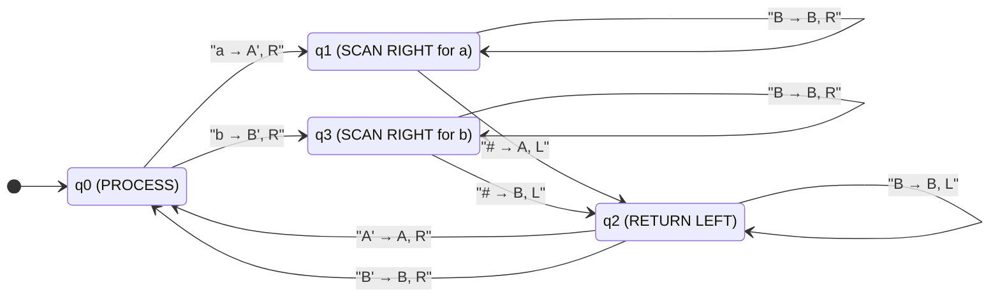
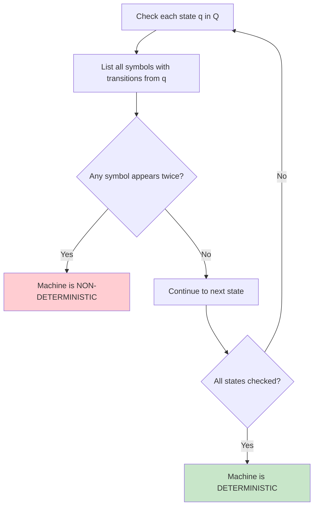
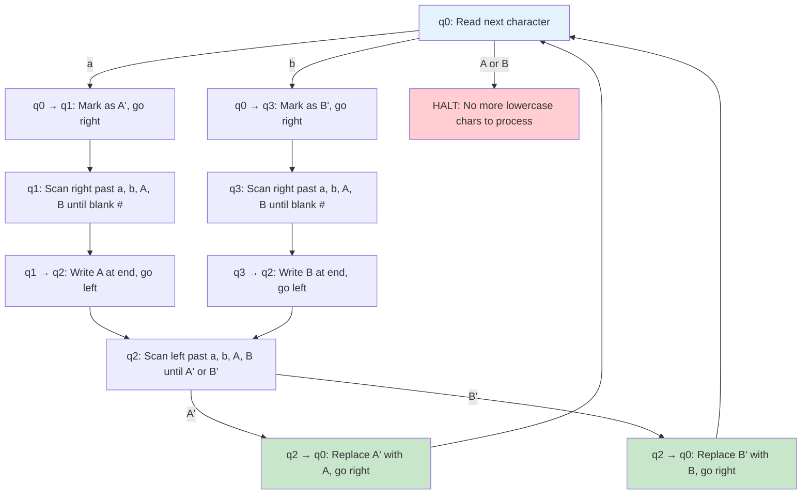
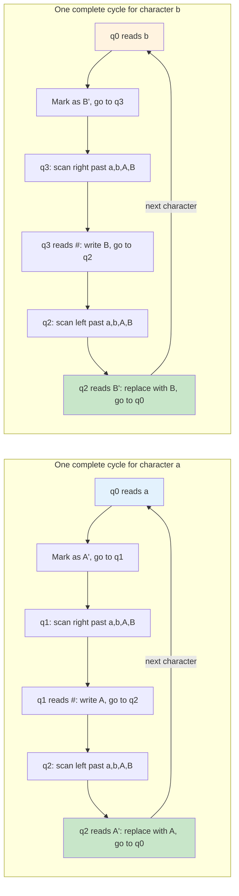
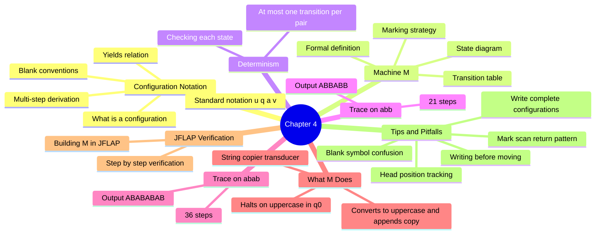

# 4. Tracing Configurations and Execution

> [!info] Chapter Overview
> This chapter is the beating heart of understanding how Turing Machines actually compute. While the previous chapter introduced the formal definitions, here we learn the essential skill of **tracing**: writing out every single configuration of a Turing Machine step by step, from the initial configuration to the final halting state. This is not merely a mechanical exercise — it is the fundamental way we prove what a machine does, verify its correctness, and develop intuition for Turing Machine design. We work through a complete example machine M that uses a marking and copying strategy, tracing it on multiple inputs to reveal its underlying purpose as a string copier. By the end of this chapter, you will be able to trace any Turing Machine confidently, read configuration notation fluently, and recognize common design patterns such as the mark-scan-return technique.

> [!tip] Prerequisites
> Before studying this chapter, you should be comfortable with:
> - The formal definition of a Turing Machine as a 7-tuple — see [[3. Turing Machines Basics and Formal Definitions]]
> - The concepts of tape alphabet, input alphabet, blank symbol, and transition function
> - The distinction between deciders and recognizers
> - Basic set notation and string notation

> [!important] Why Tracing Matters
> Tracing is not just a study technique — it is a proof technique. When an exam asks "what does machine M compute?", the expected answer involves tracing M on representative inputs and then generalizing. A correct trace is a rigorous argument. A sloppy or incomplete trace is worth nothing. Learn to trace meticulously: every step, every symbol, every head movement.

---

## 4.1 Configuration Notation

### 4.1.1 What is a Configuration?

A configuration (also called an **instantaneous description** or ID) is a complete snapshot of a Turing Machine at a precise moment during its computation. It captures everything you would need to know in order to resume the computation from that point, with no additional context required.

> [!definition] Configuration (Instantaneous Description)
> A **configuration** of a Turing Machine is a complete description of the machine's current situation, comprising exactly three pieces of information:
> 1. The **current state** $q$ of the machine (which element of $Q$ the machine is in)
> 2. The **entire content of the tape** (at least the non-blank portion, plus any relevant blanks)
> 3. The **position of the read/write head** on the tape

If you know the configuration, you can determine the next step of the machine uniquely (for a deterministic machine). If you know the initial configuration, you can determine the entire future of the computation. This is why configurations are so powerful — they are the "state of the world" at a given instant.

> [!tip] Analogy: A Photograph of the Machine
> Think of a configuration as a photograph taken of the machine at a particular instant. The photograph shows the tape with all its symbols, an arrow pointing to the current head position, and a label showing the current state. From this single photograph, you can determine what the next photograph will look like (by applying the transition function).

### 4.1.2 Standard Notation

The standard notation for writing a configuration is compact and elegant. We write:

$$u \, q \, a \, v$$

where:
- $u$ is the tape content to the **LEFT** of the head (everything before the current cell)
- $q$ is the current state (written as a label between the left and current symbol)
- $a$ is the symbol currently under the read/write head
- $v$ is the tape content to the **RIGHT** of the head (everything after the current cell)

The key convention is that **the state is written immediately to the LEFT of the symbol being read**. This means the state $q$ sits right before $a$, signaling that the head is positioned on cell containing $a$ and the machine is in state $q$.

> [!warning] Common Notation Mistake
> Students sometimes write the state after the symbol being read (e.g., $u \, a \, q \, v$) or in the middle of the left portion. The correct placement is ALWAYS: the state appears immediately to the LEFT of the symbol under the head. The configuration $u \, q \, a \, v$ means the head is on $a$ in state $q$, with $u$ to the left and $v$ to the right.

**Example 1:** If the tape contains the symbols `A B # C` (reading from left to right on the tape), and the head is on the symbol `B` in state $q_1$, we write:

$$A \, q_1 \, B \, \#C$$

This tells us: the left portion is `A`, the current state is $q_1$, the head reads `B`, and the right portion is `#C`.

**Example 2:** If the tape contains `a b b` and the head is on the first `a` in state $q_0$, we write:

$$q_0 \, a \, bb$$

Note that $u$ is empty here (there is nothing to the left of the head). This is perfectly valid — $u$ can be the empty string $\varepsilon$.

**Example 3:** If the tape contains `A B B A B B` and the head is on the fourth symbol `A` in state $q_0$, we write:

$$ABB \, q_0 \, A \, BB$$

### 4.1.3 Conventions About Blanks in Configurations

A natural question arises: how much of the tape do we write in the configuration? Since the tape is infinite and mostly blank, we cannot write out every cell. The standard conventions are:

1. **Trailing blanks are omitted.** We do not write the infinite sequence of blanks to the right of the rightmost non-blank symbol. For example, instead of writing $q_0 \, a \, bb\#\#\#\#\ldots$, we simply write $q_0 \, a \, bb\#$ or even $q_0 \, a \, bb$ (omitting the first blank too, if it is clear the input ends there).

2. **Leading blanks are usually omitted.** If the head is within or to the right of the input, we typically do not write the infinite blanks to the left.

3. **Blanks between the head and the end of significant content should be written.** If the machine has written some output and there is a gap of blanks between the head position and the output, we should indicate this.

4. **When the head moves into blank territory, include at least one blank.** If the head is on a blank cell that is relevant to the computation (e.g., the machine just moved past the end of the input), we include that blank in the configuration.

> [!tip] Practical Rule of Thumb
> When in doubt, include more rather than less. Write the non-blank portion of the tape plus one blank on either side if the head is near the boundary. The goal is clarity — anyone reading your trace should be able to see exactly where the head is and what symbols surround it.

### 4.1.4 The Yields Relation

The yields relation is the formal way of saying "one configuration leads to another in exactly one step."

> [!definition] The Yields Relation $\vdash$
> We write $C_1 \vdash C_2$ (read "$C_1$ yields $C_2$" or "$C_1$ produces $C_2$") if one single step of the Turing Machine transforms configuration $C_1$ into configuration $C_2$.

The exact rules depend on the direction of head movement:

**Moving Right (R):** If $\delta(q, a) = (q', b, R)$, then:

$$u \, q \, a \, v \vdash u \, b \, q' \, v$$

The machine writes $b$ in place of $a$, moves the head one cell to the right, and changes to state $q'$. The state $q'$ now appears to the left of the first symbol of $v$ (or to the left of a blank if $v$ is empty).

**Moving Left (L) — general case:** If $\delta(q, a) = (q', b, L)$ and the left portion is $u = u'c$ (meaning $u$ has at least one symbol, with $c$ being the rightmost symbol of $u$), then:

$$u'c \, q \, a \, v \vdash u' \, q' \, c \, b \, v$$

The machine writes $b$ in place of $a$, moves the head one cell to the left (now on $c$), and changes to state $q'$. Notice that the state $q'$ now appears to the left of $c$.

**Moving Left (L) — edge case:** If $\delta(q, a) = (q', b, L)$ and $u = \varepsilon$ (the head is already at the leftmost position of the written portion), then:

$$q \, a \, v \vdash q' \, \# \, b \, v$$

A blank symbol $\#$ is inserted to the left, and the head moves onto it. This corresponds to the fact that the tape extends infinitely in both directions, so there is always a blank cell to the left.

> [!warning] The Most Common Tracing Error
> When the head moves Left, students frequently forget to place the state to the LEFT of the symbol the head lands on. Remember: after a left move, the head is now on what was previously the last symbol of $u$. The state label must appear immediately before that symbol. Practice this until it becomes second nature.

### 4.1.5 Multi-Step Derivation

In practice, we often want to talk about multiple steps at once, not just a single step.

> [!definition] Reflexive Transitive Closure $\vdash^*$
> We write $C_1 \vdash^* C_n$ (read "$C_1$ yields $C_n$ in zero or more steps") if there exists a sequence of configurations $C_1, C_2, \ldots, C_n$ such that $C_i \vdash C_{i+1}$ for all $i$, OR if $C_1 = C_n$ (the zero-step case).

> [!definition] Transitive Closure $\vdash^+$
> We write $C_1 \vdash^+ C_n$ (read "$C_1$ yields $C_n$ in one or more steps") if there exists a sequence of at least one step from $C_1$ to $C_n$.

The distinction matters: $\vdash^*$ includes the possibility of zero steps (the configuration does not change), while $\vdash^+$ requires at least one step. In most of our tracing work, we will use $\vdash$ for individual steps and $\vdash^*$ when we want to skip ahead or summarize.

> [!tip] Reading Configuration Sequences
> A complete trace of a Turing Machine on an input is a sequence:
> $$C_0 \vdash C_1 \vdash C_2 \vdash \cdots \vdash C_n$$
> where $C_0$ is the initial configuration and $C_n$ is a halting configuration (no transition defined from $C_n$). If the sequence is infinite, the machine runs forever on that input.

---

## 4.2 The Machine M — Complete Transition Table

We now introduce the Turing Machine M that will be the central subject of this chapter. This machine is from Exercise 5 of "Exercices MT et JFLAP" and Exercise 11 of "Exos-AFD-MT-JFLAP."

### 4.2.1 Formal Definition

$$M = (Q, \Gamma, \Sigma, \delta, q_0, \#, \emptyset)$$

where:
- $Q = \{q_0, q_1, q_2, q_3\}$ — four states
- $\Gamma = \{a, b, A, A', B, B', \#\}$ — the tape alphabet (7 symbols plus blank)
- $\Sigma = \{a, b\}$ — the input alphabet
- Start state: $q_0$
- Blank symbol: $\#$
- $F = \emptyset$ — **no final states!**

> [!important] M is a Transducer, Not an Acceptor
> Because $F = \emptyset$, machine M has no accepting states. It is not designed to accept or reject inputs. Instead, it is a **transducer**: it takes an input string and transforms it into an output string on the tape. The machine halts when it reaches a (state, symbol) pair for which no transition is defined. What matters is the content of the tape when the machine halts, not whether it "accepts."

### 4.2.2 Complete Transition Table

Here is the full transition function $\delta$ for machine M:

| Current State | Symbol Read | New State | Symbol Written | Direction | Purpose |
|:---:|:---:|:---:|:---:|:---:|:---|
| $q_0$ | $a$ | $q_1$ | $A'$ | R | Mark first unprocessed `a` as $A'$, begin scanning right |
| $q_0$ | $b$ | $q_3$ | $B'$ | R | Mark first unprocessed `b` as $B'$, begin scanning right |
| $q_1$ | $a$ | $q_1$ | $a$ | R | Scan past `a` (looking for the end) |
| $q_1$ | $b$ | $q_1$ | $b$ | R | Scan past `b` (looking for the end) |
| $q_1$ | $A$ | $q_1$ | $A$ | R | Scan past `A` (already-processed `a` copy) |
| $q_1$ | $B$ | $q_1$ | $B$ | R | Scan past `B` (already-processed `b` copy) |
| $q_1$ | $\#$ | $q_2$ | $A$ | L | Reached end — write `A`, go back left |
| $q_3$ | $a$ | $q_3$ | $a$ | R | Scan past `a` (looking for the end) |
| $q_3$ | $b$ | $q_3$ | $b$ | R | Scan past `b` (looking for the end) |
| $q_3$ | $A$ | $q_3$ | $A$ | R | Scan past `A` (already-processed `a` copy) |
| $q_3$ | $B$ | $q_3$ | $B$ | R | Scan past `B` (already-processed `b` copy) |
| $q_3$ | $\#$ | $q_2$ | $B$ | L | Reached end — write `B`, go back left |
| $q_2$ | $a$ | $q_2$ | $a$ | L | Scan left past `a` |
| $q_2$ | $b$ | $q_2$ | $b$ | L | Scan left past `b` |
| $q_2$ | $A$ | $q_2$ | $A$ | L | Scan left past `A` |
| $q_2$ | $B$ | $q_2$ | $B$ | L | Scan left past `B` |
| $q_2$ | $A'$ | $q_0$ | $A$ | R | Found marked `a` — unmark to `A`, go right to next char |
| $q_2$ | $B'$ | $q_0$ | $B$ | R | Found marked `b` — unmark to `B`, go right to next char |

> [!info] Understanding the State Roles
> Each state in M has a distinct role in the algorithm:
> - **$q_0$ (PROCESS):** The "main loop" state. The machine reads the next unprocessed character and decides whether it is an `a` (go to $q_1$) or a `b` (go to $q_3$). If the symbol is neither `a` nor `b` (i.e., it is `A` or `B`), the machine halts because no transition is defined.
> - **$q_1$ (SCAN-RIGHT-FOR-A):** After marking an `a`, the machine scans right through all remaining symbols until it hits a blank, then writes `A` at the end.
> - **$q_3$ (SCAN-RIGHT-FOR-B):** After marking a `b`, the machine scans right through all remaining symbols until it hits a blank, then writes `B` at the end.
> - **$q_2$ (RETURN-LEFT):** After writing the uppercase letter at the end, the machine scans left until it finds the prime marker ($A'$ or $B'$), removes the prime, and returns to $q_0$.

### 4.2.3 State Diagram

The following Mermaid diagram shows the complete machine M with all transitions:

### 4.2.4 The Marking Strategy Explained

The machine M uses a fundamental Turing Machine design technique called **marking**. Here is how it works:

1. **Mark:** When the machine needs to process a character, it first "marks" it by replacing it with a primed version. For example, `a` becomes $A'$ and `b` becomes $B'$. This mark serves as a temporary bookmark so the machine can find its way back.

2. **Scan to end:** The machine then scans right to the end of the current tape content (signaled by encountering a blank $\#$).

3. **Write output:** At the end position (where the blank was), the machine writes the corresponding uppercase letter (`A` for `a`, `B` for `b`).

4. **Return to mark:** The machine scans left until it finds the primed marker ($A'$ or $B'$).

5. **Unmark:** The machine replaces the primed marker with the final uppercase letter (`A'` becomes `A`, $B'$ becomes `B`), moves right, and returns to the processing state $q_0$.

This mark-scan-write-return-unmark cycle repeats for each character of the input.

> [!tip] Why Marking is Necessary
> You might wonder: why not just scan right and write the uppercase letter at the end, then come back directly? The problem is: how would the machine know where to come back to? Without a marker, the machine would not know which character it just processed and where to resume. The prime marker ($A'$ or $B'$) acts as a trail of breadcrumbs — it tells the machine "this is the character I was working on, come back here."

---

## 4.3 Question 1: Is M Deterministic or Non-Deterministic?

### 4.3.1 The Question

Determine whether the machine M is deterministic (MTD) or non-deterministic (MTN).

### 4.3.2 The Answer

**M IS deterministic.**

### 4.3.3 Justification

A Turing Machine is deterministic if and only if for every pair (state, symbol), there is **at most one** transition defined. That is, $\delta$ is a (partial) function — given a state and a symbol, there is either zero or one next move, never two or more.

Let us check every state systematically:

**State $q_0$:** Transitions defined for symbols $a$ and $b$. These are two distinct symbols. No symbol appears more than once. ✓

**State $q_1$:** Transitions defined for symbols $a$, $b$, $A$, $B$, and $\#$. These are five distinct symbols. No symbol appears more than once. ✓

**State $q_3$:** Transitions defined for symbols $a$, $b$, $A$, $B$, and $\#$. These are five distinct symbols. No symbol appears more than once. ✓

**State $q_2$:** Transitions defined for symbols $a$, $b$, $A$, $B$, $A'$, and $B'$. These are six distinct symbols. No symbol appears more than once. ✓

Since every (state, symbol) pair has at most one transition, the machine is deterministic.

> [!tip] Quick Check for Determinism
> To quickly check if a Turing Machine is deterministic, look at the transition table and group transitions by state. For each state, list all the symbols that trigger a transition. If any symbol appears more than once for the same state, the machine is non-deterministic. If every symbol appears at most once per state, the machine is deterministic.
>
> A particularly common source of non-determinism in student-designed machines is having both $\delta(q, \#) = (q', a, R)$ and $\delta(q, \#) = (q'', b, L)$ — two transitions from the same state on the same symbol. This would make the machine non-deterministic.

---

## 4.4 Question 2: Complete Trace on Input "abb"

We now perform the most important exercise in this chapter: a complete, step-by-step trace of machine M on the input word "abb". Every single configuration is written out explicitly, with the transition that was applied.

### 4.4.1 Initial Configuration

The input word is $w = abb$. The tape initially contains the symbols $a$, $b$, $b$ in consecutive cells, followed by blanks ($\#$) in all subsequent cells. The machine starts in state $q_0$ with the head on the first symbol.

**Step 0:** $q_0 \, a \, bb\#$

The machine is in state $q_0$ reading the symbol `a`.

### 4.4.2 Processing the First Character (a)

**Step 1:** $\delta(q_0, a) = (q_1, A', R)$

$$q_0 \, a \, bb\# \vdash A' \, q_1 \, bb\#$$

The machine reads `a` in state $q_0$, marks it as $A'$ (the prime indicates "I am processing this character"), transitions to state $q_1$ (scan-right mode for `a`), and moves the head right. Now the head is on the first `b`.

**Step 2:** $\delta(q_1, b) = (q_1, b, R)$

$$A' \, q_1 \, bb\# \vdash A'b \, q_1 \, b\#$$

In state $q_1$, the machine scans past `b` without changing it. The head moves right. Now the head is on the second `b`.

**Step 3:** $\delta(q_1, b) = (q_1, b, R)$

$$A'b \, q_1 \, b\# \vdash A'bb \, q_1 \, \#$$

In state $q_1$, the machine scans past the second `b` without changing it. The head moves right. Now the head is on the blank $\#$, which signals the end of the content.

**Step 4:** $\delta(q_1, \#) = (q_2, A, L)$

$$A'bb \, q_1 \, \# \vdash A'b \, q_2 \, bA$$

The machine has reached the blank at the end. It writes `A` (the uppercase copy of the `a` it is processing) in place of the blank, transitions to state $q_2$ (return-left mode), and moves left. The head is now on the second `b`.

**Step 5:** $\delta(q_2, b) = (q_2, b, L)$

$$A'b \, q_2 \, bA \vdash A' \, q_2 \, bbA$$

In state $q_2$, the machine scans left past `b`. The head moves left. Now the head is on the first `b`.

**Step 6:** $\delta(q_2, b) = (q_2, b, L)$

$$A' \, q_2 \, bbA \vdash q_2 \, A'bbA$$

In state $q_2$, the machine scans left past another `b`. The head moves left. Now the head is on $A'$ — the marker we placed in Step 1!

**Step 7:** $\delta(q_2, A') = (q_0, A, R)$

$$q_2 \, A'bbA \vdash A \, q_0 \, bbA$$

The machine found the marker $A'$. It replaces $A'$ with $A$ (removing the prime, making the conversion permanent), transitions back to $q_0$ (processing mode), and moves right. The head is now on the first `b`. The first character has been fully processed: the original `a` is now `A`, and a copy `A` has been appended at the end.

> [!info] Observing the Cycle
> Steps 1 through 7 form one complete cycle of the machine. Let us summarize what happened in this cycle:
> - The machine read `a`, marked it as $A'$
> - Scanned right to the end, wrote `A`
> - Returned left to find $A'$, unmarked it to `A`
> - Net effect: the `a` became `A`, and an `A` was appended at the end
> - The tape went from `abb#` to `AbbA` (with the head on the first `b`)

### 4.4.3 Processing the Second Character (b)

**Step 8:** $\delta(q_0, b) = (q_3, B', R)$

$$A \, q_0 \, bbA \vdash AB' \, q_3 \, bA$$

The machine reads `b` in state $q_0$, marks it as $B'$ (the prime indicates "I am processing this character"), transitions to state $q_3$ (scan-right mode for `b`), and moves the head right. The head is now on the second `b`.

**Step 9:** $\delta(q_3, b) = (q_3, b, R)$

$$AB' \, q_3 \, bA \vdash AB'b \, q_3 \, A$$

In state $q_3$, the machine scans past `b` without changing it. The head moves right. Now the head is on `A` (the copy written in Step 4).

**Step 10:** $\delta(q_3, A) = (q_3, A, R)$

$$AB'b \, q_3 \, A \vdash AB'bA \, q_3 \, \#$$

In state $q_3$, the machine scans past `A` without changing it. The head moves right. Now the head is on the blank $\#$.

**Step 11:** $\delta(q_3, \#) = (q_2, B, L)$

$$AB'bA \, q_3 \, \# \vdash AB'b \, q_2 \, AB$$

The machine has reached the blank at the end. It writes `B` (the uppercase copy of the `b` it is processing), transitions to state $q_2$ (return-left mode), and moves left. The head is now on `A`.

**Step 12:** $\delta(q_2, A) = (q_2, A, L)$

$$AB'b \, q_2 \, AB \vdash AB' \, q_2 \, bAB$$

In state $q_2$, the machine scans left past `A`. The head moves left. Now the head is on `b`.

**Step 13:** $\delta(q_2, b) = (q_2, b, L)$

$$AB' \, q_2 \, bAB \vdash A \, q_2 \, B'bAB$$

In state $q_2$, the machine scans left past `b`. The head moves left. Now the head is on $B'$ — the marker from Step 8!

**Step 14:** $\delta(q_2, B') = (q_0, B, R)$

$$A \, q_2 \, B'bAB \vdash AB \, q_0 \, bAB$$

The machine found the marker $B'$. It replaces $B'$ with $B$ (removing the prime), transitions back to $q_0$ (processing mode), and moves right. The head is now on the second `b`. The second character has been fully processed: the original `b` is now `B`, and a copy `B` has been appended.

### 4.4.4 Processing the Third Character (b)

**Step 15:** $\delta(q_0, b) = (q_3, B', R)$

$$AB \, q_0 \, bAB \vdash ABB' \, q_3 \, AB$$

The machine reads `b` in state $q_0$, marks it as $B'$, transitions to state $q_3$, and moves right. The head is now on `A`.

**Step 16:** $\delta(q_3, A) = (q_3, A, R)$

$$ABB' \, q_3 \, AB \vdash ABB'A \, q_3 \, B$$

In state $q_3$, the machine scans past `A`. The head moves right. Now the head is on `B`.

**Step 17:** $\delta(q_3, B) = (q_3, B, R)$

$$ABB'A \, q_3 \, B \vdash ABB'AB \, q_3 \, \#$$

In state $q_3$, the machine scans past `B`. The head moves right. Now the head is on the blank $\#$.

**Step 18:** $\delta(q_3, \#) = (q_2, B, L)$

$$ABB'AB \, q_3 \, \# \vdash ABB'A \, q_2 \, BB$$

The machine has reached the blank. It writes `B` (the uppercase copy of the `b`), transitions to $q_2$, and moves left. The head is now on `B`.

**Step 19:** $\delta(q_2, B) = (q_2, B, L)$

$$ABB'A \, q_2 \, BB \vdash ABB' \, q_2 \, ABB$$

In state $q_2$, the machine scans left past `B`. The head moves left. Now the head is on `A`.

**Step 20:** $\delta(q_2, A) = (q_2, A, L)$

$$ABB' \, q_2 \, ABB \vdash AB \, q_2 \, B'ABB$$

In state $q_2$, the machine scans left past `A`. The head moves left. Now the head is on $B'$ — the marker from Step 15!

**Step 21:** $\delta(q_2, B') = (q_0, B, R)$

$$AB \, q_2 \, B'ABB \vdash ABB \, q_0 \, ABB$$

The machine found the marker $B'$. It replaces $B'$ with $B$ (removing the prime), transitions back to $q_0$, and moves right. The head is now on `A`. The third character has been fully processed.

### 4.4.5 The Machine Halts

**Step 22 (halt attempt):** The machine is now in state $q_0$ reading the symbol `A`. Looking at the transition table, there is **no transition defined** for the pair $(q_0, A)$. The only transitions from $q_0$ are for symbols `a` and `b`.

Since no transition is defined, **the machine halts.**

**Final configuration:** $ABB \, q_0 \, ABB$

The final tape content is: **A B B A B B**

### 4.4.6 Summary Table for Input "abb"

| Step | Configuration | Transition Applied |
|:---:|:---|:---|
| 0 | $q_0 \, a \, bb\#$ | — (initial) |
| 1 | $A' \, q_1 \, bb\#$ | $\delta(q_0, a) = (q_1, A', R)$ |
| 2 | $A'b \, q_1 \, b\#$ | $\delta(q_1, b) = (q_1, b, R)$ |
| 3 | $A'bb \, q_1 \, \#$ | $\delta(q_1, b) = (q_1, b, R)$ |
| 4 | $A'b \, q_2 \, bA$ | $\delta(q_1, \#) = (q_2, A, L)$ |
| 5 | $A' \, q_2 \, bbA$ | $\delta(q_2, b) = (q_2, b, L)$ |
| 6 | $q_2 \, A'bbA$ | $\delta(q_2, b) = (q_2, b, L)$ |
| 7 | $A \, q_0 \, bbA$ | $\delta(q_2, A') = (q_0, A, R)$ |
| 8 | $AB' \, q_3 \, bA$ | $\delta(q_0, b) = (q_3, B', R)$ |
| 9 | $AB'b \, q_3 \, A$ | $\delta(q_3, b) = (q_3, b, R)$ |
| 10 | $AB'bA \, q_3 \, \#$ | $\delta(q_3, A) = (q_3, A, R)$ |
| 11 | $AB'b \, q_2 \, AB$ | $\delta(q_3, \#) = (q_2, B, L)$ |
| 12 | $AB' \, q_2 \, bAB$ | $\delta(q_2, A) = (q_2, A, L)$ |
| 13 | $A \, q_2 \, B'bAB$ | $\delta(q_2, b) = (q_2, b, L)$ |
| 14 | $AB \, q_0 \, bAB$ | $\delta(q_2, B') = (q_0, B, R)$ |
| 15 | $ABB' \, q_3 \, AB$ | $\delta(q_0, b) = (q_3, B', R)$ |
| 16 | $ABB'A \, q_3 \, B$ | $\delta(q_3, A) = (q_3, A, R)$ |
| 17 | $ABB'AB \, q_3 \, \#$ | $\delta(q_3, B) = (q_3, B, R)$ |
| 18 | $ABB'A \, q_2 \, BB$ | $\delta(q_3, \#) = (q_2, B, L)$ |
| 19 | $ABB' \, q_2 \, ABB$ | $\delta(q_2, B) = (q_2, B, L)$ |
| 20 | $AB \, q_2 \, B'ABB$ | $\delta(q_2, A) = (q_2, A, L)$ |
| 21 | $ABB \, q_0 \, ABB$ | $\delta(q_2, B') = (q_0, B, R)$ |
| — | **HALT** | No transition for $(q_0, A)$ |

> [!important] Result for Input "abb"
> Input: `abb`
> Output: `ABBABB`
> The machine has taken the input `abb`, converted each character to uppercase, and appended a complete uppercase copy. The result is `ABB` (the original, now uppercase) followed by `ABB` (the copy, also uppercase).

---

## 4.5 Question 3: Tape Content After Execution on "abab"

We now trace machine M on the input "abab" using the same meticulous methodology. This is a longer input (4 characters), so the trace will have more steps.

### 4.5.1 Initial Configuration

**Step 0:** $q_0 \, a \, bab\#$

### 4.5.2 Processing the First Character (a)

**Step 1:** $\delta(q_0, a) = (q_1, A', R)$

$$q_0 \, a \, bab\# \vdash A' \, q_1 \, bab\#$$

Mark `a` as $A'$, enter scan-right mode.

**Step 2:** $\delta(q_1, b) = (q_1, b, R)$

$$A' \, q_1 \, bab\# \vdash A'b \, q_1 \, ab\#$$

Scan past `b`.

**Step 3:** $\delta(q_1, a) = (q_1, a, R)$

$$A'b \, q_1 \, ab\# \vdash A'ba \, q_1 \, b\#$$

Scan past `a`.

**Step 4:** $\delta(q_1, b) = (q_1, b, R)$

$$A'ba \, q_1 \, b\# \vdash A'bab \, q_1 \, \#$$

Scan past `b`. Now at the blank.

**Step 5:** $\delta(q_1, \#) = (q_2, A, L)$

$$A'bab \, q_1 \, \# \vdash A'ba \, q_2 \, bA$$

Write `A` at the end, enter return mode.

**Step 6:** $\delta(q_2, b) = (q_2, b, L)$

$$A'ba \, q_2 \, bA \vdash A'b \, q_2 \, abA$$

Scan left past `b`.

**Step 7:** $\delta(q_2, a) = (q_2, a, L)$

$$A'b \, q_2 \, abA \vdash A' \, q_2 \, babA$$

Scan left past `a`.

**Step 8:** $\delta(q_2, b) = (q_2, b, L)$

$$A' \, q_2 \, babA \vdash q_2 \, A'babA$$

Scan left past `b`. Now on the marker $A'$.

**Step 9:** $\delta(q_2, A') = (q_0, A, R)$

$$q_2 \, A'babA \vdash A \, q_0 \, babA$$

Found marker! Replace $A'$ with `A`, return to $q_0$. The tape now reads: `AbabA`.

### 4.5.3 Processing the Second Character (b)

**Step 10:** $\delta(q_0, b) = (q_3, B', R)$

$$A \, q_0 \, babA \vdash AB' \, q_3 \, abA$$

Mark `b` as $B'$, enter scan-right mode for `b`.

**Step 11:** $\delta(q_3, a) = (q_3, a, R)$

$$AB' \, q_3 \, abA \vdash AB'a \, q_3 \, bA$$

Scan past `a`.

**Step 12:** $\delta(q_3, b) = (q_3, b, R)$

$$AB'a \, q_3 \, bA \vdash AB'ab \, q_3 \, A$$

Scan past `b`.

**Step 13:** $\delta(q_3, A) = (q_3, A, R)$

$$AB'ab \, q_3 \, A \vdash AB'abA \, q_3 \, \#$$

Scan past `A`. Now at the blank.

**Step 14:** $\delta(q_3, \#) = (q_2, B, L)$

$$AB'abA \, q_3 \, \# \vdash AB'ab \, q_2 \, AB$$

Write `B` at the end, enter return mode.

**Step 15:** $\delta(q_2, A) = (q_2, A, L)$

$$AB'ab \, q_2 \, AB \vdash AB'a \, q_2 \, bAB$$

Scan left past `A`.

**Step 16:** $\delta(q_2, b) = (q_2, b, L)$

$$AB'a \, q_2 \, bAB \vdash AB' \, q_2 \, abAB$$

Scan left past `b`.

**Step 17:** $\delta(q_2, a) = (q_2, a, L)$

$$AB' \, q_2 \, abAB \vdash A \, q_2 \, B'abAB$$

Scan left past `a`. Now on the marker $B'$.

**Step 18:** $\delta(q_2, B') = (q_0, B, R)$

$$A \, q_2 \, B'abAB \vdash AB \, q_0 \, abAB$$

Found marker! Replace $B'$ with `B`, return to $q_0$. The tape now reads: `ABabAB`.

### 4.5.4 Processing the Third Character (a)

**Step 19:** $\delta(q_0, a) = (q_1, A', R)$

$$AB \, q_0 \, abAB \vdash ABA' \, q_1 \, bAB$$

Mark `a` as $A'$, enter scan-right mode for `a`.

**Step 20:** $\delta(q_1, b) = (q_1, b, R)$

$$ABA' \, q_1 \, bAB \vdash ABA'b \, q_1 \, AB$$

Scan past `b`.

**Step 21:** $\delta(q_1, A) = (q_1, A, R)$

$$ABA'b \, q_1 \, AB \vdash ABA'bA \, q_1 \, B$$

Scan past `A`.

**Step 22:** $\delta(q_1, B) = (q_1, B, R)$

$$ABA'bA \, q_1 \, B \vdash ABA'bAB \, q_1 \, \#$$

Scan past `B`. Now at the blank.

**Step 23:** $\delta(q_1, \#) = (q_2, A, L)$

$$ABA'bAB \, q_1 \, \# \vdash ABA'bA \, q_2 \, BA$$

Write `A` at the end, enter return mode.

**Step 24:** $\delta(q_2, B) = (q_2, B, L)$

$$ABA'bA \, q_2 \, BA \vdash ABA'b \, q_2 \, ABA$$

Scan left past `B`.

**Step 25:** $\delta(q_2, A) = (q_2, A, L)$

$$ABA'b \, q_2 \, ABA \vdash ABA' \, q_2 \, bABA$$

Scan left past `A`.

**Step 26:** $\delta(q_2, b) = (q_2, b, L)$

$$ABA' \, q_2 \, bABA \vdash AB \, q_2 \, A'bABA$$

Scan left past `b`. Now on the marker $A'$.

**Step 27:** $\delta(q_2, A') = (q_0, A, R)$

$$AB \, q_2 \, A'bABA \vdash ABA \, q_0 \, bABA$$

Found marker! Replace $A'$ with `A`, return to $q_0$. The tape now reads: `ABAbABA`.

### 4.5.5 Processing the Fourth Character (b)

**Step 28:** $\delta(q_0, b) = (q_3, B', R)$

$$ABA \, q_0 \, bABA \vdash ABAB' \, q_3 \, ABA$$

Mark `b` as $B'$, enter scan-right mode for `b`.

**Step 29:** $\delta(q_3, A) = (q_3, A, R)$

$$ABAB' \, q_3 \, ABA \vdash ABAB'A \, q_3 \, BA$$

Scan past `A`.

**Step 30:** $\delta(q_3, B) = (q_3, B, R)$

$$ABAB'A \, q_3 \, BA \vdash ABAB'AB \, q_3 \, A$$

Scan past `B`.

**Step 31:** $\delta(q_3, A) = (q_3, A, R)$

$$ABAB'AB \, q_3 \, A \vdash ABAB'ABA \, q_3 \, \#$$

Scan past `A`. Now at the blank.

**Step 32:** $\delta(q_3, \#) = (q_2, B, L)$

$$ABAB'ABA \, q_3 \, \# \vdash ABAB'AB \, q_2 \, AB$$

Write `B` at the end, enter return mode.

**Step 33:** $\delta(q_2, A) = (q_2, A, L)$

$$ABAB'AB \, q_2 \, AB \vdash ABAB'A \, q_2 \, BAB$$

Scan left past `A`.

**Step 34:** $\delta(q_2, B) = (q_2, B, L)$

$$ABAB'A \, q_2 \, BAB \vdash ABAB' \, q_2 \, ABAB$$

Scan left past `B`.

**Step 35:** $\delta(q_2, A) = (q_2, A, L)$

$$ABAB' \, q_2 \, ABAB \vdash ABA \, q_2 \, B'ABAB$$

Scan left past `A`. Now on the marker $B'$.

**Step 36:** $\delta(q_2, B') = (q_0, B, R)$

$$ABA \, q_2 \, B'ABAB \vdash ABAB \, q_0 \, ABAB$$

Found marker! Replace $B'$ with `B`, return to $q_0$. The tape now reads: `ABABABAB`.

### 4.5.6 The Machine Halts

The machine is now in state $q_0$ reading the symbol `A`. There is no transition for $(q_0, A)$. The machine **halts**.

**Final configuration:** $ABAB \, q_0 \, ABAB$

**Final tape content:** `ABABABAB`

> [!important] Result for Input "abab"
> Input: `abab`
> Output: `ABABABAB`
> The machine has converted the input to uppercase (`abab` becomes `ABAB`) and appended a copy (`ABAB`), giving `ABABABAB`.

### 4.5.7 Summary Table for Input "abab"

| Step | Configuration | Transition Applied |
|:---:|:---|:---|
| 0 | $q_0 \, a \, bab\#$ | — (initial) |
| 1 | $A' \, q_1 \, bab\#$ | $\delta(q_0, a) = (q_1, A', R)$ |
| 2 | $A'b \, q_1 \, ab\#$ | $\delta(q_1, b) = (q_1, b, R)$ |
| 3 | $A'ba \, q_1 \, b\#$ | $\delta(q_1, a) = (q_1, a, R)$ |
| 4 | $A'bab \, q_1 \, \#$ | $\delta(q_1, b) = (q_1, b, R)$ |
| 5 | $A'ba \, q_2 \, bA$ | $\delta(q_1, \#) = (q_2, A, L)$ |
| 6 | $A'b \, q_2 \, abA$ | $\delta(q_2, b) = (q_2, b, L)$ |
| 7 | $A' \, q_2 \, babA$ | $\delta(q_2, a) = (q_2, a, L)$ |
| 8 | $q_2 \, A'babA$ | $\delta(q_2, b) = (q_2, b, L)$ |
| 9 | $A \, q_0 \, babA$ | $\delta(q_2, A') = (q_0, A, R)$ |
| 10 | $AB' \, q_3 \, abA$ | $\delta(q_0, b) = (q_3, B', R)$ |
| 11 | $AB'a \, q_3 \, bA$ | $\delta(q_3, a) = (q_3, a, R)$ |
| 12 | $AB'ab \, q_3 \, A$ | $\delta(q_3, b) = (q_3, b, R)$ |
| 13 | $AB'abA \, q_3 \, \#$ | $\delta(q_3, A) = (q_3, A, R)$ |
| 14 | $AB'ab \, q_2 \, AB$ | $\delta(q_3, \#) = (q_2, B, L)$ |
| 15 | $AB'a \, q_2 \, bAB$ | $\delta(q_2, A) = (q_2, A, L)$ |
| 16 | $AB' \, q_2 \, abAB$ | $\delta(q_2, b) = (q_2, b, L)$ |
| 17 | $A \, q_2 \, B'abAB$ | $\delta(q_2, a) = (q_2, a, L)$ |
| 18 | $AB \, q_0 \, abAB$ | $\delta(q_2, B') = (q_0, B, R)$ |
| 19 | $ABA' \, q_1 \, bAB$ | $\delta(q_0, a) = (q_1, A', R)$ |
| 20 | $ABA'b \, q_1 \, AB$ | $\delta(q_1, b) = (q_1, b, R)$ |
| 21 | $ABA'bA \, q_1 \, B$ | $\delta(q_1, A) = (q_1, A, R)$ |
| 22 | $ABA'bAB \, q_1 \, \#$ | $\delta(q_1, B) = (q_1, B, R)$ |
| 23 | $ABA'bA \, q_2 \, BA$ | $\delta(q_1, \#) = (q_2, A, L)$ |
| 24 | $ABA'b \, q_2 \, ABA$ | $\delta(q_2, B) = (q_2, B, L)$ |
| 25 | $ABA' \, q_2 \, bABA$ | $\delta(q_2, A) = (q_2, A, L)$ |
| 26 | $AB \, q_2 \, A'bABA$ | $\delta(q_2, b) = (q_2, b, L)$ |
| 27 | $ABA \, q_0 \, bABA$ | $\delta(q_2, A') = (q_0, A, R)$ |
| 28 | $ABAB' \, q_3 \, ABA$ | $\delta(q_0, b) = (q_3, B', R)$ |
| 29 | $ABAB'A \, q_3 \, BA$ | $\delta(q_3, A) = (q_3, A, R)$ |
| 30 | $ABAB'AB \, q_3 \, A$ | $\delta(q_3, B) = (q_3, B, R)$ |
| 31 | $ABAB'ABA \, q_3 \, \#$ | $\delta(q_3, A) = (q_3, A, R)$ |
| 32 | $ABAB'AB \, q_2 \, AB$ | $\delta(q_3, \#) = (q_2, B, L)$ |
| 33 | $ABAB'A \, q_2 \, BAB$ | $\delta(q_2, A) = (q_2, A, L)$ |
| 34 | $ABAB' \, q_2 \, ABAB$ | $\delta(q_2, B) = (q_2, B, L)$ |
| 35 | $ABA \, q_2 \, B'ABAB$ | $\delta(q_2, A) = (q_2, A, L)$ |
| 36 | $ABAB \, q_0 \, ABAB$ | $\delta(q_2, B') = (q_0, B, R)$ |
| — | **HALT** | No transition for $(q_0, A)$ |

---

## 4.6 Understanding What Machine M Does

### 4.6.1 Observing the Pattern

Let us collect our results so far:

| Input | Output | Observation |
|:---:|:---:|:---|
| `abb` | `ABBABB` | `abb` in uppercase is `ABB`, appended copy is `ABB` |
| `abab` | `ABABABAB` | `abab` in uppercase is `ABAB`, appended copy is `ABAB` |

The pattern is clear: machine M takes an input word $w$ over $\{a, b\}$, converts each character to its uppercase equivalent ($a \to A$, $b \to B$), and then **appends a copy** of this uppercase version.

In other words, if the input is $w = c_1 c_2 \ldots c_n$ where each $c_i \in \{a, b\}$, the output is:

$$\text{uppercase}(c_1)\text{uppercase}(c_2)\ldots\text{uppercase}(c_n)\text{uppercase}(c_1)\text{uppercase}(c_2)\ldots\text{uppercase}(c_n)$$

Or more concisely: if $f$ is the homomorphism mapping $a \mapsto A$ and $b \mapsto B$, then the output is $f(w) \cdot f(w)$ (the concatenation of $f(w)$ with itself).

> [!definition] Machine M is a String Copier (Transducer)
> Machine M is a **string copying transducer**. Given an input word $w \in \{a, b\}^*$, it produces the output $f(w) \cdot f(w)$ where $f$ is the uppercase mapping. Equivalently, M duplicates its input (after converting to uppercase).

### 4.6.2 How the Copying Works — Phase by Phase

The copying process works character by character. For each character in the input, the machine goes through a cycle of exactly 7 phases (for an `a`) or 7 phases (for a `b`), but the number of steps within each phase varies depending on how far the machine needs to scan.

### 4.6.3 Why the Machine Halts

The machine halts because eventually, all the lowercase characters in the input have been processed and replaced with their uppercase equivalents. When the machine returns to $q_0$ and the next symbol under the head is `A` or `B` (instead of `a` or `b`), there is no transition defined, and the machine stops.

This is a clever halting mechanism: the machine does not need a separate "end of input" check. Instead, the transition from lowercase to uppercase naturally signals completion. The absence of a transition on uppercase letters in state $q_0$ is the halting condition.

> [!tip] Design Insight — Using Symbol Transformation for Termination
> This is a beautiful example of a general TM design principle: **the machine's halting condition is encoded in the transformation of symbols on the tape**. By replacing each lowercase letter with its uppercase equivalent, the machine simultaneously (1) records that the character has been processed, and (2) ensures that when it returns to $q_0$, the next unprocessed character is always the next lowercase letter. When there are no more lowercase letters, the machine naturally halts.

### 4.6.4 Generalizing the Result

For any input word $w \in \{a, b\}^*$ of length $n$, the machine M will:

1. Process each of the $n$ characters one by one, from left to right
2. For each character, append the corresponding uppercase letter at the end of the tape
3. After processing all $n$ characters, the tape will contain the uppercase version of $w$ followed by a copy, i.e., a string of length $2n$

The number of steps required is roughly $O(n^2)$ because for each of the $n$ characters, the machine must scan to the end of the growing tape (which gets longer with each character processed) and then scan back. The total number of steps is proportional to $n + (n+1) + (n+2) + \cdots + (2n-1) = O(n^2)$.

> [!warning] Common Misconception
> Students sometimes think the machine copies the original input and keeps it unchanged. This is NOT the case. The machine transforms the original input characters from lowercase to uppercase (so `a` becomes `A` and `b` becomes `B`) AND appends a copy. The final tape has NO lowercase letters. The output is entirely in uppercase.

---

## 4.7 JFLAP Verification (Question 4)

### 4.7.1 Building Machine M in JFLAP

JFLAP is a software tool for designing and simulating automata and Turing Machines. Here is how to build machine M in JFLAP and verify the traces from this chapter.

**Step 1: Create a new Turing Machine**

Open JFLAP and select "Turing Machine" from the main menu. A blank canvas will appear.

**Step 2: Add the four states**

Click on the "State" tool and place four states on the canvas. Label them $q_0$, $q_1$, $q_2$, and $q_3$. Right-click on $q_0$ and select "Initial" to mark it as the start state. (There are no final states since $F = \emptyset$.)

**Step 3: Add all transitions**

Click on the "Transition" tool and add each transition from the table. For each transition, you will need to specify three things: the symbol read, the symbol written, and the direction (L or R). In JFLAP, transitions are entered in the format "read; write; direction".

The transitions to add are:

| From | To | Read | Write | Direction | JFLAP Format |
|:---:|:---:|:---:|:---:|:---:|:---|
| $q_0$ | $q_1$ | a | A' | R | `a; A'; R` |
| $q_0$ | $q_3$ | b | B' | R | `b; B'; R` |
| $q_1$ | $q_1$ | a | a | R | `a; a; R` |
| $q_1$ | $q_1$ | b | b | R | `b; b; R` |
| $q_1$ | $q_1$ | A | A | R | `A; A; R` |
| $q_1$ | $q_1$ | B | B | R | `B; B; R` |
| $q_1$ | $q_2$ | $\sqcup$ | A | L | `□; A; L` |
| $q_3$ | $q_3$ | a | a | R | `a; a; R` |
| $q_3$ | $q_3$ | b | b | R | `b; b; R` |
| $q_3$ | $q_3$ | A | A | R | `A; A; R` |
| $q_3$ | $q_3$ | B | B | R | `B; B; R` |
| $q_3$ | $q_2$ | $\sqcup$ | B | L | `□; B; L` |
| $q_2$ | $q_2$ | a | a | L | `a; a; L` |
| $q_2$ | $q_2$ | b | b | L | `b; b; L` |
| $q_2$ | $q_2$ | A | A | L | `A; A; L` |
| $q_2$ | $q_2$ | B | B | L | `B; B; L` |
| $q_2$ | $q_0$ | A' | A | R | `A'; A; R` |
| $q_2$ | $q_0$ | B' | B | R | `B'; B; R` |

> [!warning] JFLAP Blank Symbol
> In JFLAP, the blank symbol is represented by a square character ($\sqcup$) or sometimes by the word "blank" or a special placeholder. Make sure you use the correct JFLAP convention for the blank symbol when entering transitions involving $\#$.

**Step 4: Run the machine on inputs**

Select "Input" then "Step by State" or "Fast Run" to execute the machine. Enter the input string `abb` and step through the execution. Verify that each step matches the trace in Section 4.4. Then repeat for `abab` and verify against Section 4.5.

**Step 5: Inspect the final tape**

After the machine halts, JFLAP will display the final tape content. Confirm that the tape shows `ABBABB` for input `abb` and `ABABABAB` for input `abab`.

> [!tip] JFLAP as a Verification Tool
> JFLAP is extremely useful for checking your hand traces. If your trace disagrees with JFLAP, the error is almost certainly in your trace, not in JFLAP. Use JFLAP as a debugging tool: step through the machine one transition at a time and compare each configuration with your handwritten trace.

### 4.7.2 JFLAP Step-by-Step Verification Walkthrough

When you run M on input `abb` in JFLAP using "Step by State" mode, you should see the following sequence of configurations. Each line shows the tape content with the current state displayed above the symbol under the head:

1. Tape: `[q0]a b b □ □ ...` — Start
2. Tape: `A' [q1]b b □ □ ...` — After Step 1
3. Tape: `A' b [q1]b □ □ ...` — After Step 2
4. Tape: `A' b b [q1]□ □ ...` — After Step 3
5. Tape: `A' b [q2]b A ...` — After Step 4
6. Tape: `A' [q2]b b A ...` — After Step 5
7. Tape: `[q2]A' b b A ...` — After Step 6
8. Tape: `A [q0]b b A ...` — After Step 7
9. Continue matching steps 8-21 from Section 4.4...

If any step does not match, check your transition table carefully. The most common error is a wrong direction (L instead of R or vice versa) or a wrong symbol being written.

---

## 4.8 Tips and Common Pitfalls

### 4.8.1 Tracing Tips

> [!tip] Always Write the COMPLETE Configuration
> Never skip a step or abbreviate a configuration. The most common source of errors in traces is skipping "obvious" intermediate steps. What seems obvious to you may not be obvious to the grader, and more importantly, it is precisely in the "obvious" steps that subtle errors creep in. Write every configuration in full, including the state and head position.

> [!tip] Use a Table Format
> Organizing your trace as a table (Step, Configuration, Transition Applied) makes it much easier to read and verify. It also helps you spot errors quickly because the transition applied in each step must be consistent with the configuration.

> [!tip] Double-Check Head Movement
> After applying each transition, verify that the head position in the new configuration is correct:
> - For a RIGHT move: the state should appear one cell to the RIGHT of where it was before (i.e., before the next symbol)
> - For a LEFT move: the state should appear one cell to the LEFT of where it was before (i.e., before the previous symbol)

> [!tip] Count Your Steps
> Keep a running count of steps. This helps you stay organized and makes it easy to reference specific steps when discussing or debugging your trace.

### 4.8.2 Common Pitfalls

> [!warning] Pitfall 1: Forgetting That Writing Happens BEFORE Moving
> When applying a transition $\delta(q, a) = (q', b, D)$, the sequence of operations is:
> 1. WRITE $b$ in place of $a$ (on the current cell)
> 2. MOVE in direction $D$ (L or R)
> 3. CHANGE state to $q'$
>
> All three happen as part of one atomic step, but the write is to the CURRENT cell, not the cell the head moves to. Students sometimes erroneously write $b$ on the cell they are moving to, instead of the cell they are currently on.

> [!warning] Pitfall 2: Confusing the Blank Symbol
> In this course, the blank symbol is $\#$. In JFLAP, it is $\sqcup$. In some textbooks, it is $B$ or $\sqcup$ or $\text{␣}$. Always check which convention is being used and be consistent. Mixing up the blank symbol with a regular symbol (e.g., reading `B` as "blank" instead of as the uppercase letter `B`) will cause your entire trace to go wrong.
>
> In machine M, the symbol `B` is NOT the blank — it is an uppercase letter. The blank is $\#$. This is a crucial distinction!

> [!warning] Pitfall 3: Losing Track of the Head Position
> When the tape content is long (like `ABAB'ABA` during the trace on "abab"), it is easy to lose track of which symbol the head is on. Always write the state immediately before the symbol being read, and double-check that the state is in the correct position after each transition.

> [!warning] Pitfall 4: Missing the Halting Condition
> The machine halts when it reaches a (state, symbol) pair for which NO transition is defined. Students sometimes forget to check for this and continue the trace past the halting point. Always check: does a transition exist for the current (state, symbol) pair? If not, the machine halts.

> [!warning] Pitfall 5: Incorrect Left-Movement Configuration
> When the head moves left, the state label moves to the LEFT of the new symbol under the head. This means the state appears BEFORE a symbol that was previously to the LEFT of the old head position. Students frequently place the state in the wrong position after a left move. Practice this carefully.

### 4.8.3 Essential Background Knowledge

> [!important] The Mark-Scan-Return Pattern
> The design pattern used in machine M — mark a character, scan to the end, write something, return to the mark, unmark — is one of the most fundamental patterns in Turing Machine design. It appears in:
> - **String copying** (as in machine M)
> - **Palindrome checking** (mark the first and last characters, compare, repeat)
> - **String reversal** (mark the first character, write it at the end, repeat)
> - **Multiplication** (copy a string multiple times)
> - Many other TM constructions
>
> Mastering this pattern is essential for designing your own Turing Machines.

> [!important] Transducers vs Acceptors
> Machine M is a **transducer** — it transforms input into output. Most of the Turing Machines you encounter in this course will be **acceptors** — they accept or reject inputs. However, transducers are equally important. They model the idea of computation as transformation, which is the foundation of computability theory. Every transducer can be viewed as an acceptor (by treating the output as a yes/no answer), and every acceptor can be viewed as a transducer (by outputting "yes" or "no").

> [!important] The Power of Auxiliary Symbols
> Machine M uses the auxiliary symbols $A'$ and $B'$ as temporary markers. This is a crucial technique: by extending the tape alphabet $\Gamma$ beyond the input alphabet $\Sigma$, the machine can "annotate" the tape with information that helps it navigate. Without these markers, the machine would have no way to find its way back after scanning to the end of the tape. The use of auxiliary symbols is what makes Turing Machines so powerful — the tape serves not just as input but as a writable, re-readable memory.

### 4.8.4 Exam Strategy

> [!tip] How to Approach "Trace This Machine" Questions on Exams
> 1. **Write the initial configuration first.** This is usually $q_0 \, w$ where $w$ is the input.
> 2. **For each step, do three things:**
>    a. Identify the current state and the symbol under the head
>    b. Look up the transition $\delta(\text{state}, \text{symbol})$ in the table
>    c. Write the new configuration based on the transition
> 3. **Check for halting** after each step: is there a transition for the new (state, symbol) pair?
> 4. **When the machine halts, read the tape content** — this is the output (for a transducer) or determine acceptance/rejection (for an acceptor).
> 5. **If asked "what does the machine do?", generalize from the specific trace.** Run the machine on 2-3 representative inputs, observe the pattern, and state the general function.

> [!tip] Time Management
> A complete trace on a short input (3-4 characters) typically takes 15-25 steps. At about 30 seconds per step (including looking up the transition and writing the configuration), a full trace takes about 10-15 minutes. Budget your time accordingly on exams — do not spend 30 minutes on a trace when there are other questions to answer.

---

## 4.9 Deeper Analysis of Machine M

### 4.9.1 Why Does M Use Separate States q1 and q3?

A natural question is: why does M use two separate scan-right states ($q_1$ for `a` and $q_3$ for `b`) instead of a single scan-right state? The answer lies in the transition to the return state $q_2$:

- From $q_1$: when a blank is reached, write `A` (because we were processing an `a`)
- From $q_3$: when a blank is reached, write `B` (because we were processing a `b`)

If there were only one scan-right state, the machine would not "remember" whether it was processing an `a` or a `b` when it reached the end. The state encodes this information — this is exactly what states are for in finite automata and Turing Machines: **remembering a finite amount of information**.

### 4.9.2 What Would Happen on the Empty Input?

If the input is the empty word $\varepsilon$, the initial configuration is $q_0 \, \#$. The machine is in state $q_0$ reading a blank. Looking at the transition table, there is no transition for $(q_0, \#)$. The machine halts immediately.

The output is the empty tape, which represents the empty word. This is consistent with our understanding: duplicating the empty string gives the empty string.

### 4.9.3 What Would Happen on a Single-Character Input?

**Input "a":** The machine would:
1. Mark `a` as $A'$, scan right to blank, write `A`, return left, unmark $A'$ to `A`
2. Now in $q_0$ reading `A` — no transition, halt
3. Output: `AA`

**Input "b":** The machine would:
1. Mark `b` as $B'$, scan right to blank, write `B`, return left, unmark $B'$ to `B`
2. Now in $q_0$ reading `B` — no transition, halt
3. Output: `BB`

Both are consistent with the string copying interpretation: duplicating `a` gives `aa` (in uppercase: `AA`), and duplicating `b` gives `bb` (in uppercase: `BB`).

### 4.9.4 The Complete Cycle Flow

### 4.9.5 Efficiency Considerations

The machine M is not the most efficient way to copy a string. A more efficient approach would be to mark the first character, scan to the end, write the copy, and then scan back — but use a single left-scan without needing a return state. However, M's design prioritizes **clarity** over efficiency. Each state has a clear purpose, and the cycle structure makes the algorithm easy to understand and verify.

In computability theory, we generally do not care about efficiency (that is the domain of complexity theory). What matters is whether a computation is possible at all, not how many steps it takes. Machine M correctly copies its input, which is all that matters from the computability perspective.

> [!info] Computability vs Complexity
> Computability theory asks: "Can this be computed at all?" Complexity theory asks: "How efficiently can this be computed?" Machine M demonstrates that string copying IS computable. The question of whether it can be done in $O(n)$ steps instead of $O(n^2)$ steps is a complexity question, which we do not address here.

---

## 4.10 Summary

In this chapter, we have learned:

1. **Configuration notation** provides a complete snapshot of a Turing Machine at any instant, encoding the current state, tape content, and head position in the compact form $u \, q \, a \, v$.

2. **The yields relation** $\vdash$ describes how one configuration transforms into the next in a single step, with specific rules for right moves and left moves.

3. **Machine M** is a deterministic Turing Machine that uses a mark-scan-return-unmark strategy to copy its input string, converting lowercase letters to uppercase in the process.

4. **Tracing** is the essential skill of writing out every configuration step by step. It is both a verification technique and a proof technique.

5. **The marking technique** (using prime symbols like $A'$ and $B'$ as temporary bookmarks) is a fundamental TM design pattern that appears in many constructions.

6. **Machine M halts** when all lowercase characters have been processed and the head in state $q_0$ encounters an uppercase letter (A or B) for which no transition is defined.

7. **JFLAP** can be used to verify hand traces by building the machine and stepping through the execution.

> [!tip] What Comes Next
> In the next chapter, we will explore more complex Turing Machine constructions and begin to study the limits of computation — which problems can be solved by Turing Machines and which cannot. The tracing skills you have developed in this chapter will be essential, as we will need to reason about the behavior of machines on arbitrary inputs, not just specific traces.
