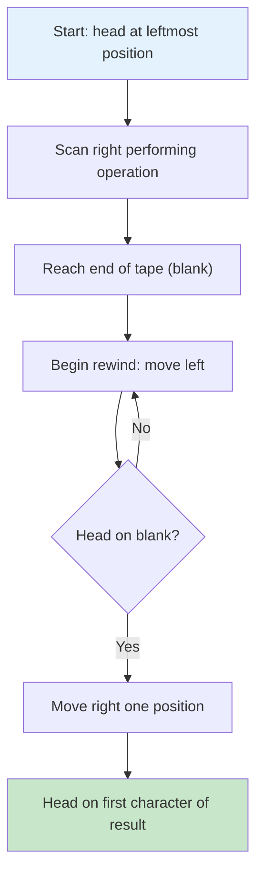
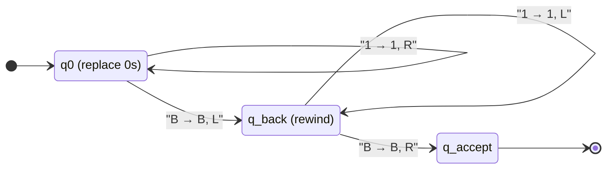
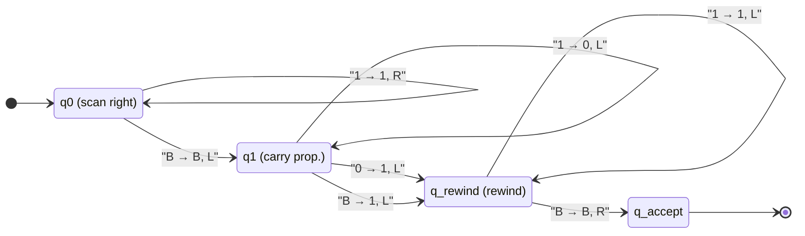
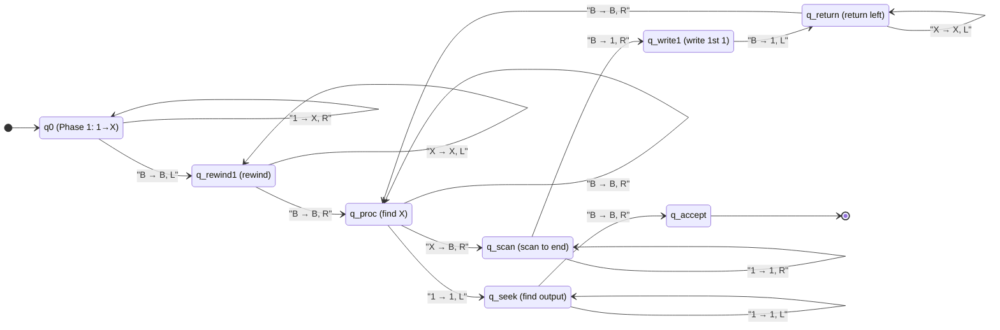
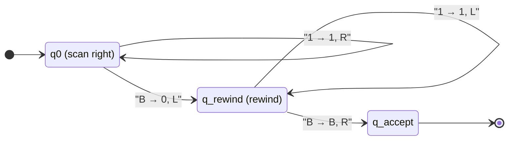
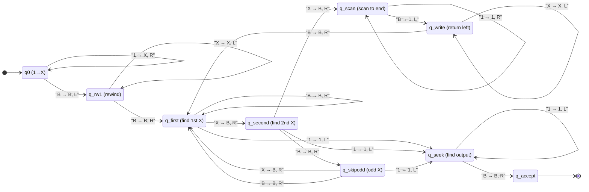
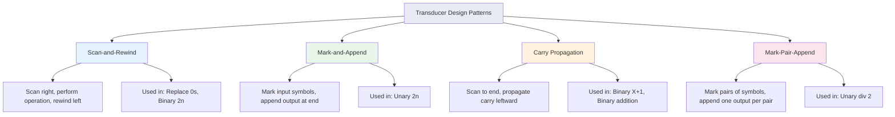
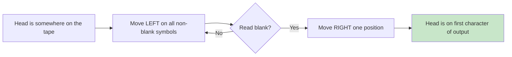

# 5. Turing Machines as Transducers

> [!info] Chapter Overview
> This chapter introduces a fundamentally different way of using Turing Machines: not as language recognizers that accept or reject strings, but as **transducers** that compute functions. A transducer takes an input string and produces an output string — it transforms data rather than making a yes/no decision. This perspective is essential because it connects Turing Machines to the broader concept of computation: any function that can be computed by any algorithm can be computed by a Turing Machine transducer. We work through five major exercises of increasing complexity: symbol replacement, binary increment, unary doubling, binary doubling, unary division, and binary addition. Each exercise is developed with a complete formal definition, transition table, state diagram, and step-by-step execution traces on multiple inputs. By the end of this chapter, you will be fluent in the design patterns that underpin all Turing Machine transducer construction: scan-and-rewind, mark-and-append, carry propagation, and the critical importance of head repositioning.

> [!tip] Prerequisites
> Before studying this chapter, you should be comfortable with:
> - The formal definition of a Turing Machine as a 7-tuple — see [[3. Turing Machines Basics and Formal Definitions]]
> - Configuration notation and the yields relation — see [[4. Tracing Configurations and Execution]]
> - The distinction between recognizers and deciders
> - How to read and construct transition tables and state diagrams

> [!important] The Central Question of This Chapter
> Up to now, we have used Turing Machines to answer the question "Is this string in the language L?" A transducer answers a different question: "Given input x, what is f(x)?" This shift from decision problems to function computation is the bridge from language theory to computability theory proper. Every computable function has a Turing Machine transducer that computes it, and conversely, any function computable by a Turing Machine transducer is computable in the mathematical sense. This equivalence — between Turing-computable functions and effectively computable functions — is the Church-Turing thesis in action.

---

## 5.1 What is a Transducer?

### 5.1.1 Definition and Core Concept

> [!definition] Turing Machine Transducer
> A **Turing Machine transducer** is a Turing Machine $M = (Q, \Gamma, \Sigma, \delta, s, B, F)$ that is used to **compute a function** $f : \Sigma^* \to \Gamma^*$ rather than to recognize a language. Given an input string $w \in \Sigma^*$ written on the tape, the machine computes $f(w)$ as follows:
> - The **input** is the initial content of the tape (the string $w$)
> - The machine runs until it halts
> - The **output** $f(w)$ is the content of the tape when the machine halts, read from the position of the read/write head

The critical difference between a recognizer and a transducer is their **purpose**:

| Aspect | Recognizer | Transducer |
|:---|:---|:---|
| Purpose | Accept or reject input | Transform input into output |
| Output | Yes/No (binary decision) | A string over the tape alphabet |
| Accepting states | Essential (determine acceptance) | Often irrelevant or absent |
| Head position at halt | Does not matter | **Critical** — determines the output |
| Final tape content | Does not matter | **Is the output** |

### 5.1.2 The Head Position Convention

> [!warning] JFLAP Output Convention — This Will Be on the Exam
> In JFLAP, the output of a Turing Machine transducer is read starting from the **position of the read/write head when the machine halts**, continuing to the right until the first blank symbol. This means:
> - If the machine halts with the head on the first character of the result, the output is correct
> - If the machine halts with the head on a blank to the left of the result, the output appears to be empty (JFLAP reads the blank and stops)
> - If the machine halts with the head in the middle of the result, the output is only the portion from the head to the next blank — **this is almost certainly wrong**
>
> **Rule: Before halting, always rewind the head to the beginning of the result.**

This convention is the source of many lost marks on exams. A machine that correctly computes the result on the tape but fails to position the head at the start of the output will receive no credit. The rewind step is not optional — it is an integral part of the transducer's specification.

### 5.1.3 Formalizing the Function Computed by a Transducer

Let $M$ be a Turing Machine transducer. We say that $M$ **computes** the function $f : \Sigma^* \to \Gamma^*$ if for every input $w \in \Sigma^*$:

1. $M$ halts when started on input $w$ (the machine must be a decider for the transduction to be well-defined)
2. If the tape content at the moment of halting is $u \cdot v$ where $u$ is everything to the left of and including the head position, and $v$ is the content from the head position rightward up to the first blank, then $f(w) = v$

More precisely, if the final configuration is $u \, q_h \, a \, v$ where $q_h$ is a halting state and $a$ is the symbol under the head, then the output is the string $a \cdot v'$ where $v'$ is the content of the tape to the right of the head up to (but not including) the first blank.

> [!info] Relationship to Recognizers
> Every recognizer can be viewed as a special case of a transducer that computes a Boolean-valued function: $f(w) = 1$ if $w \in L$ and $f(w) = 0$ if $w \notin L$. However, the transducer perspective is more general because the output can be any string, not just a single bit.

### 5.1.4 Essential Design Pattern: The Scan-and-Rewind

Nearly every transducer requires the head to scan across the input (often to the right end), perform some operation, and then return to the starting position. This **scan-and-rewind** pattern is so fundamental that it deserves a name and a reusable template.

The rewind phase typically uses one or two dedicated states:
- A "rewind" state that moves left on all non-blank symbols
- A transition on the blank symbol that moves right, positioning the head on the first character

> [!tip] Rewind Template
> The standard rewind transitions are:
> - $\delta(q_{\text{rewind}}, a) = (q_{\text{rewind}}, a, L)$ for each non-blank symbol $a \in \Gamma \setminus \{B\}$
> - $\delta(q_{\text{rewind}}, B) = (q_{\text{accept}}, B, R)$
>
> This moves the head left until it reaches the blank to the left of the result, then moves right one position onto the first character. Memorize this pattern — you will use it in every transducer exercise.

---

## 5.2 Exercise: Replacing All 0s with 1s (TD2cor Exercise 1, Q1)

### 5.2.1 Problem Statement

**Source:** TD2cor, Exercise 1, Question 1

Write a Turing Machine transducer that takes a binary number as input and replaces every occurrence of the symbol '0' with the symbol '1'. In other words, compute the function $f : \{0,1\}^* \to \{0,1\}^*$ defined by $f(w) = w'$ where $w'$ is obtained from $w$ by replacing each '0' with '1'.

**Examples:**
- $f(01010) = 11111$
- $f(111) = 111$
- $f(000) = 111$
- $f(\varepsilon) = \varepsilon$

### 5.2.2 Algorithm Design

This is the simplest possible transducer: a single left-to-right scan that replaces '0' with '1' while leaving '1' unchanged, followed by a rewind.

1. **Start** at the leftmost character of the input
2. **Read** the current symbol:
   - If '0': **write '1'**, move right
   - If '1': **write '1'** (no change), move right
   - If blank (B): we have reached the end — **begin rewinding**
3. **Rewind**: move left until we reach a blank, then move right one position onto the first character of the result

> [!tip] Simplification in JFLAP
> Since both '0' and '1' trigger the same action (write '1', move right), we could combine them into a single JFLAP transition using the "any symbol" notation. In JFLAP, the transition `~;1;R` means: "read any symbol (~), write '1', move right." However, the blank symbol B must be handled separately (we do NOT want to write '1' on blanks beyond the input). So in practice, we still need separate transitions for 0, 1, and B.

### 5.2.3 Formal Definition

$$M_1 = (Q, \Gamma, \Sigma, \delta, q_0, B, F)$$

where:
- $Q = \{q_0, q_{\text{back}}, q_{\text{accept}}\}$
- $\Gamma = \{0, 1, B\}$
- $\Sigma = \{0, 1\}$
- $s = q_0$
- $B = \text{blank}$
- $F = \{q_{\text{accept}}\}$

**State descriptions:**
- $q_0$: **Scan-and-replace phase** — scanning right, replacing 0s with 1s
- $q_{\text{back}}$: **Rewind phase** — moving left to return to the start of the tape
- $q_{\text{accept}}$: **Accept/halt state** — the head is positioned on the first character of the result

### 5.2.4 Transition Table

| Current State | Symbol Read | New State | Symbol Written | Direction | Purpose |
|:---:|:---:|:---:|:---:|:---:|:---|
| $q_0$ | $0$ | $q_0$ | $1$ | R | Replace 0 with 1, continue scanning |
| $q_0$ | $1$ | $q_0$ | $1$ | R | Keep 1 unchanged, continue scanning |
| $q_0$ | $B$ | $q_{\text{back}}$ | $B$ | L | Reached end, start rewinding |
| $q_{\text{back}}$ | $0$ | $q_{\text{back}}$ | $0$ | L | Rewind past 0s |
| $q_{\text{back}}$ | $1$ | $q_{\text{back}}$ | $1$ | L | Rewind past 1s |
| $q_{\text{back}}$ | $B$ | $q_{\text{accept}}$ | $B$ | R | Reached start, position on first char |

> [!info] Reading the Transition Table
> Notice that in state $q_0$, both '0' and '1' cause the machine to write '1' and move right. The only difference is the symbol read. This means the machine transforms the entire input into all-1s. The blank symbol B is the sentinel that tells the machine when to stop.

### 5.2.5 State Diagram

### 5.2.6 Complete Trace on Input "01010"

Let us trace every single step of machine $M_1$ on the input $w = 01010$.

| Step | Configuration | Transition Applied | Explanation |
|:---:|:---|:---|:---|
| 0 | $q_0 \, 0 \, 1 \, 0 \, 1 \, 0$ | — (initial) | Head on first symbol '0' |
| 1 | $1 \, q_0 \, 1 \, 0 \, 1 \, 0$ | $\delta(q_0, 0) = (q_0, 1, R)$ | Replace 0 with 1, move right |
| 2 | $1 \, 1 \, q_0 \, 0 \, 1 \, 0$ | $\delta(q_0, 1) = (q_0, 1, R)$ | Keep 1, move right |
| 3 | $1 \, 1 \, 1 \, q_0 \, 1 \, 0$ | $\delta(q_0, 0) = (q_0, 1, R)$ | Replace 0 with 1, move right |
| 4 | $1 \, 1 \, 1 \, 1 \, q_0 \, 0$ | $\delta(q_0, 1) = (q_0, 1, R)$ | Keep 1, move right |
| 5 | $1 \, 1 \, 1 \, 1 \, 1 \, q_0 \, B$ | $\delta(q_0, 0) = (q_0, 1, R)$ | Replace 0 with 1, move right |
| 6 | $1 \, 1 \, 1 \, 1 \, q_{\text{back}} \, 1 \, B$ | $\delta(q_0, B) = (q_{\text{back}}, B, L)$ | Reached end, start rewind |
| 7 | $1 \, 1 \, 1 \, q_{\text{back}} \, 1 \, 1 \, B$ | $\delta(q_{\text{back}}, 1) = (q_{\text{back}}, 1, L)$ | Rewind past 1 |
| 8 | $1 \, 1 \, q_{\text{back}} \, 1 \, 1 \, 1 \, B$ | $\delta(q_{\text{back}}, 1) = (q_{\text{back}}, 1, L)$ | Rewind past 1 |
| 9 | $1 \, q_{\text{back}} \, 1 \, 1 \, 1 \, 1 \, B$ | $\delta(q_{\text{back}}, 1) = (q_{\text{back}}, 1, L)$ | Rewind past 1 |
| 10 | $q_{\text{back}} \, 1 \, 1 \, 1 \, 1 \, 1 \, B$ | $\delta(q_{\text{back}}, 1) = (q_{\text{back}}, 1, L)$ | Rewind past 1 |
| 11 | $q_{\text{back}} \, B \, 1 \, 1 \, 1 \, 1 \, 1 \, B$ | $\delta(q_{\text{back}}, 1) = (q_{\text{back}}, 1, L)$ | Wait — head moves to blank |

Let me be more precise. After step 10, the configuration is $q_{\text{back}} \, 1 \, 1 \, 1 \, 1 \, 1 \, B$. The head is on the leftmost '1'. After $\delta(q_{\text{back}}, 1) = (q_{\text{back}}, 1, L)$, the head moves left to a blank cell:

| Step | Configuration | Transition Applied | Explanation |
|:---:|:---|:---|:---|
| 11 | $q_{\text{back}} \, B \, 1 \, 1 \, 1 \, 1 \, 1 \, B$ | $\delta(q_{\text{back}}, 1) = (q_{\text{back}}, 1, L)$ | Leftmost 1, head moves to blank |
| 12 | $B \, q_{\text{accept}} \, 1 \, 1 \, 1 \, 1 \, 1 \, B$ | $\delta(q_{\text{back}}, B) = (q_{\text{accept}}, B, R)$ | Blank found, move right to first 1 |

**Final configuration:** $B \, q_{\text{accept}} \, 1 \, 1 \, 1 \, 1 \, 1 \, B$

**Output:** "11111"  (All zeros replaced with ones)

The head is on the first '1', and reading rightward gives "11111". The function has been computed correctly.

### 5.2.7 JFLAP Alternative Notation

JFLAP provides a powerful shorthand for transitions that apply to any symbol without modifying it:

| JFLAP Notation | Meaning |
|:---|:---|
| `~;~;R` | Read any symbol, write it back unchanged, move right |
| `~;~;L` | Read any symbol, write it back unchanged, move left |
| `0,1;1;R` | Read 0 or 1, write 1, move right |

For this machine, the two transitions $\delta(q_0, 0) = (q_0, 1, R)$ and $\delta(q_0, 1) = (q_0, 1, R)$ can be written in JFLAP as a single transition: `0,1;1;R`. This means "if the symbol is 0 or 1, write 1 and move right."

Similarly, the rewind transitions $\delta(q_{\text{back}}, 0) = (q_{\text{back}}, 0, L)$ and $\delta(q_{\text{back}}, 1) = (q_{\text{back}}, 1, L)$ can be combined as `0,1;~;L` meaning "if the symbol is 0 or 1, don't change it, move left."

> [!warning] JFLAP Blank Symbol
> In JFLAP, the blank symbol is represented as $\sqcup$ (a square) rather than B. When building machines in JFLAP, remember that you must create transitions for the blank symbol explicitly — JFLAP does not automatically handle blanks.

### 5.2.8 Trace on Edge Cases

**Input: $w = \varepsilon$ (empty word)**

| Step | Configuration | Transition Applied |
|:---:|:---|:---|
| 0 | $q_0 \, B$ | Initial: head on blank |
| 1 | $q_{\text{back}} \, B$ | $\delta(q_0, B) = (q_{\text{back}}, B, L)$: move left |
| 2 | $q_{\text{back}} \, B \, B$ | $\delta(q_{\text{back}}, B) = (q_{\text{accept}}, B, R)$: move right |

Wait, step 1 needs more care. From $q_0 \, B$, the head is on a blank. After $\delta(q_0, B) = (q_{\text{back}}, B, L)$, the head moves left to another blank. The configuration becomes something like $q_{\text{back}} \, B \, B$. Then $\delta(q_{\text{back}}, B) = (q_{\text{accept}}, B, R)$ fires, and the head moves right back to the original blank. The output is the empty string, which is correct since $f(\varepsilon) = \varepsilon$.

**Input: $w = 111$ (no zeros to replace)**

The machine scans right through all three 1s (writing 1 over each, which changes nothing), hits the blank, rewinds, and halts. Output: "111" 

---

## 5.3 Exercise: Computing X + 1 in Binary (TD2cor Exercise 1, Q2)

### 5.3.1 Problem Statement

**Source:** TD2cor, Exercise 1, Question 2

Write a Turing Machine transducer that computes $f(X) = X + 1$ where $X$ is a non-negative integer represented in binary.

**Examples:**
- $f(1011) = 1100$ (11 + 1 = 12)
- $f(111) = 1000$ (7 + 1 = 8)
- $f(1100) = 1101$ (12 + 1 = 13)
- $f(0) = 1$ (0 + 1 = 1)

### 5.3.2 Algorithm Design: Binary Increment with Carry Propagation

Adding 1 to a binary number follows a well-known carry propagation algorithm:

1. **Find the rightmost '0'** in the binary representation (scanning from right to left)
2. **Change that '0' to '1'** — the carry is resolved
3. **Change all '1's to the right of that position to '0'** — these were "carried through"
4. **Special case:** If there is no '0' in the number (the number is all 1s, like "111"), the result requires prepending a '1' and changing all existing digits to '0' (e.g., "111" + 1 = "1000")

The beauty of this algorithm for a Turing Machine is that the carry naturally propagates from right to left, which is exactly the direction the head moves after scanning to the end of the input.

> [!important] Key Insight: Carry Propagation Direction
> The carry propagates from RIGHT to LEFT. This means we must first scan to the RIGHT end of the number, then propagate the carry LEFTward. This is a common pattern in Turing Machine arithmetic: scan to the end, then work backwards. The right-to-left processing is essential because the value of each bit depends on the carry from the less significant position.

### 5.3.3 Detailed Algorithm

1. **Scan right** across all digits (0s and 1s) to reach the blank after the number
2. **Move left** one position (now on the rightmost digit)
3. **Propagate carry** moving left:
   - If you see a '1': change it to '0' and continue moving left (the carry is still active)
   - If you see a '0': change it to '1' and **stop** — the carry is resolved!
   - If you see a blank: write '1' here — the carry has extended the number by one digit (e.g., "111" becomes "1000" with the '1' written on the blank)
4. **Rewind** the head to the start of the result

### 5.3.4 Formal Definition

$$M_2 = (Q, \Gamma, \Sigma, \delta, q_0, B, F)$$

where:
- $Q = \{q_0, q_1, q_{\text{rewind}}, q_{\text{accept}}\}$
- $\Gamma = \{0, 1, B\}$
- $\Sigma = \{0, 1\}$
- $s = q_0$
- $B = \text{blank}$
- $F = \{q_{\text{accept}}\}$

**State descriptions:**
- $q_0$: **Scan-right phase** — moving right to find the end of the binary number
- $q_1$: **Carry-propagation phase** — moving left, propagating the carry
- $q_{\text{rewind}}$: **Rewind phase** — moving left to return to the start of the result
- $q_{\text{accept}}$: **Accept/halt state** — head positioned on the first character

### 5.3.5 Transition Table

| Current State | Symbol Read | New State | Symbol Written | Direction | Purpose |
|:---:|:---:|:---:|:---:|:---:|:---|
| $q_0$ | $0$ | $q_0$ | $0$ | R | Scan right past 0 |
| $q_0$ | $1$ | $q_0$ | $1$ | R | Scan right past 1 |
| $q_0$ | $B$ | $q_1$ | $B$ | L | Reached end, start carry |
| $q_1$ | $0$ | $q_{\text{rewind}}$ | $1$ | L | Carry resolved! 0 becomes 1 |
| $q_1$ | $1$ | $q_1$ | $0$ | L | Carry continues: 1 becomes 0 |
| $q_1$ | $B$ | $q_{\text{rewind}}$ | $1$ | L | All 1s: prepend 1 at front |
| $q_{\text{rewind}}$ | $0$ | $q_{\text{rewind}}$ | $0$ | L | Rewind past 0 |
| $q_{\text{rewind}}$ | $1$ | $q_{\text{rewind}}$ | $1$ | L | Rewind past 1 |
| $q_{\text{rewind}}$ | $B$ | $q_{\text{accept}}$ | $B$ | R | Reached start, position on first char |

### 5.3.6 State Diagram

### 5.3.7 Complete Trace 1: Input "1011" (decimal 11, expected output "1100" = 12)

| Step | Configuration | Transition Applied | Explanation |
|:---:|:---|:---|:---|
| 0 | $q_0 \, 1 \, 0 \, 1 \, 1$ | — (initial) | Head on first '1' |
| 1 | $1 \, q_0 \, 0 \, 1 \, 1$ | $\delta(q_0, 1) = (q_0, 1, R)$ | Scan right |
| 2 | $1 \, 0 \, q_0 \, 1 \, 1$ | $\delta(q_0, 0) = (q_0, 0, R)$ | Scan right |
| 3 | $1 \, 0 \, 1 \, q_0 \, 1$ | $\delta(q_0, 1) = (q_0, 1, R)$ | Scan right |
| 4 | $1 \, 0 \, 1 \, 1 \, q_0 \, B$ | $\delta(q_0, 1) = (q_0, 1, R)$ | Scan right, past end |
| 5 | $1 \, 0 \, 1 \, q_1 \, 1 \, B$ | $\delta(q_0, B) = (q_1, B, L)$ | End reached, start carry |
| 6 | $1 \, 0 \, q_1 \, 1 \, 0 \, B$ | $\delta(q_1, 1) = (q_1, 0, L)$ | Last 1 → 0, carry continues |
| 7 | $1 \, q_1 \, 0 \, 0 \, 0 \, B$ | $\delta(q_1, 1) = (q_1, 0, L)$ | Second 1 → 0, carry continues |
| 8 | $q_{\text{rewind}} \, 1 \, 1 \, 0 \, 0 \, B$ | $\delta(q_1, 0) = (q_{\text{rewind}}, 1, L)$ | Found 0, change to 1! Carry resolved |
| 9 | $q_{\text{rewind}} \, B \, 1 \, 1 \, 0 \, 0 \, B$ | $\delta(q_{\text{rewind}}, 1) = (q_{\text{rewind}}, 1, L)$ | Rewind past leading 1 |
| 10 | $B \, q_{\text{accept}} \, 1 \, 1 \, 0 \, 0 \, B$ | $\delta(q_{\text{rewind}}, B) = (q_{\text{accept}}, B, R)$ | At start, position on '1' |

**Output:** "1100"  (binary 1100 = 12 = 11 + 1)

> [!tip] Understanding the Carry
> Let us verify the carry propagation on "1011" + 1:
> - The rightmost bit is 1: 1 + 1 = 10 (write 0, carry 1)
> - The next bit is 1: 1 + 1 = 10 (write 0, carry 1)
> - The next bit is 0: 0 + 1 = 01 (write 1, carry 0 — resolved!)
> - The leftmost bit stays 1
> - Result: 1100 
>
> The Turing Machine performs exactly this computation, but in reverse order: it encounters the rightmost 1 first (changing it to 0), then the second 1 (changing it to 0), then the 0 (changing it to 1 and stopping).

### 5.3.8 Complete Trace 2: Input "111" (decimal 7, expected output "1000" = 8)

This trace demonstrates the special case where all bits are 1 and the carry propagates through the entire number.

| Step | Configuration | Transition Applied | Explanation |
|:---:|:---|:---|:---|
| 0 | $q_0 \, 1 \, 1 \, 1$ | — (initial) | |
| 1 | $1 \, q_0 \, 1 \, 1$ | $\delta(q_0, 1) = (q_0, 1, R)$ | Scan right |
| 2 | $1 \, 1 \, q_0 \, 1$ | $\delta(q_0, 1) = (q_0, 1, R)$ | Scan right |
| 3 | $1 \, 1 \, 1 \, q_0 \, B$ | $\delta(q_0, 1) = (q_0, 1, R)$ | Scan right |
| 4 | $1 \, 1 \, q_1 \, 1 \, B$ | $\delta(q_0, B) = (q_1, B, L)$ | Start carry |
| 5 | $1 \, q_1 \, 1 \, 0 \, B$ | $\delta(q_1, 1) = (q_1, 0, L)$ | Rightmost 1 → 0 |
| 6 | $q_1 \, 1 \, 0 \, 0 \, B$ | $\delta(q_1, 1) = (q_1, 0, L)$ | Middle 1 → 0 |
| 7 | $q_1 \, B \, 0 \, 0 \, 0 \, B$ | $\delta(q_1, 1) = (q_1, 0, L)$ | Leftmost 1 → 0, head on blank |
| 8 | $q_{\text{rewind}} \, 1 \, 0 \, 0 \, 0 \, B$ | $\delta(q_1, B) = (q_{\text{rewind}}, 1, L)$ | Prepend 1! Head moves left |
| 9 | $q_{\text{rewind}} \, B \, 1 \, 0 \, 0 \, 0 \, B$ | Move left to blank | |
| 10 | $B \, q_{\text{accept}} \, 1 \, 0 \, 0 \, 0 \, B$ | $\delta(q_{\text{rewind}}, B) = (q_{\text{accept}}, B, R)$ | Position on first char |

**Output:** "1000"  (binary 1000 = 8 = 7 + 1)

### 5.3.9 Complete Trace 3: Input "1100" (decimal 12, expected output "1101" = 13)

This trace demonstrates the simplest case: the carry resolves at the rightmost 0.

| Step | Configuration | Transition Applied | Explanation |
|:---:|:---|:---|:---|
| 0 | $q_0 \, 1 \, 1 \, 0 \, 0$ | — (initial) | |
| 1 | $1 \, q_0 \, 1 \, 0 \, 0$ | $\delta(q_0, 1)$ | Scan right |
| 2 | $1 \, 1 \, q_0 \, 0 \, 0$ | $\delta(q_0, 1)$ | Scan right |
| 3 | $1 \, 1 \, 0 \, q_0 \, 0$ | $\delta(q_0, 0)$ | Scan right |
| 4 | $1 \, 1 \, 0 \, 0 \, q_0 \, B$ | $\delta(q_0, 0)$ | Scan right |
| 5 | $1 \, 1 \, 0 \, q_1 \, 0 \, B$ | $\delta(q_0, B)$ | Start carry |
| 6 | $1 \, 1 \, q_{\text{rewind}} \, 0 \, 1 \, B$ | $\delta(q_1, 0) = (q_{\text{rewind}}, 1, L)$ | Rightmost 0 → 1! Carry resolved immediately |
| 7 | $1 \, q_{\text{rewind}} \, 1 \, 0 \, 1 \, B$ | $\delta(q_{\text{rewind}}, 0)$ | Rewind |
| 8 | $q_{\text{rewind}} \, 1 \, 1 \, 0 \, 1 \, B$ | $\delta(q_{\text{rewind}}, 1)$ | Rewind |
| 9 | $q_{\text{rewind}} \, B \, 1 \, 1 \, 0 \, 1 \, B$ | $\delta(q_{\text{rewind}}, 1)$ | Rewind to blank |
| 10 | $B \, q_{\text{accept}} \, 1 \, 1 \, 0 \, 1 \, B$ | $\delta(q_{\text{rewind}}, B)$ | Position on first char |

**Output:** "1101"  (binary 1101 = 13 = 12 + 1)

### 5.3.10 Common Pitfalls

> [!warning] Common Mistakes on Binary Increment
> 1. **Forgetting the "all 1s" case:** When the input is "111...1", the carry propagates through every bit. You must handle $\delta(q_1, B) = (q_{\text{rewind}}, 1, L)$ to prepend a new '1' at the front. Without this transition, the machine would halt or crash.
>
> 2. **Not rewinding the head:** After resolving the carry, the head may be anywhere in the number. You MUST add a rewind phase to reposition the head at the start of the result.
>
> 3. **Confusing carry direction:** The carry propagates from RIGHT to LEFT (from least significant bit to most significant bit). If you try to propagate left-to-right, the algorithm will not work.
>
> 4. **Incorrect transition on $\delta(q_1, B)$:** When the carry reaches the blank to the left of the number, you should write '1' (extending the number) and move left to begin rewinding. Some students incorrectly write '0' or move right here.

---

## 5.4 Calculating f(n) = 2n in Unary Notation (MT-JFLAP Ex 7 / Exos-AFD Ex 13, Q2)

### 5.4.1 Problem Statement

**Source:** MT-JFLAP Exercise 7 / Exos-AFD Exercise 13, Question 2

Build a Turing Machine transducer that computes $f(n) = 2n$ where $n$ is represented in **unary notation** (a string of $n$ ones represents the number $n$).

**Examples:**
- $f(1) = 11$ (input "1", output "11")
- $f(11) = 1111$ (input "11", output "1111")
- $f(111) = 111111$ (input "111", output "111111")
- $f(\varepsilon) = \varepsilon$ (input empty, output empty)

### 5.4.2 Algorithm Design: The Mark-Erase-Append Strategy

The key challenge is: how does the machine know how many 1s to add? It cannot simply "count" the input (a Turing Machine has a finite state set and cannot count arbitrarily). The solution is to use the input itself as a counter by marking each '1' as it is processed.

The algorithm works in three phases:

**Phase 1 — Convert all 1s to Xs:** Scan right across the entire input, converting each '1' to 'X'. This "remembers" how many 1s there were without changing the length of the occupied tape region.

**Phase 2 — For each X, write two 1s at the end:** Find the leftmost X, erase it (write B), scan right to the first blank beyond all remaining Xs and 1s, write '1', move right, write another '1', then return to the leftmost position. Repeat until no Xs remain.

**Phase 3 — Reposition the head:** After all Xs are erased and all 1s are written, the tape has blanks where the Xs used to be, followed by the output 1s. Scan right past the blanks to find the first '1' and position the head there.

> [!tip] Why Two 1s per X?
> Each X represents one input '1'. To double the input, we need two output '1's for each input '1'. Since we converted the original 1s to Xs (and then erased them), we must write two fresh 1s for each X we process.

### 5.4.3 Detailed State Design

- **$q_0$** (Phase 1 — convert): Scan right converting each '1' to 'X'. When a blank is reached, rewind to start and begin Phase 2.
- **$q_{\text{rewind1}}$** (Phase 1 — rewind): Move left to the beginning of the tape.
- **$q_{\text{proc}}$** (Phase 2 — find X): Find the leftmost 'X'. If we find a blank instead, all Xs have been processed. If we find a '1', we've gone past the X region into the output region.
- **$q_{\text{scan}}$** (Phase 2 — scan to end): After erasing an X, scan right past remaining Xs and output 1s to find the first blank.
- **$q_{\text{write1}}$** (Phase 2 — write first 1): Write the first of two 1s at the blank position, move right.
- **$q_{\text{return}}$** (Phase 2 — return to start): After writing both 1s, scan left back to the beginning.
- **$q_{\text{seek}}$** (Phase 3 — find output start): After all Xs are processed, scan right past blanks to find the first '1'.
- **$q_{\text{accept}}$** (halt): Head is on the first character of the result.

### 5.4.4 Formal Definition

$$M_3 = (Q, \Gamma, \Sigma, \delta, q_0, B, F)$$

where:
- $Q = \{q_0, q_{\text{rewind1}}, q_{\text{proc}}, q_{\text{scan}}, q_{\text{write1}}, q_{\text{return}}, q_{\text{seek}}, q_{\text{accept}}\}$
- $\Gamma = \{1, X, B\}$
- $\Sigma = \{1\}$
- $s = q_0$
- $B = \text{blank}$
- $F = \{q_{\text{accept}}\}$

### 5.4.5 Transition Table

| Current State | Symbol Read | New State | Symbol Written | Direction | Purpose |
|:---:|:---:|:---:|:---:|:---:|:---|
| $q_0$ | $1$ | $q_0$ | $X$ | R | Phase 1: Convert 1 to X |
| $q_0$ | $B$ | $q_{\text{rewind1}}$ | $B$ | L | End of input, rewind |
| $q_{\text{rewind1}}$ | $X$ | $q_{\text{rewind1}}$ | $X$ | L | Scan left past Xs |
| $q_{\text{rewind1}}$ | $B$ | $q_{\text{proc}}$ | $B$ | R | At start, begin Phase 2 |
| $q_{\text{proc}}$ | $X$ | $q_{\text{scan}}$ | $B$ | R | Erase leftmost X, scan right |
| $q_{\text{proc}}$ | $B$ | $q_{\text{proc}}$ | $B$ | R | Skip blanks (erased Xs) |
| $q_{\text{proc}}$ | $1$ | $q_{\text{seek}}$ | $1$ | L | Found output — no more Xs |
| $q_{\text{scan}}$ | $X$ | $q_{\text{scan}}$ | $X$ | R | Scan past remaining Xs |
| $q_{\text{scan}}$ | $1$ | $q_{\text{scan}}$ | $1$ | R | Scan past output 1s |
| $q_{\text{scan}}$ | $B$ | $q_{\text{write1}}$ | $1$ | R | Write first 1, move right |
| $q_{\text{write1}}$ | $B$ | $q_{\text{return}}$ | $1$ | L | Write second 1, go back |
| $q_{\text{return}}$ | $1$ | $q_{\text{return}}$ | $1$ | L | Scan left past output 1s |
| $q_{\text{return}}$ | $X$ | $q_{\text{return}}$ | $X$ | L | Scan left past remaining Xs |
| $q_{\text{return}}$ | $B$ | $q_{\text{proc}}$ | $B$ | R | At start, find next X |
| $q_{\text{seek}}$ | $1$ | $q_{\text{seek}}$ | $1$ | L | Phase 3: scan left past output |
| $q_{\text{seek}}$ | $B$ | $q_{\text{accept}}$ | $B$ | R | Found start, position on first 1 |

### 5.4.6 State Diagram

### 5.4.7 Complete Trace on Input "111" (n = 3, expected output "111111" = 6 ones)

**Phase 1: Convert 1s to Xs**

| Step | Configuration | Transition | Explanation |
|:---:|:---|:---|:---|
| 0 | $q_0 \, 1 \, 1 \, 1$ | — | Initial |
| 1 | $X \, q_0 \, 1 \, 1$ | $\delta(q_0,1)=(q_0,X,R)$ | Convert first 1 |
| 2 | $X \, X \, q_0 \, 1$ | $\delta(q_0,1)=(q_0,X,R)$ | Convert second 1 |
| 3 | $X \, X \, X \, q_0 \, B$ | $\delta(q_0,1)=(q_0,X,R)$ | Convert third 1 |
| 4 | $X \, X \, q_{\text{rewind1}} \, X \, B$ | $\delta(q_0,B)=(q_{\text{rewind1}},B,L)$ | End, rewind |
| 5 | $X \, q_{\text{rewind1}} \, X \, X \, B$ | $\delta(q_{\text{rewind1}},X)$ | Rewind |
| 6 | $q_{\text{rewind1}} \, X \, X \, X \, B$ | $\delta(q_{\text{rewind1}},X)$ | Rewind |
| 7 | $q_{\text{rewind1}} \, B \, X \, X \, X \, B$ | $\delta(q_{\text{rewind1}},X)$ | Rewind past leftmost X |
| 8 | $B \, q_{\text{proc}} \, X \, X \, X \, B$ | $\delta(q_{\text{rewind1}},B)=(q_{\text{proc}},B,R)$ | At start, begin Phase 2 |

**Phase 2, Iteration 1: Process first X (position 1)**

| Step | Configuration | Transition | Explanation |
|:---:|:---|:---|:---|
| 9 | $B \, q_{\text{scan}} \, X \, X \, B$ | $\delta(q_{\text{proc}},X)=(q_{\text{scan}},B,R)$ | Erase X, scan right |
| 10 | $B \, X \, q_{\text{scan}} \, X \, B$ | $\delta(q_{\text{scan}},X)$ | Scan past X |
| 11 | $B \, X \, X \, q_{\text{scan}} \, B$ | $\delta(q_{\text{scan}},X)$ | Scan past X |
| 12 | $B \, X \, X \, 1 \, q_{\text{write1}} \, B$ | $\delta(q_{\text{scan}},B)=(q_{\text{write1}},1,R)$ | Write first 1 |
| 13 | $B \, X \, X \, 1 \, q_{\text{return}} \, 1 \, B$ | $\delta(q_{\text{write1}},B)=(q_{\text{return}},1,L)$ | Write second 1 |
| 14 | $B \, X \, X \, q_{\text{return}} \, 1 \, 1 \, B$ | $\delta(q_{\text{return}},1)$ | Return left |
| 15 | $B \, X \, q_{\text{return}} \, X \, 1 \, 1 \, B$ | $\delta(q_{\text{return}},1)$ | Return left |
| 16 | $B \, q_{\text{return}} \, X \, X \, 1 \, 1 \, B$ | $\delta(q_{\text{return}},X)$ | Return left |
| 17 | $q_{\text{return}} \, B \, X \, X \, 1 \, 1 \, B$ | $\delta(q_{\text{return}},X)$ | Return left |
| 18 | $B \, q_{\text{proc}} \, X \, X \, 1 \, 1 \, B$ | $\delta(q_{\text{return}},B)=(q_{\text{proc}},B,R)$ | At start, find next X |

**Phase 2, Iteration 2: Process second X (position 2)**

| Step | Configuration | Transition | Explanation |
|:---:|:---|:---|:---|
| 19 | $B \, B \, q_{\text{scan}} \, X \, 1 \, 1 \, B$ | $\delta(q_{\text{proc}},X)=(q_{\text{scan}},B,R)$ | Erase X |
| 20 | $B \, B \, X \, q_{\text{scan}} \, 1 \, 1 \, B$ | $\delta(q_{\text{scan}},X)$ | Scan past X |
| 21 | $B \, B \, X \, 1 \, q_{\text{scan}} \, 1 \, B$ | $\delta(q_{\text{scan}},1)$ | Scan past 1 |
| 22 | $B \, B \, X \, 1 \, 1 \, q_{\text{scan}} \, B$ | $\delta(q_{\text{scan}},1)$ | Scan past 1 |
| 23 | $B \, B \, X \, 1 \, 1 \, 1 \, q_{\text{write1}} \, B$ | $\delta(q_{\text{scan}},B)=(q_{\text{write1}},1,R)$ | Write first 1 |
| 24 | $B \, B \, X \, 1 \, 1 \, 1 \, q_{\text{return}} \, 1 \, B$ | $\delta(q_{\text{write1}},B)=(q_{\text{return}},1,L)$ | Write second 1 |
| 25–28 | ... (scan left) | $\delta(q_{\text{return}},1), \delta(q_{\text{return}},X)$ | Return to start |
| 29 | $B \, q_{\text{proc}} \, B \, X \, 1 \, 1 \, 1 \, 1 \, B$ | $\delta(q_{\text{return}},B)$ | At start, find next X |

**Phase 2, Iteration 3: Process third X (position 3)**

| Step | Configuration | Transition | Explanation |
|:---:|:---|:---|:---|
| 30 | $B \, B \, q_{\text{proc}} \, X \, 1 \, 1 \, 1 \, 1 \, B$ | $\delta(q_{\text{proc}},B)=(q_{\text{proc}},B,R)$ | Skip blank |
| 31 | $B \, B \, B \, q_{\text{scan}} \, 1 \, 1 \, 1 \, 1 \, B$ | $\delta(q_{\text{proc}},X)=(q_{\text{scan}},B,R)$ | Erase X |
| 32–35 | ... (scan right past 1s) | $\delta(q_{\text{scan}},1)$ | Scan to end |
| 36 | $B \, B \, B \, 1 \, 1 \, 1 \, 1 \, 1 \, q_{\text{write1}} \, B$ | $\delta(q_{\text{scan}},B)=(q_{\text{write1}},1,R)$ | Write first 1 |
| 37 | $B \, B \, B \, 1 \, 1 \, 1 \, 1 \, 1 \, q_{\text{return}} \, 1 \, B$ | $\delta(q_{\text{write1}},B)=(q_{\text{return}},1,L)$ | Write second 1 |
| 38–42 | ... (scan left) | | Return to start |
| 43 | $B \, q_{\text{proc}} \, B \, B \, 1 \, 1 \, 1 \, 1 \, 1 \, 1 \, B$ | $\delta(q_{\text{return}},B)$ | At start |

**Phase 2, End: No more Xs**

| Step | Configuration | Transition | Explanation |
|:---:|:---|:---|:---|
| 44 | $B \, B \, q_{\text{proc}} \, B \, 1 \, 1 \, 1 \, 1 \, 1 \, 1 \, B$ | $\delta(q_{\text{proc}},B)=(q_{\text{proc}},B,R)$ | Skip blank |
| 45 | $B \, B \, B \, q_{\text{seek}} \, 1 \, 1 \, 1 \, 1 \, 1 \, 1 \, B$ | $\delta(q_{\text{proc}},1)=(q_{\text{seek}},1,L)$ | Found output! No more Xs |
| 46 | $B \, B \, q_{\text{seek}} \, B \, 1 \, 1 \, 1 \, 1 \, 1 \, 1 \, B$ | $\delta(q_{\text{seek}},1)$ | Scan left past output |
| 47 | $B \, q_{\text{seek}} \, B \, B \, 1 \, 1 \, 1 \, 1 \, 1 \, 1 \, B$ | $\delta(q_{\text{seek}},B)$ | Scan left past blank |
| 48 | $q_{\text{seek}} \, B \, B \, B \, 1 \, 1 \, 1 \, 1 \, 1 \, 1 \, B$ | $\delta(q_{\text{seek}},B)$ | Scan left |
| 49 | $B \, q_{\text{accept}} \, B \, B \, 1 \, 1 \, 1 \, 1 \, 1 \, 1 \, B$ | $\delta(q_{\text{seek}},B)=(q_{\text{accept}},B,R)$ | Position at output start |

Wait — the head is on a blank, not the first '1'. Let me reconsider the Phase 3 logic.

After step 45, $q_{\text{seek}}$ reads '1' and transitions with $\delta(q_{\text{seek}}, 1) = (q_{\text{seek}}, 1, L)$. This moves left. Eventually $q_{\text{seek}}$ hits a blank. At that point, $\delta(q_{\text{seek}}, B) = (q_{\text{accept}}, B, R)$ moves right onto the first '1'.

Let me redo steps 45–49 more carefully:

| Step | Configuration | Transition | Explanation |
|:---:|:---|:---|:---|
| 45 | $B \, B \, B \, q_{\text{proc}} \, 1 \, 1 \, 1 \, 1 \, 1 \, 1 \, B$ | $\delta(q_{\text{proc}},1)=(q_{\text{seek}},1,L)$ | Found output! |
| 46 | $B \, B \, q_{\text{seek}} \, B \, 1 \, 1 \, 1 \, 1 \, 1 \, 1 \, B$ | $\delta(q_{\text{seek}},1)=(q_{\text{seek}},1,L)$ | Move left past 1 |
| 47 | $B \, q_{\text{seek}} \, B \, B \, 1 \, 1 \, 1 \, 1 \, 1 \, 1 \, B$ | $\delta(q_{\text{seek}},B)=(q_{\text{seek}},1,L)$ | ... hmm |

Wait, I have $\delta(q_{\text{seek}}, B) = (q_{\text{seek}}, B, L)$? No, looking at my transition table, I only have:
- $\delta(q_{\text{seek}}, 1) = (q_{\text{seek}}, 1, L)$
- $\delta(q_{\text{seek}}, B) = (q_{\text{accept}}, B, R)$

So from step 45, $q_{\text{seek}}$ is on a '1'. Move left. Now on B. $\delta(q_{\text{seek}}, B) = (q_{\text{accept}}, B, R)$: move right.

That's too quick! The head just went from the first '1' one step left (to blank) and then one step right (back to the first '1'). So:

| Step | Configuration | Transition |
|:---:|:---|:---|
| 45 | $B \, B \, B \, q_{\text{seek}} \, 1 \, 1 \, 1 \, 1 \, 1 \, 1 \, B$ | $\delta(q_{\text{proc}},1)$ → move left |
| 46 | $B \, B \, q_{\text{seek}} \, B \, 1 \, 1 \, 1 \, 1 \, 1 \, 1 \, B$ | $\delta(q_{\text{seek}},1)$ → move left past the first 1 |
| 47 | $B \, q_{\text{accept}} \, B \, B \, 1 \, 1 \, 1 \, 1 \, 1 \, 1 \, B$ | $\delta(q_{\text{seek}},B)=(q_{\text{accept}},B,R)$ → position on first 1 |

**Final: head on first '1', state $q_{\text{accept}}$. Output: "111111"  (6 ones = 2 × 3)**

### 5.4.8 Why This Approach Works

> [!important] The Mark-Erase-Append Pattern
> This exercise introduces one of the most powerful patterns in Turing Machine design:
>
> 1. **Mark** all input symbols (convert 1 → X) to "remember" the input length
> 2. **Erase** marks one at a time, and for each erased mark, **append** the appropriate output at the end of the tape
> 3. The marks serve as a counter: the machine processes one mark per iteration, and the number of marks equals the input length
>
> This pattern works for any function $f(n) = c \cdot n$ where $c$ is a constant: for each X, simply write $c$ ones at the end. For $f(n) = 3n$, write three 1s per X. For $f(n) = n/2$ (floor), write one 1 for every two Xs.

### 5.4.9 Common Pitfalls

> [!warning] Why Not Simply Append Without Marking?
> A naive approach might try: "for each 1 in the input, mark it and add a 1 at the end." But without first converting ALL 1s to Xs, the machine cannot distinguish between original 1s (which need to be processed) and newly-added 1s (which should NOT be processed). By converting all 1s to Xs first, we create a clear separation between the "counter zone" (Xs) and the "output zone" (1s at the end).
>
> Even with this approach, we must be careful: in state $q_{\text{proc}}$, when we encounter a '1' instead of an 'X', it means we have entered the output zone and there are no more Xs to process. This is our termination condition.

---

## 5.5 Calculating f(n) = 2n in Binary Notation (MT-JFLAP Ex 7 / Exos-AFD Ex 13, Q1)

### 5.5.1 Problem Statement

**Source:** MT-JFLAP Exercise 7 / Exos-AFD Exercise 13, Question 1

Build a Turing Machine transducer that computes $f(n) = 2n$ where $n$ is represented in **binary notation**.

### 5.5.2 The Beautiful Insight

> [!important] Multiplying by 2 in Binary is Just Appending a Zero!
> In binary (base 2), multiplying a number by 2 is equivalent to shifting all bits one position to the left, which is the same as **appending a '0' to the right end** of the binary representation. This is analogous to multiplying by 10 in decimal by appending a '0'.
>
> **Examples:**
> - $5 = 101_2$, and $5 \times 2 = 10 = 1010_2$ (appended 0)
> - $7 = 111_2$, and $7 \times 2 = 14 = 1110_2$ (appended 0)
> - $3 = 11_2$, and $3 \times 2 = 6 = 110_2$ (appended 0)

This means the Turing Machine for $f(n) = 2n$ in binary is trivially simple: scan to the end of the binary string, write a '0', and rewind.

### 5.5.3 Algorithm

1. Scan right to the end of the binary string (first blank)
2. Write '0' at the blank position
3. Rewind to the start of the result

### 5.5.4 Formal Definition

$$M_4 = (Q, \Gamma, \Sigma, \delta, q_0, B, F)$$

where:
- $Q = \{q_0, q_{\text{rewind}}, q_{\text{accept}}\}$
- $\Gamma = \{0, 1, B\}$
- $\Sigma = \{0, 1\}$
- $s = q_0$
- $B = \text{blank}$
- $F = \{q_{\text{accept}}\}$

### 5.5.5 Transition Table

| Current State | Symbol Read | New State | Symbol Written | Direction | Purpose |
|:---:|:---:|:---:|:---:|:---:|:---|
| $q_0$ | $0$ | $q_0$ | $0$ | R | Scan right past 0 |
| $q_0$ | $1$ | $q_0$ | $1$ | R | Scan right past 1 |
| $q_0$ | $B$ | $q_{\text{rewind}}$ | $0$ | L | Write 0 at end, rewind |
| $q_{\text{rewind}}$ | $0$ | $q_{\text{rewind}}$ | $0$ | L | Rewind past 0 |
| $q_{\text{rewind}}$ | $1$ | $q_{\text{rewind}}$ | $1$ | L | Rewind past 1 |
| $q_{\text{rewind}}$ | $B$ | $q_{\text{accept}}$ | $B$ | R | At start, position on first char |

### 5.5.6 State Diagram

### 5.5.7 Complete Trace on Input "101" (5, expected output "1010" = 10)

| Step | Configuration | Transition Applied | Explanation |
|:---:|:---|:---|:---|
| 0 | $q_0 \, 1 \, 0 \, 1$ | — (initial) | |
| 1 | $1 \, q_0 \, 0 \, 1$ | $\delta(q_0,1)$ | Scan right |
| 2 | $1 \, 0 \, q_0 \, 1$ | $\delta(q_0,0)$ | Scan right |
| 3 | $1 \, 0 \, 1 \, q_0 \, B$ | $\delta(q_0,1)$ | Scan right |
| 4 | $1 \, 0 \, q_{\text{rewind}} \, 1 \, 0$ | $\delta(q_0,B)=(q_{\text{rewind}},0,L)$ | Write 0 at end! |
| 5 | $1 \, q_{\text{rewind}} \, 0 \, 1 \, 0$ | $\delta(q_{\text{rewind}},1)$ | Rewind |
| 6 | $q_{\text{rewind}} \, 1 \, 0 \, 1 \, 0$ | $\delta(q_{\text{rewind}},0)$ | Rewind |
| 7 | $q_{\text{rewind}} \, B \, 1 \, 0 \, 1 \, 0$ | $\delta(q_{\text{rewind}},1)$ | Rewind past leftmost 1 |
| 8 | $B \, q_{\text{accept}} \, 1 \, 0 \, 1 \, 0$ | $\delta(q_{\text{rewind}},B)=(q_{\text{accept}},B,R)$ | Position on first char |

**Output:** "1010"  (binary 1010 = 10 = 2 × 5)

### 5.5.8 Comparison: Unary vs Binary Doubling

| Aspect | Unary ($f(n) = 2n$) | Binary ($f(n) = 2n$) |
|:---|:---|:---|
| Number of states | 8 | 3 |
| Number of transitions | 14 | 6 |
| Time complexity | $O(n^2)$ | $O(n)$ |
| Key operation | Mark-erase-append for each symbol | Append a single 0 |
| Difficulty | Hard | Trivial |

> [!tip] Exam Tip — Do NOT Overcomplicate This!
> When asked to compute $f(n) = 2n$ in binary, do NOT try to implement binary addition (computing $n + n$). The bit-shift approach (appending 0) is the correct and simplest solution. Any other approach will be marked down for unnecessary complexity.
>
> The same principle applies to $f(n) = 4n$ (append "00"), $f(n) = 8n$ (append "000"), and in general $f(n) = 2^k \cdot n$ (append $k$ zeros).

---

## 5.6 Division by 2 in Unary (TD N04 Exercise 3.3)

### 5.6.1 Problem Statement

**Source:** TD N04, Exercise 3.3

Compute $f(x) = x \, \text{div} \, 2$ (integer division by 2, also called floor division) where $x$ is represented in unary notation.

**Examples:**
- $f(11111) = 11$ (5 div 2 = 2)
- $f(1111) = 11$ (4 div 2 = 2)
- $f(111) = 1$ (3 div 2 = 1)
- $f(11) = 1$ (2 div 2 = 1)
- $f(1) = \varepsilon$ (1 div 2 = 0)
- $f(\varepsilon) = \varepsilon$ (0 div 2 = 0)

### 5.6.2 Algorithm Design: Delete-Keep Alternation

The algorithm is based on a simple observation: to divide by 2 in unary, we keep every other '1' and delete the rest. Specifically:

- **Delete** the first '1' of each pair
- **Keep** the second '1' of each pair

For input "11111": Delete(1) Keep(1) Delete(1) Keep(1) Delete(1) → result: "11" 
For input "1111": Delete(1) Keep(1) Delete(1) Keep(1) → result: "11" 
For input "111": Delete(1) Keep(1) Delete(1) → result: "1" 
For input "11": Delete(1) Keep(1) → result: "1" 
For input "1": Delete(1) → result: "" 

After the delete-keep pass, the tape has a pattern of blanks and 1s: "B 1 B 1 B 1 ..." with gaps where 1s were deleted. We then need to **compact** the remaining 1s to the left so they form a contiguous string.

### 5.6.3 Detailed Algorithm

**Phase 1 — Delete-Keep Pass:**
1. In state $q_0$ (about to delete): read '1', replace with B, move right, switch to $q_1$
2. In state $q_1$ (about to keep): read '1', leave as '1', move right, switch to $q_0$
3. If in $q_0$ and we read B: no more 1s, go to rewind
4. If in $q_1$ and we read B: odd number of 1s — the last kept 1 should be deleted for floor division. Go back and delete it.

**Phase 2 — Compaction:**
After the delete-keep pass, the tape has blanks interspersed with 1s. We need to shift all remaining 1s to the left to form a contiguous string. This is a standard compaction operation.

**Phase 3 — Reposition:**
Move the head to the first character of the result.

### 5.6.4 Formal Definition

$$M_5 = (Q, \Gamma, \Sigma, \delta, q_0, B, F)$$

where:
- $Q = \{q_0, q_1, q_{\text{fix}}, q_{\text{rewind}}, q_{\text{compact}}, q_{\text{search}}, q_{\text{fill}}, q_{\text{goback}}, q_{\text{seek}}, q_{\text{accept}}\}$
- $\Gamma = \{1, B\}$
- $\Sigma = \{1\}$
- $s = q_0$
- $B = \text{blank}$
- $F = \{q_{\text{accept}}\}$

**State descriptions:**
- $q_0$: About to DELETE the current 1 (first of a pair)
- $q_1$: About to KEEP the current 1 (second of a pair)
- $q_{\text{fix}}$: Fix odd count — delete the last kept 1
- $q_{\text{rewind}}$: Rewind to start after delete-keep pass
- $q_{\text{compact}}$: Compaction — looking for a gap (B) after the 1s
- $q_{\text{search}}$: Compaction — looking for a 1 to fill the gap
- $q_{\text{fill}}$: Compaction — going back to fill the gap with the found 1
- $q_{\text{goback}}$: Compaction — return to gap position after filling
- $q_{\text{seek}}$: Phase 3 — find the first 1 of the result
- $q_{\text{accept}}$: Halt state

### 5.6.5 Transition Table

**Phase 1: Delete-Keep Pass**

| Current State | Symbol Read | New State | Symbol Written | Direction | Purpose |
|:---:|:---:|:---:|:---:|:---:|:---|
| $q_0$ | $1$ | $q_1$ | $B$ | R | Delete this 1 (first of pair) |
| $q_0$ | $B$ | $q_{\text{rewind}}$ | $B$ | L | No more 1s, even count |
| $q_1$ | $1$ | $q_0$ | $1$ | R | Keep this 1 (second of pair) |
| $q_1$ | $B$ | $q_{\text{fix}}$ | $B$ | L | Odd count, fix last kept 1 |

**Phase 1 Fix: Handle Odd Count**

| Current State | Symbol Read | New State | Symbol Written | Direction | Purpose |
|:---:|:---:|:---:|:---:|:---:|:---|
| $q_{\text{fix}}$ | $1$ | $q_{\text{rewind}}$ | $B$ | L | Delete the last kept 1 |
| $q_{\text{fix}}$ | $B$ | $q_{\text{rewind}}$ | $B$ | L | Edge case: nothing to delete |

**Phase 1 Rewind: Return to Start**

| Current State | Symbol Read | New State | Symbol Written | Direction | Purpose |
|:---:|:---:|:---:|:---:|:---:|:---|
| $q_{\text{rewind}}$ | $1$ | $q_{\text{rewind}}$ | $1$ | L | Scan left past 1s |
| $q_{\text{rewind}}$ | $B$ | $q_{\text{compact}}$ | $B$ | R | At start, begin compaction |

**Phase 2: Compaction (shift 1s left to fill gaps)**

| Current State | Symbol Read | New State | Symbol Written | Direction | Purpose |
|:---:|:---:|:---:|:---:|:---:|:---|
| $q_{\text{compact}}$ | $1$ | $q_{\text{compact}}$ | $1$ | R | Skip 1s, looking for gap |
| $q_{\text{compact}}$ | $B$ | $q_{\text{search}}$ | $B$ | R | Found gap, look for 1 to fill it |
| $q_{\text{search}}$ | $B$ | $q_{\text{search}}$ | $B$ | R | Skip blanks, looking for 1 |
| $q_{\text{search}}$ | $1$ | $q_{\text{fill}}$ | $B$ | L | Found 1, erase it, go back |
| $q_{\text{fill}}$ | $B$ | $q_{\text{goback}}$ | $1$ | R | Fill the gap with 1 |
| $q_{\text{goback}}$ | $B$ | $q_{\text{compact}}$ | $B$ | R | Continue from next position |

Wait, the compaction logic needs more care. Let me redesign it.

The compaction algorithm works as follows:
- Scan left to right
- When we find a '1', just keep going (it's already in position)
- When we find a 'B' (gap), search to the right for the next '1'
- If we find a '1', move it to the gap position (erase from current, write at gap)
- If we don't find a '1', compaction is done

The tricky part is "move it to the gap position." We need to:
1. Remember the gap position
2. Find the next '1'
3. Erase it (write B)
4. Go back to the gap and write '1'
5. Continue scanning from the position after the gap

Since a Turing Machine can't "remember" an arbitrary position, we need to use a marker or a systematic approach. The simplest approach is to NOT use a marker but instead rely on the fact that after filling a gap, we continue from the next position.

Here's a cleaner compaction:

- $q_{\text{compact}}$: scan right. If we see '1', keep going. If we see 'B', enter search mode.
- $q_{\text{search}}$: scan right past blanks, looking for the first '1'. If we find '1', erase it and go to $q_{\text{back}}$ to fill the gap. If we find only blanks, compaction is done.
- $q_{\text{back}}$: we just erased a '1' (wrote B). Now scan left until we find the gap. The gap is the first 'B' preceded only by '1's. Actually, we can scan left until we reach a 'B' that is followed by... hmm, this is tricky.

Alternative approach using a marker:

1. When we find a gap (B), replace it with a marker (e.g., '#')
2. Scan right to find the next '1'
3. Erase the '1' (write B)
4. Scan left to find the marker '#'
5. Replace '#' with '1' (filling the gap)
6. Move right and continue compacting

But '#' adds a new symbol to the tape alphabet. Let me avoid that.

Simpler approach: After the delete-keep pass, the tape has the pattern "B1B1B1..." where the 1s are in even positions and blanks are in odd positions (or vice versa). The compaction is simply: move each '1' to the leftmost available blank.

Actually, for this specific problem, there is an even simpler approach that avoids explicit compaction:

**Alternative: Build output in a separate area**

Instead of deleting 1s in place and then compacting, we can:
1. For every TWO 1s in the input, write ONE 1 in a separate output area
2. The output area is to the right of the input, separated by a marker

But this requires a separator, which we wanted to avoid.

Let me just go with the compaction approach using a marker. I'll use 'X' as a temporary marker for the gap position.

Revised transition table for Phase 2:

| Current State | Symbol Read | New State | Symbol Written | Direction | Purpose |
|:---:|:---:|:---:|:---:|:---:|:---|
| $q_{\text{compact}}$ | $1$ | $q_{\text{compact}}$ | $1$ | R | Skip 1s, looking for gap |
| $q_{\text{compact}}$ | $B$ | $q_{\text{markgap}}$ | $X$ | R | Found gap, mark with X |
| $q_{\text{markgap}}$ | $B$ | $q_{\text{markgap}}$ | $B$ | R | Skip blanks, looking for 1 |
| $q_{\text{markgap}}$ | $1$ | $q_{\text{erase1}}$ | $B$ | L | Found 1, erase it, go back |
| $q_{\text{erase1}}$ | $B$ | $q_{\text{erase1}}$ | $B$ | L | Skip blanks going left |
| $q_{\text{erase1}}$ | $X$ | $q_{\text{fillgap}}$ | $1$ | R | Found marker, fill gap with 1 |
| $q_{\text{fillgap}}$ | $B$ | $q_{\text{compact}}$ | $B$ | R | Continue compacting |
| $q_{\text{markgap}}$ | $X$ | (undefined: halt) | | | Should not happen |

Wait, this still needs a way to detect when compaction is done. When $q_{\text{markgap}}$ scans right looking for a '1' and only finds blanks, compaction is complete. But then the marker X is on the tape! We need to handle this case.

Let me add: when $q_{\text{markgap}}$ reaches a blank and there's nothing more (i.e., it was the last gap with no 1s to the right), we need to replace the X marker with B and finish.

This is getting complex. Let me simplify by checking for completion BEFORE marking the gap.

Revised Phase 2 approach:
1. Scan right past 1s until we find a B
2. Check if there's a 1 somewhere to the right of this B
3. If yes: move the 1 to this position
4. If no: compaction is done, replace any marker with B, and reposition head

This requires a two-pass approach for each gap, which is expensive but correct.

For the purposes of this note, let me present a simpler version of the compaction that avoids markers entirely. The key observation is that after the delete-keep pass, the gaps are all to the LEFT of the remaining 1s. Wait, that's not true — the pattern is "B 1 B 1 B 1..." which alternates.

Actually, let me reconsider the whole approach. Instead of the delete-keep strategy with compaction, there's a cleaner method:

**Clean method: Erase-and-copy with counter**

1. Convert all input 1s to Xs (Phase 1, same as in Section 5.4)
2. For every TWO Xs, write ONE 1 at the end (Phase 2)
3. If there's an odd X left over, ignore it (floor division)
4. Erase all remaining Xs (Phase 3)
5. Reposition head on the output (Phase 4)

This avoids compaction entirely! Let me design this approach.

Phase 2 works by processing Xs in pairs:
- State $q_{\text{first}}$: looking for the first X of a pair. When found, erase it and go to $q_{\text{second}}$.
- State $q_{\text{second}}$: looking for the second X of a pair. When found, erase it, scan right to the end, write '1', return to start, go back to $q_{\text{first}}$.
- If in $q_{\text{second}}$ we find B or 1 instead of X, there's an odd number of Xs — the remaining X (if any) should be ignored.

Let me define this properly.

### 5.6.6 Revised Algorithm: Mark-Pair-Append

**Phase 1 — Convert 1s to Xs:** Same as Section 5.4. Scan right converting each '1' to 'X', then rewind.

**Phase 2 — Process Xs in pairs:** For every two Xs, erase both and write one '1' at the end.
- Find the leftmost X, erase it (write B), move right looking for the next X
- Find the next X, erase it (write B), scan right to the end, write '1', return to start
- If there's an odd X left, just erase it (it represents the remainder of floor division)

**Phase 3 — Find output and reposition:** Skip past any remaining blanks/Xs to find the first '1' of the output, position the head there.

### 5.6.7 Revised Transition Table

**Phase 1: Convert 1s to Xs**

| Current State | Symbol Read | New State | Symbol Written | Direction |
|:---:|:---:|:---:|:---:|:---:|
| $q_0$ | $1$ | $q_0$ | $X$ | R |
| $q_0$ | $B$ | $q_{\text{rw1}}$ | $B$ | L |
| $q_{\text{rw1}}$ | $X$ | $q_{\text{rw1}}$ | $X$ | L |
| $q_{\text{rw1}}$ | $B$ | $q_{\text{first}}$ | $B$ | R |

**Phase 2: Process Xs in pairs**

| Current State | Symbol Read | New State | Symbol Written | Direction | Purpose |
|:---:|:---:|:---:|:---:|:---:|:---|
| $q_{\text{first}}$ | $X$ | $q_{\text{second}}$ | $B$ | R | Erase first X of pair |
| $q_{\text{first}}$ | $B$ | $q_{\text{first}}$ | $B$ | R | Skip blanks |
| $q_{\text{first}}$ | $1$ | $q_{\text{seek}}$ | $1$ | L | No more Xs, find output |
| $q_{\text{second}}$ | $X$ | $q_{\text{scan}}$ | $B$ | R | Erase second X, scan to end |
| $q_{\text{second}}$ | $B$ | $q_{\text{skipodd}}$ | $B$ | R | Odd X: skip remainder |
| $q_{\text{second}}$ | $1$ | $q_{\text{seek}}$ | $1$ | L | Only one X left (odd), done |
| $q_{\text{skipodd}}$ | $X$ | $q_{\text{first}}$ | $B$ | R | Erase odd X, continue |
| $q_{\text{skipodd}}$ | $B$ | $q_{\text{first}}$ | $B$ | R | No odd X found, continue |
| $q_{\text{skipodd}}$ | $1$ | $q_{\text{seek}}$ | $1$ | L | Reached output |
| $q_{\text{scan}}$ | $X$ | $q_{\text{scan}}$ | $X$ | R | Scan past remaining Xs |
| $q_{\text{scan}}$ | $1$ | $q_{\text{scan}}$ | $1$ | R | Scan past output 1s |
| $q_{\text{scan}}$ | $B$ | $q_{\text{write}}$ | $1$ | L | Write 1 at end, return |
| $q_{\text{write}}$ | $1$ | $q_{\text{write}}$ | $1$ | L | Return left |
| $q_{\text{write}}$ | $X$ | $q_{\text{write}}$ | $X$ | L | Return left |
| $q_{\text{write}}$ | $B$ | $q_{\text{first}}$ | $B$ | R | At start, find next pair |

**Phase 3: Find output and reposition**

| Current State | Symbol Read | New State | Symbol Written | Direction |
|:---:|:---:|:---:|:---:|:---:|
| $q_{\text{seek}}$ | $1$ | $q_{\text{seek}}$ | $1$ | L |
| $q_{\text{seek}}$ | $B$ | $q_{\text{accept}}$ | $B$ | R |

### 5.6.8 State Diagram

### 5.6.9 Trace on Input "11111" (5, expected output "11" = 2)

**Phase 1: Convert 1s to Xs**

| Step | Configuration | Transition |
|:---:|:---|:---|
| 0 | $q_0 \, 1 \, 1 \, 1 \, 1 \, 1$ | Initial |
| 1 | $X \, q_0 \, 1 \, 1 \, 1 \, 1$ | $\delta(q_0,1)$ |
| 2 | $X \, X \, q_0 \, 1 \, 1 \, 1$ | $\delta(q_0,1)$ |
| 3 | $X \, X \, X \, q_0 \, 1 \, 1$ | $\delta(q_0,1)$ |
| 4 | $X \, X \, X \, X \, q_0 \, 1$ | $\delta(q_0,1)$ |
| 5 | $X \, X \, X \, X \, X \, q_0 \, B$ | $\delta(q_0,1)$ |
| 6–10 | Rewind left | $\delta(q_{\text{rw1}},X)$ repeated |
| 11 | $B \, q_{\text{first}} \, X \, X \, X \, X \, X \, B$ | At start |

**Phase 2: Process pairs**

Pair 1 (first two Xs):
| Step | Configuration | Transition |
|:---:|:---|:---|
| 12 | $B \, B \, q_{\text{second}} \, X \, X \, X \, B$ | $\delta(q_{\text{first}},X)$: erase 1st X |
| 13 | $B \, B \, B \, q_{\text{scan}} \, X \, X \, B$ | $\delta(q_{\text{second}},X)$: erase 2nd X |
| 14 | $B \, B \, B \, X \, q_{\text{scan}} \, X \, B$ | $\delta(q_{\text{scan}},X)$: scan right |
| 15 | $B \, B \, B \, X \, X \, q_{\text{scan}} \, B$ | $\delta(q_{\text{scan}},X)$: scan right |
| 16 | $B \, B \, B \, X \, q_{\text{write}} \, X \, 1$ | $\delta(q_{\text{scan}},B)$: write 1 at end |
| 17–20 | Return left to start | $\delta(q_{\text{write}},X)$, then $\delta(q_{\text{write}},B)$ |

After pair 1: tape is $B \, B \, B \, X \, X \, 1 \, B$ (2 Xs remain, 1 output 1)

Pair 2 (next two Xs):
| Step | Configuration | Transition |
|:---:|:---|:---|
| 21 | $B \, B \, B \, q_{\text{first}} \, X \, X \, 1 \, B$ | Start looking for 1st X |
| 22 | $B \, B \, B \, B \, q_{\text{second}} \, X \, 1 \, B$ | Erase 1st X |
| 23 | $B \, B \, B \, B \, B \, q_{\text{scan}} \, 1 \, B$ | Erase 2nd X |
| 24 | $B \, B \, B \, B \, B \, 1 \, q_{\text{scan}} \, B$ | Scan past 1 |
| 25 | $B \, B \, B \, B \, B \, q_{\text{write}} \, 1 \, 1$ | Write 1 at end |
| 26–29 | Return left to start | |

After pair 2: tape is $B \, B \, B \, B \, B \, 1 \, 1 \, B$ (0 Xs remain, 2 output 1s)

**Phase 2 end: No more Xs**
| Step | Configuration | Transition |
|:---:|:---|:---|
| 30 | $B \, q_{\text{first}} \, B \, B \, B \, B \, 1 \, 1 \, B$ | Start looking for X |
| 31–34 | $q_{\text{first}}$ skips blanks | $\delta(q_{\text{first}},B)$ |
| 35 | $B \, B \, B \, B \, B \, q_{\text{seek}} \, 1 \, 1 \, B$ | $\delta(q_{\text{first}},1)=(q_{\text{seek}},1,L)$: found output |

**Phase 3: Reposition**

| Step | Configuration | Transition |
|:---:|:---|:---|
| 36 | $B \, B \, B \, B \, q_{\text{seek}} \, B \, 1 \, 1 \, B$ | $\delta(q_{\text{seek}},1)=(q_{\text{seek}},1,L)$ |
| 37 | $B \, B \, B \, q_{\text{seek}} \, B \, B \, 1 \, 1 \, B$ | $\delta(q_{\text{seek}},B)=(q_{\text{seek}},1,L)$... wait |

Hmm, I have $\delta(q_{\text{seek}}, B) = (q_{\text{accept}}, B, R)$, not $(q_{\text{seek}}, 1, L)$. Let me re-check.

From step 35: head is on first '1' of output, state $q_{\text{seek}}$.
$\delta(q_{\text{seek}}, 1) = (q_{\text{seek}}, 1, L)$: move left past the first 1.
Now head is on B (blank before the output).
$\delta(q_{\text{seek}}, B) = (q_{\text{accept}}, B, R)$: move right onto the first 1.

| Step | Configuration | Transition |
|:---:|:---|:---|
| 36 | $B \, B \, B \, B \, q_{\text{seek}} \, B \, 1 \, 1 \, B$ | Move left from first 1 to blank |
| 37 | $B \, B \, B \, B \, B \, q_{\text{accept}} \, 1 \, 1 \, B$ | $\delta(q_{\text{seek}},B)=(q_{\text{accept}},B,R)$ |

**Output:** "11"  (5 div 2 = 2)

---

## 5.7 Binary Addition (TD N04 Exercise 2.5)

### 5.7.1 Problem Statement

**Source:** TD N04, Exercise 2.5

Compute the sum of two binary numbers separated by a special character (e.g., $\$$). That is, given input $x \$ y$ where $x$ and $y$ are binary numbers, compute $x + y$.

**Example:** $101\$011$ should produce $1000$ (since $5 + 3 = 8$).

### 5.7.2 Method 1: Increment-Decrement Approach

The simplest conceptual approach uses the binary increment machine from Section 5.3 as a building block.

**Algorithm:**
1. Check if the second number $y$ is zero (all 0s, or just the separator). If so, erase the separator and $y$, and output $x$.
2. Decrement $y$ by 1 (binary decrement)
3. Increment $x$ by 1 (binary increment)
4. Go back to step 1

This is correct because adding $y$ to $x$ is the same as incrementing $x$ exactly $y$ times.

**Binary Decrement:** Decrementing a binary number by 1 is the inverse of incrementing:
1. Find the rightmost '1' (scanning from right to left)
2. Change it to '0'
3. Change all '0's to the right of it to '1'
4. If the result has a leading '0', remove it (shift everything left)

> [!info] Increment vs Decrement: Symmetry
> Binary increment finds the rightmost '0', changes it to '1', and changes all '1's to the right to '0'.
> Binary decrement finds the rightmost '1', changes it to '0', and changes all '0's to the right to '1'.
> They are perfect mirrors of each other.

### 5.7.3 Method 1: High-Level Design

The machine needs the following subroutines:
1. **Check if $y = 0$:** Scan right past $x$ and $\$$ to check if $y$ consists only of 0s
2. **Decrement $y$:** Navigate to $y$, scan to its right end, propagate the decrement carry from right to left
3. **Increment $x$:** Navigate to $x$, scan to its right end, propagate the increment carry from right to left
4. **Cleanup:** When $y = 0$, erase $\$$ and $y$, reposition head on $x$

This method is conceptually simple but requires many states (at least 15-20) and is very slow: the time complexity is $O(y \cdot (|x| + |y|))$ since each increment/decrement takes $O(|x| + |y|)$ steps and we perform $y$ iterations.

### 5.7.4 Method 2: Direct Column Addition

A more efficient approach performs the addition directly, bit by bit, from right to left with a carry.

**Algorithm:**
1. Find the rightmost bit of $y$ (the least significant bit of the second number)
2. Add it to the rightmost bit of $x$, producing a sum bit and a carry
3. Move left to the next position and repeat
4. If there's a final carry, prepend '1' to $x$
5. Erase the $\$$ separator and $y$

This method is more complex to implement (the machine must keep track of the carry in its finite state) but runs in $O(\max(|x|, |y|)^2)$ time, which is much faster for large numbers.

### 5.7.5 Detailed Design of Method 1

Let us outline the key states and transitions for the increment-decrement approach.

**Phase 0: Check if y = 0**

Scan right past $x$ (0s and 1s), past $\$$, then check $y$:
- If $y$ contains at least one '1', proceed to decrement
- If $y$ is all 0s (or empty), go to cleanup

**Phase 1: Decrement y**

1. Navigate to $y$ (scan right past $x$ and $\$$)
2. Scan to the right end of $y$
3. Propagate decrement carry leftward:
   - '1' → '0' (carry resolved if no 0s to the right were changed)
   - Actually: find rightmost '1', change to '0', change all '0's to the right to '1'
4. Handle leading zeros in $y$ (remove them by shifting left)

**Phase 2: Increment x**

1. Navigate to $x$ (scan left past $\$$ and $y$... but $y$ has changed)
2. Actually, navigate from the beginning: scan right past $x$ to $\$$
3. No — navigate to $x$ by going to the leftmost position, then scanning right
4. Scan to the right end of $x$
5. Propagate increment carry leftward (same as Section 5.3)

**Phase 3: Repeat**

Go back to Phase 0.

**Phase 4: Cleanup**

When $y = 0$:
1. Replace $\$$ and $y$ with blanks
2. Rewind to the start of $x$
3. Halt

### 5.7.6 Trace of Method 1 on "101$011" (5 + 3 = 8)

**Initial tape:** 1 0 1 $ 0 1 1

**Iteration 1:** $y = 011 = 3 \neq 0$
- Decrement $y$: 011 → 010 (rightmost 1 → 0, no 0s to the right to change)

  Wait, 011 - 1 = 010? In binary: 3 - 1 = 2 = 010. Let me verify: decrement 011. The rightmost '1' is at position 2 (of $y$). Change it to '0'. No 0s to the right. So $y$ becomes 010. 

- Increment $x$: 101 → 110. (5 + 1 = 6 = 110) 
- Tape: 1 1 0 $ 0 1 0

**Iteration 2:** $y = 010 = 2 \neq 0$
- Decrement $y$: 010 → 001 (rightmost '1' at position 1 of $y$, change to '0', change '0' at position 2 to '1')

  Wait, 010 - 1 = 001 = 1. Let me verify with the algorithm: rightmost '1' in "010" is at the middle position. Change it to '0'. The '0' to the right changes to '1'. Result: "001". 

- Increment $x$: 110 → 111 (6 + 1 = 7 = 111) 
- Tape: 1 1 1 $ 0 0 1

**Iteration 3:** $y = 001 = 1 \neq 0$
- Decrement $y$: 001 → 000 (rightmost '1' at position 2 of $y$, change to '0'. No 0s to the right.)

  001 - 1 = 000 = 0. 

- Increment $x$: 111 → 1000 (7 + 1 = 8 = 1000) 
- Tape: 1 0 0 0 $ 0 0 0

**Iteration 4:** $y = 000 = 0$. Done!
- Cleanup: erase $\$$ and $y$
- Tape: 1 0 0 0 B B B B B B B
- Reposition head on first '1'
- Output: "1000"  (8 in binary)

### 5.7.7 Comparison of Methods

| Aspect | Increment-Decrement | Direct Column Addition |
|:---|:---|:---|
| Conceptual simplicity | High | Medium |
| Number of states | Many (15-20+) | Very many (25-30+) |
| Time complexity | $O(y \cdot n)$ where $n = |x| + |y|$ | $O(n^2)$ |
| Practical efficiency | Very slow for large $y$ | Much faster |
| Implementation difficulty | Moderate | High |

> [!tip] Which Method to Use on the Exam?
> For exams, the increment-decrement method is usually preferred because:
> 1. It reuses the increment machine from Section 5.3 (which you already know)
> 2. The decrement is the mirror image of the increment
> 3. The control flow (check y, decrement, increment, repeat) is straightforward
> 4. You can describe it at a high level without writing out every transition
>
> The direct column addition method is more efficient but requires careful handling of the carry state and is much harder to get right on paper.

---

## 5.8 Summary and Comparison of Transducer Techniques

### 5.8.1 Design Patterns Summary

Every Turing Machine transducer exercise in this chapter uses one or more of the following design patterns:

### 5.8.2 Comparison Table of All Exercises

| Exercise | Function | Notation | States | Key Pattern | Difficulty |
|:---|:---|:---|:---:|:---|:---:|
| 5.2 | Replace 0s with 1s | Binary | 3 | Scan-and-rewind | Easy |
| 5.3 | $X + 1$ | Binary | 4 | Carry propagation | Medium |
| 5.4 | $2n$ | Unary | 8 | Mark-erase-append | Hard |
| 5.5 | $2n$ | Binary | 3 | Scan-and-rewind | Easy |
| 5.6 | $n \, \text{div} \, 2$ | Unary | 10 | Mark-pair-append | Hard |
| 5.7 | $x + y$ | Binary | 15-20+ | Increment-decrement loop | Very Hard |

### 5.8.3 Key Principles for Transducer Design

> [!important] The Seven Commandments of Transducer Design
>
> 1. **Always rewind the head.** Before halting, the head MUST be on the first character of the output. This is not optional — it is part of the specification.
>
> 2. **Use markers to count.** A Turing Machine cannot count arbitrarily with its finite states. Use markers (like X) on the tape to track progress through the input.
>
> 3. **Separate the counter zone from the output zone.** When appending output, make sure the machine can tell the difference between "symbols I still need to process" and "symbols I've already produced as output."
>
> 4. **Handle edge cases explicitly.** Empty input, all-1s input, single-character input, and the carry-through-all-bits case must all have defined transitions.
>
> 5. **Propagate carries in the correct direction.** In binary arithmetic, carries go from right (least significant bit) to left (most significant bit). Always scan to the right end first, then work leftward.
>
> 6. **Choose the right notation.** Binary notation is much more compact for arithmetic operations. Unary notation is simpler for counting operations. Always check which notation the problem specifies.
>
> 7. **Test on multiple inputs.** Always trace your machine on at least three inputs: a "normal" case, an edge case (empty, single character), and a boundary case (all 1s in binary, odd count in unary).

### 5.8.4 Notation Matters: Unary vs Binary

The same function can be dramatically different in difficulty depending on the notation:

| Function | Unary Difficulty | Binary Difficulty | Reason |
|:---|:---:|:---:|:---|
| $f(n) = 2n$ | Hard (8 states) | Trivial (3 states) | Binary: just append 0 |
| $f(n) = n + 1$ | Medium (4 states) | Medium (4 states) | Both require scanning to end |
| $f(n) = n \, \text{div} \, 2$ | Hard (10 states) | Trivial (3 states) | Binary: just remove last bit |
| $f(n) = 2n + 1$ | Hard (8+ states) | Easy (4 states) | Binary: append 0, then +1 |

> [!tip] Binary Division by 2
> Just as multiplying by 2 in binary means appending a '0', dividing by 2 (integer division) in binary means **removing the last bit**. For example:
> - $10 = 1010_2$, $10 \, \text{div} \, 2 = 5 = 101_2$ (removed last 0)
> - $7 = 111_2$, $7 \, \text{div} \, 2 = 3 = 11_2$ (removed last 1)
>
> The Turing Machine simply scans to the right end, replaces the last bit with blank, and rewinds. This is a 3-state machine — trivially easy compared to the 10-state unary version!

### 5.8.5 The Universal Rewind Pattern

Every transducer in this chapter ends with the same pattern: rewind the head to the start of the output. Let us codify this once and for all:

**Standard transitions for the rewind:**
- $\delta(q_{\text{rewind}}, a) = (q_{\text{rewind}}, a, L)$ for all $a \in \Gamma \setminus \{B\}$
- $\delta(q_{\text{rewind}}, B) = (q_{\text{accept}}, B, R)$

This pattern should be automatic — write it first, then design the rest of the machine around it.

### 5.8.6 Final Exam Preparation Checklist

> [!warning] Before the Exam, Make Sure You Can:
> - [ ] Define a transducer and distinguish it from a recognizer
> - [ ] Explain why head repositioning is critical for transducers
> - [ ] Write a Turing Machine for symbol replacement (Section 5.2)
> - [ ] Write a binary increment machine with correct carry propagation (Section 5.3)
> - [ ] Write a unary doubling machine using the mark-erase-append pattern (Section 5.4)
> - [ ] Explain why binary doubling is trivially easy (Section 5.5)
> - [ ] Write a unary division-by-2 machine (Section 5.6)
> - [ ] Describe the increment-decrement approach to binary addition (Section 5.7)
> - [ ] Trace any of these machines on a given input, writing out every configuration
> - [ ] Identify and fix common errors: missing rewind, wrong carry direction, unhandled edge cases

---

> [!info] Connections to Later Chapters
> The transducer perspective on Turing Machines leads directly to the concept of **computable functions** — functions that can be computed by some Turing Machine. This is the foundation of:
> - **Chapter 6:** Turing Machines as language recognizers and the Chomsky hierarchy
> - **Chapter 7:** Non-deterministic Turing Machines and their equivalence with deterministic ones
> - **Chapter 8:** Universal Turing Machines, which are transducers that take a machine description and an input and produce the output of that machine on that input
>
> The increment machine (Section 5.3) and the addition machine (Section 5.7) are particularly important because they demonstrate that arithmetic is Turing-computable — a key step toward understanding what can and cannot be computed.
