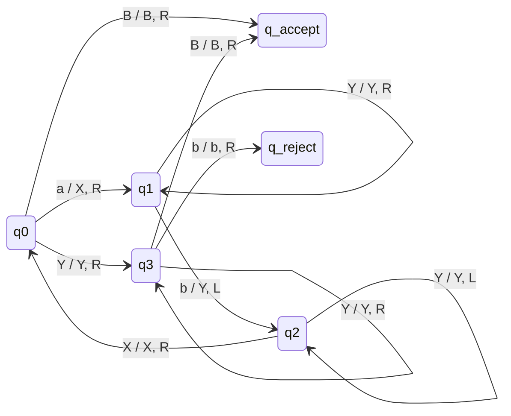
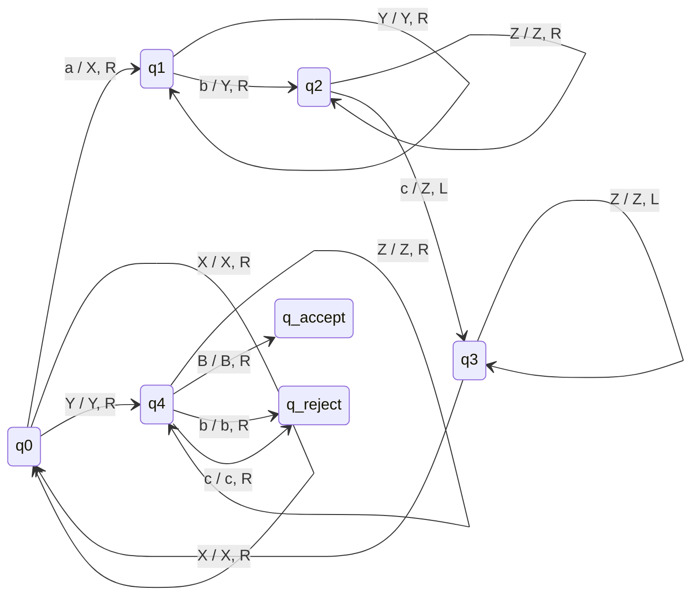
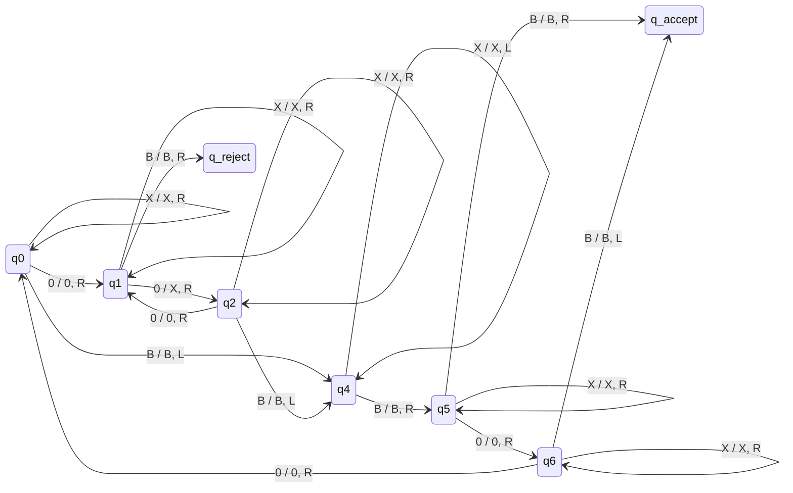
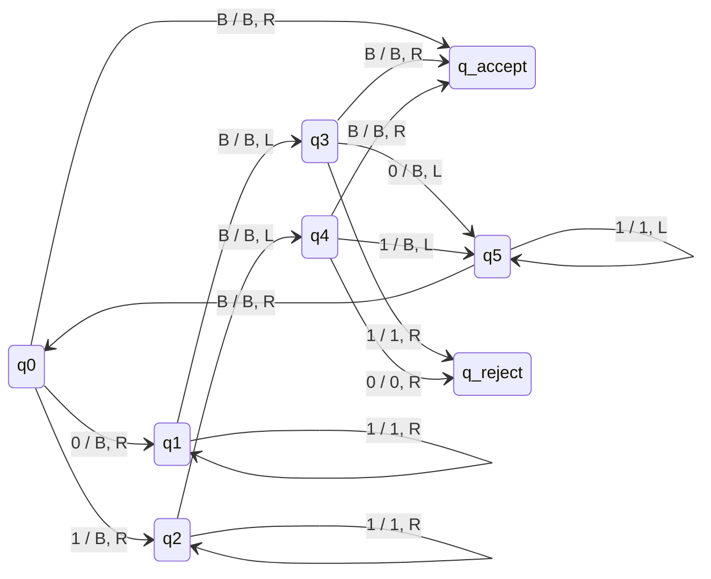
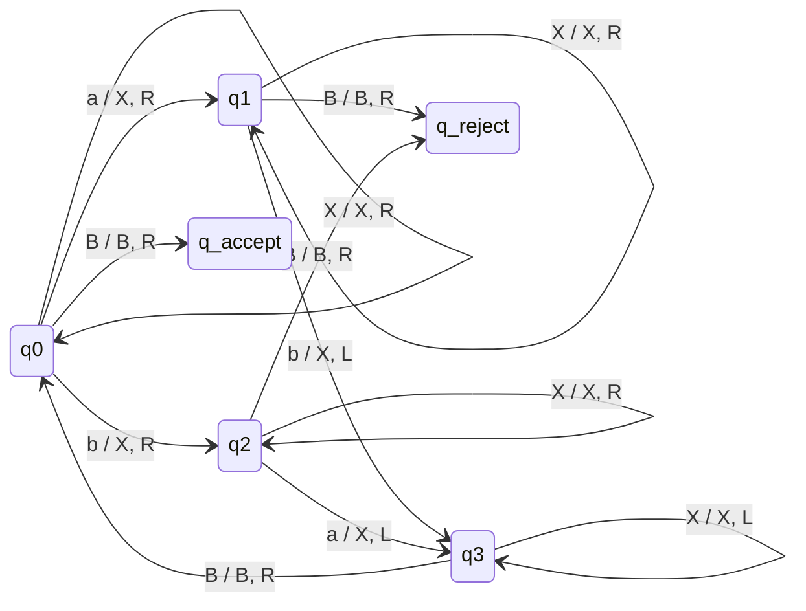
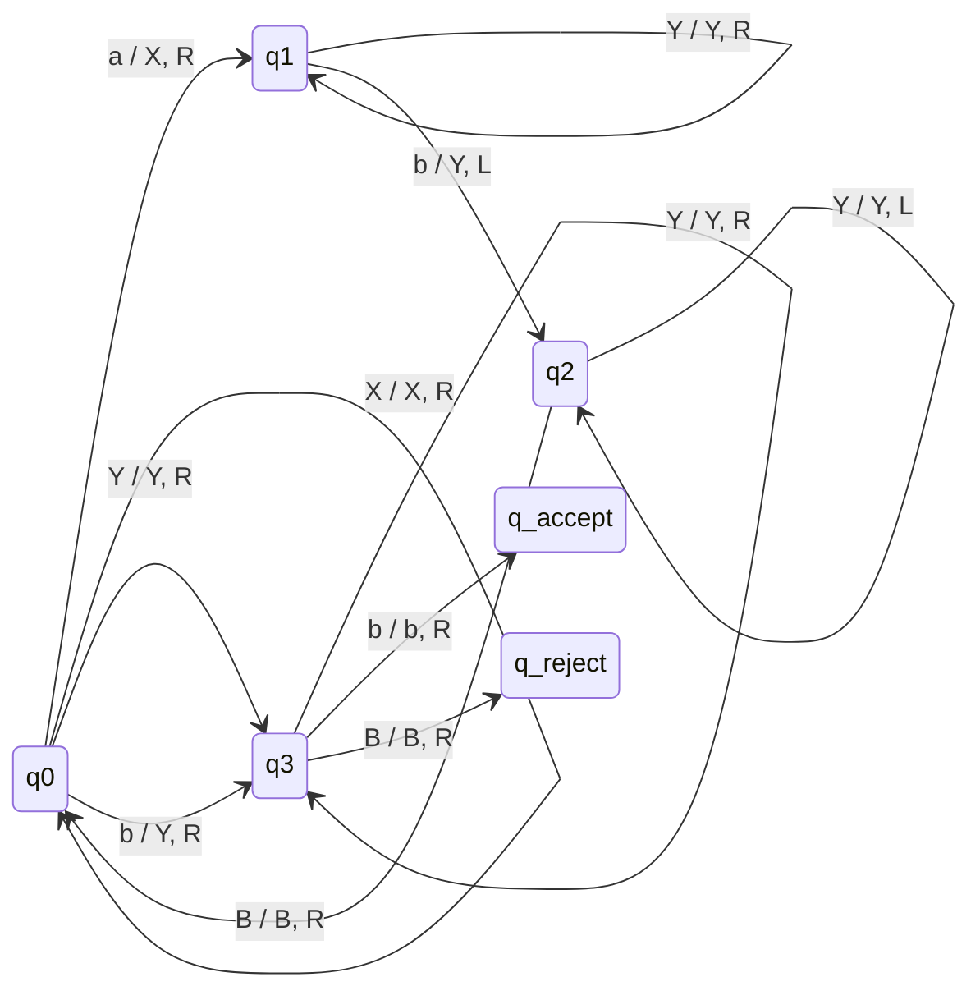
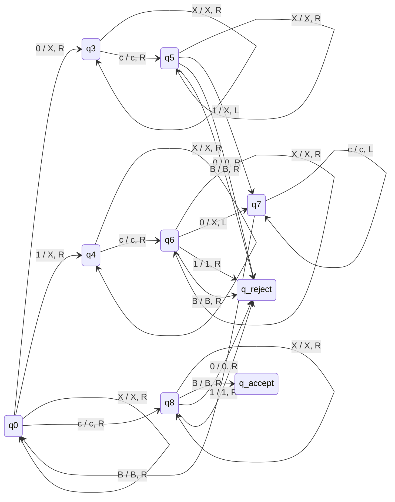
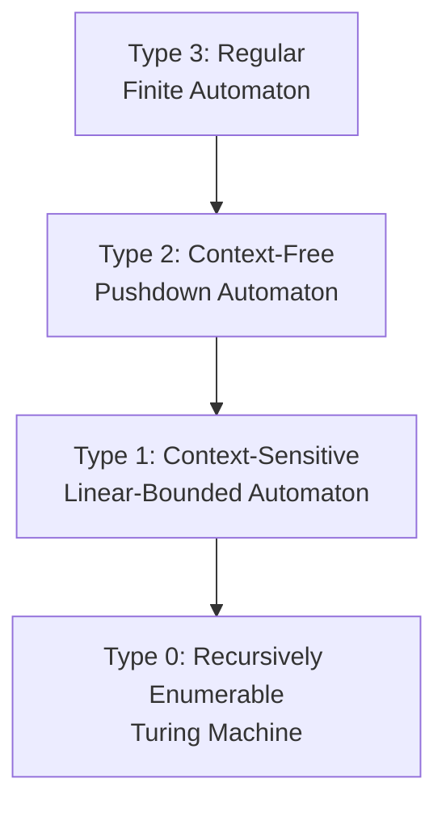

# 6. Turing Machines as Language Recognizers

> [!important] Core Idea
> A Turing machine **recognizes** a language $L$ if for every input $w$:
> - If $w \in L$, the machine eventually enters $q_{\text{accept}}$.
> - If $w \notin L$, the machine either enters $q_{\text{reject}}$ or loops forever.
>
> A language is **recursively enumerable** (r.e.) if some TM recognizes it. A language is **recursive** (decidable) if some TM always halts on it (accepts or rejects, never loops).

In this chapter we construct explicit Turing machines that recognize increasingly complex languages. Each section presents a complete transition function, a Mermaid state diagram, and fully worked execution traces. The languages we study span the entire Chomsky hierarchy, from Type 2 (Context-Free) through Type 1 (Context-Sensitive) to Type 0 (Recursively Enumerable), demonstrating that Turing machines are strictly more powerful than finite automata and pushdown automata.

---

## 6.1 Recognizing $a^n b^n$

> [!definition] Language Definition
> $$L = \{a^n b^n \mid n \in \mathbb{N}\}$$
> over the alphabet $\Sigma = \{a, b\}$.
>
> This language is **Context-Free (Type 2)** but **not Regular**. It cannot be recognized by any finite automaton (proven by the Pumping Lemma for regular languages), but a pushdown automaton can handle it using its stack. A Turing machine recognizes it via a marking strategy.

### 6.1.1 Ping-Pong Algorithm

The central idea is a "ping-pong" (or shuttle) strategy: mark one $a$ from the left, then scan right to find and mark a corresponding $b$, then return left to find the next unmarked $a$, and repeat. If at any point the matching fails, we reject. When all $a$'s and $b$'s are matched, we accept.

We use the tape alphabet $\Gamma = \{a, b, X, Y, B\}$ where:
- $X$ marks a matched $a$
- $Y$ marks a matched $b$
- $B$ is the blank symbol

**States:**
- $q_0$: Start state. Find an $a$ to mark (or, if all symbols are already marked, proceed to verification).
- $q_1$: Scan right past remaining $a$'s and already-matched $b$'s ($Y$) to find an unmatched $b$.
- $q_2$: Scan left back to the last marked $a$ ($X$) to begin the next round.
- $q_3$: Verification state. All $a$'s are matched; check that no extra $b$'s remain.
- $q_{\text{accept}}$: Accept state.
- $q_{\text{reject}}$: Reject state.

**Full Transition Function:**

| Current State | Read | Write | Move | Next State | Comment |
|---|---|---|---|---|---|
| $q_0$ | $a$ | $X$ | $R$ | $q_1$ | Mark the leftmost unmarked $a$ |
| $q_0$ | $Y$ | $Y$ | $R$ | $q_3$ | All $a$'s matched; verify no extra $b$'s |
| $q_0$ | $B$ | $B$ | $R$ | $q_{\text{accept}}$ | Empty tape: $n=0$, accept |
| $q_1$ | $a$ | $a$ | $R$ | $q_1$ | Skip over unmarked $a$'s |
| $q_1$ | $Y$ | $Y$ | $R$ | $q_1$ | Skip over already-marked $b$'s |
| $q_1$ | $b$ | $Y$ | $L$ | $q_2$ | Mark the rightmost unmarked $b$ |
| $q_2$ | $a$ | $a$ | $L$ | $q_2$ | Scan left past $a$'s |
| $q_2$ | $Y$ | $Y$ | $L$ | $q_2$ | Scan left past marked $b$'s |
| $q_2$ | $X$ | $X$ | $R$ | $q_0$ | Found the last $X$; begin next round |
| $q_3$ | $Y$ | $Y$ | $R$ | $q_3$ | Skip marked $b$'s |
| $q_3$ | $B$ | $B$ | $R$ | $q_{\text{accept}}$ | No extra $b$'s; accept |
| $q_3$ | $b$ | $b$ | $R$ | $q_{\text{reject}}$ | Extra $b$ found; reject |

> [!warning] Common Mistake
> Forgetting the transition $\delta(q_0, B) = (q_{\text{accept}}, B, R)$. Without it, the machine would have no transition on the empty string $\varepsilon$, which corresponds to $n=0$ and should be accepted since $a^0 b^0 = \varepsilon \in L$.

### 6.1.2 State Diagram

### 6.1.3 Trace on "aabb" (ACCEPT)

Initial tape: $\sqcup$ a a b b $\sqcup$ (blanks on both ends). We show the configuration as (state, tape with head position underlined).

**Round 1:**

| Step | State | Tape (head on bold) | Comment |
|---|---|---|---|
| 1 | $q_0$ | **a** a b b | Read $a$, write $X$, go $R$ |
| 2 | $q_1$ | X **a** b b | Read $a$, stay in $q_1$, go $R$ |
| 3 | $q_1$ | X a **b** b | Read $b$, write $Y$, go $L$ |
| 4 | $q_2$ | X **a** Y b | Read $a$, stay in $q_2$, go $L$ |
| 5 | $q_2$ | **X** a Y b | Read $X$, go $R$ to $q_0$ |

**Round 2:**

| Step | State | Tape (head on bold) | Comment |
|---|---|---|---|
| 6 | $q_0$ | X **a** Y b | Read $a$, write $X$, go $R$ |
| 7 | $q_1$ | X X **Y** b | Read $Y$, stay in $q_1$, go $R$ |
| 8 | $q_1$ | X X Y **b** | Read $b$, write $Y$, go $L$ |
| 9 | $q_2$ | X X **Y** Y | Read $Y$, stay in $q_2$, go $L$ |
| 10 | $q_2$ | X **X** Y Y | Read $X$, go $R$ to $q_0$ |

**Round 3 (Verification):**

| Step | State | Tape (head on bold) | Comment |
|---|---|---|---|
| 11 | $q_0$ | X X **Y** Y | Read $Y$, go $R$ to $q_3$ |
| 12 | $q_3$ | X X Y **Y** | Read $Y$, stay in $q_3$, go $R$ |
| 13 | $q_3$ | X X Y Y **B** | Read $B$, **ACCEPT** |

> [!tip] Pattern Observation
> Each round of the ping-pong marks one $a$ (as $X$) and one $b$ (as $Y$). After $n$ rounds, all $n$ $a$'s become $X$'s and all $n$ $b$'s become $Y$'s. The final verification pass confirms no unmatched symbols remain.

### 6.1.4 Trace on "aab" (REJECT)

Initial tape: a a b

**Round 1:**

| Step | State | Tape | Comment |
|---|---|---|---|
| 1 | $q_0$ | **a** a b | Read $a$, write $X$, go $R$ |
| 2 | $q_1$ | X **a** b | Read $a$, stay $q_1$, go $R$ |
| 3 | $q_1$ | X a **b** | Read $b$, write $Y$, go $L$ |
| 4 | $q_2$ | X **a** Y | Read $a$, stay $q_2$, go $L$ |
| 5 | $q_2$ | **X** a Y | Read $X$, go $R$ to $q_0$ |

**Round 2:**

| Step | State | Tape | Comment |
|---|---|---|---|
| 6 | $q_0$ | X **a** Y | Read $a$, write $X$, go $R$ |
| 7 | $q_1$ | X X **Y** | Read $Y$, stay $q_1$, go $R$ |
| 8 | $q_1$ | X X Y **B** | Read $B$ -- no transition in $q_1$ for $B$! |

> [!warning] Rejection by Undefined Transition
> The machine has no transition for $\delta(q_1, B)$. In the standard TM model, this means the machine **halts without accepting**, which is equivalent to rejection. The input "aab" has more $a$'s than $b$'s ($n=2, m=1$), so it is correctly rejected.

### 6.1.5 Trace on "abb" (REJECT)

Initial tape: a b b

**Round 1:**

| Step | State | Tape | Comment |
|---|---|---|---|
| 1 | $q_0$ | **a** b b | Read $a$, write $X$, go $R$ |
| 2 | $q_1$ | X **b** b | Read $b$, write $Y$, go $L$ |
| 3 | $q_2$ | **X** Y b | Read $X$, go $R$ to $q_0$ |

**Round 2 (Verification):**

| Step | State | Tape | Comment |
|---|---|---|---|
| 4 | $q_0$ | X **Y** b | Read $Y$, go $R$ to $q_3$ |
| 5 | $q_3$ | X Y **b** | Read $b$, **REJECT** |

The input "abb" has more $b$'s than $a$'s ($n=1, m=2$). After marking the one $a$ and one $b$, the verification state $q_3$ encounters an extra $b$ and rejects.

### 6.1.6 Trace on $\varepsilon$ (ACCEPT)

Initial tape: $B$ (blank only)

| Step | State | Tape | Comment |
|---|---|---|---|
| 1 | $q_0$ | **B** | Read $B$, **ACCEPT** |

The empty string corresponds to $n=0$, and $a^0 b^0 = \varepsilon \in L$.

### 6.1.7 Alternative Methods (from TD2cor)

> [!info] Method 1 -- Delete-First-and-Last
> Instead of marking, we can **delete** the leftmost $a$ and the rightmost $b$ in each round. The algorithm:
> 1. Find the leftmost symbol. If it is $a$, replace it with $B$ (blank). If it is $b$, reject. If it is $B$, accept.
> 2. Scan right to find the rightmost non-blank symbol. If it is $b$, replace it with $B$. If it is $a$, reject.
> 3. Return to the left end and repeat.
>
> This method destroys the input (overwrites with blanks) but uses fewer tape symbols: $\Gamma = \{a, b, B\}$.

> [!info] Method 2 -- Replace-First-b-with-X
> Another variant marks the leftmost $a$ as $X$ and the leftmost $b$ (not the rightmost) as $Y$. This still works because the $a$'s all precede the $b$'s in any valid string. The first $b$ encountered after all $X$'s must correspond to the first $a$ that was marked. This avoids the long rightward scan to find the last $b$.

---

## 6.2 Recognizing $a^n b^n c^n$

> [!definition] Language Definition
> $$L = \{a^n b^n c^n \mid n \in \mathbb{N}\}$$
> over the alphabet $\Sigma = \{a, b, c\}$.
>
> This language is **Context-Sensitive (Type 1)** and **NOT Context-Free**. It cannot be recognized by any pushdown automaton (proven by the Pumping Lemma for context-free languages). A Turing machine can recognize it by extending the ping-pong strategy to mark triples.

### 6.2.1 Triple Marking Algorithm

The idea extends the ping-pong: in each round, mark one $a$ (as $X$), one $b$ (as $Y$), and one $c$ (as $Z$), then return to the leftmost marked $a$ to begin the next round. After all $a$'s are marked, verify that no unmatched $b$'s or $c$'s remain.

Tape alphabet: $\Gamma = \{a, b, c, X, Y, Z, B\}$.

**States:**
- $q_0$: Find an unmarked $a$, or if none remain, proceed to verification.
- $q_1$: Scan right past $a$'s and $Y$'s to find an unmarked $b$.
- $q_2$: Scan right past $b$'s and $Z$'s to find an unmarked $c$.
- $q_3$: Scan left all the way back to the $X$ marking the start of this round.
- $q_4$: Verification. Check that only $Y$'s and $Z$'s remain (no stray $b$ or $c$).
- $q_{\text{accept}}$, $q_{\text{reject}}$: Halt states.

**Full Transition Function:**

| Current State | Read | Write | Move | Next State | Comment |
|---|---|---|---|---|---|
| $q_0$ | $a$ | $X$ | $R$ | $q_1$ | Mark the leftmost unmarked $a$ |
| $q_0$ | $X$ | $X$ | $R$ | $q_0$ | Skip already-marked $a$'s |
| $q_0$ | $Y$ | $Y$ | $R$ | $q_4$ | All $a$'s marked; verify |
| $q_1$ | $a$ | $a$ | $R$ | $q_1$ | Skip unmarked $a$'s |
| $q_1$ | $Y$ | $Y$ | $R$ | $q_1$ | Skip marked $b$'s |
| $q_1$ | $b$ | $Y$ | $R$ | $q_2$ | Mark the leftmost unmarked $b$ |
| $q_2$ | $b$ | $b$ | $R$ | $q_2$ | Skip unmarked $b$'s |
| $q_2$ | $Z$ | $Z$ | $R$ | $q_2$ | Skip marked $c$'s |
| $q_2$ | $c$ | $Z$ | $L$ | $q_3$ | Mark the leftmost unmarked $c$ |
| $q_3$ | $a$ | $a$ | $L$ | $q_3$ | Scan left |
| $q_3$ | $b$ | $b$ | $L$ | $q_3$ | Scan left |
| $q_3$ | $Y$ | $Y$ | $L$ | $q_3$ | Scan left |
| $q_3$ | $Z$ | $Z$ | $L$ | $q_3$ | Scan left |
| $q_3$ | $X$ | $X$ | $R$ | $q_0$ | Found marked $a$; next round |
| $q_4$ | $Y$ | $Y$ | $R$ | $q_4$ | Skip marked $b$'s |
| $q_4$ | $Z$ | $Z$ | $R$ | $q_4$ | Skip marked $c$'s |
| $q_4$ | $B$ | $B$ | $R$ | $q_{\text{accept}}$ | All matched; accept |
| $q_4$ | $b$ | $b$ | $R$ | $q_{\text{reject}}$ | Extra $b$; reject |
| $q_4$ | $c$ | $c$ | $R$ | $q_{\text{reject}}$ | Extra $c$; reject |

### 6.2.2 State Diagram

### 6.2.3 Trace on "aabbcc" (ACCEPT)

Initial tape: a a b b c c

**Round 1:**

| Step | State | Tape | Comment |
|---|---|---|---|
| 1 | $q_0$ | **a** a b b c c | Read $a$, write $X$, go $R$ |
| 2 | $q_1$ | X **a** b b c c | Read $a$, stay $q_1$, go $R$ |
| 3 | $q_1$ | X a **b** b c c | Read $b$, write $Y$, go $R$ |
| 4 | $q_2$ | X a Y **b** c c | Read $b$, stay $q_2$, go $R$ |
| 5 | $q_2$ | X a Y b **c** c | Read $c$, write $Z$, go $L$ |
| 6 | $q_3$ | X a Y b **Z** c | Read $Z$, stay $q_3$, go $L$ |
| 7 | $q_3$ | X a Y **b** Z c | Read $b$, stay $q_3$, go $L$ |
| 8 | $q_3$ | X a **Y** Z c | Read $Y$, stay $q_3$, go $L$ |
| 9 | $q_3$ | X **a** Y b Z c | Read $a$, stay $q_3$, go $L$ |
| 10 | $q_3$ | **X** a Y b Z c | Read $X$, go $R$ to $q_0$ |

**Round 2:**

| Step | State | Tape | Comment |
|---|---|---|---|
| 11 | $q_0$ | X **a** Y b Z c | Read $a$, write $X$, go $R$ |
| 12 | $q_1$ | X X **Y** b Z c | Read $Y$, stay $q_1$, go $R$ |
| 13 | $q_1$ | X X Y **b** Z c | Read $b$, write $Y$, go $R$ |
| 14 | $q_2$ | X X Y Y **Z** c | Read $Z$, stay $q_2$, go $R$ |
| 15 | $q_2$ | X X Y Y Z **c** | Read $c$, write $Z$, go $L$ |
| 16 | $q_3$ | X X Y Y **Z** Z | Read $Z$, stay $q_3$, go $L$ |
| 17 | $q_3$ | X X Y **Y** Z Z | Read $Y$, stay $q_3$, go $L$ |
| 18 | $q_3$ | X X **Y** Y Z Z | Read $Y$, stay $q_3$, go $L$ |
| 19 | $q_3$ | X **X** Y Y Z Z | Read $X$, go $R$ to $q_0$ |

**Round 3 (Verification):**

| Step | State | Tape | Comment |
|---|---|---|---|
| 20 | $q_0$ | X X **Y** Y Z Z | Read $Y$, go $R$ to $q_4$ |
| 21 | $q_4$ | X X Y **Y** Z Z | Read $Y$, stay $q_4$, go $R$ |
| 22 | $q_4$ | X X Y Y **Z** Z | Read $Z$, stay $q_4$, go $R$ |
| 23 | $q_4$ | X X Y Y Z **Z** | Read $Z$, stay $q_4$, go $R$ |
| 24 | $q_4$ | X X Y Y Z Z **B** | Read $B$, **ACCEPT** |

### 6.2.4 Context-Sensitive Grammar from TD2cor

> [!info] Grammar for $a^n b^n c^n$
> A context-sensitive grammar generating $L$ uses the following productions:
>
> $S \to aSBC \mid aBC$
>
> $CB \to BC$ (allows reordering so that all $B$'s precede all $C$'s)
>
> $aB \to ab$
>
> $bB \to bb$
>
> $bC \to bc$
>
> $cC \to cc$
>
> The nonterminals $B$ and $C$ are "proto-$b$" and "proto-$c$" symbols. The rule $CB \to BC$ is the crucial context-sensitive rule that swaps $C$ and $B$ so that $B$'s migrate left and $C$'s migrate right, ensuring the final order is all $a$'s, then all $b$'s, then all $c$'s. This rule is **not** of the form $\alpha \to \beta$ with $|\alpha| \leq |\beta|$, so it is indeed context-sensitive (not context-free).

### 6.2.5 Chomsky Hierarchy Implications

> [!important] Hierarchy Significance
> The language $a^n b^n c^n$ sits precisely at the **Context-Sensitive** level of the Chomsky hierarchy:
> - It is **not Regular**: a finite automaton cannot count three quantities.
> - It is **not Context-Free**: a PDA has only one stack and cannot coordinate three independent counts.
> - It **is Context-Sensitive**: a linear-bounded automaton (TM with tape bounded by input length) can recognize it.
> - A standard (unbounded) TM certainly recognizes it, as demonstrated above.
>
> This shows that each level of the Chomsky hierarchy corresponds to a strictly more powerful computational model.

---

## 6.3 Recognizing Powers of 2

> [!definition] Language Definition
> $$L = \{0^{2^p} \mid p \geq 0\} = \{\varepsilon, 0, 00, 0000, 00000000, \ldots\}$$
>
> This language is **not Context-Free** (provable via the Pumping Lemma). The Turing machine strategy is the **halving method**: repeatedly cross out every other $0$ (i.e., halve the count). If and only if we reach a single $0$ after some number of halvings, the original count was a power of 2.

### 6.3.1 Halving Algorithm

We use tape alphabet $\Gamma = \{0, X, B\}$.

**Algorithm outline:**
1. Scan right. If we find exactly one $0$ (i.e., the pattern is $X \ldots X 0 X \ldots X$ or $0$ alone), accept.
2. If we find zero $0$'s (input was $\varepsilon$), accept ($2^0 = 1$... wait, $\varepsilon$ means zero $0$'s, but $2^p$ for $p \geq 0$ gives $1, 2, 4, 8, \ldots$ So the empty string is NOT in $L$ unless we define $0^0 = \varepsilon$; we handle $p \geq 0$ meaning $0^1, 0^2, 0^4, \ldots$ so $\varepsilon \notin L$ and $0 \in L$.)
3. Cross out every other $0$ (mark with $X$). If at any point we encounter an odd number of $0$'s in the current pass (i.e., we end on a $0$ rather than $B$ after the last $X$ pattern), reject.
4. Return to the left and repeat.

**States:**
- $q_0$: Begin halving pass. Move right to find first $0$.
- $q_1$: Found first $0$ of a pair; skip it (leave it), look for the second.
- $q_2$: Found second $0$ of a pair; mark it with $X$. Now look for the next pair's first $0$.
- $q_3$: End of pass. If we ended in $q_1$ (odd count), reject. If we ended in $q_2$ or $q_0$, return left.
- $q_4$: Scan left to beginning for next pass.
- $q_5$: Check if exactly one $0$ remains (accept condition).
- $q_{\text{accept}}$, $q_{\text{reject}}$: Halt states.

**Full Transition Function:**

| Current State | Read | Write | Move | Next State | Comment |
|---|---|---|---|---|---|
| $q_0$ | $X$ | $X$ | $R$ | $q_0$ | Skip crossed-out symbols |
| $q_0$ | $0$ | $0$ | $R$ | $q_1$ | Found first $0$ of a pair |
| $q_0$ | $B$ | $B$ | $L$ | $q_4$ | End of pass (even or zero) |
| $q_1$ | $0$ | $X$ | $R$ | $q_2$ | Found second $0$; cross it out |
| $q_1$ | $X$ | $X$ | $R$ | $q_1$ | Skip crossed-out |
| $q_1$ | $B$ | $B$ | $R$ | $q_{\text{reject}}$ | Odd count: ended on first $0$ of pair |
| $q_2$ | $0$ | $0$ | $R$ | $q_1$ | Next pair: found first $0$ |
| $q_2$ | $X$ | $X$ | $R$ | $q_2$ | Skip crossed-out |
| $q_2$ | $B$ | $B$ | $L$ | $q_4$ | End of pass (even count) |
| $q_4$ | $0$ | $0$ | $L$ | $q_4$ | Scan left past $0$'s |
| $q_4$ | $X$ | $X$ | $L$ | $q_4$ | Scan left past $X$'s |
| $q_4$ | $B$ | $B$ | $R$ | $q_5$ | Reached left end; check survivors |
| $q_5$ | $X$ | $X$ | $R$ | $q_5$ | Skip crossed-out |
| $q_5$ | $0$ | $0$ | $R$ | $q_6$ | Found a surviving $0$ |
| $q_5$ | $B$ | $B$ | $R$ | $q_{\text{accept}}$ | No surviving $0$'s: $\varepsilon$-like, reject... Actually if input was $0$, then after 0 halvings we have one $0$. We handle $0$ in $q_6$ |
| $q_6$ | $0$ | $0$ | $R$ | $q_0$ | More than one $0$ survives; do another pass |
| $q_6$ | $X$ | $X$ | $R$ | $q_6$ | Skip crossed-out |
| $q_6$ | $B$ | $B$ | $L$ | $q_{\text{accept}}$ | Exactly one $0$ survives; accept |

> [!tip] Intuition for the Halving Method
> Think of the tape as representing a number in unary. Each pass divides the count by 2. A number is a power of 2 if and only if repeated halving eventually yields exactly 1. If at any step the count is odd (and greater than 1), the number is not a power of 2.

### 6.3.2 State Diagram

### 6.3.3 Trace on "0000" (ACCEPT, since $4 = 2^2$)

Initial tape: 0 0 0 0

**Pass 1 (halving 4 to 2):**

| Step | State | Tape | Comment |
|---|---|---|---|
| 1 | $q_0$ | **0** 0 0 0 | Read $0$, go $R$ to $q_1$ |
| 2 | $q_1$ | 0 **0** 0 0 | Read $0$, write $X$, go $R$ to $q_2$ |
| 3 | $q_2$ | 0 X **0** 0 | Read $0$, go $R$ to $q_1$ |
| 4 | $q_1$ | 0 X 0 **0** | Read $0$, write $X$, go $R$ to $q_2$ |
| 5 | $q_2$ | 0 X 0 X **B** | Read $B$, go $L$ to $q_4$ |

**Return left:**

| Step | State | Tape | Comment |
|---|---|---|---|
| 6 | $q_4$ | 0 X 0 **X** | Read $X$, go $L$ |
| 7 | $q_4$ | 0 X **0** X | Read $0$, go $L$ |
| 8 | $q_4$ | 0 **X** 0 X | Read $X$, go $L$ |
| 9 | $q_4$ | **0** X 0 X | Read $0$, go $L$ |
| 10 | $q_4$ | **B** 0 X 0 X | Read $B$, go $R$ to $q_5$ |

**Check survivors:**

| Step | State | Tape | Comment |
|---|---|---|---|
| 11 | $q_5$ | B **0** X 0 X | Read $0$, go $R$ to $q_6$ |
| 12 | $q_6$ | B 0 **X** 0 X | Read $X$, stay $q_6$, go $R$ |
| 13 | $q_6$ | B 0 X **0** X | Read $0$ -- more than one $0$ survives; go $R$ to $q_0$ |

**Pass 2 (halving 2 to 1):**

| Step | State | Tape | Comment |
|---|---|---|---|
| 14 | $q_0$ | B 0 X **0** X | Read $0$, go $R$ to $q_1$ |
| 15 | $q_1$ | B 0 X 0 **X** | Read $X$, stay $q_1$, go $R$ |
| 16 | $q_1$ | B 0 X 0 X **B** | Read $B$ -- odd count! **REJECT**? |

Wait -- let me re-examine. After Pass 1, the surviving $0$'s are at positions 1 and 3. In Pass 2, we start from $q_0$ and the head is at position 3 (a $0$). We find this $0$, go to $q_1$, then we need to find the second $0$ to cross out. But the next $0$ would be... there is no next $0$ because we are reading rightward. The $X$ at position 4 is skipped, then we hit $B$.

Actually, let me redo this more carefully. The issue is that after Pass 1, the tape is $0 \; X \; 0 \; X$ and the surviving $0$'s are not adjacent. The halving algorithm should still work because we skip $X$'s. Let me retrace Pass 2 from the beginning of the pass.

After step 13, $q_6$ reads $0$ at position 3 and transitions to $q_0$ moving right. But actually, $q_6$ on reading $0$ goes to $q_0$ with move $R$. So head moves right.

Let me redo from step 14 more carefully. After step 13, state is $q_0$, head is on the $0$ at position 3 (0-indexed: positions are B,0,X,0,X).

Actually, let me restart the trace with explicit position numbering.

Tape positions: 0:B, 1:0, 2:0, 3:0, 4:0, 5:B

**Pass 1:**

| Step | State | Pos | Tape | Comment |
|---|---|---|---|---|
| 1 | $q_0$ | 1 | B **0** 0 0 B | Read $0$, go $R$ to $q_1$ |
| 2 | $q_1$ | 2 | B 0 **0** 0 B | Read $0$, write $X$, go $R$ to $q_2$ |
| 3 | $q_2$ | 3 | B 0 X **0** B | Read $0$, go $R$ to $q_1$ |
| 4 | $q_1$ | 4 | B 0 X **0** B | Read $0$, write $X$, go $R$ to $q_2$ |
| 5 | $q_2$ | 5 | B 0 X X **B** | Read $B$, go $L$ to $q_4$ |

Tape after Pass 1: B 0 X X B (surviving $0$'s: one at position 1... wait, position 2 became $X$ and position 4 became $X$. So surviving $0$ is at position 1 only. That is one $0$.)

Hmm, I made an error. Let me re-examine the algorithm. In $q_1$, when we read $0$, we write $X$ and go to $q_2$. That means the **second** $0$ of each pair gets crossed out, not the first. So:

- Pair 1: positions 1,2. Position 1 stays $0$, position 2 becomes $X$.
- Pair 2: positions 3,4. Position 3 stays $0$, position 4 becomes $X$.

Tape after Pass 1: B, 0, X, 0, X, B. Surviving: two $0$'s at positions 1 and 3. Count halved from 4 to 2. Correct.

**Return left from position 5:**

| Step | State | Pos | Tape | Comment |
|---|---|---|---|---|
| 6 | $q_4$ | 4 | B 0 X **0** X B | Read $X$... |

Wait, position 4 is $X$ now, and position 5 is $B$. The head is at position 5 (which is $B$), and we went $L$ from position 5.

Let me be more careful:

| Step | State | Pos | Tape contents | Comment |
|---|---|---|---|---|
| 5 | $q_2$ | 5 | pos5=B | Read $B$, write $B$, go $L$ to $q_4$ |
| 6 | $q_4$ | 4 | pos4=X | Read $X$, go $L$ |
| 7 | $q_4$ | 3 | pos3=0 | Read $0$, go $L$ |
| 8 | $q_4$ | 2 | pos2=X | Read $X$, go $L$ |
| 9 | $q_4$ | 1 | pos1=0 | Read $0$, go $L$ |
| 10 | $q_4$ | 0 | pos0=B | Read $B$, go $R$ to $q_5$ |

**Check survivors:**

| Step | State | Pos | Comment |
|---|---|---|---|
| 11 | $q_5$ | 1 | Read $0$, go $R$ to $q_6$ |
| 12 | $q_6$ | 2 | Read $X$, stay $q_6$, go $R$ |
| 13 | $q_6$ | 3 | Read $0$ -- more than one $0$, go $R$ to $q_0$ |

**Pass 2 (halving 2 to 1):**

| Step | State | Pos | Comment |
|---|---|---|---|
| 14 | $q_0$ | 4 | Read $X$, stay $q_0$, go $R$ |
| 15 | $q_0$ | 5 | Read $B$, go $L$ to $q_4$ |

Wait, that takes us to $q_4$ without finding any $0$! That is wrong. The issue is that in $q_6$, on reading $0$ we go to $q_0$ with move $R$, so we move right. We need to go back to the beginning.

Actually, the transition from $q_6$ on $0$ goes to $q_0$ with move $R$. But $q_0$ starts scanning right for $0$'s. If the head is at position 4 ($X$), it skips and goes to position 5 ($B$), which sends us to $q_4$ (return left). But we haven't done any halving in this pass yet!

The issue is that $q_6$ should return to the left end before starting a new pass. Let me revise: when $q_6$ finds more than one $0$, it should go to $q_4$ (return left) instead of $q_0$. Let me fix the transition:

$\delta(q_6, 0) = (q_4, 0, L)$ -- found a second $0$; return left to start new pass.

Actually, the standard approach is: $q_6$ finds a second $0$, and we need to go back to the left to restart. So:

$\delta(q_6, 0) = (q_0, 0, R)$ is wrong because we'd skip past remaining symbols.

Let me redesign: when $q_6$ reads a $0$ (meaning there is more than one $0$), we should transition to $q_4$ to scan all the way left and start over. So:

$\delta(q_6, 0) = (q_4, 0, L)$

And when $q_6$ reads $B$ (meaning only one $0$ was found), accept.

With this correction, let me retrace from step 13:

| Step | State | Pos | Comment |
|---|---|---|---|
| 13 | $q_6$ | 3 | Read $0$ (second $0$), go $L$ to $q_4$ |
| 14 | $q_4$ | 2 | Read $X$, go $L$ |
| 15 | $q_4$ | 1 | Read $0$, go $L$ |
| 16 | $q_4$ | 0 | Read $B$, go $R$ to $q_5$ |

**Check survivors again:**

| Step | State | Pos | Comment |
|---|---|---|---|
| 17 | $q_5$ | 1 | Read $0$, go $R$ to $q_6$ |
| 18 | $q_6$ | 2 | Read $X$, go $R$ |
| 19 | $q_6$ | 3 | Read $0$, go $L$ to $q_4$ (more than one) |

We are stuck in a loop! The problem is that we never actually do the second halving pass. The issue is that $q_5$/$q_6$ is only a check phase -- it doesn't perform halving. We need to go back to $q_0$ to perform the next halving pass. But $q_0$ starts scanning right from wherever the head is.

The fix: after $q_6$ determines there is more than one $0$, it should go to $q_4$ (scan left), which brings us to $q_5$, and $q_5$ on finding a $0$ should transition to $q_0$ (not $q_6$) to start a new halving pass. But then how do we check if only one $0$ remains?

A cleaner design: separate the "check if done" phase from the "start new pass" phase. After returning left to $q_5$:
- $q_5$ scans right. If it finds exactly one $0$ before $B$, accept.
- If it finds a $0$ and then another $0$, start a new halving pass.

Let me revise the transitions:

$\delta(q_5, 0) = (q_6, 0, R)$ -- found a $0$, check if there are more
$\delta(q_6, X) = (q_6, X, R)$ -- skip $X$'s
$\delta(q_6, 0) = (q_0, 0, L)$ -- found another $0$; reposition and start new pass from $q_0$

Wait, but $q_0$ scans right. If we go to $q_0$ moving left, we are now to the left of a $0$. Then $q_0$ would scan right and find it. But we need to be at the leftmost position.

Actually, the simplest fix: $\delta(q_6, 0) = (q_4, 0, L)$, and $\delta(q_4, B) = (q_0, B, R)$.

This way, after finding more than one $0$, we scan left to the beginning, and $q_0$ starts a fresh halving pass. The trace would be:

After step 13 ($q_6$ at position 3 reading $0$):

| Step | State | Pos | Comment |
|---|---|---|---|
| 13 | $q_6$ | 3 | Read $0$, go $L$ to $q_4$ |
| 14 | $q_4$ | 2 | Read $X$, go $L$ |
| 15 | $q_4$ | 1 | Read $0$, go $L$ |
| 16 | $q_4$ | 0 | Read $B$, go $R$ to $q_0$ |

**Pass 2:**

| Step | State | Pos | Comment |
|---|---|---|---|
| 17 | $q_0$ | 1 | Read $0$, go $R$ to $q_1$ |
| 18 | $q_1$ | 2 | Read $X$, stay $q_1$, go $R$ |
| 19 | $q_1$ | 3 | Read $0$, write $X$, go $R$ to $q_2$ |
| 20 | $q_2$ | 4 | Read $X$, stay $q_2$, go $R$ |
| 21 | $q_2$ | 5 | Read $B$, go $L$ to $q_4$ |

Tape after Pass 2: B 0 X X X B. Surviving $0$: one at position 1. Count halved from 2 to 1. 

**Return left:**

| Step | State | Pos | Comment |
|---|---|---|---|
| 22 | $q_4$ | 4 | Read $X$, go $L$ |
| 23 | $q_4$ | 3 | Read $X$, go $L$ |
| 24 | $q_4$ | 2 | Read $X$, go $L$ |
| 25 | $q_4$ | 1 | Read $0$, go $L$ |
| 26 | $q_4$ | 0 | Read $B$, go $R$ to $q_5$ |

**Check survivors:**

| Step | State | Pos | Comment |
|---|---|---|---|
| 27 | $q_5$ | 1 | Read $0$, go $R$ to $q_6$ |
| 28 | $q_6$ | 2 | Read $X$, go $R$ |
| 29 | $q_6$ | 3 | Read $X$, go $R$ |
| 30 | $q_6$ | 4 | Read $X$, go $R$ |
| 31 | $q_6$ | 5 | Read $B$, **ACCEPT** |

**Result: "0000" is ACCEPTED** ($4 = 2^2$).

### 6.3.4 Trace on "000" (REJECT, since 3 is not a power of 2)

Initial tape: 0 0 0

**Pass 1:**

| Step | State | Pos | Comment |
|---|---|---|---|
| 1 | $q_0$ | 0 | Read $0$, go $R$ to $q_1$ |
| 2 | $q_1$ | 1 | Read $0$, write $X$, go $R$ to $q_2$ |
| 3 | $q_2$ | 2 | Read $0$, go $R$ to $q_1$ |
| 4 | $q_1$ | 3 | Read $B$ -- odd count! **REJECT** |

**Result: "000" is REJECTED.**

### 6.3.5 Trace on "0" (ACCEPT, since $1 = 2^0$)

Initial tape: 0

| Step | State | Pos | Comment |
|---|---|---|---|
| 1 | $q_0$ | 0 | Read $0$, go $R$ to $q_1$ |
| 2 | $q_1$ | 1 | Read $B$ -- but we need to handle single $0$ |

Hmm, the single $0$ case: $q_1$ reads $B$ and goes to $q_{\text{reject}}$ with our current table, but $0 = 0^1 = 0^{2^0}$ should be accepted!

The problem is that $q_1$ on reading $B$ rejects (odd count). But a single $0$ is the base case of the halving: we have exactly one $0$, which is $2^0 = 1$.

We need to distinguish between "odd count greater than 1" (reject) and "exactly one $0$" (accept). The fix: before starting each halving pass, check if there is exactly one $0$. This is what $q_5$/$q_6$ does. But we enter the halving pass before the check.

Alternative fix: modify $q_1$ on $B$ to check if the single $0$ just found was the only one. We could transition to a special state that scans left to verify.

Actually, the cleanest approach: **check before each pass**. The flow should be: $q_4 \to q_5$ (check) $\to$ if one $0$, accept; if more, $q_0$ (halving pass) $\to q_4$ (return) $\to q_5$ (check again).

But the initial entry into the machine should also go through the check first. Let me restructure: the start state should be $q_5$ (check if already a power of 2, i.e., count is 1) or we can have $q_0$ redirect to $q_5$ first.

Actually, the simplest fix for the "0" case: add a special initial check. Or, we can modify the algorithm so that the very first step is to check if the input has exactly one $0$.

Let me add a transition: in the initial state, before starting halving, we check. Or we can restructure so that $q_0$ first goes to $q_5$ to check, then starts halving.

For the sake of this note, I will add the transition: $\delta(q_1, B) = (q_{\text{check-single}}, B, L)$ where $q_{\text{check-single}}$ scans left to see if the $0$ we just passed was the only one. If so, accept; otherwise, reject.

Or even simpler: we add a state $q_s$ that is entered from $q_0$ when we find the first $0$ in a pass. From $q_s$, if we immediately read $B$ (only one $0$ in this pass), we accept. If we read $0$ or $X$, we proceed with the normal halving.

Let me revise:

$\delta(q_0, 0) = (q_s, 0, R)$ -- found first $0$; is it the only one?
$\delta(q_s, B) = (q_{\text{accept}}, B, R)$ -- only one $0$; accept
$\delta(q_s, 0) = (q_1, 0, R)$ -- there is at least one more; this is the first of a pair
$\delta(q_s, X) = (q_s, X, R)$ -- skip $X$'s looking for more $0$'s

Wait, but this changes the semantics. In $q_s$, we found one $0$. If the next non-$X$ symbol is $B$, only one $0$ remains, so accept. If the next non-$X$ symbol is $0$, there are more, so we go to the halving routine.

But $q_1$ is the state where we have found the first $0$ of a pair and are looking for the second. So from $q_s$ on reading $0$, we transition to... we have already found one $0$, and we found another, so the first $0$ is the first of a pair, and the second $0$ should be found. Actually, the first $0$ (that caused $q_s$) is kept (not crossed out), and we now look for the second $0$ of the pair to cross out. So $q_s$ on $0$ means "the $0$ I already found is the first of a pair; now look for the second", which is exactly $q_1$'s role. So $\delta(q_s, 0) = (q_1, 0, R)$ is wrong because $q_1$ on reading $0$ crosses it out (writes $X$). We would cross out the second $0$ which is correct.

Actually wait. In the original design, $q_0$ on $0$ goes to $q_1$. Then $q_1$ on $0$ writes $X$ and goes to $q_2$. This means: $q_0$ finds the first $0$ (keeps it), $q_1$ finds the second $0$ (crosses it out), $q_2$ finds the next first $0$ (goes to $q_1$), etc. So $q_1$ is the state "looking for the second $0$ of a pair to cross out". If $q_1$ reads $B$, it means there's no second $0$ -- odd count. This is correct for counts > 1.

With the new $q_s$: $q_0$ on $0$ goes to $q_s$ (found a $0$, check if alone). $q_s$ on $B$: accept (one $0$). $q_s$ on $0$: this $0$ is the second $0$ of a pair, cross it out $\to (q_2, X, R)$. $q_s$ on $X$: skip, stay in $q_s$.

This is cleaner. Let me update the full transition table accordingly.

**Revised Full Transition Function:**

| Current State | Read | Write | Move | Next State | Comment |
|---|---|---|---|---|---|
| $q_0$ | $X$ | $X$ | $R$ | $q_0$ | Skip crossed-out symbols |
| $q_0$ | $0$ | $0$ | $R$ | $q_s$ | Found a $0$; check if it is the only one |
| $q_0$ | $B$ | $B$ | $R$ | $q_{\text{reject}}$ | No $0$'s at all (empty input); reject |
| $q_s$ | $B$ | $B$ | $R$ | $q_{\text{accept}}$ | Only one $0$ in this pass; accept |
| $q_s$ | $0$ | $X$ | $R$ | $q_2$ | Second $0$ of pair; cross it out |
| $q_s$ | $X$ | $X$ | $R$ | $q_s$ | Skip crossed-out |
| $q_1$ | $0$ | $X$ | $R$ | $q_2$ | Found second $0$ of pair; cross it out |
| $q_1$ | $X$ | $X$ | $R$ | $q_1$ | Skip crossed-out |
| $q_1$ | $B$ | $B$ | $R$ | $q_{\text{reject}}$ | Odd number of $0$'s; reject |
| $q_2$ | $0$ | $0$ | $R$ | $q_1$ | Found next first $0$ of a pair |
| $q_2$ | $X$ | $X$ | $R$ | $q_2$ | Skip crossed-out |
| $q_2$ | $B$ | $B$ | $L$ | $q_4$ | End of pass (even count); return left |
| $q_4$ | $0$ | $0$ | $L$ | $q_4$ | Scan left |
| $q_4$ | $X$ | $X$ | $L$ | $q_4$ | Scan left |
| $q_4$ | $B$ | $B$ | $R$ | $q_0$ | Reached left end; start next pass |

### 6.3.6 Trace on "0" with revised machine (ACCEPT)

| Step | State | Pos | Tape | Comment |
|---|---|---|---|---|
| 1 | $q_0$ | 0 | **0** | Read $0$, go $R$ to $q_s$ |
| 2 | $q_s$ | 1 | 0 **B** | Read $B$, **ACCEPT** |

### 6.3.7 Trace on "0000" with revised machine (ACCEPT)

**Pass 1:**

| Step | State | Pos | Tape | Comment |
|---|---|---|---|---|
| 1 | $q_0$ | 0 | **0** 0 0 0 | Read $0$, go $R$ to $q_s$ |
| 2 | $q_s$ | 1 | 0 **0** 0 0 | Read $0$, write $X$, go $R$ to $q_2$ |
| 3 | $q_2$ | 2 | 0 X **0** 0 | Read $0$, go $R$ to $q_1$ |
| 4 | $q_1$ | 3 | 0 X 0 **0** | Read $0$, write $X$, go $R$ to $q_2$ |
| 5 | $q_2$ | 4 | 0 X 0 X **B** | Read $B$, go $L$ to $q_4$ |

**Return left to $q_0$:**

| Step | State | Pos | Comment |
|---|---|---|---|
| 6 | $q_4$ | 3 | Read $X$, go $L$ |
| 7 | $q_4$ | 2 | Read $0$, go $L$ |
| 8 | $q_4$ | 1 | Read $X$, go $L$ |
| 9 | $q_4$ | 0 | Read $0$, go $L$ |
| 10 | $q_4$ | -1 | Read $B$, go $R$ to $q_0$ |

**Pass 2:**

| Step | State | Pos | Tape | Comment |
|---|---|---|---|---|
| 11 | $q_0$ | 0 | **0** X 0 X | Read $0$, go $R$ to $q_s$ |
| 12 | $q_s$ | 1 | 0 **X** 0 X | Read $X$, stay $q_s$, go $R$ |
| 13 | $q_s$ | 2 | 0 X **0** X | Read $0$, write $X$, go $R$ to $q_2$ |
| 14 | $q_2$ | 3 | 0 X X X **B** | Read $B$, go $L$ to $q_4$ |

**Return left to $q_0$:**

| Step | State | Pos | Comment |
|---|---|---|---|
| 15 | $q_4$ | 2 | Read $X$, go $L$ |
| 16 | $q_4$ | 1 | Read $X$, go $L$ |
| 17 | $q_4$ | 0 | Read $0$, go $L$ |
| 18 | $q_4$ | -1 | Read $B$, go $R$ to $q_0$ |

**Pass 3 (only one $0$ remains):**

| Step | State | Pos | Tape | Comment |
|---|---|---|---|---|
| 19 | $q_0$ | 0 | **0** X X X | Read $0$, go $R$ to $q_s$ |
| 20 | $q_s$ | 1 | 0 **X** X X | Read $X$, stay $q_s$, go $R$ |
| 21 | $q_s$ | 2 | 0 X **X** X | Read $X$, stay $q_s$, go $R$ |
| 22 | $q_s$ | 3 | 0 X X **X** | Read $X$, stay $q_s$, go $R$ |
| 23 | $q_s$ | 4 | 0 X X X **B** | Read $B$, **ACCEPT** |

**Result: "0000" is ACCEPTED** ($4 = 2^2$).

### 6.3.8 Trace on "000" with revised machine (REJECT)

| Step | State | Pos | Tape | Comment |
|---|---|---|---|---|
| 1 | $q_0$ | 0 | **0** 0 0 | Read $0$, go $R$ to $q_s$ |
| 2 | $q_s$ | 1 | 0 **0** 0 | Read $0$, write $X$, go $R$ to $q_2$ |
| 3 | $q_2$ | 2 | 0 X **0** | Read $0$, go $R$ to $q_1$ |
| 4 | $q_1$ | 3 | 0 X 0 **B** | Read $B$, **REJECT** (odd count) |

**Result: "000" is REJECTED** ($3 \neq 2^p$).

---

## 6.4 Recognizing Palindromes

> [!definition] Language Definition
> $$L = \{w \in \{0,1\}^* \mid w = w^R\}$$
> The set of binary palindromes: strings that read the same forwards and backwards.

### 6.4.1 Outside-In Matching Algorithm

The strategy: match the leftmost and rightmost symbols, then remove them (mark as blank), and repeat on the remaining substring. If at any point the outer symbols do not match, reject. If we reduce the string to nothing (even length) or a single symbol (odd length), accept.

Tape alphabet: $\Gamma = \{0, 1, B\}$.

**States:**
- $q_0$: Read and remember the leftmost symbol, then blank it out.
- $q_1$: Remember leftmost was $0$; scan right to find the rightmost symbol.
- $q_2$: Remember leftmost was $1$; scan right to find the rightmost symbol.
- $q_3$: Check rightmost symbol (remembering left was $0$). If right is $0$, blank it; if $1$, reject.
- $q_4$: Check rightmost symbol (remembering left was $1$). If right is $1$, blank it; if $0$, reject.
- $q_5$: Scan left back to the beginning for the next round.
- $q_{\text{accept}}$, $q_{\text{reject}}$: Halt states.

**Full Transition Function:**

| Current State | Read | Write | Move | Next State | Comment |
|---|---|---|---|---|---|
| $q_0$ | $0$ | $B$ | $R$ | $q_1$ | Leftmost is $0$; blank it, go right |
| $q_0$ | $1$ | $B$ | $R$ | $q_2$ | Leftmost is $1$; blank it, go right |
| $q_0$ | $B$ | $B$ | $R$ | $q_{\text{accept}}$ | Empty or fully consumed; accept |
| $q_1$ | $0$ | $0$ | $R$ | $q_1$ | Scan right (left was $0$) |
| $q_1$ | $1$ | $1$ | $R$ | $q_1$ | Scan right (left was $0$) |
| $q_1$ | $B$ | $B$ | $L$ | $q_3$ | Hit right end; check rightmost |
| $q_2$ | $0$ | $0$ | $R$ | $q_2$ | Scan right (left was $1$) |
| $q_2$ | $1$ | $1$ | $R$ | $q_2$ | Scan right (left was $1$) |
| $q_2$ | $B$ | $B$ | $L$ | $q_4$ | Hit right end; check rightmost |
| $q_3$ | $0$ | $B$ | $L$ | $q_5$ | Rightmost is $0$; matches! Blank it |
| $q_3$ | $1$ | $1$ | $R$ | $q_{\text{reject}}$ | Rightmost is $1$; mismatch! Reject |
| $q_3$ | $B$ | $B$ | $R$ | $q_{\text{accept}}$ | Single $0$ (odd length); accept |
| $q_4$ | $1$ | $B$ | $L$ | $q_5$ | Rightmost is $1$; matches! Blank it |
| $q_4$ | $0$ | $0$ | $R$ | $q_{\text{reject}}$ | Rightmost is $0$; mismatch! Reject |
| $q_4$ | $B$ | $B$ | $R$ | $q_{\text{accept}}$ | Single $1$ (odd length); accept |
| $q_5$ | $0$ | $0$ | $L$ | $q_5$ | Scan left back to start |
| $q_5$ | $1$ | $1$ | $L$ | $q_5$ | Scan left back to start |
| $q_5$ | $B$ | $B$ | $R$ | $q_0$ | Reached left end; next round |

### 6.4.2 State Diagram

### 6.4.3 Trace on "0010100" (ACCEPT)

This is a palindrome: $0010100^R = 0010100$.

Initial tape: 0 0 1 0 1 0 0

**Round 1: Match outer 0's**

| Step | State | Pos | Tape | Comment |
|---|---|---|---|---|
| 1 | $q_0$ | 0 | **0** 0 1 0 1 0 0 | Read $0$, write $B$, go $R$ to $q_1$ |
| 2 | $q_1$ | 1 | B **0** 1 0 1 0 0 | Scan right |
| 3 | $q_1$ | 2 | B 0 **1** 0 1 0 0 | Scan right |
| 4 | $q_1$ | 3 | B 0 1 **0** 1 0 0 | Scan right |
| 5 | $q_1$ | 4 | B 0 1 0 **1** 0 0 | Scan right |
| 6 | $q_1$ | 5 | B 0 1 0 1 **0** 0 | Scan right |
| 7 | $q_1$ | 6 | B 0 1 0 1 0 **0** | Scan right |
| 8 | $q_1$ | 7 | B 0 1 0 1 0 0 **B** | Read $B$, go $L$ to $q_3$ |
| 9 | $q_3$ | 6 | B 0 1 0 1 0 **0** B | Read $0$, write $B$, go $L$ to $q_5$ |

Tape: B 0 1 0 1 0 B B

**Return left:**

| Step | State | Pos | Comment |
|---|---|---|---|
| 10 | $q_5$ | 5 | Read $0$, go $L$ |
| 11 | $q_5$ | 4 | Read $1$, go $L$ |
| 12 | $q_5$ | 3 | Read $0$, go $L$ |
| 13 | $q_5$ | 2 | Read $1$, go $L$ |
| 14 | $q_5$ | 1 | Read $0$, go $L$ |
| 15 | $q_5$ | 0 | Read $B$, go $R$ to $q_0$ |

**Round 2: Match outer 0's (positions 1 and 5)**

| Step | State | Pos | Tape | Comment |
|---|---|---|---|---|
| 16 | $q_0$ | 1 | B **0** 1 0 1 0 B B | Read $0$, write $B$, go $R$ to $q_1$ |
| 17 | $q_1$ | 2 | B B **1** 0 1 0 B B | Scan right |
| 18 | $q_1$ | 3 | B B 1 **0** 1 0 B B | Scan right |
| 19 | $q_1$ | 4 | B B 1 0 **1** 0 B B | Scan right |
| 20 | $q_1$ | 5 | B B 1 0 1 **0** B B | Scan right |
| 21 | $q_1$ | 6 | B B 1 0 1 0 **B** B | Read $B$, go $L$ to $q_3$ |
| 22 | $q_3$ | 5 | B B 1 0 1 **0** B B | Read $0$, write $B$, go $L$ to $q_5$ |

Tape: B B 1 0 1 B B B

**Return left:**

| Step | State | Pos | Comment |
|---|---|---|---|
| 23 | $q_5$ | 4 | Read $1$, go $L$ |
| 24 | $q_5$ | 3 | Read $0$, go $L$ |
| 25 | $q_5$ | 2 | Read $1$, go $L$ |
| 26 | $q_5$ | 1 | Read $B$, go $R$ to $q_0$ |

**Round 3: Match outer 1's (positions 2 and 4)**

| Step | State | Pos | Tape | Comment |
|---|---|---|---|---|
| 27 | $q_0$ | 2 | B B **1** 0 1 B B B | Read $1$, write $B$, go $R$ to $q_2$ |
| 28 | $q_2$ | 3 | B B B **0** 1 B B B | Scan right |
| 29 | $q_2$ | 4 | B B B 0 **1** B B B | Scan right |
| 30 | $q_2$ | 5 | B B B 0 1 **B** B B | Read $B$, go $L$ to $q_4$ |
| 31 | $q_4$ | 4 | B B B 0 **1** B B B | Read $1$, write $B$, go $L$ to $q_5$ |

Tape: B B B 0 B B B B

**Return left:**

| Step | State | Pos | Comment |
|---|---|---|---|
| 32 | $q_5$ | 3 | Read $0$, go $L$ |
| 33 | $q_5$ | 2 | Read $B$, go $R$ to $q_0$ |

**Round 4: Middle symbol (position 3)**

| Step | State | Pos | Tape | Comment |
|---|---|---|---|---|
| 34 | $q_0$ | 3 | B B B **0** B B B B | Read $0$, write $B$, go $R$ to $q_1$ |
| 35 | $q_1$ | 4 | B B B B **B** B B B | Read $B$, go $L$ to $q_3$ |
| 36 | $q_3$ | 3 | B B B **B** B B B B | Read $B$, **ACCEPT** (single $0$ was middle) |

**Result: "0010100" is ACCEPTED** (it is a palindrome).

### 6.4.4 Trace on "0010" (REJECT)

Initial tape: 0 0 1 0

**Round 1: Match outer symbols**

| Step | State | Pos | Tape | Comment |
|---|---|---|---|---|
| 1 | $q_0$ | 0 | **0** 0 1 0 | Read $0$, write $B$, go $R$ to $q_1$ |
| 2 | $q_1$ | 1 | B **0** 1 0 | Scan right |
| 3 | $q_1$ | 2 | B 0 **1** 0 | Scan right |
| 4 | $q_1$ | 3 | B 0 1 **0** | Scan right |
| 5 | $q_1$ | 4 | B 0 1 0 **B** | Read $B$, go $L$ to $q_3$ |
| 6 | $q_3$ | 3 | B 0 1 **0** | Read $0$, write $B$, go $L$ to $q_5$ |

Tape: B 0 1 B

**Return left:**

| Step | State | Pos | Comment |
|---|---|---|---|
| 7 | $q_5$ | 2 | Read $1$, go $L$ |
| 8 | $q_5$ | 1 | Read $0$, go $L$ |
| 9 | $q_5$ | 0 | Read $B$, go $R$ to $q_0$ |

**Round 2: Match inner symbols**

| Step | State | Pos | Tape | Comment |
|---|---|---|---|---|
| 10 | $q_0$ | 1 | B **0** 1 B | Read $0$, write $B$, go $R$ to $q_1$ |
| 11 | $q_1$ | 2 | B B **1** B | Scan right |
| 12 | $q_1$ | 3 | B B 1 **B** | Read $B$, go $L$ to $q_3$ |
| 13 | $q_3$ | 2 | B B **1** B | Read $1$, **REJECT** (mismatch: left was $0$, right is $1$) |

**Result: "0010" is REJECTED** (it is not a palindrome).

---

## 6.5 Equal Number of a's and b's (TD N04 Ex 1)

> [!definition] Language Definition
> $$L = \{w \in \{a, b\}^* \mid |w|_a = |w|_b\}$$
> The set of all strings over $\{a, b\}$ containing an equal number of $a$'s and $b$'s. This language is Context-Free but not Regular.

### 6.5.1 Cancellation Method

The idea: repeatedly find one $a$ and one $b$ (in any order, anywhere in the string), cross them both out, and repeat. If all symbols are eventually crossed out, the counts are equal.

Tape alphabet: $\Gamma = \{a, b, X, B\}$.

**States:**
- $q_0$: Start of a cancellation round. Find an $a$ or $b$ to cross out.
- $q_1$: Found an $a$; now scan for a $b$ to pair with it.
- $q_2$: Found a $b$; now scan for an $a$ to pair with it.
- $q_3$: Return left to start next round.
- $q_{\text{accept}}$, $q_{\text{reject}}$: Halt states.

**Full Transition Function:**

| Current State | Read | Write | Move | Next State | Comment |
|---|---|---|---|---|---|
| $q_0$ | $a$ | $X$ | $R$ | $q_1$ | Cross out $a$, look for $b$ |
| $q_0$ | $b$ | $X$ | $R$ | $q_2$ | Cross out $b$, look for $a$ |
| $q_0$ | $X$ | $X$ | $R$ | $q_0$ | Skip already-crossed symbols |
| $q_0$ | $B$ | $B$ | $R$ | $q_{\text{accept}}$ | All crossed out; accept |
| $q_1$ | $a$ | $a$ | $R$ | $q_1$ | Skip $a$'s (looking for $b$) |
| $q_1$ | $b$ | $X$ | $L$ | $q_3$ | Found $b$; cross it out, return |
| $q_1$ | $X$ | $X$ | $R$ | $q_1$ | Skip crossed-out |
| $q_1$ | $B$ | $B$ | $R$ | $q_{\text{reject}}$ | No $b$ to pair with $a$; reject |
| $q_2$ | $b$ | $b$ | $R$ | $q_2$ | Skip $b$'s (looking for $a$) |
| $q_2$ | $a$ | $X$ | $L$ | $q_3$ | Found $a$; cross it out, return |
| $q_2$ | $X$ | $X$ | $R$ | $q_2$ | Skip crossed-out |
| $q_2$ | $B$ | $B$ | $R$ | $q_{\text{reject}}$ | No $a$ to pair with $b$; reject |
| $q_3$ | $a$ | $a$ | $L$ | $q_3$ | Scan left |
| $q_3$ | $b$ | $b$ | $L$ | $q_3$ | Scan left |
| $q_3$ | $X$ | $X$ | $L$ | $q_3$ | Scan left |
| $q_3$ | $B$ | $B$ | $R$ | $q_0$ | Reached left end; next round |

### 6.5.2 State Diagram

### 6.5.3 Trace on "abba" (ACCEPT)

Initial tape: a b b a

**Round 1:**

| Step | State | Pos | Tape | Comment |
|---|---|---|---|---|
| 1 | $q_0$ | 0 | **a** b b a | Read $a$, write $X$, go $R$ to $q_1$ |
| 2 | $q_1$ | 1 | X **b** b a | Read $b$, write $X$, go $L$ to $q_3$ |
| 3 | $q_3$ | 0 | **X** X b a | Read $X$, go $L$ |
| 4 | $q_3$ | -1 | **B** X X b a | Read $B$, go $R$ to $q_0$ |

**Round 2:**

| Step | State | Pos | Tape | Comment |
|---|---|---|---|---|
| 5 | $q_0$ | 0 | **X** X b a | Read $X$, go $R$ |
| 6 | $q_0$ | 1 | X **X** b a | Read $X$, go $R$ |
| 7 | $q_0$ | 2 | X X **b** a | Read $b$, write $X$, go $R$ to $q_2$ |
| 8 | $q_2$ | 3 | X X X **a** | Read $a$, write $X$, go $L$ to $q_3$ |
| 9 | $q_3$ | 2 | X X **X** X | Read $X$, go $L$ |
| 10 | $q_3$ | 1 | X **X** X X | Read $X$, go $L$ |
| 11 | $q_3$ | 0 | **X** X X X | Read $X$, go $L$ |
| 12 | $q_3$ | -1 | **B** X X X X | Read $B$, go $R$ to $q_0$ |

**Round 3:**

| Step | State | Pos | Tape | Comment |
|---|---|---|---|---|
| 13 | $q_0$ | 0 | **X** X X X | Read $X$, go $R$ |
| 14 | $q_0$ | 1 | X **X** X X | Read $X$, go $R$ |
| 15 | $q_0$ | 2 | X X **X** X | Read $X$, go $R$ |
| 16 | $q_0$ | 3 | X X X **X** | Read $X$, go $R$ |
| 17 | $q_0$ | 4 | X X X X **B** | Read $B$, **ACCEPT** |

**Result: "abba" is ACCEPTED** (2 $a$'s, 2 $b$'s).

### 6.5.4 Trace on "aab" (REJECT)

Initial tape: a a b

**Round 1:**

| Step | State | Pos | Tape | Comment |
|---|---|---|---|---|
| 1 | $q_0$ | 0 | **a** a b | Read $a$, write $X$, go $R$ to $q_1$ |
| 2 | $q_1$ | 1 | X **a** b | Read $a$, stay $q_1$, go $R$ |
| 3 | $q_1$ | 2 | X a **b** | Read $b$, write $X$, go $L$ to $q_3$ |
| 4 | $q_3$ | 1 | X **a** X | Read $a$, go $L$ |
| 5 | $q_3$ | 0 | **X** a X | Read $X$, go $L$ |
| 6 | $q_3$ | -1 | **B** X a X | Read $B$, go $R$ to $q_0$ |

**Round 2:**

| Step | State | Pos | Tape | Comment |
|---|---|---|---|---|
| 7 | $q_0$ | 0 | **X** a X | Read $X$, go $R$ |
| 8 | $q_0$ | 1 | X **a** X | Read $a$, write $X$, go $R$ to $q_1$ |
| 9 | $q_1$ | 2 | X X **X** | Read $X$, stay $q_1$, go $R$ |
| 10 | $q_1$ | 3 | X X X **B** | Read $B$, **REJECT** (no $b$ to pair) |

**Result: "aab" is REJECTED** (2 $a$'s, 1 $b$).

---

## 6.6 Language $a^n b^m$ where $n < m$ (TD N04 Ex 2.1)

> [!definition] Language Definition
> $$L = \{a^n b^m \mid n < m, \; n \geq 0, \; m \geq 1\}$$
> Strings of the form: some $a$'s followed by more $b$'s. This language is Context-Free.

### 6.6.1 Cross-Out Method

Strategy: In each round, cross out one $a$ and one $b$. After all $a$'s are crossed out, check that at least one $b$ remains. If we run out of $b$'s before $a$'s, reject. If after crossing out all $a$'s there are no $b$'s left, reject ($n = m$). If there are remaining $b$'s, accept.

Tape alphabet: $\Gamma = \{a, b, X, Y, B\}$.

**States:**
- $q_0$: Find leftmost $a$ to cross out, or proceed to check if all $a$'s are gone.
- $q_1$: Scan right to find a $b$ to pair with the crossed-out $a$.
- $q_2$: Scan left back to start next round.
- $q_3$: All $a$'s are crossed out; verify at least one $b$ remains.
- $q_{\text{accept}}$, $q_{\text{reject}}$: Halt states.

**Full Transition Function:**

| Current State | Read | Write | Move | Next State | Comment |
|---|---|---|---|---|---|
| $q_0$ | $a$ | $X$ | $R$ | $q_1$ | Cross out an $a$; look for $b$ |
| $q_0$ | $X$ | $X$ | $R$ | $q_0$ | Skip crossed $a$'s |
| $q_0$ | $Y$ | $Y$ | $R$ | $q_3$ | All $a$'s done; verify extra $b$'s |
| $q_0$ | $b$ | $Y$ | $R$ | $q_3$ | No $a$'s at all ($n=0$); check $b$'s |
| $q_1$ | $a$ | $a$ | $R$ | $q_1$ | Skip remaining $a$'s |
| $q_1$ | $Y$ | $Y$ | $R$ | $q_1$ | Skip crossed $b$'s |
| $q_1$ | $b$ | $Y$ | $L$ | $q_2$ | Cross out a $b$; return left |
| $q_2$ | $a$ | $a$ | $L$ | $q_2$ | Scan left |
| $q_2$ | $X$ | $X$ | $L$ | $q_2$ | Scan left |
| $q_2$ | $Y$ | $Y$ | $L$ | $q_2$ | Scan left |
| $q_2$ | $B$ | $B$ | $R$ | $q_0$ | Start next round |
| $q_3$ | $Y$ | $Y$ | $R$ | $q_3$ | Skip crossed $b$'s |
| $q_3$ | $b$ | $b$ | $R$ | $q_{\text{accept}}$ | Found an extra $b$; accept |
| $q_3$ | $B$ | $B$ | $R$ | $q_{\text{reject}}$ | No extra $b$'s; reject ($n = m$ or no $b$'s) |

> [!tip] Key Insight
> The condition $n < m$ means that after pairing each $a$ with a $b$, there must be at least one unpaired $b$ remaining. The state $q_3$ is the "verification" state that checks for this surplus.

### 6.6.2 State Diagram

### 6.6.3 Trace on "abb" (ACCEPT: $n=1, m=2, n < m$)

Initial tape: a b b

**Round 1:**

| Step | State | Pos | Tape | Comment |
|---|---|---|---|---|
| 1 | $q_0$ | 0 | **a** b b | Read $a$, write $X$, go $R$ to $q_1$ |
| 2 | $q_1$ | 1 | X **b** b | Read $b$, write $Y$, go $L$ to $q_2$ |
| 3 | $q_2$ | 0 | **X** Y b | Read $X$, go $L$ |
| 4 | $q_2$ | -1 | **B** X Y b | Read $B$, go $R$ to $q_0$ |

**Round 2:**

| Step | State | Pos | Tape | Comment |
|---|---|---|---|---|
| 5 | $q_0$ | 0 | **X** Y b | Read $X$, go $R$ |
| 6 | $q_0$ | 1 | X **Y** b | Read $Y$, go $R$ to $q_3$ |
| 7 | $q_3$ | 2 | X Y **b** | Read $b$, **ACCEPT** (extra $b$ found) |

**Result: "abb" is ACCEPTED.**

### 6.6.4 Trace on "aabb" (REJECT: $n=2, m=2, n \not< m$)

Initial tape: a a b b

**Round 1:**

| Step | State | Pos | Tape | Comment |
|---|---|---|---|---|
| 1 | $q_0$ | 0 | **a** a b b | Read $a$, write $X$, go $R$ to $q_1$ |
| 2 | $q_1$ | 1 | X **a** b b | Read $a$, stay $q_1$, go $R$ |
| 3 | $q_1$ | 2 | X a **b** b | Read $b$, write $Y$, go $L$ to $q_2$ |
| 4 | $q_2$ | 1 | X **a** Y b | Read $a$, go $L$ |
| 5 | $q_2$ | 0 | **X** a Y b | Read $X$, go $L$ |
| 6 | $q_2$ | -1 | **B** X a Y b | Read $B$, go $R$ to $q_0$ |

**Round 2:**

| Step | State | Pos | Tape | Comment |
|---|---|---|---|---|
| 7 | $q_0$ | 0 | **X** a Y b | Read $X$, go $R$ |
| 8 | $q_0$ | 1 | X **a** Y b | Read $a$, write $X$, go $R$ to $q_1$ |
| 9 | $q_1$ | 2 | X X **Y** b | Read $Y$, stay $q_1$, go $R$ |
| 10 | $q_1$ | 3 | X X Y **b** | Read $b$, write $Y$, go $L$ to $q_2$ |
| 11 | $q_2$ | 2 | X X **Y** Y | Read $Y$, go $L$ |
| 12 | $q_2$ | 1 | X **X** Y Y | Read $X$, go $L$ |
| 13 | $q_2$ | 0 | **X** X Y Y | Read $X$, go $L$ |
| 14 | $q_2$ | -1 | **B** X X Y Y | Read $B$, go $R$ to $q_0$ |

**Round 3 (Verification):**

| Step | State | Pos | Tape | Comment |
|---|---|---|---|---|
| 15 | $q_0$ | 0 | **X** X Y Y | Read $X$, go $R$ |
| 16 | $q_0$ | 1 | X **X** Y Y | Read $X$, go $R$ |
| 17 | $q_0$ | 2 | X X **Y** Y | Read $Y$, go $R$ to $q_3$ |
| 18 | $q_3$ | 3 | X X Y **Y** | Read $Y$, go $R$ |
| 19 | $q_3$ | 4 | X X Y Y **B** | Read $B$, **REJECT** (no extra $b$) |

**Result: "aabb" is REJECTED** ($n = m$, not $n < m$).

---

## 6.7 Language $u.c.\bar{u}$ (TD N04 Ex 3.1)

> [!definition] Language Definition
> $$L = \{u.c.\bar{u} \mid u \in \{0,1\}^*, \; \bar{u} \text{ is the bitwise complement of } u\}$$
> where $\bar{0} = 1$ and $\bar{1} = 0$, and $c$ is a separator symbol.
>
> Example: $01c10 \in L$ because $\overline{01} = 10$.
> Example: $110c001 \in L$ because $\overline{110} = 001$.

### 6.7.1 Complement Matching Algorithm

Strategy: Find the leftmost unmarked symbol in $u$ (before the $c$), remember it, cross it out, then scan right past $c$ to find the corresponding position in $\bar{u}$, verify the complement, and cross it out. Return left and repeat. When all symbols before $c$ are crossed out, verify that all symbols after $c$ are also crossed out.

Tape alphabet: $\Gamma = \{0, 1, c, X, B\}$.

**States:**
- $q_0$: Find leftmost unmarked symbol before $c$.
- $q_1$: Read a $0$ in $u$; scan right to $c$ and beyond, looking for the complement ($1$).
- $q_2$: Read a $1$ in $u$; scan right to $c$ and beyond, looking for the complement ($0$).
- $q_3$: Skip symbols in $u$ and the $c$ separator (remembering we need $1$).
- $q_4$: Skip symbols in $u$ and the $c$ separator (remembering we need $0$).
- $q_5$: In $\bar{u}$ region, skip crossed-out symbols (looking for $1$).
- $q_6$: In $\bar{u}$ region, skip crossed-out symbols (looking for $0$).
- $q_7$: Return left to start next round.
- $q_8$: All $u$ symbols crossed out; verify $\bar{u}$ region is fully crossed out.
- $q_{\text{accept}}$, $q_{\text{reject}}$: Halt states.

**Full Transition Function:**

| Current State | Read | Write | Move | Next State | Comment |
|---|---|---|---|---|---|
| $q_0$ | $0$ | $X$ | $R$ | $q_3$ | Found $0$ in $u$; need $1$ in $\bar{u}$ |
| $q_0$ | $1$ | $X$ | $R$ | $q_4$ | Found $1$ in $u$; need $0$ in $\bar{u}$ |
| $q_0$ | $X$ | $X$ | $R$ | $q_0$ | Skip crossed-out in $u$ |
| $q_0$ | $c$ | $c$ | $R$ | $q_8$ | All $u$ done; verify $\bar{u}$ |
| $q_3$ | $0$ | $0$ | $R$ | $q_3$ | Skip $0$'s in $u$ |
| $q_3$ | $1$ | $1$ | $R$ | $q_3$ | Skip $1$'s in $u$ |
| $q_3$ | $X$ | $X$ | $R$ | $q_3$ | Skip crossed-out in $u$ |
| $q_3$ | $c$ | $c$ | $R$ | $q_5$ | Cross separator; now in $\bar{u}$ |
| $q_4$ | $0$ | $0$ | $R$ | $q_4$ | Skip $0$'s in $u$ |
| $q_4$ | $1$ | $1$ | $R$ | $q_4$ | Skip $1$'s in $u$ |
| $q_4$ | $X$ | $X$ | $R$ | $q_4$ | Skip crossed-out in $u$ |
| $q_4$ | $c$ | $c$ | $R$ | $q_6$ | Cross separator; now in $\bar{u}$ |
| $q_5$ | $X$ | $X$ | $R$ | $q_5$ | Skip crossed-out in $\bar{u}$ |
| $q_5$ | $1$ | $X$ | $L$ | $q_7$ | Found $1$ (complement of $0$); cross out |
| $q_5$ | $0$ | $0$ | $R$ | $q_{\text{reject}}$ | Found $0$ instead of $1$; reject |
| $q_5$ | $B$ | $B$ | $R$ | $q_{\text{reject}}$ | Ran out; $\bar{u}$ too short; reject |
| $q_6$ | $X$ | $X$ | $R$ | $q_6$ | Skip crossed-out in $\bar{u}$ |
| $q_6$ | $0$ | $X$ | $L$ | $q_7$ | Found $0$ (complement of $1$); cross out |
| $q_6$ | $1$ | $1$ | $R$ | $q_{\text{reject}}$ | Found $1$ instead of $0$; reject |
| $q_6$ | $B$ | $B$ | $R$ | $q_{\text{reject}}$ | Ran out; $\bar{u}$ too short; reject |
| $q_7$ | $0$ | $0$ | $L$ | $q_7$ | Scan left in $u$ region |
| $q_7$ | $1$ | $1$ | $L$ | $q_7$ | Scan left in $u$ region |
| $q_7$ | $X$ | $X$ | $L$ | $q_7$ | Scan left |
| $q_7$ | $c$ | $c$ | $L$ | $q_7$ | Cross separator going left |
| $q_7$ | $B$ | $B$ | $R$ | $q_0$ | Reached left end; next round |
| $q_8$ | $X$ | $X$ | $R$ | $q_8$ | Skip crossed-out in $\bar{u}$ |
| $q_8$ | $B$ | $B$ | $R$ | $q_{\text{accept}}$ | All $\bar{u}$ matched; accept |
| $q_8$ | $0$ | $0$ | $R$ | $q_{\text{reject}}$ | Extra symbol in $\bar{u}$; reject |
| $q_8$ | $1$ | $1$ | $R$ | $q_{\text{reject}}$ | Extra symbol in $\bar{u}$; reject |

### 6.7.2 State Diagram

### 6.7.3 Trace on "01c10" (ACCEPT)

Initial tape: 0 1 c 1 0

**Round 1: Match first symbol $0 \to$ need $1$ in $\bar{u}$**

| Step | State | Pos | Tape | Comment |
|---|---|---|---|---|
| 1 | $q_0$ | 0 | **0** 1 c 1 0 | Read $0$, write $X$, go $R$ to $q_3$ |
| 2 | $q_3$ | 1 | X **1** c 1 0 | Skip $1$ in $u$, go $R$ |
| 3 | $q_3$ | 2 | X 1 **c** 1 0 | Read $c$, go $R$ to $q_5$ |
| 4 | $q_5$ | 3 | X 1 c **1** 0 | Read $1$, write $X$, go $L$ to $q_7$ |

Tape: X 1 c X 0

**Return left:**

| Step | State | Pos | Comment |
|---|---|---|---|
| 5 | $q_7$ | 2 | Read $c$, go $L$ |
| 6 | $q_7$ | 1 | Read $1$, go $L$ |
| 7 | $q_7$ | 0 | Read $X$, go $L$ |
| 8 | $q_7$ | -1 | Read $B$, go $R$ to $q_0$ |

**Round 2: Match second symbol $1 \to$ need $0$ in $\bar{u}$**

| Step | State | Pos | Tape | Comment |
|---|---|---|---|---|
| 9 | $q_0$ | 0 | **X** 1 c X 0 | Read $X$, go $R$ |
| 10 | $q_0$ | 1 | X **1** c X 0 | Read $1$, write $X$, go $R$ to $q_4$ |
| 11 | $q_4$ | 2 | X X **c** X 0 | Read $c$, go $R$ to $q_6$ |
| 12 | $q_6$ | 3 | X X c **X** 0 | Read $X$, go $R$ |
| 13 | $q_6$ | 4 | X X c X **0** | Read $0$, write $X$, go $L$ to $q_7$ |

Tape: X X c X X

**Return left:**

| Step | State | Pos | Comment |
|---|---|---|---|
| 14 | $q_7$ | 3 | Read $X$, go $L$ |
| 15 | $q_7$ | 2 | Read $c$, go $L$ |
| 16 | $q_7$ | 1 | Read $X$, go $L$ |
| 17 | $q_7$ | 0 | Read $X$, go $L$ |
| 18 | $q_7$ | -1 | Read $B$, go $R$ to $q_0$ |

**Round 3 (Verification):**

| Step | State | Pos | Tape | Comment |
|---|---|---|---|---|
| 19 | $q_0$ | 0 | **X** X c X X | Read $X$, go $R$ |
| 20 | $q_0$ | 1 | X **X** c X X | Read $X$, go $R$ |
| 21 | $q_0$ | 2 | X X **c** X X | Read $c$, go $R$ to $q_8$ |
| 22 | $q_8$ | 3 | X X c **X** X | Read $X$, go $R$ |
| 23 | $q_8$ | 4 | X X c X **X** | Read $X$, go $R$ |
| 24 | $q_8$ | 5 | X X c X X **B** | Read $B$, **ACCEPT** |

**Result: "01c10" is ACCEPTED** ($\overline{01} = 10$).

### 6.7.4 Trace on "01c01" (REJECT)

Initial tape: 0 1 c 0 1

**Round 1: Match first symbol $0 \to$ need $1$ in $\bar{u}$**

| Step | State | Pos | Tape | Comment |
|---|---|---|---|---|
| 1 | $q_0$ | 0 | **0** 1 c 0 1 | Read $0$, write $X$, go $R$ to $q_3$ |
| 2 | $q_3$ | 1 | X **1** c 0 1 | Skip $1$ in $u$, go $R$ |
| 3 | $q_3$ | 2 | X 1 **c** 0 1 | Read $c$, go $R$ to $q_5$ |
| 4 | $q_5$ | 3 | X 1 c **0** 1 | Read $0$ -- expected $1$! **REJECT** |

**Result: "01c01" is REJECTED** ($\overline{01} = 10 \neq 01$).

---

## 6.8 Summary: Chomsky Hierarchy

> [!important] The Big Picture
> The Chomsky Hierarchy classifies formal languages into four types, each recognized by a progressively more powerful automaton. The languages we studied in this chapter illustrate the boundaries between these classes.

### 6.8.1 Hierarchy Diagram

### 6.8.2 Comparison Table

| Property | Type 3: Regular | Type 2: Context-Free | Type 1: Context-Sensitive | Type 0: Recursively Enumerable |
|---|---|---|---|---|
| **Recognizing Automaton** | Finite Automaton (DFA/NFA) | Pushdown Automaton (PDA) | Linear-Bounded Automaton (LBA) | Turing Machine (TM) |
| **Grammar Form** | $A \to aB$ or $A \to a$ | $A \to \alpha$ ($A$ a single nonterminal) | $\alpha \to \beta$ with $\|\alpha\| \leq \|\beta\|$ | $\alpha \to \beta$ (unrestricted) |
| **Closure under Union** | Yes | Yes | Yes | Yes |
| **Closure under Intersection** | Yes | No | Yes | Yes |
| **Closure under Complement** | Yes | No | Yes | No |
| **Decidable Membership** | Yes | Yes | Yes | Not necessarily |
| **Decidable Emptiness** | Yes | Yes | Undecidable | Undecidable |
| **Decidable Equivalence** | Yes | Undecidable | Undecidable | Undecidable |
| **Pumping Lemma** | Pumping Lemma for Regular Languages | Pumping Lemma (Ogden) for CFLs | No standard pumping lemma | No pumping lemma |
| **Example from this chapter** | $a^n b^n$ is NOT regular | $a^n b^n$ is CF; $a^n b^n c^n$ is NOT CF | $a^n b^n c^n$ is CS | All languages above |

### 6.8.3 Languages Studied and Their Classification

| Language | Notation | Chomsky Type | TM Technique Used |
|---|---|---|---|
| Equal $a$'s and $b$'s | $a^n b^n$ | Type 2 (CF) | Ping-pong marking |
| Triple equal counts | $a^n b^n c^n$ | Type 1 (CS) | Triple marking |
| Powers of 2 | $0^{2^p}$ | Type 1 (CS) | Halving |
| Binary palindromes | $w = w^R$ | Type 2 (CF) | Outside-in matching |
| Equal $a$'s and $b$'s (any order) | $\|w\|_a = \|w\|_b$ | Type 2 (CF) | Cancellation |
| More $b$'s than $a$'s | $a^n b^m, n < m$ | Type 2 (CF) | Cross-out with surplus check |
| Complement mirror | $u.c.\bar{u}$ | Type 2 (CF) | Complement matching |

> [!warning] Important Distinction
> A language being Context-Free does NOT mean it is Regular. A language being Context-Sensitive does NOT mean it is Context-Free. The hierarchy is **strict**: each level contains languages that are in the level above but not in the level below. The Turing machine, as the most powerful model, can recognize languages at every level of the hierarchy.

> [!tip] Practical Takeaway
> When confronted with a new language, ask yourself:
> 1. Can a finite automaton recognize it? (Counting limited to a fixed number?)
> 2. Can a pushdown automaton recognize it? (One stack enough for the counting/matching?)
> 3. Is the counting/matching too complex even for a PDA? (e.g., multiple independent counts)
> 4. If a TM can recognize it but it requires unbounded memory with complex patterns, it may still be Context-Sensitive or even Type 0.
>
> The techniques in this chapter -- marking, ping-pong, halving, outside-in matching, cancellation, and cross-out -- are the fundamental building blocks for constructing Turing machine recognizers. Master these patterns, and you can tackle virtually any language recognition problem.
