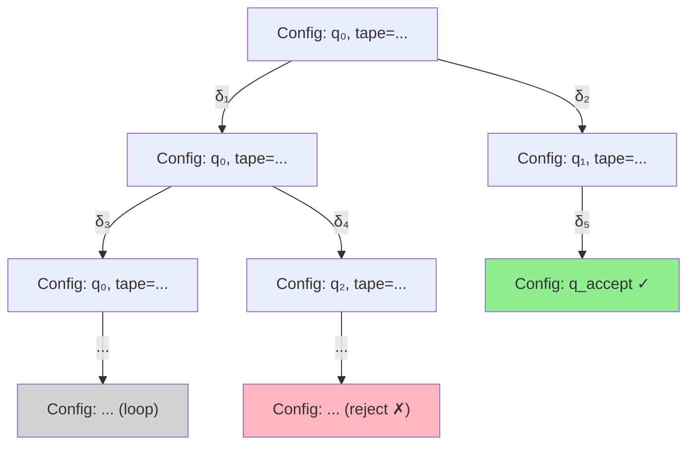
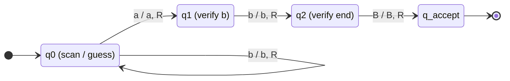
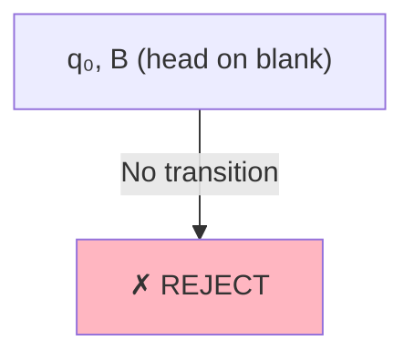
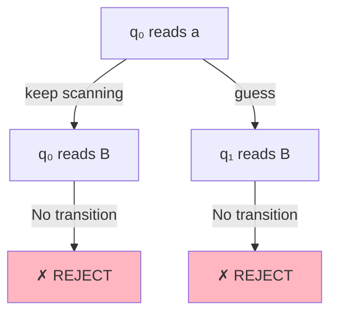
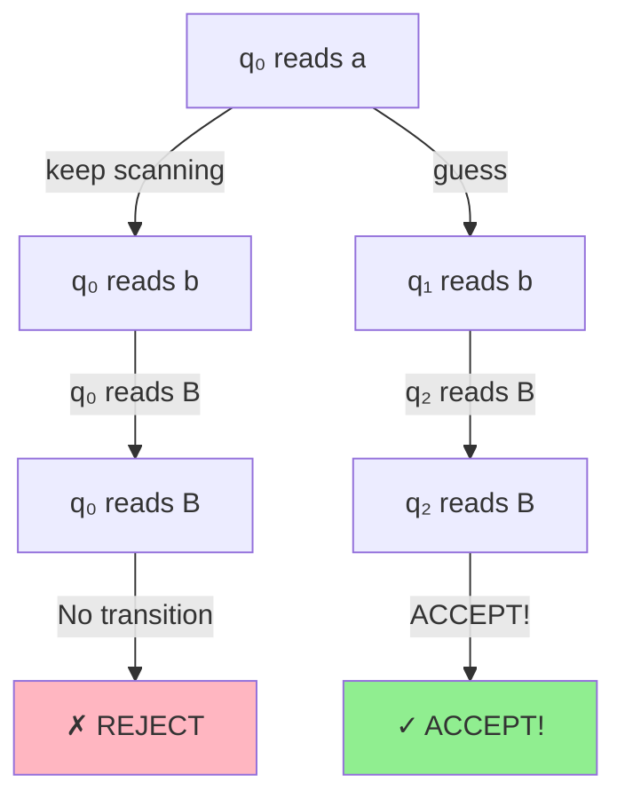
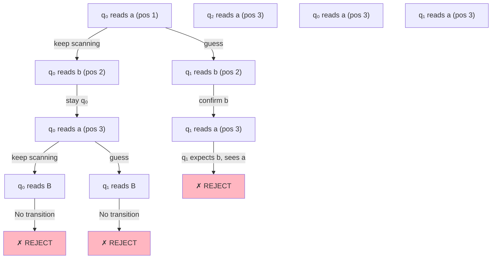
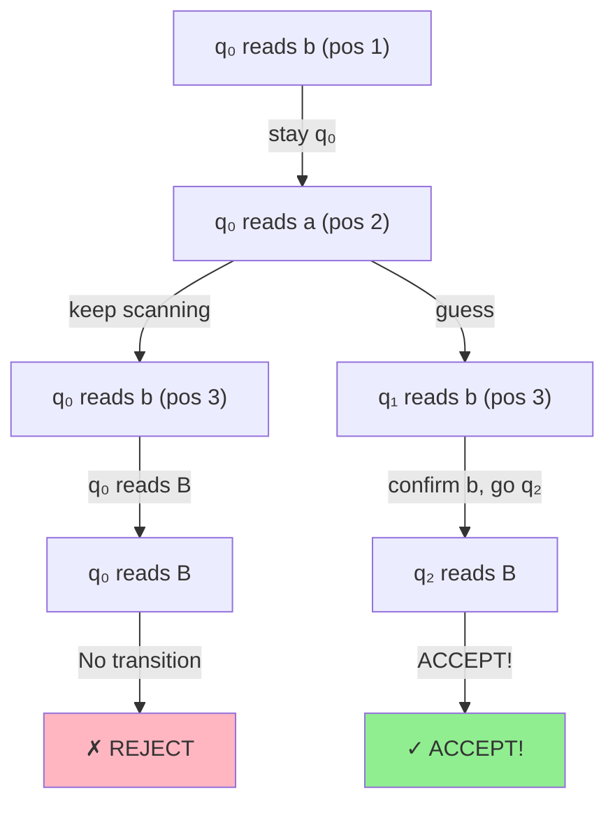
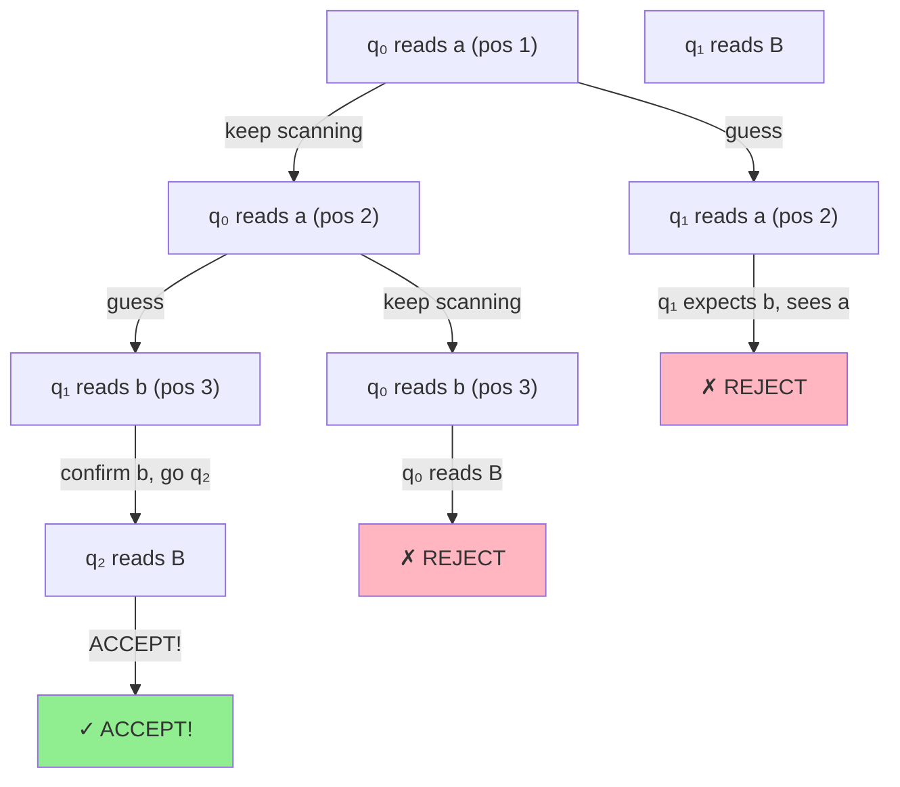
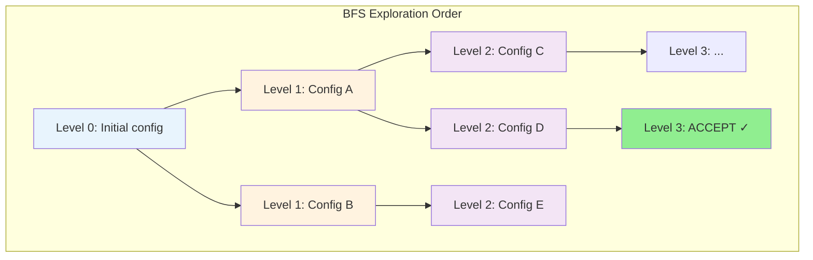

# 7. Non-Deterministic Turing Machines

> [!info] Chapter Overview
> This chapter introduces the **Non-Deterministic Turing Machine** (MTND), a variant of the Turing Machine model where the transition function can return **multiple possible moves** for a given state-symbol pair. Rather than following a single computation path, an MTND explores a branching **execution tree** of configurations. A word is accepted if **at least one** path through this tree reaches an accepting configuration. The central result of this chapter is the **Equivalence Theorem**: despite their seemingly greater power, MTNDs accept exactly the same class of languages as MTDs. However, non-determinism offers practical advantages in machine design — fewer states, simpler constructions, and more intuitive algorithms. Understanding non-determinism is essential for later chapters on complexity theory (P vs NP) and decidability.

> [!tip] Prerequisites
> Before studying this chapter, you should be comfortable with:
> - Deterministic Turing Machines (MTD) — see [[3. Turing Machines Basics and Formal Definitions]]
> - Turing Machines as language recognizers — see [[6. Turing Machines as Language Recognizers]]
> - Configuration notation and execution traces
> - The distinction between acceptance and decidability

---

## 7.1 Formal Definition of an MTND

> [!definition] Non-Deterministic Turing Machine (MTND)
> A **Non-Deterministic Turing Machine** is a 7-tuple $M = (Q, \Gamma, \Sigma, \delta, s, B, F)$ where:
> - **Q** is a finite set of **states**
> - **Γ** (Gamma) is the **tape alphabet** — the finite set of all symbols that can appear on the tape
> - **Σ** (Sigma) is the **input alphabet**, with $\Sigma \subset \Gamma$
> - **δ** (Delta) is the **non-deterministic transition function**: $\delta : Q \times \Gamma \to \mathcal{P}(Q \times \Gamma \times \{L, R\})$
> - **s** is the **start state**, with $s \in Q$
> - **B** is the **blank symbol**, with $B \in \Gamma \setminus \Sigma$
> - **F** is the **set of final (accepting) states**, with $F \subseteq Q$

### 7.1.1 The Critical Difference: The Transition Function δ

The sole difference between an MTD and an MTND lies in the transition function. Let us compare them side by side:

| Property | MTD (Deterministic) | MTND (Non-Deterministic) |
|:---|:---|:---|
| Signature | $\delta : Q \times \Gamma \to Q \times \Gamma \times \{L, R\}$ | $\delta : Q \times \Gamma \to \mathcal{P}(Q \times \Gamma \times \{L, R\})$ |
| Output type | A single triple $(q', a', D)$ | A **set** of triples $\{(q_1, a_1, D_1), (q_2, a_2, D_2), \ldots\}$ |
| Number of choices | Always exactly 1 | 0, 1, or many |
| Undefined transition | Machine halts | $\delta(q, a) = \emptyset$ — machine halts on this branch |

> [!important] Understanding the Power Set
> The notation $\mathcal{P}(Q \times \Gamma \times \{L, R\})$ refers to the **power set** (the set of all subsets) of $Q \times \Gamma \times \{L, R\}$. This means that $\delta(q, a)$ can return:
> - The **empty set** $\emptyset$: no transition is possible from this configuration — the branch halts (and rejects, since it did not reach an accepting state)
> - A **singleton set** $\{(q', a', D)\}$: exactly one transition — behaves like a deterministic machine here
> - A **set with two or more elements** $\{(q_1, a_1, D_1), (q_2, a_2, D_2)\}$: the machine has multiple choices — the computation **branches**

### 7.1.2 Acceptance Criterion for MTNDs

The acceptance condition for an MTND is fundamentally different from that of an MTD, and it is crucial to understand this difference thoroughly.

> [!definition] Acceptance by an MTND
> A word $w$ is **accepted** by an MTND $M$ if and only if **there exists** at least one computation path starting from the initial configuration on input $w$ that reaches a configuration whose state is in $F$ (the set of accepting states).
>
> A word $w$ is **rejected** by $M$ if and only if **every** computation path starting from the initial configuration on input $w$ either:
> - Halts in a non-accepting state (undefined transition with current state $\notin F$), or
> - Loops forever without ever entering an accepting state

In logical terms:

$$w \in L(M) \iff \exists \text{ a computation path } \pi \text{ such that } \pi \text{ reaches an accepting configuration}$$

$$w \notin L(M) \iff \forall \text{ computation paths } \pi, \text{ } \pi \text{ never reaches an accepting configuration}$$

> [!warning] The Existential Nature of Non-Deterministic Acceptance
> This is perhaps the most counter-intuitive aspect of MTNDs. A word is accepted if **even one** path out of potentially millions or billions of paths leads to acceptance. All other paths might reject, loop, or crash — it does not matter. As long as **one** path accepts, the word is in the language.
>
> Conversely, for a word to be rejected, **every single path** must fail. If even one path loops forever (and no path accepts), the word is still rejected — but we may never know this, because we cannot necessarily detect that all paths fail.

### 7.1.3 Non-Determinism Is NOT Randomness

> [!important] Common Misconception
> Non-determinism is often confused with probabilistic or randomized computation. This is **wrong**.
>
> - **Randomness**: The machine flips a coin and follows one branch **randomly**. Acceptance depends on probability.
> - **Non-determinism**: The machine **magically guesses** the correct branch. If any branch leads to acceptance, the machine "finds" it. It is as if the machine tries **all branches simultaneously** (or equivalently, always makes the lucky choice).
>
> An MTND does not randomly select a transition — it **explores all possible transitions**. Acceptance requires only that at least one path succeeds. Think of it as an **oracle** that always makes the right guess, rather than a gambler taking chances.

This distinction has profound implications. A non-deterministic machine is not a realistic model of physical computation — no real computer can magically explore infinitely many paths at once. Rather, it is a **mathematical abstraction** that helps us reason about the structure of problems and the power of guessing.

---

## 7.2 Execution Trees

When an MTND executes on an input, the computation does not follow a single linear sequence of configurations as with an MTD. Instead, each time the machine encounters a state-symbol pair with multiple possible transitions, the computation **branches**. The complete set of all possible computations forms an **execution tree**.

### 7.2.1 Structure of the Execution Tree

> [!definition] Execution Tree
> The **execution tree** of an MTND $M$ on input $w$ is a tree where:
> - The **root node** is the initial configuration (start state $s$, tape containing $w$, head on the first symbol)
> - Each **node** represents a configuration $(q, \text{tape contents}, \text{head position})$
> - Each **edge** corresponds to one transition $\delta(q, a) = (q', a', D)$
> - The **children** of a node $C$ are all configurations reachable from $C$ by applying one transition
> - A **leaf node** is a configuration from which no transition is possible (either $\delta(q, a) = \emptyset$ or $q \in F$)
> - The tree may be **infinite** if some branches contain loops

### 7.2.2 Acceptance and Rejection in the Tree

The acceptance criterion can now be rephrased in terms of the execution tree:

- **Accept**: The word $w$ is accepted if the tree contains **at least one leaf node** whose state is in $F$ (an accepting configuration). Even if this leaf is buried deep in the tree, surrounded by rejecting or looping branches, the word is still accepted.

- **Reject**: The word $w$ is rejected if **no leaf node** in the tree is an accepting configuration. This means every branch either terminates in a non-accepting state or loops forever.

> [!tip] Visualizing Acceptance
> Imagine the execution tree as a garden of forking paths. The MTND accepts if **any** path leads to a garden of acceptance (an accepting state). It rejects only if **every** path leads to a dead end or goes on forever without finding the garden.

### 7.2.3 Why Execution Trees Can Be Infinite

An execution tree may be infinite in two ways:

1. **Infinite depth**: A single branch loops forever (e.g., a state that transitions back to itself on a symbol that is always present). This branch has no leaf node.

2. **Infinite branching**: If the machine has transitions that keep creating new branches at every step, the tree grows wider and wider. However, since the state set $Q$ and tape alphabet $\Gamma$ are finite, the number of branches at any single node is bounded by $|Q| \times |\Gamma| \times 2$ (the maximum size of $\mathcal{P}(Q \times \Gamma \times \{L, R\})$ that can be returned). The tree's width is always finite at each level, but the depth can be infinite.

> [!warning] Infinite Trees and the Halting Problem
> If the execution tree is infinite (because some branches loop), we cannot simply enumerate all leaves to check for acceptance — there may be infinitely many nodes. This is why the **simulation** of an MTND by an MTD requires a **breadth-first search** (BFS) rather than a depth-first search (DFS), as we will see in Section 7.4.

---

## 7.3 Exercise: 4-State MTND for Words Ending in "ab"

**Source:** MT-JFLAP Exercise 6 / Exos-AFD Exercise 12

> [!definition] Language Definition
> $$L = \{w \in \{a, b\}^* : w \text{ ends with } ab\}$$
>
> This language contains all words over $\{a, b\}$ whose last two characters are "ab". Examples: $ab \in L$, $aab \in L$, $bab \in L$, $aaab \in L$. Counter-examples: $\varepsilon \notin L$, $a \notin L$, $ba \notin L$, $aba \notin L$, $bbb \notin L$.

### 7.3.1 Design Logic

The key idea for this MTND is the concept of **non-deterministic guessing**. The machine scans the input from left to right, and at every position where it sees an `a`, it has two choices:

1. **Keep scanning** — this `a` might not be the start of the final "ab". Stay in the scanning state $q_0$.
2. **Guess** that this `a` is the start of the final "ab" — transition to the verification state $q_1$.

If the guess is correct (the `a` is indeed the second-to-last character, followed by `b` and then the end of the word), the machine accepts. If the guess is wrong, the machine will detect the failure in the verification phase (it will see a symbol other than what it expects), and that branch of computation will reject.

### 7.3.2 State Descriptions

- **$q_0$** (Scanning state): The machine scans right across the input. On reading `a`, it has a non-deterministic choice: stay in $q_0$ (keep scanning) or transition to $q_1$ (guess that this `a` starts the final "ab"). On reading `b`, it has no choice — it must stay in $q_0$ (since "ab" starts with `a`, a `b` cannot be the beginning of the final "ab").

- **$q_1$** (First verification state): The machine has guessed that the previous `a` was the start of the final "ab". Now it must see a `b` to confirm. If it reads `b`, it transitions to $q_2$. If it reads anything else (`a` or `B`), there is no transition — the branch rejects.

- **$q_2$** (Second verification state): The machine has confirmed "ab". Now it must verify that this `b` is the **last** character. If it reads the blank `B`, it transitions to $q_{\text{accept}}$. If it reads `a` or `b`, there is no transition — the branch rejects (the "ab" was not at the end).

- **$q_{\text{accept}}$** (Accepting state): The machine has verified that the word ends in "ab". Accept!

### 7.3.3 Transition Table

| Current State | Read | Transitions | Comment |
|:---:|:---:|:---|:---|
| $q_0$ | $a$ | $\{(q_0, a, R),\; (q_1, a, R)\}$ | TWO choices: keep scanning or guess |
| $q_0$ | $b$ | $\{(q_0, b, R)\}$ | One choice: keep scanning |
| $q_0$ | $B$ | $\emptyset$ | No transition — branch rejects (empty or ended) |
| $q_1$ | $a$ | $\emptyset$ | Expected `b`, saw `a` — branch rejects |
| $q_1$ | $b$ | $\{(q_2, b, R)\}$ | Confirmed `b` after guessed `a` |
| $q_1$ | $B$ | $\emptyset$ | Expected `b`, saw blank — branch rejects |
| $q_2$ | $a$ | $\emptyset$ | Expected blank, saw `a` — branch rejects |
| $q_2$ | $b$ | $\emptyset$ | Expected blank, saw `b` — branch rejects |
| $q_2$ | $B$ | $\{(q_{\text{accept}}, B, R)\}$ | Confirmed end of word — ACCEPT! |

### 7.3.4 Formal Definition

$$M = (Q, \Gamma, \Sigma, \delta, s, B, F)$$

where:
- $Q = \{q_0, q_1, q_2, q_{\text{accept}}\}$
- $\Gamma = \{a, b, B\}$
- $\Sigma = \{a, b\}$
- $s = q_0$
- $B$ is the blank symbol
- $F = \{q_{\text{accept}}\}$

### 7.3.5 State Diagram

> [!tip] Reading the State Diagram
> Note the **two arrows** from $q_0$ on input `a`: one going back to $q_0$ (keep scanning) and one going to $q_1$ (guess). This is the visual signature of non-determinism — multiple transitions from the same state-symbol pair. In contrast, all transitions from $q_1$ and $q_2$ are deterministic (at most one transition per symbol).

### 7.3.6 Execution Tree for the Empty Word ε

Initial configuration: head on $B$, state $q_0$.

Since $\delta(q_0, B) = \emptyset$, there are no transitions. The tree has only the root node, which is a rejecting leaf.

**Result: $\varepsilon \notin L$** — Correct! The empty word does not end in "ab". ✓

### 7.3.7 Execution Tree for Input "a"

Initial configuration: head on `a`, state $q_0$.

**Branch 1** ($q_0$ keeps scanning): $q_0$ reads `a`, stays in $q_0$, moves right. Now reads $B$. No transition for $\delta(q_0, B)$. Branch rejects.

**Branch 2** ($q_0$ guesses): $q_0$ reads `a`, transitions to $q_1$, moves right. Now $q_1$ reads $B$. No transition for $\delta(q_1, B)$. Branch rejects.

**Result: "a" $\notin L$** — Correct! A single `a` does not end in "ab". ✓

### 7.3.8 Execution Tree for Input "ab"

Initial configuration: head on `a`, state $q_0$.

**Branch 1** ($q_0$ keeps scanning on first `a`): $q_0$ reads `a`, stays $q_0$, moves R. $q_0$ reads `b`, stays $q_0$, moves R. $q_0$ reads $B$, no transition. Branch rejects.

**Branch 2** ($q_0$ guesses on first `a`): $q_0$ reads `a`, goes to $q_1$, moves R. $q_1$ reads `b`, goes to $q_2$, moves R. $q_2$ reads $B$, goes to $q_{\text{accept}}$. **Branch accepts!** ✓

**Result: "ab" $\in L$** — Correct! At least one branch accepts. ✓

> [!important] Key Observation
> Branch 1 rejected, but the word is still accepted because Branch 2 succeeded. This perfectly illustrates the existential nature of MTND acceptance: **one successful branch is all it takes**.

### 7.3.9 Execution Tree for Input "aba"

Initial configuration: head on first `a`, state $q_0$. The word "aba" ends in `a`, NOT in "ab", so it should be rejected.

Let us trace all branches exhaustively:

**Branch A** ($q_0 \xrightarrow{a} q_0 \xrightarrow{b} q_0 \xrightarrow{a} q_0 \xrightarrow{B} \text{fail}$): The machine keeps scanning all the way to the end and hits $B$ in state $q_0$. No transition. Reject.

**Branch B** ($q_0 \xrightarrow{a} q_0 \xrightarrow{b} q_0 \xrightarrow{a} q_1 \xrightarrow{B} \text{fail}$): The machine guesses on the last `a`. Then $q_1$ reads $B$ (expected `b`). No transition. Reject.

**Branch C** ($q_0 \xrightarrow{a} q_1 \xrightarrow{b} q_2 \xrightarrow{a} \text{fail}$): The machine guesses on the first `a`. Then $q_1$ confirms `b`, goes to $q_2$. Then $q_2$ reads `a` (expected $B$). No transition. Reject.

All branches reject. **Result: "aba" $\notin L$** — Correct! "aba" ends in `a`, not "ab". ✓

### 7.3.10 Execution Tree for Input "bab"

Initial configuration: head on `b`, state $q_0$. The word "bab" ends in "ab", so it should be accepted.

**Branch A** ($q_0 \xrightarrow{b} q_0 \xrightarrow{a} q_0 \xrightarrow{b} q_0 \xrightarrow{B} \text{fail}$): Keeps scanning all the way, hits $B$ in $q_0$. No transition. Reject.

**Branch B** ($q_0 \xrightarrow{b} q_0 \xrightarrow{a} q_1 \xrightarrow{b} q_2 \xrightarrow{B} q_{\text{accept}}$): Guesses on the `a` at position 2. Confirms `b` at position 3. Sees $B$ (end of word). **Accept!** ✓

**Result: "bab" $\in L$** — Correct! ✓

### 7.3.11 Execution Tree for Input "aab"

Let us also trace a longer example where the non-deterministic guess happens at the correct position.

**Branch A** ($q_0 \xrightarrow{a} q_0 \xrightarrow{a} q_0 \xrightarrow{b} q_0 \xrightarrow{B} \text{fail}$): All scanning, reaches end. Reject.

**Branch B** ($q_0 \xrightarrow{a} q_0 \xrightarrow{a} q_1 \xrightarrow{b} q_2 \xrightarrow{B} q_{\text{accept}}$): Guesses on the second `a`. This is the correct guess! Accept. ✓

**Branch C** ($q_0 \xrightarrow{a} q_1 \xrightarrow{a} \text{fail}$): Guesses on the first `a`. Then $q_1$ reads `a` (expected `b`). Reject. ✗

**Result: "aab" $\in L$** — Correct! ✓

### 7.3.12 Summary of Results

| Input | In $L$? | Accepting Branch Exists? | All Branches Reject? | Result |
|:---:|:---:|:---:|:---:|:---:|
| $\varepsilon$ | No | No | Yes | REJECT ✓ |
| `a` | No | No | Yes | REJECT ✓ |
| `ab` | Yes | Yes | No | ACCEPT ✓ |
| `aba` | No | No | Yes | REJECT ✓ |
| `bab` | Yes | Yes | No | ACCEPT ✓ |
| `aab` | Yes | Yes | No | ACCEPT ✓ |

> [!tip] The Power of Guessing
> This 4-state MTND elegantly solves the problem by leveraging non-determinism to "guess" the correct position. A deterministic TM for the same language would need to systematically check each `a` position one by one (scan to the end, back up, check, repeat), requiring more states and a more complex algorithm. The MTND achieves the same result with a simpler, more intuitive design.

---

## 7.4 MTND vs MTD: The Equivalence Theorem

The most important theoretical result about non-deterministic Turing machines is that they are **no more powerful** than deterministic ones in terms of the languages they can accept.

> [!important] Equivalence Theorem
> **Theorem:** For every Non-Deterministic Turing Machine (MTND), there exists a Deterministic Turing Machine (MTD) that accepts the same language.
>
> $$L(\text{MTND}) = L(\text{MTD})$$
>
> The class of languages accepted by MTNDs is exactly the same as the class of languages accepted by MTDs — namely, the **recursively enumerable** (Turing-recognizable) languages.

### 7.4.1 Proof Idea: Breadth-First Simulation

The proof is constructive: we show how to build an MTD that simulates a given MTND. The key technique is **breadth-first search (BFS)** over the execution tree.

**The 3-Tape Construction:**

The simulating MTD uses three tapes:

| Tape | Purpose |
|:---:|:---|
| Tape 1 | Stores the original input $w$ (never modified — serves as a reference) |
| Tape 2 | Simulates one computation path of the MTND at a time |
| Tape 3 | Encodes a "path counter" that tracks which paths to explore and in what order |

**The Algorithm:**

1. Copy the input from Tape 1 to Tape 2.
2. Use Tape 3 to enumerate all possible computation paths of the MTND in **breadth-first order**.
3. For each path number $n$:
   a. Reset Tape 2 to the initial configuration.
   b. Simulate the MTND along the path specified by $n$ on Tape 2.
   c. If the simulation reaches an accepting configuration, **ACCEPT**.
   d. If the simulation halts without accepting, move on to path $n+1$.
4. Continue until an accepting path is found (or run forever if none exists).

### 7.4.2 Why Breadth-First Search and Not Depth-First Search

> [!warning] DFS Can Miss Accepting Paths
> A depth-first search explores one branch fully before moving to the next. If the first branch of the execution tree is **infinite** (loops forever), DFS will never return from it and will never explore other branches — even if those other branches contain an accepting configuration.
>
> **Example:** Suppose the execution tree has two branches:
> - Branch 1: loops forever (never accepts)
> - Branch 2: accepts after 10 steps
>
> DFS would get stuck on Branch 1 and never find the accepting Branch 2. The MTD would loop forever, failing to accept a word that the MTND would accept.

Breadth-first search avoids this problem by exploring all branches **level by level**:

- Level 1: all configurations reachable in 1 step
- Level 2: all configurations reachable in 2 steps
- Level 3: all configurations reachable in 3 steps
- ...

Since each level is finite (the number of possible configurations at any given depth is finite), the BFS will eventually explore every finite accepting path. If the MTND has an accepting path of length $k$, the BFS will find it at level $k$.

> [!tip] BFS Guarantees Finding Finite Accepting Paths
> The crucial property of BFS is: if there exists a finite accepting path of length $k$ in the execution tree, then BFS will discover it after exploring at most $k$ levels. Since each level is finite, this discovery takes a finite amount of time. Therefore, if the MTND accepts $w$, the simulating MTD will also accept $w$ (after potentially enormous but finite computation).

### 7.4.3 The Cost of Simulation: Exponential Overhead

While the MTD can always simulate the MTND, the cost can be **exponentially** larger. If the MTND has at most $b$ choices at each step and the accepting path has length $k$, then the BFS must explore up to $b^k$ paths. This exponential blowup is unavoidable in the worst case — it is not a flaw of the construction, but a fundamental property of the relationship between deterministic and non-deterministic computation.

> [!important] The P vs NP Connection
> The exponential gap between MTNDs and MTDs in terms of simulation time is the foundation of the famous **P vs NP** problem in complexity theory:
> - **P**: Problems solvable by a deterministic TM in polynomial time
> - **NP**: Problems solvable by a non-deterministic TM in polynomial time
>
> The question "P = NP?" asks whether the exponential simulation overhead can be avoided. This is one of the seven Millennium Prize Problems and remains open as of 2025.

### 7.4.4 Completing the Proof

**Proof of the Equivalence Theorem:**

Let $M = (Q, \Gamma, \Sigma, \delta, s, B, F)$ be an MTND. We construct an MTD $M'$ that accepts the same language.

$M'$ uses three tapes as described above. It performs a BFS of $M$'s execution tree:

**Claim 1:** If $w \in L(M)$, then $w \in L(M')$.

*Proof:* If $w \in L(M)$, there exists a finite computation path $\pi$ of $M$ on input $w$ that reaches an accepting configuration. Let $k$ be the length of $\pi$ (number of transitions). The BFS of $M'$ explores all configurations at depth 1, then depth 2, ..., then depth $k$. At depth $k$, it will simulate the path $\pi$ and discover the accepting configuration. Therefore $M'$ accepts $w$. $\square$

**Claim 2:** If $w \notin L(M)$, then $w \notin L(M')$.

*Proof:* If $w \notin L(M)$, then no computation path of $M$ on input $w$ reaches an accepting configuration. The BFS of $M'$ will never find an accepting configuration in the execution tree, so it will run forever without accepting. Therefore $w \notin L(M')$. $\square$

From Claims 1 and 2, $L(M') = L(M)$. $\square$

---

## 7.5 Practical Differences Between MTNDs and MTDs

Although MTNDs and MTDs accept the same class of languages (the recursively enumerable languages), they differ significantly in practical aspects of machine design and analysis.

### 7.5.1 Comparison Table

| Aspect | MTD (Deterministic) | MTND (Non-Deterministic) |
|:---|:---|:---|
| **Number of states** | Typically more — must encode all control flow deterministically | Typically fewer — non-deterministic guessing replaces complex control logic |
| **Ease of design** | More complex — must explicitly handle every case | Simpler — can "guess" the right path, avoiding complex bookkeeping |
| **Ease of analysis** | Straightforward — single execution path to trace | Harder — must consider all possible execution paths |
| **Execution model** | Single linear computation | Branching execution tree |
| **Simulation time** | Direct execution | Exponential overhead when simulated by an MTD (BFS of execution tree) |
| **Languages accepted** | Recursively enumerable | Recursively enumerable (same class) |
| **Intuitive model** | Like a regular program | Like a program with "oracle guesses" |

### 7.5.2 When to Use Non-Determinism

> [!tip] Design Strategy
> Non-determinism is most useful when the algorithm has a natural "guess and verify" structure:
>
> 1. **Pattern matching at unknown positions**: Instead of scanning the entire input to find a specific pattern, the MTND can guess where the pattern starts and verify locally. (Example: the words-ending-in-"ab" machine above.)
>
> 2. **Choosing among alternatives**: When a problem requires selecting one option from many, the MTND can non-deterministically choose the correct option. (Example: graph reachability — guess a path.)
>
> 3. **Existential quantification**: When the language definition involves "there exists" (e.g., "there exists a factorization," "there exists a path"), non-determinism directly captures this existential quantifier.

### 7.5.3 A Concrete Example: Simplicity Advantage

Consider the language $L = \{w \in \{a, b\}^* : w \text{ contains } ab \text{ as a substring}\}$. 

**MTND approach** (3 states):
- $q_0$: Scan right. On `a`, guess that this starts "ab" (go to $q_1$) or keep scanning.
- $q_1$: Must see `b`. If yes, accept.
- $q_{\text{accept}}$: Done.

**MTD approach** (also 3 states in this case, since this language is regular):
- $q_0$: Haven't seen relevant `a`. On `a` go to $q_1$; on `b` stay in $q_0$.
- $q_1$: Saw `a`, looking for `b`. On `b` go to $q_{\text{accept}}$; on `a` stay in $q_1$.
- $q_{\text{accept}}$: Found "ab".

For this particular language (which is regular), the MTD and MTND are equally simple. But for more complex languages, the gap widens considerably.

### 7.5.4 A Concrete Example Where MTND Is Much Simpler

Consider the language $L = \{w \in \{a, b\}^* : w \text{ has some character that appears exactly once}\}$.

**MTND approach** (intuitive):
- Guess which position $i$ has the unique character.
- Verify that no other position has the same character.

**MTD approach** (much more complex):
- Must systematically check each position, requiring loops and bookkeeping.
- For each position, scan the entire word to count occurrences.
- Multiple nested loops with states for tracking position and count.

The MTND captures the existential quantifier ("there exists a position") naturally, while the MTD must enumerate all positions explicitly.

---

## 7.6 Tips and Common Pitfalls

### 7.6.1 Non-Determinism Does NOT Add Computational Power

> [!important] The Fundamental Fact
> Non-deterministic Turing machines and deterministic Turing machines accept **exactly the same class of languages**: the recursively enumerable languages. Adding non-determinism does not allow you to accept any language that a deterministic TM cannot.
>
> This may seem surprising given that non-determinism feels "more powerful." The resolution is that non-determinism provides **conciseness** (fewer states, simpler algorithms) and potentially **speed** (shorter accepting paths), but not **expressiveness** (no new languages).

### 7.6.2 Non-Determinism CAN Reduce the Number of States

While MTNDs do not accept more languages, they often accept the same language with **fewer states**. The non-deterministic "guessing" mechanism can replace complex control structures that would require additional states in a deterministic machine.

For example, our 4-state MTND for words ending in "ab" uses 4 states ($q_0, q_1, q_2, q_{\text{accept}}$). A deterministic TM for the same language requires at least 3 states for the DFA-equivalent behavior (since the language is regular, the minimal DFA has 3 states), plus potentially more states for the TM's tape management. The non-deterministic version is at least as compact.

### 7.6.3 When Drawing Execution Trees, Be Exhaustive

> [!warning] Common Mistake — Incomplete Execution Trees
> When asked to draw the execution tree of an MTND on a given input, you must trace **every possible branch**. It is not sufficient to trace only the branches that accept or only the branches that seem "interesting." A complete execution tree shows:
> - Every branching point and all choices
> - Every leaf node (accepting or rejecting)
> - Every infinite branch (indicated with "loops" or "...")
>
> Missing branches can lead to incorrect conclusions about whether a word is accepted or rejected.

### 7.6.4 The Acceptance Condition Is Existential

> [!tip] Mental Check
> After drawing the execution tree for a word $w$, check:
> - If **any** leaf is an accepting configuration → $w \in L$
> - If **all** leaves are rejecting configurations and there are no infinite branches → $w \notin L$
> - If there are no accepting leaves but some branches are infinite → $w \notin L$ (the infinite branches never accept, and the finite ones all reject)
>
> The tricky case is the last one: some branches loop forever but none accept. The word is still rejected, but the simulating MTD will run forever (it cannot determine that no accepting branch exists).

### 7.6.5 Non-Determinism Is Not Randomness (Reiterated)

> [!warning] Do Not Confuse Non-Determinism with Probability
> This bears repeating because it is the most common conceptual error:
>
> | Property | Non-Deterministic TM | Probabilistic TM |
> |:---|:---|:---|
> | Choice mechanism | All choices explored | Random choice made |
> | Acceptance | If ANY path accepts | If probability of acceptance $> \frac{1}{2}$ |
> | Model | Mathematical abstraction | Realistic (can be simulated with a random number generator) |
> | "Guessing" | Always guesses correctly | May guess wrong |
>
> An MTND does not "roll dice" — it explores every possible computation path simultaneously. If any path leads to acceptance, the word is accepted. This is a fundamentally different semantics from probabilistic computation.

### 7.6.6 Handling the Empty Transition Set

When $\delta(q, a) = \emptyset$, the machine has no transition available. In the execution tree, this creates a **leaf node** that is a rejecting configuration (assuming $q \notin F$). This is the non-deterministic analog of a deterministic machine "crashing" — the branch simply terminates without accepting.

> [!tip] Design with Explicit Dead Ends
> When designing an MTND, it is perfectly fine (and often intentional) to have $\delta(q, a) = \emptyset$ for certain state-symbol pairs. This means that if the machine reaches this configuration along a particular branch, that branch rejects. Other branches may still succeed. This is how the "guess and verify" paradigm works: wrong guesses lead to dead ends (empty transition sets), while the correct guess leads to acceptance.

### 7.6.7 The Relationship to NFAs

Students who have studied Non-Deterministic Finite Automata (AFN/NFA) will recognize many parallels:

| Concept | NFA | MTND |
|:---|:---|:---|
| Multiple transitions | $\delta(q, a) = \{q_1, q_2, \ldots\}$ | $\delta(q, a) = \{(q_1, a_1, D_1), (q_2, a_2, D_2), \ldots\}$ |
| Acceptance | If any path accepts | If any path accepts |
| Equivalence with deterministic model | NFA = DFA (same regular languages) | MTND = MTD (same r.e. languages) |
| Simulation by deterministic model | Subset construction | BFS of execution tree |
| Exponential blowup | Up to $2^n$ states | Up to exponential time |

The subset construction for converting an NFA to a DFA is analogous to the BFS simulation of an MTND by an MTD. Both work by systematically exploring all possible configurations of the non-deterministic machine.

---

## 7.7 Summary and Key Takeaways

```mermaid
mindmap
  root((Non-Deterministic TMs))
    Definition
      Same 7-tuple as MTD
      delta returns SETS of moves
      Zero, one, or many transitions per pair
    Acceptance
      Existential: at least one path accepts
      Rejection: ALL paths fail or loop
      NOT probabilistic
    Execution Trees
      Root = initial config
      Branches = transition choices
      May be infinite
      Accept if ANY leaf accepts
    Equivalence with MTD
      Same language class: r.e.
      Proof: BFS simulation
      3-tape construction
      Exponential overhead
    Practical Differences
      Fewer states with MTND
      Simpler design with MTND
      Harder analysis with MTND
      Same expressive power
```

> [!important] The Five Key Facts to Remember
> 1. An MTND differs from an MTD only in its transition function: $\delta : Q \times \Gamma \to \mathcal{P}(Q \times \Gamma \times \{L, R\})$ instead of $\delta : Q \times \Gamma \to Q \times \Gamma \times \{L, R\}$.
> 2. A word is accepted by an MTND if **there exists** at least one computation path leading to an accepting configuration.
> 3. A word is rejected by an MTND if **every** computation path fails to accept (either halting in a non-accepting state or looping forever).
> 4. For every MTND, there exists an equivalent MTD that accepts the same language (Equivalence Theorem). The proof uses breadth-first search over the execution tree.
> 5. Non-determinism provides **conciseness** (fewer states, simpler designs) but not **expressiveness** (no additional languages beyond what MTDs can accept).

> [!tip] Looking Ahead
> The concept of non-determinism becomes even more important in complexity theory, where the classes P and NP are defined in terms of deterministic and non-deterministic polynomial-time computation, respectively. The question of whether P = NP is equivalent to asking whether the exponential simulation overhead of MTNDs by MTDs can be avoided for problems with polynomial-length accepting paths. This is arguably the most famous open problem in all of computer science.
