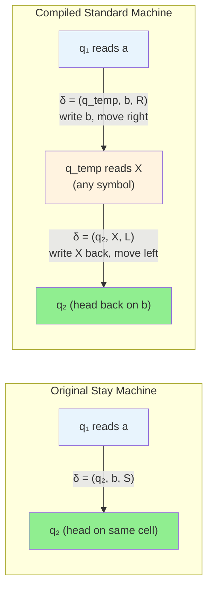
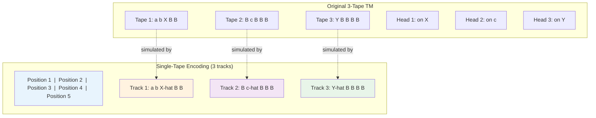
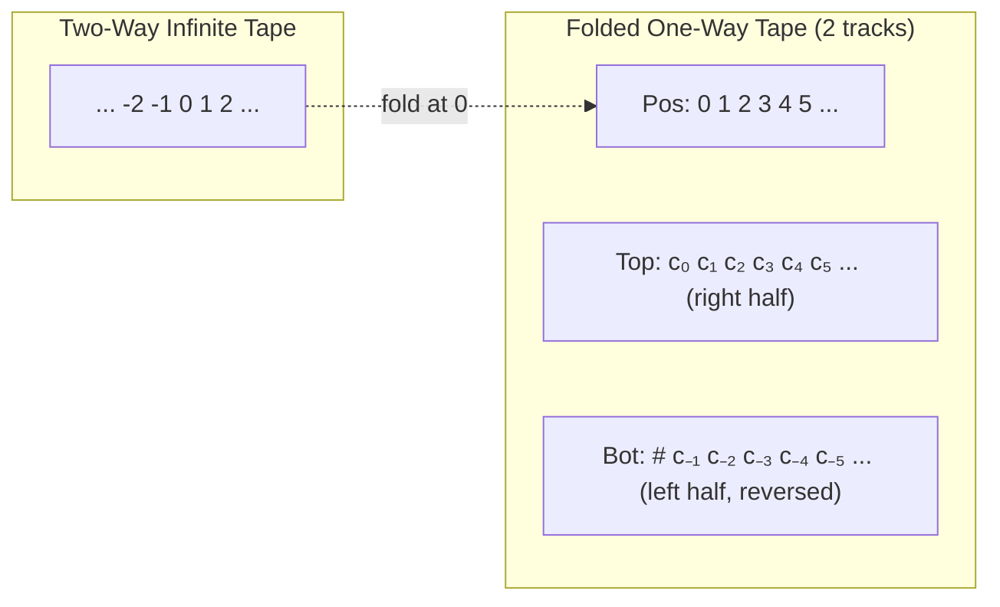
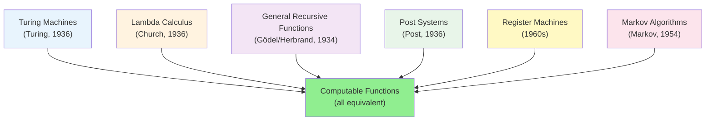
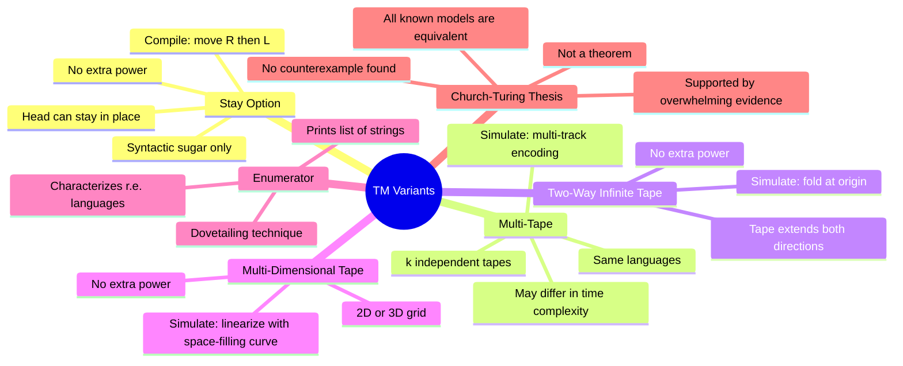

# 8. Advanced Turing Machine Variants

> [!info] Chapter Overview
> This chapter explores several **enriched Turing Machine models** — machines that extend the standard deterministic TM with additional capabilities such as a "stay" head movement, multiple tapes, two-way infinite tapes, multi-dimensional tapes, and output capabilities. For each variant, we examine its definition, how it differs from the standard model, and — crucially — **why it does not exceed the computational power of the standard Turing Machine**. The chapter culminates in a discussion of the **Church-Turing Thesis**, the philosophical claim that any effectively computable function can be computed by a Turing Machine, supported by the overwhelming evidence that all reasonable computational models are equivalent. Understanding these variants deepens your appreciation for the **robustness** of the Turing Machine model: no matter how many conveniences we add, the class of recognizable languages remains the same.

> [!tip] Prerequisites
> Before studying this chapter, you should be comfortable with:
> - Deterministic Turing Machines (MTD) — see [[3. Turing Machines Basics and Formal Definitions]]
> - Configuration notation and derivation relations — see [[4. Tracing Configurations and Execution]]
> - Non-Deterministic Turing Machines and their equivalence with MTDs — see [[7. Non-Deterministic Turing Machines]]
> - The distinction between language recognition and decidability

---

## 8.1 Turing Machines with the Stay Option (MT-JFLAP Ex 8 / Exos-AFD Ex 15)

### 8.1.1 Definition

In the standard Turing Machine model, the head must move either Left (L) or Right (R) after each transition. This can be inconvenient when we want to modify a cell and then immediately perform another operation on the same cell. The **Stay option** extends the movement set with a third direction: **S** (Stay), meaning the head remains on the current cell after writing.

> [!definition] Turing Machine with Stay Option
> A **Turing Machine with Stay option** is a 7-tuple $M = (Q, \Gamma, \Sigma, \delta, s, B, F)$ where the transition function has the signature:
>
> $$\delta : Q \times \Gamma \to Q \times \Gamma \times \{L, R, S\}$$
>
> The only change from the standard TM is the codomain: the movement direction can now be **L** (Left), **R** (Right), or **S** (Stay). When the direction is S, the read/write head does not move after writing — it stays on the cell that was just modified.

> [!important] Why the Stay Option Is Convenient
> The Stay option eliminates a common annoyance in TM programming: when you want to write a symbol and then immediately act on the same cell, you normally have to move right and then left again, introducing temporary states. With Stay, you can do it in one transition. This is purely a **programming convenience** — it does not add computational power, as we will prove by showing how to compile any Stay-option machine into a standard TM.

### 8.1.2 Configuration Derivation Relation

We now define precisely how configurations evolve under the Stay-option transition function. Recall that a configuration is written as $u \, q \, a \, v$, where $u$ is the tape content to the left of the head, $q$ is the current state, $a$ is the symbol under the head, and $v$ is the tape content to the right of the head.

**Case 1: Move Right (R)**

If $\delta(q, a) = (q', b, R)$:

$$u \, q \, a \, v \vdash u \, b \, q' \, v$$

The symbol $a$ under the head is replaced by $b$, the state changes to $q'$, and the head moves one cell to the right. If $v$ is non-empty, the head is now on the first symbol of $v$; if $v$ is empty, the head is on a blank cell.

> [!tip] Example of Move Right
> Configuration: $\texttt{01} \, q_3 \, \texttt{1} \, \texttt{0B}$
> Transition: $\delta(q_3, \texttt{1}) = (q_5, \texttt{X}, R)$
> Result: $\texttt{01X} \, q_5 \, \texttt{0B}$
> The $\texttt{1}$ was overwritten with $\texttt{X}$, and the head moved right to be on the $\texttt{0}$.

**Case 2: Move Left (L)**

If $\delta(q, a) = (q', b, L)$:

There are two sub-cases depending on whether the tape has content to the left of the head:

- **Sub-case 2a:** If $u = u'c$ (i.e., $u$ is non-empty and $c$ is its last symbol):

$$u'c \, q \, a \, v \vdash u' \, q' \, c \, b \, v$$

The symbol $a$ is replaced by $b$, and the head moves left onto the last symbol $c$ of $u$. The state changes to $q'$.

- **Sub-case 2b:** If $u = \varepsilon$ (the head is at the leftmost non-blank cell or beyond):

$$q \, a \, v \vdash q' \, B \, b \, v$$

When there is nothing to the left, a blank symbol $B$ is inserted. The head moves left onto this newly created blank cell. This ensures the tape can always extend to the left.

> [!tip] Example of Move Left
> Configuration: $\texttt{01} \, q_3 \, \texttt{1} \, \texttt{0B}$
> Transition: $\delta(q_3, \texttt{1}) = (q_5, \texttt{X}, L)$
> Result: $\texttt{0} \, q_5 \, \texttt{1X0B}$
> The $\texttt{1}$ was overwritten with $\texttt{X}$, and the head moved left to be on the $\texttt{1}$ (last symbol of $u = \texttt{01}$).

**Case 3: Stay (S)** — This is the new case!

If $\delta(q, a) = (q', b, S)$:

$$u \, q \, a \, v \vdash u \, q' \, b \, v$$

The symbol $a$ is replaced by $b$, the state changes to $q'$, but **the head does not move**. The head remains on the cell that was just written. Notice that in the configuration notation, the state $q'$ appears immediately before $b$, indicating the head is positioned on the cell containing $b$.

> [!tip] Example of Stay
> Configuration: $\texttt{01} \, q_3 \, \texttt{1} \, \texttt{0B}$
> Transition: $\delta(q_3, \texttt{1}) = (q_5, \texttt{X}, S)$
> Result: $\texttt{01} \, q_5 \, \texttt{X} \, \texttt{0B}$
> The $\texttt{1}$ was overwritten with $\texttt{X}$, and the head stayed on that same cell. Compare with Move Right: in that case, the result was $\texttt{01X} \, q_5 \, \texttt{0B}$, where the head moved past the $\texttt{X}$.

### 8.1.3 Compiling Stay into Standard TM

> [!important] The Key Insight
> The Stay option does not add any computational power. Any TM with the Stay option can be converted into an equivalent standard TM (where the head must move L or R on every transition). The conversion is a **local compilation** — each Stay transition is replaced by a small sequence of standard transitions that achieve the same net effect.

The idea is simple: to simulate "stay in place," the machine can **move one step right and then immediately one step left**. The net displacement is zero, so the head ends up on the same cell where it started.

**Compilation Procedure:**

For each Stay transition $\delta(q_1, a) = (q_2, b, S)$, do the following:

1. Create a new **temporary state** $q_{\text{temp}}$ that is unique to this particular Stay transition.
2. Replace the Stay transition with two standard transitions:
   - $\delta_{\text{std}}(q_1, a) = (q_{\text{temp}}, b, R)$ — write $b$, move right to the temporary state
   - For **ALL** symbols $X \in \Gamma$: $\delta_{\text{std}}(q_{\text{temp}}, X) = (q_2, X, L)$ — write the same symbol back unchanged, move left

The temporary state $q_{\text{temp}}$ reads whatever symbol is on the cell to the right, writes it back unchanged, and then moves left. The net effect: the original cell was overwritten with $b$, the head moved right then left, ending up back on the cell containing $b$.

> [!warning] Do Not Forget ALL Symbols in Γ
> The second transition from $q_{\text{temp}}$ must be defined for **every** symbol $X$ in the tape alphabet $\Gamma$. The temporary state has no idea what symbol is on the cell to the right — it could be any symbol from $\Gamma$. Each possibility must have a transition that writes the symbol back and moves left. If you forget even one symbol, the compiled machine might halt prematurely (undefined transition) on inputs where the original Stay machine would have continued.

### 8.1.4 Worked Example

Consider a Stay-option machine with tape alphabet $\Gamma = \{a, b, B\}$ and the following transitions:

- $\delta(q_0, a) = (q_1, X, S)$ — mark $a$ as $X$, stay on the same cell
- $\delta(q_1, b) = (q_2, Y, R)$ — mark $b$ as $Y$, move right

**Step 1: Compile the Stay transition**

The transition $\delta(q_0, a) = (q_1, X, S)$ is a Stay transition. We create a temporary state $q_{\text{temp1}}$ and replace it with:

- $\delta_{\text{std}}(q_0, a) = (q_{\text{temp1}}, X, R)$ — write $X$, move right to temp state
- $\delta_{\text{std}}(q_{\text{temp1}}, X) = (q_1, X, L)$ — write $X$ back, move left
- $\delta_{\text{std}}(q_{\text{temp1}}, a) = (q_1, a, L)$ — write $a$ back, move left
- $\delta_{\text{std}}(q_{\text{temp1}}, b) = (q_1, b, L)$ — write $b$ back, move left
- $\delta_{\text{std}}(q_{\text{temp1}}, B) = (q_1, B, L)$ — write $B$ back, move left

Note that we need a transition for every symbol in $\Gamma = \{a, b, X, B\}$ — wait, we also need $X$ and $Y$ in the tape alphabet since they are written by the machine. Let us be precise: the full tape alphabet is $\Gamma = \{a, b, X, Y, B\}$, so we actually need five transitions from $q_{\text{temp1}}$, one for each symbol. However, at the point when $q_{\text{temp1}}$ is entered (right after writing $X$ on the cell where $a$ was), the head is on the cell to the right. That cell could contain any symbol from $\Gamma$. So we need:

- $\delta_{\text{std}}(q_{\text{temp1}}, a) = (q_1, a, L)$
- $\delta_{\text{std}}(q_{\text{temp1}}, b) = (q_1, b, L)$
- $\delta_{\text{std}}(q_{\text{temp1}}, X) = (q_1, X, L)$
- $\delta_{\text{std}}(q_{\text{temp1}}, Y) = (q_1, Y, L)$
- $\delta_{\text{std}}(q_{\text{temp1}}, B) = (q_1, B, L)$

**Step 2: The second transition is already standard**

The transition $\delta(q_1, b) = (q_2, Y, R)$ is already a standard Right transition, so it remains unchanged:

- $\delta_{\text{std}}(q_1, b) = (q_2, Y, R)$

**Step 3: Full trace comparison on input "ab"**

Let us trace both machines on the input $\texttt{ab}$, which appears on the tape as $a \, b \, B \, B \, \ldots$

**Original Stay Machine:**

| Step | Configuration | Transition Applied |
|:---:|:---|:---|
| 0 | $q_0 \, a \, b$ | Initial configuration |
| 1 | $q_1 \, X \, b$ | $\delta(q_0, a) = (q_1, X, S)$: write $X$, stay |
| 2 | $X \, q_2 \, Y$ | $\delta(q_1, b) = (q_2, Y, R)$: write $Y$, move right |

The head is now on the cell to the right of $Y$ (which contains $B$), in state $q_2$.

**Compiled Standard Machine:**

| Step | Configuration | Transition Applied |
|:---:|:---|:---|
| 0 | $q_0 \, a \, b$ | Initial configuration |
| 1 | $X \, q_{\text{temp1}} \, b$ | $\delta_{\text{std}}(q_0, a) = (q_{\text{temp1}}, X, R)$: write $X$, move right |
| 2 | $q_1 \, X \, b$ | $\delta_{\text{std}}(q_{\text{temp1}}, b) = (q_1, b, L)$: write $b$ back, move left |
| 3 | $X \, q_2 \, Y$ | $\delta_{\text{std}}(q_1, b) = (q_2, Y, R)$: write $Y$, move right |

After Step 2, the compiled machine has returned to the configuration $q_1 \, X \, b$, which is exactly the same as the original machine's Step 1. Then Step 3 applies the same transition as the original machine's Step 2. The final configuration $X \, q_2 \, Y$ is identical in both machines.

> [!tip] Verifying Correctness
> Notice that Step 2 of the compiled machine (the "return" step) is purely mechanical: it reads the symbol to the right ($b$), writes it back unchanged, and moves left. This "round trip" (right then left) is what simulates the Stay. The key point is that the compiled machine takes **two steps** where the original took one, but the resulting tape content and head position are identical. This is a constant-factor overhead, which does not affect the language recognized.

> [!warning] Compilation Overhead
> Each Stay transition in the original machine becomes two transitions in the compiled machine (plus $|\Gamma|$ transition rules for the temporary state). If the original machine has $k$ Stay transitions, the compiled machine has $k$ additional temporary states and $k \times (1 + |\Gamma|)$ additional transition rules. This is a modest overhead — the compiled machine is only a constant factor larger than the original.

---

## 8.2 Multi-Tape Turing Machines

### 8.2.1 Definition

A **multi-tape Turing Machine** extends the standard model by providing multiple independent tapes, each with its own read/write head. On each transition, the machine reads one symbol from each tape, writes one symbol to each tape, and moves each head independently.

> [!definition] k-Tape Turing Machine
> A **k-tape Turing Machine** is a 7-tuple $M = (Q, \Gamma, \Sigma, \delta, s, B, F)$ where the transition function has the signature:
>
> $$\delta : Q \times \Gamma^k \to Q \times \Gamma^k \times \{L, R, S\}^k$$
>
> On each transition, the machine:
> 1. Reads a $k$-tuple of symbols $(a_1, a_2, \ldots, a_k)$ — one from each tape
> 2. Writes a $k$-tuple of symbols $(b_1, b_2, \ldots, b_k)$ — one to each tape
> 3. Moves each of the $k$ heads independently according to the $k$-tuple of directions $(D_1, D_2, \ldots, D_k)$
>
> The input is placed on Tape 1, and all other tapes start blank.

This is a powerful convenience. For example, a 2-tape TM can copy the input from Tape 1 to Tape 2 in a single pass, then use Tape 2 as a working copy while Tape 1 serves as a reference. A 3-tape TM can use one tape for input, one for working memory, and one for output. The possibilities are far more flexible than the single-tape model.

> [!tip] Practical Analogy
> Think of a single-tape TM as working at a desk with a single sheet of paper — you have to keep erasing and rewriting to manage multiple pieces of information. A multi-tape TM is like having multiple sheets of paper on the desk, each with its own cursor. You can read from one sheet, compute, and write to another — all in one step. This is much more convenient but, as we shall see, not fundamentally more powerful.

### 8.2.2 Equivalence with Single-Tape TM

> [!important] Theorem: Multi-Tape TMs Are Equivalent to Single-Tape TMs
> For any $k$-tape Turing Machine $M$, there exists a single-tape Turing Machine $M'$ such that $L(M) = L(M')$.
>
> The class of languages recognized by multi-tape TMs is exactly the same as the class recognized by single-tape TMs: the **recursively enumerable** languages.

**Proof by Construction — The Multi-Track Simulation:**

The idea is to simulate $k$ tapes on a single tape by using **$k$ tracks** — separate regions or "layers" of the single tape, where each track stores the contents of one of the $k$ virtual tapes. Additionally, we need a way to remember where each virtual head is positioned.

**Encoding Method:**

1. **Track structure:** The single tape is divided into $k$ tracks. At each cell position $i$, the cell stores a $k$-tuple $(c_1, c_2, \ldots, c_k)$, where $c_j$ is the symbol at position $i$ on virtual tape $j$. We can encode this $k$-tuple as a single composite symbol from an enlarged alphabet $\Gamma^k$.

2. **Head position markers:** To track the position of each virtual head, we mark the symbol under each head with a special "dot" or "hat" notation. For example, if the head of tape $j$ is on the symbol $c$ at position $i$, we store $\dot{c}$ (or $\hat{c}$) instead of $c$ in track $j$ at position $i$. This effectively doubles the alphabet for each track (each symbol has a "marked" and "unmarked" version).

**Simulation Algorithm:**

The single-tape TM $M'$ simulates one step of the multi-tape TM $M$ as follows:

1. **Scan pass:** $M'$ scans the entire tape from left to right to find all $k$ marked symbols (the symbols under each virtual head). It records these $k$ symbols in its finite state control. Since $k$ and $\Gamma$ are finite, there are only finitely many possible combinations, so the finite state control can store this information.

2. **Compute:** $M'$ uses the recorded $k$ symbols and the current state to determine what $M$ would do: the new state $q'$, the $k$ symbols to write, and the $k$ head movement directions.

3. **Write pass:** $M'$ scans the tape again from left to right. For each marked symbol, it updates the symbol (writes the new symbol) and adjusts the mark (moves the mark left or right on the appropriate track based on the direction for that tape). If a mark needs to move to a cell that is currently blank (beyond the current tape content), $M'$ extends the tape by shifting everything to the right.

4. **Update state:** $M'$ transitions to state $q'$.

> [!warning] Quadratic Slowdown
> Each simulated step of the $k$-tape TM requires the single-tape TM to scan the entire tape twice (read pass + write pass). If the $k$-tape TM runs for $T(n)$ steps on an input of length $n$, the tape content can grow to at most $O(T(n))$ cells. Therefore, the single-tape simulation takes $O(T(n))$ per simulated step, for a total of $O(T(n)^2)$ steps. This **quadratic slowdown** is inherent — there are problems where a 2-tape TM runs in $O(n)$ but any single-tape TM needs $\Omega(n^2)$ steps.

### 8.2.3 Why Multi-Tape TMs Are Useful

Despite being equivalent in power, multi-tape TMs are enormously more convenient for designing algorithms. Here are the key advantages:

1. **Simpler algorithm design:** Complex algorithms often require multiple pieces of data to be manipulated simultaneously. With a single tape, you must constantly shuttle back and forth between different regions of the tape, adding many intermediate states. With multiple tapes, each piece of data can live on its own tape, and the algorithm becomes much more natural.

2. **Time efficiency:** A $k$-tape TM can solve some problems in $O(n)$ time that require $O(n^2)$ time on any single-tape TM. For example, recognizing the language $\{w \# w : w \in \{0,1\}^*\}$ can be done in $O(n)$ on a 2-tape TM (copy the part before $\#$ to Tape 2, then compare Tape 1 after $\#$ with Tape 2), but requires $O(n^2)$ on any single-tape TM.

3. **Closer to real computers:** Real computers have random-access memory, multiple registers, and separate input/output channels — all of which are more naturally modeled by a multi-tape TM than a single-tape TM.

> [!important] What Changes and What Does Not
> | Aspect | Single-Tape TM | Multi-Tape TM |
> |:---|:---|:---|
> | **Languages recognized** | Recursively enumerable | Recursively enumerable (SAME) |
> | **Time complexity** | May be $O(n^2)$ | May be $O(n)$ (DIFFERENT) |
> | **Ease of programming** | Harder | Easier (DIFFERENT) |
> | **Number of states** | Typically more | Typically fewer (DIFFERENT) |
>
> The **language recognition power** is identical. What differs is the **efficiency** and **convenience** of the programming model.

---

## 8.3 Other TM Variants (Brief Overview)

### 8.3.1 Two-Way Infinite Tape

In the standard Turing Machine model, the tape extends infinitely in both directions. Some presentations use a **one-way infinite tape** that extends infinitely to the right but has a fixed left end (the head cannot move left from the leftmost cell). Are these models equivalent?

> [!tip] Yes — They Are Equivalent
> A two-way infinite tape can be simulated by a one-way infinite tape (and vice versa). The key idea is to **fold** the two-way infinite tape:
>
> - Take the two-way infinite tape with cells indexed $\ldots, -2, -1, 0, 1, 2, \ldots$
> - Fold it at position 0 so that cells with even non-negative indices store the "right half" (cells $0, 1, 2, \ldots$) and cells with odd indices store the "left half" (cells $-1, -2, -3, \ldots$)
> - Use a special marker to indicate the "fold point" (the original cell 0)
> - When the simulated head moves right from cell $i$ (even), go to cell $i+1$ on the one-way tape
> - When the simulated head moves left from cell $0$, go to cell $1$ on the one-way tape (this is the start of the "left half")
> - When the simulated head moves left on the "left half," move right on the one-way tape (the left half is stored in reverse)
>
> Alternatively, use two tracks on a one-way infinite tape: the top track stores the right half, the bottom track stores the left half in reverse.

The simulation requires a constant factor more work per step (checking which "half" the head is on and adjusting movements accordingly), but the language recognition power is unchanged.

### 8.3.2 Multi-Dimensional Tape

Instead of a one-dimensional tape, we can imagine a TM with a two-dimensional grid (or even a three-dimensional grid) as its memory. The head can move in four directions on a 2D grid: North, South, East, West (or six directions in 3D).

> [!info] Equivalence with Standard TM
> A multi-dimensional tape TM is equivalent to a standard one-dimensional tape TM. The simulation maps the $d$-dimensional grid onto a one-dimensional tape using a **space-filling enumeration** — a systematic way to assign a unique linear address to each cell of the grid.
>
> For a 2D grid, one common method is a **spiral enumeration**: start at the origin, then visit cells in a spiral pattern outward. Alternatively, use a **row-by-row enumeration**: map cell $(i, j)$ to linear position $i \cdot W + j$ where $W$ is the width of the visited region.
>
> The single-tape TM keeps track of the current 2D position in its finite state and uses the linearized tape to store all visited cells. Moving from one 2D cell to an adjacent cell may require scanning the tape to find the corresponding linear position, but this is always possible with a finite state control.

The key insight is that the set of cells on a $d$-dimensional grid is countable, so there always exists a bijection with the natural numbers (the positions on a one-dimensional tape). This bijection enables the simulation.

### 8.3.3 Enumerator TM

An **enumerator** is a Turing Machine equipped with a special **output tape** (write-only) and a **printer** mechanism. Instead of (or in addition to) accepting or rejecting inputs, the enumerator prints out a list of strings.

> [!definition] Enumerator Turing Machine
> An **enumerator** $E$ is a Turing Machine with:
> - A work tape (standard read/write)
> - An output tape (write-only, one-way)
> - A special **print** action that writes a string followed by a separator to the output tape
>
> The enumerator starts with a blank work tape (no input). It may run forever, printing strings one at a time. The **language enumerated by $E$**, denoted $L(E)$, is the set of all strings that $E$ eventually prints.
>
> If $E$ prints a string $w$, then $w \in L(E)$. If $E$ never prints $w$, then $w \notin L(E)$. Note that $E$ may print the same string multiple times — the language $L(E)$ is a set, so duplicates are ignored.

> [!important] Theorem: Enumerator Characterization of Recursive Enumerability
> A language $L$ is **recursively enumerable** (Turing-recognizable) if and only if there exists an enumerator $E$ such that $L(E) = L$.
>
> **Proof sketch (forward direction):** If $L$ is recursively enumerable, then there is a TM $M$ that recognizes $L$. To build the enumerator $E$, we use a technique called **dovetailing**: $E$ systematically runs $M$ on all possible strings $w_1, w_2, w_3, \ldots$ in a interleaved fashion. For each string $w_i$, $E$ simulates $M$ for $i$ steps. If $M$ accepts $w_i$ within those $i$ steps, $E$ prints $w_i$. This ensures that every string in $L$ is eventually printed.
>
> **Proof sketch (reverse direction):** If $E$ enumerates $L$, then to recognize $L$, we build a TM $M$ that, on input $w$, runs $E$ and checks each output string. If $E$ ever prints $w$, then $M$ accepts. If $w \notin L$, then $E$ never prints $w$, and $M$ runs forever.

The name "recursively enumerable" itself comes from this characterization: a language is r.e. if and only if it can be **enumerated** (listed) by a mechanical procedure.

---

## 8.4 The Robustness of the Turing Machine Model

### 8.4.1 The Church-Turing Thesis

The equivalences we have seen — Stay option, multi-tape, two-way infinite, multi-dimensional, enumerator — all point to a remarkable fact: the class of languages recognized by Turing Machines is **incredibly stable**. No matter how we modify or enrich the TM model (within reason), the class of recognizable languages does not change.

This stability is the empirical foundation of the **Church-Turing Thesis**, one of the most important ideas in all of computer science.

> [!important] The Church-Turing Thesis
> Any function that is **effectively computable** — that is, computable by a well-defined step-by-step procedure that a human could carry out with unlimited time and unlimited paper — can be computed by a Turing Machine.
>
> Equivalently: the class of "effectively computable" functions is exactly the class of Turing-computable functions.

> [!warning] The Church-Turing Thesis Is NOT a Theorem
> The Church-Turing Thesis is a **philosophical claim**, not a mathematical theorem. It cannot be proved, because the notion of "effectively computable" is informal and intuitive — it is not a precisely defined mathematical concept. The thesis asserts that the formal concept of "Turing-computable" captures the informal concept of "effectively computable." We can accumulate evidence for the thesis, but we cannot prove it in the mathematical sense.

### 8.4.2 Evidence for the Church-Turing Thesis

Despite not being provable, the Church-Turing Thesis is supported by overwhelming evidence from multiple independent lines of reasoning:

**1. Convergence of independent formalisms**

In the 1930s, several researchers independently proposed formal models of computation, each aiming to capture the intuitive notion of "effective procedure." Remarkably, they all turned out to be equivalent:

| Model | Proposed by | Year |
|:---|:---|:---|
| Lambda Calculus | Alonzo Church | 1936 |
| Turing Machines | Alan Turing | 1936 |
| General Recursive Functions | Kurt Gödel / Jacques Herbrand | 1934 |
| Post Systems | Emil Post | 1936 |
| Register Machines | Multiple later authors | 1960s |
| Markov Algorithms | Andrey Markov Jr. | 1954 |

Each of these models was designed from a different philosophical starting point — Church focused on functions and substitution, Turing on mechanical symbol manipulation, Gödel on arithmetic definability, Post on string rewriting — yet they all define the same class of computable functions. This convergence is powerful evidence that they have all captured the "right" notion.

**2. All TM variants are equivalent**

As we have seen in this chapter, every reasonable extension of the Turing Machine model — Stay option, multi-tape, multi-dimensional, two-way infinite tape, non-determinism, enumerator — yields the same class of recognizable languages. This robustness suggests that the class is a "natural" boundary, not an artifact of a particular model's limitations.

**3. No counterexample has ever been found**

Despite nearly a century of research, no one has ever found a function that is:
- Intuitively "effectively computable" (can be described by a clear, mechanical procedure)
- NOT computable by a Turing Machine

Every algorithm that anyone has ever devised — for any problem, in any programming language, on any hardware — can be implemented on a Turing Machine. This is a remarkable empirical fact.

**4. Modern programming languages are Turing-complete**

Every general-purpose programming language (C, Python, Java, Haskell, etc.) is **Turing-complete**, meaning it can simulate any Turing Machine and can be simulated by any Turing Machine. This provides a practical, everyday confirmation of the thesis: whatever you can program, a TM can compute.

### 8.4.3 What Changes and What Does Not

When we vary the Turing Machine model, certain properties remain invariant while others change. Understanding this distinction is crucial:

> [!important] Invariant vs. Variant Properties
>
> **Invariant (does NOT change across variants):**
> - **Language recognition power** — all standard variants recognize exactly the recursively enumerable languages
> - **Decidability** — a language is decidable on one variant iff it is decidable on all variants
> - **The halting problem** — remains undecidable for all variants
>
> **Variant (CAN change across variants):**
> - **Number of states** — a multi-tape TM may need fewer states than the equivalent single-tape TM
> - **Time complexity** — a $k$-tape TM may run in $O(n)$ where the best single-tape TM needs $O(n^2)$
> - **Space complexity** — different variants may use different amounts of tape
> - **Ease of programming** — some variants are much easier to design algorithms for

| Variant | Same Languages? | Same Time? | Same Space? | Same Number of States? |
|:---|:---:|:---:|:---:|:---:|
| Stay option vs. Standard | Yes | Yes (constant factor) | Yes | No (Stay uses fewer) |
| $k$-tape vs. 1-tape | Yes | No (up to quadratic gap) | Yes (constant factor) | No (multi-tape uses fewer) |
| 2-way infinite vs. 1-way | Yes | Yes (constant factor) | Yes | No (2-way may use fewer) |
| 2D tape vs. 1D tape | Yes | Yes (polynomial factor) | Yes (constant factor) | No (2D may use fewer) |
| Non-deterministic vs. Deterministic | Yes | No (up to exponential gap) | Yes (polynomial factor) | No (ND uses fewer) |

> [!tip] The Big Picture
> When we ask "does variant X add computational power?", we are asking about **language recognition power** — the set of languages that can be recognized. The answer for all the variants discussed in this chapter is **no**. However, when we ask about **complexity** — how much time or space is needed — the answer can be **yes**. This distinction between **computability** (what can be computed at all) and **complexity** (how efficiently it can be computed) is fundamental in theoretical computer science.

---

## 8.5 Tips and Common Pitfalls

### 8.5.1 Compiling Stay Transitions: Cover ALL Symbols

> [!warning] Most Common Error
> When compiling a Stay transition $\delta(q_1, a) = (q_2, b, S)$ into standard transitions, the temporary state $q_{\text{temp}}$ must have transitions defined for **every** symbol in the tape alphabet $\Gamma$, not just the symbols that "seem likely" to appear. Forgetting even one symbol means the compiled machine could halt (undefined transition) on inputs where the original machine would have continued.
>
> **Checklist for Stay compilation:**
> 1. Create a unique temporary state $q_{\text{temp}}$
> 2. Add $\delta_{\text{std}}(q_1, a) = (q_{\text{temp}}, b, R)$
> 3. For **each** $X \in \Gamma$: add $\delta_{\text{std}}(q_{\text{temp}}, X) = (q_2, X, L)$
> 4. Verify that $|\Gamma|$ transitions were added in step 3

### 8.5.2 The Stay Option Is Syntactic Sugar

> [!info] Conceptual Clarity
> The Stay option does not add computational power — it is **syntactic sugar** that makes TM programs easier to write and read. Think of it like a macro or a convenience function in a programming language: it does not let you compute anything new, but it saves you from writing boilerplate code (the "move right, then move left" pattern).
>
> When asked on an exam to "compile" a Stay machine, you are demonstrating that you understand this equivalence at a mechanical level — that you can systematically replace each Stay transition with a local pattern of standard transitions.

### 8.5.3 Multi-Tape TMs Are Easier but Equivalent

> [!tip] Design Strategy
> When asked to design a TM for a complex language, **start with a multi-tape design** if the problem naturally involves multiple pieces of data. Once the algorithm is correct on multiple tapes, you can argue (by the equivalence theorem) that a single-tape TM exists. You do not always need to write out the full single-tape simulation — the existence argument is often sufficient.
>
> However, if the question explicitly asks you to "simulate on a single tape" or "show the construction," you must provide the detailed multi-track encoding and the two-pass simulation algorithm.

### 8.5.4 The Church-Turing Thesis Is NOT a Theorem

> [!warning] Do Not Say "By the Church-Turing Theorem"
> The Church-Turing Thesis is a **thesis** (a philosophical claim), not a **theorem** (a provable mathematical statement). It cannot be proved because it connects an informal notion ("effectively computable") with a formal one ("Turing-computable"). You can say "by the Church-Turing Thesis" or "the Church-Turing Thesis suggests," but never "by the Church-Turing Theorem."
>
> What you CAN prove are specific equivalences between formal models (e.g., "multi-tape TMs are equivalent to single-tape TMs" is a theorem). The thesis goes beyond these specific results to make a universal claim about all possible models of computation.

### 8.5.5 Compilation Must Produce the Same Output on ALL Inputs

> [!important] Verification Requirement
> When asked to compile a variant TM into a standard TM, you must show that the compiled machine produces the **same output** as the original on **every** input — not just a few examples. A trace on a specific input (like our "ab" example) is helpful for building intuition, but it does not constitute a proof.
>
> A proper compilation argument shows:
> 1. **Correctness:** For each transition of the original machine, the compiled machine has a corresponding sequence of transitions that achieves the same effect (same symbol written, same net head movement, same state change).
> 2. **Completeness:** Every input to the original machine is handled correctly by the compiled machine, with no missing transitions or unintended halting.
> 3. **No extra behavior:** The compiled machine does not accept any input that the original machine would reject (or vice versa).

### 8.5.6 Temporary States Must Be Unique

> [!tip] Naming Convention
> When compiling multiple Stay transitions, each one requires its own unique temporary state. Do not reuse the same temporary state for different Stay transitions, because the temporary state "remembers" which original state to return to. Use a naming convention like $q_{\text{temp1}}, q_{\text{temp2}}, \ldots$ or $q_{t}^{(q_i, a_j)}$ to keep track.

---

## 8.6 Summary

### 8.6.1 Key Results

| Variant | Modification | Equivalent to Standard TM? | Key Compilation Idea |
|:---|:---|:---:|:---|
| Stay option | Head can stay (S) in addition to L, R | Yes | Move right then left; use temp state |
| Multi-tape | $k$ independent tapes and heads | Yes | Multi-track encoding on single tape; two-pass simulation |
| Two-way infinite tape | Tape extends infinitely in both directions | Yes | Fold the tape; use two tracks for left/right halves |
| Multi-dimensional tape | 2D grid or higher | Yes | Space-filling curve to linearize addresses |
| Enumerator | Output tape for printing strings | Yes | Dovetailing: run TM on all inputs interleaved |
| Non-deterministic | Multiple transitions per state-symbol pair | Yes | BFS over execution tree (see Chapter 7) |

### 8.6.2 The Robustness Principle

### 8.6.3 The Central Message

> [!important] Robustness of the Turing Machine
> The single most important takeaway from this chapter is the **robustness** of the Turing Machine model. No matter how we extend or modify the basic model — adding a Stay option, adding tapes, making the tape infinite in both directions, using a grid, adding non-determinism, adding an output mechanism — the class of recognizable languages remains the same: the **recursively enumerable** languages.
>
> This robustness is powerful evidence for the Church-Turing Thesis. If the Turing Machine model were brittle — if small changes led to different classes of computable functions — we would doubt whether it truly captures the notion of "effective computability." But the model is remarkably stable: every reasonable computational model ever proposed turns out to be equivalent to the Turing Machine.
>
> What does change across variants is **efficiency** and **convenience**. A multi-tape TM can solve problems faster. A Stay-option TM is easier to program. A non-deterministic TM can express algorithms more concisely. But none of these variants can recognize a language that a standard single-tape deterministic TM cannot.

> [!tip] Looking Ahead
> The equivalence of all these variants tells us that computability theory is on firm ground: the boundary between the computable and the uncomputable is a real, objective feature of the mathematical universe, not an artifact of our choice of model. In later chapters, we will use this foundation to explore **what cannot be computed** — the world of undecidable problems, the Halting Problem, and Rice's Theorem — secure in the knowledge that our results are model-independent, thanks to the robustness explored in this chapter.
