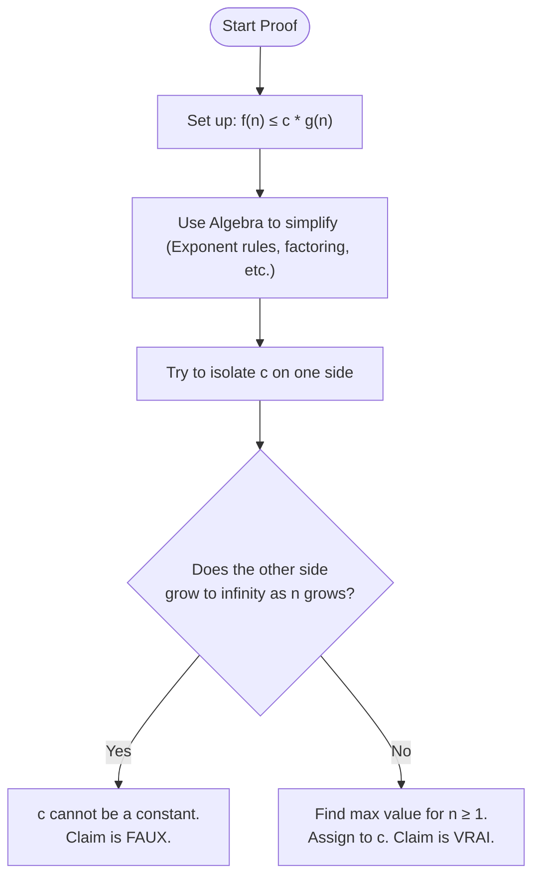

# 5. Additional Big O Mathematical Proofs

> [!info] Context and Methodology
> Just like in the previous note covering $2^{n+1}$ and $2^{2n}$, we must prove whether a complexity claim is **Vrai (True)** or **Faux (False)** using the formal definition of Big-O:
> $f(n) \le c \cdot g(n)$ for all $n \ge n_0$.
> 
> The goal is always to use algebra to isolate the constant $c$. If $c$ can be a fixed number, it's True. If the math forces $c$ to grow with $n$, it's False.

Here is the universal workflow for solving any of these proofs:

---

## Example A: Dealing with Polynomials 
**Claim:** $3n^2 + 5n = O(n^2)$

We know from counting operations (like the $6n^2 + 6n + 4$ matrix example) that we usually just "drop the lower terms". Here is the rigorous mathematical proof of *why* we are allowed to drop them.

1. **Identify functions:**
   $f(n) = 3n^2 + 5n$
   $g(n) = n^2$

2. **Set up the inequality:**
   $3n^2 + 5n \le c \cdot n^2$

3. **Algebraic Manipulation (Isolate $c$):**
   Divide the entire equation by $n^2$:
   $\frac{3n^2}{n^2} + \frac{5n}{n^2} \le c$
   $3 + \frac{5}{n} \le c$

4. **Logical Deduction for $c$:**
   We only care about $n \ge 1$ (since algorithm inputs size $n$ are positive integers).
   What is the absolute *maximum* value of $3 + \frac{5}{n}$?
   - If $n = 1$, it is $3 + \frac{5}{1} = 8$.
   - If $n = 10$, it is $3 + 0.5 = 3.5$.
   - If $n \to \infty$, it shrinks to $3 + 0 = 3$.
   
   The largest this side will ever be is $8$. Therefore, if we set $c = 8$, the condition $3 + \frac{5}{n} \le 8$ is always true.

5. **Conclusion:** 
   Because a valid constant $c=8$ exists, the claim is **Vrai (True)**.

---

## Example B: Tricky Bases in Exponentials
**Claim:** $3^n = O(2^n)$

This looks very similar to the $2^{2n} = O(2^n)$ problem from the TD, and uses the exact same logic.

1. **Identify functions:**
   $f(n) = 3^n$
   $g(n) = 2^n$

2. **Set up the inequality:**
   $3^n \le c \cdot 2^n$

3. **Algebraic Manipulation:**
   Divide both sides by $2^n$:
   $\frac{3^n}{2^n} \le c$
   
   Use the exponent rule $\frac{x^y}{z^y} = (\frac{x}{z})^y$:
   $(\frac{3}{2})^n \le c$
   $1.5^n \le c$

4. **Logical Deduction for $c$:**
   As $n$ grows larger (e.g., $1.5^{10}$, $1.5^{100}$), the value $1.5^n$ explodes towards infinity. 
   You cannot pick a static constant number $c$ that will remain larger than infinity. 

5. **Conclusion:**
   Because $c$ cannot be bounded, the claim is **Faux (False)**.

---

## Example C: The Reverse Exponential
**Claim:** $2^n = O(3^n)$

Let's flip the previous example to see how the mathematical proof handles it.

1. **Identify functions:**
   $f(n) = 2^n$
   $g(n) = 3^n$

2. **Set up the inequality:**
   $2^n \le c \cdot 3^n$

3. **Algebraic Manipulation:**
   Divide both sides by $3^n$:
   $(\frac{2}{3})^n \le c$

4. **Logical Deduction for $c$:**
   Notice that $\frac{2}{3}$ is less than $1$ (it is roughly $0.66$). 
   When you raise a fraction smaller than 1 to a high power, it *shrinks* towards zero.
   - For $n=1$, $(\frac{2}{3})^1 = 0.66$
   - For $n=2$, $(\frac{2}{3})^2 \approx 0.44$
   - For $n \to \infty$, it approaches $0$.
   
   The absolute maximum value is $0.66$ (when $n=1$). Therefore, we can easily pick a constant $c = 1$. Since $0.66 \le 1$, and it only gets smaller from there, $c=1$ works forever.

5. **Conclusion:**
   Because a constant $c$ exists, the claim is **Vrai (True)**.

---

## Example D: Logarithmic Properties
**Claim:** $\log(n^3) = O(\log n)$

> [!tip] Essential Background Knowledge
> Logarithms are frequently used in complexity analysis (like binary search). You MUST memorize the power rule of logarithms for exams:
> $\log(x^y) = y \cdot \log(x)$

1. **Identify functions:**
   $f(n) = \log(n^3)$
   $g(n) = \log n$

2. **Set up the inequality:**
   $\log(n^3) \le c \cdot \log n$

3. **Algebraic Manipulation:**
   Apply the logarithm power rule to $f(n)$:
   $3 \cdot \log n \le c \cdot \log n$

4. **Isolate $c$:**
   Divide both sides by $\log n$ (assuming $n > 1$ so $\log n > 0$):
   $3 \le c$

5. **Conclusion:**
   The math perfectly isolated $c$. If we choose $c=3$, the inequality holds true.
   The claim is **Vrai (True)**.
