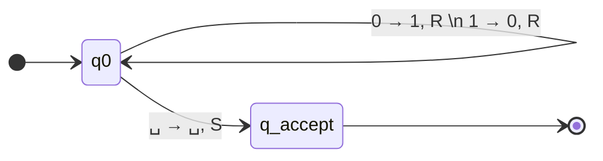

# Exercise 1: One's Complement of a Binary Number

## 1. Problem Statement
Determine a Turing Machine (DMTQ - *Déterminer une Machine de Turing qui*) that calculates the 1's complement of a binary number. 

The 1's complement is a bitwise NOT operation. This means we must replace every `0` with a `1`, and every `1` with a `0`. We must provide a high-level description, the formal mathematical definition, and a state diagram.

---

## 2. Deep Methodological Breakdown

Before writing down formally defined states or diving straight into equations, let us fully dissect the problem by running a mental trace. 

**The Input Environment:**
* We are given a tape containing a string of `0`s and `1`s.
* Because of our strict Left-Bounded tape rule, the string starts exactly at index 0 (Cell 0).
* Our Turing Machine boots up with its read/write head already positioned on exactly the first character of this string.
* At the physical end of the binary string, there is an infinite padding of blank symbols ($\sqcup$). This blank symbol acts as our stopping condition.

**The Math of 1's Complement:**
* Unlike mathematical addition, taking the complement of a single bit has absolutely zero effect on its neighbors. There is no concept of a "carry" bit.
* Thus, the calculation is strictly local. We only need to look at the current cell.

**The Strategy:**
Because the operation is strictly local and independent for every cell, the logic is incredibly simple. We only need to sweep across the string exactly once! We do not need multiple phases. We just need to read the symbol under the head, invert it, step right, and repeat. 

We can define a single state, $q_0$, representing the "Scan and Invert" phase.

Let's imagine the input is `101`:
1. Start at index 0. State $q_0$. Tape reads `1`. Invert to `0`. Move Right (`R`).
2. Now at index 1. State is still $q_0$. Tape reads `0`. Invert to `1`. Move Right (`R`).
3. Now at index 2. State is still $q_0$. Tape reads `1`. Invert to `0`. Move Right (`R`).
4. Now at index 3. State is still $q_0$. Tape reads $\sqcup$ (blank space). This means the string is over!

**The Halting Condition:**
When we read $\sqcup$, our job is entirely finished. We do not want to change the blank symbol. Our course allows the use of the `S` (Stay) command. We can simply write $\sqcup$, command the head to Stay in place (`S`), and jump to the Accept state ($q_{accept}$ or $q_f$).

**What if the input is completely empty?**
Always trace edge cases. If the user provides an empty string, the tape boots up with $\sqcup$ in Cell 0. 
Following our logic: At index 0, in state $q_0$, the head reads $\sqcup$. The machine executes the halting rule, writes $\sqcup$, Stays (`S`), and accepts. The empty string correctly maps to an empty string. The algorithm is robust.

---

## 3. Formal Definition

A deterministic Turing Machine translates the above logic into strict mathematics using the 7-tuple: 
$M = (Q, \Sigma, \Gamma, \delta, q_0, q_{accept}, q_{reject})$.

* **States ($Q$):** $\{q_0, q_{accept}, q_{reject}\}$ (Note: $q_{reject}$ is implicitly assumed for any undefined transitions).
* **Input Alphabet ($\Sigma$):** $\{0, 1\}$
* **Tape Alphabet ($\Gamma$):** $\{0, 1, \sqcup\}$
* **Start State ($q_{start}$):** $q_0$

### Transition Function $\delta$:
This is the formal mathematical representation of our detailed logic.

$$
\begin{aligned}
\delta(q_0, 1) &= (q_0, 0, R) \quad &&\text{ // If 1, overwrite with 0, and move Right} \\
\delta(q_0, 0) &= (q_0, 1, R) \quad &&\text{ // If 0, overwrite with 1, and move Right} \\
\delta(q_0, \sqcup) &= (q_{accept}, \sqcup, S) \quad &&\text{ // If blank, the string is over. Leave blank, Stay, Accept.}
\end{aligned}
$$

---

## 4. State Diagram

Below is the state diagram for the Turing Machine. Note how the loop for `0` and `1` remains tightly contained within the single $q_0$ state, emphasizing the one-pass nature of the algorithm.

