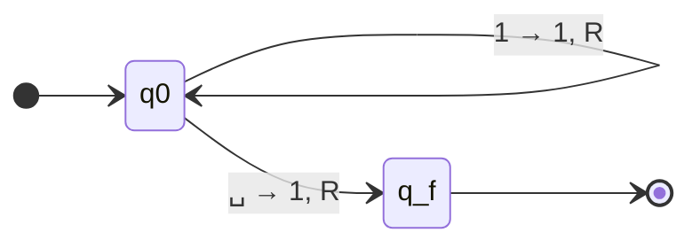

# Exercise 2: Unary Successor Calculation

## 1. Problem Statement
Determine a Turing Machine (DMTQ) that calculates the successor of a number specifically using **unary coding**. 

In unary coding, a number $N$ is represented by a contiguous block of exactly $N$ occurrences of the symbol `1`.
* $0$ is the empty string ($\epsilon$).
* $1$ is `1`.
* $2$ is `11`.
* $3$ is `111`, etc.

The mathematical "successor" of $N$ is $N+1$. We must output the unary representation of $N+1$.

---

## 2. Deep Methodological Breakdown

To build a Turing Machine, we must strip away high-level mathematical concepts and think purely in terms of physical tape manipulation. 

**The Math of Unary Addition:**
In unary, counting is identical to drawing primitive tally marks. If you want to add 1 to a number, you don't carry values or flip bits like in binary; you simply draw one more tally mark. 
Therefore, computing $N+1$ in unary string manipulation is exactly equivalent to appending a single `1` to the rightmost end of the string.

**The Input Environment:**
* The tape begins at index 0 reading a string of `1`s.
* After the string of `1`s, there will be an infinite sequence of $\sqcup$ (blank) symbols.
* The head starts at index 0.

**The Strategy:**
To append a `1` to the end of the string, the machine's primary obstacle is simply *finding* the end of the string. The machine does not know how long the string is.
We can define the algorithm in two steps:
1. **Find the End:** The machine will use an initial state $q_0$ exclusively for traveling right. As long as it sees a `1`, it means "I am still inside the number." It will leave the `1` completely unchanged, and move Right (`R`). It will loop this action endlessly until it steps off the number.
2. **Execute the Addition:** The moment the head steps off the sequence of `1`s, it will read a $\sqcup$. This blank symbol perfectly denotes the physical end of the number. To add $1$, the machine simply replaces that empty $\sqcup$ cell with a `1`.
3. **Finish:** The addition is complete. Using the course's `S` (Stay) command, the machine does not need to move the head any further. It just stays parked on the newly written `1` and jumps to the accept state ($q_{acc}$ or $q_f$).

**What if the input is Zero?**
In our coding scheme, Zero is the empty string. Thus, the tape initially contains $\sqcup$ at index 0.
Let's trace: The machine boots up in $q_0$, reading index 0. It immediately sees a $\sqcup$. It executes Step 2: overrides the $\sqcup$ with a `1`, Stays, and Accepts. The empty string correctly and instantly becomes `1`. Our logic handles the edge case natively!

---

## 3. Formal Definition

A deterministic Turing Machine translates the algorithm into a formal 7-tuple: $M = (Q, \Sigma, \Gamma, \delta, q_0, q_{accept}, q_{reject})$.

* **States ($Q$):** $\{q_0, q_{accept}\}$
* **Input Alphabet ($\Sigma$):** $\{0, 1\}$ *(Although we strictly only use `1` for unary tally marks, we keep `0` in the alphabet to exactly match the TD notes).*
* **Tape Alphabet ($\Gamma$):** $\{0, 1, \sqcup\}$
* **Start State ($q_{start}$):** $q_0$
* **Accept State:** $q_{accept}$ (often written as $q_f$ for final state)

### Transition Function $\delta$:
Here is the strict mapping of our algorithm:

$$
\begin{aligned}
\delta(q_0, 1) &= (q_0, 1, R) \quad &&\text{// As long as we read a tally mark, skip over it efficiently (Move Right).} \\
\delta(q_0, \sqcup) &= (q_{accept}, 1, R) \quad &&\text{// We found the end! Replace blank with a tally mark. (Note: The TD notes use 'R' here, but 'S' or 'L' are also logically valid).}
\end{aligned}
$$

> [!abstract] Note on Final Head Direction
> In classical Turing theory, the head must move left or right. Moving right (`R`) after dropping the final digit works precisely. The course notes also permit `S` (Stay) or standard `L` to park the head on the result. Following the handwritten source strictly, we use `R`, moving onto the next blank space and accepting.

---

## 4. State Diagram

The diagram beautifully illustrates the simplicity of unary operations: a scanning loop to find the tape boundary, followed by an immediate execution and halt.

