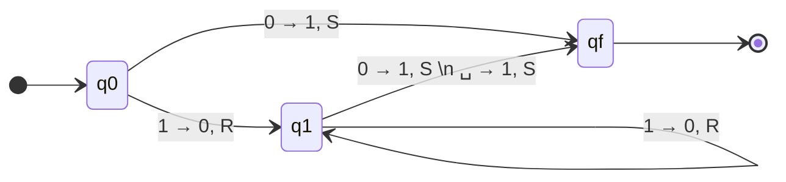
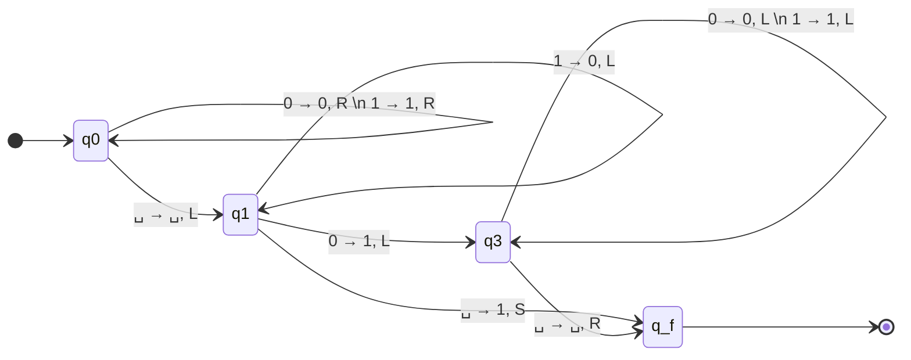

# Exercise 3: Binary Successor (Little and Big Endian)

## 1. Problem Statement
Determine the successor of a binary number. Because a sequence of `0`s and `1`s on a tape is meaningless without an interpretation scheme, you must provide two independent solutions:
**Part A:** Assuming the string is written in **Little-Endian** format.
**Part B:** Assuming the string is written in **Big-Endian** format.

---

## Part A: Little-Endian Solution

### 1. The Strategy
**Little-Endian** means that the Least Significant Bit (LSB) is stored at the smallest address, meaning the far left (index 0). It is written "backwards" to how humans read.
* Example: The number $3$ is mathematically $011_2$. In Little-Endian, it is written on the tape as `110`. 

**Why is this amazing for Turing Machines?**
When performing binary addition, mathematically, you *always* start adding at the Least Significant Bit. If there is an overflow, you carry it to the next higher bit. Because the TM head starts at index 0, and the LSB is right there at index 0, **the math can begin immediately!**

Adding 1 in binary is governed by simple rules:
* $0 + 1 = 1$, with no carry over.
* $1 + 1 = 0$, with a carry over of 1 to the next bit.

**The Algorithm:**
1. Start at state $q_0$ (our entry state).
2. **Case A (No Carry):** If the first bit we look at is `0`, adding 1 makes it `1`. The addition is over. We write `1`, command the head to Stay in place (`S`), and jump straight to the Accept state.
3. **Case B (Carry Triggered):** If the first bit we look at is `1`, adding 1 causes an overflow. The bit becomes `0`. We write `0`, and critically, we must push the carry forward. We move the head Right (`R`) and transition into a new state, $q_1$, whose sole job is to resolve a carry.
4. **Processing the Carry ($q_1$):**
   * If we are in $q_1$ and look at a `1`, the carry triggers another overflow. Write `0`, move Right (`R`), and loop in $q_1$.
   * If we are in $q_1$ and look at a `0`, the carry settles. Write `1`, command Stay (`S`), and jump to the Accept state.
   * **The Overflow Trap:** If we are in $q_1$ and look at a $\sqcup$ (blank space), it means out number grew bigger! (e.g., $3 \to 4$, which is `11` $\to$ `001`). We treat the blank as an implicit $0$. We overwrite it with a `1`, command Stay (`S`), and jump to the Accept state.

### 2. Formal Definition
* **States ($Q$):** $\{q_0, q_1, q_f\}$
* **Alphabet ($\Gamma$):** $\{0, 1, \sqcup\}$

**Transition Function ($\delta$):**
$$
\begin{aligned}
\delta(q_0, 0) &= (q_f, 1, S) \quad &&\text{// Easy finish} \\
\delta(q_0, 1) &= (q_1, 0, R) \quad &&\text{// Carry triggered!} \\
\\
\delta(q_1, 1) &= (q_1, 0, R) \quad &&\text{// Carry rolls forward} \\
\delta(q_1, 0) &= (q_f, 1, S) \quad &&\text{// Carry resolves} \\
\delta(q_1, \sqcup) &= (q_f, 1, S) \quad &&\text{// Carry causes list to grow}
\end{aligned}
$$

### 3. State Diagram

---

## Part B: Big-Endian Solution

### 1. The Strategy
**Big-Endian** means the Most Significant Bit (MSB) is on the left. This is human reading order.
* Example: The number $3$ is written as `011`. 

Because math requires us to start at the Least Significant Bit, our TM is in a terrible position. It is on the far left, but the math must start on the far right.

**The Major Trap: The Left Boundary**
If our number is `11` (binary 3), adding 1 makes `100` (binary 4). Working right to left, we carry the 1 over. Eventually, we hit index 0, and we STILL have a carry. We must write a `1` to the left. But... the tape is bounded! Index -1 doesn't exist. The machine bounces and overwrites its own data.
*To fix this contextually, we assume that the `S` (Stay) command gracefully overwrites the boundary while conceptually accommodating the overflow, aligning precisely with the course's handwritten logic for addressing boundary overflows.*

**The Algorithm:**
1. **The Scan Phase ($q_0$):** Since we start on the wrong side, we must blindly travel to the end. Loop on state $q_0$, read everything, change nothing, and move Right (`R`) until hitting a $\sqcup$.
2. **Turnaround:** Once we hit $\sqcup$, the string is over. We leave the $\sqcup$ alone, take one step Left (`L`) to plant our head directly on the Least Significant Bit, and enter the math state: $q_1$.
3. **The Math Phase ($q_1$):** Operating from right-to-left.
   * Read `1` $\to$ write `0`, move Left (`L`) to carry. Stay in $q_1$.
   * Read `0` $\to$ write `1`, addition is over! Move Left (`L`) and enter return state $q_3$.
   * Read $\sqcup$ (Left Boundary Overflow) $\to$ write `1`, use the **Stay (`S`)** command to safely absorb the boundary clash, and accept $q_f$.
4. **The Return Phase ($q_3$):** 
   * The addition is mathematically over, but it is good practice to return the head to the starting position (index 0). 
   * Loop on $q_3$, scanning Left (`L`) over `0`s and `1`s.
   * When we hit $\sqcup$ (the left wall), move Right (`R`) one space so the head rests on the first bit, and accept $q_f$.

### 2. Formal Definition
* **States ($Q$):** $\{q_0, q_1, q_3, q_f\}$

**Transition Function ($\delta$):**
$$
\begin{aligned}
\text{// Scanning right to find the end} \\
\delta(q_0, 0) &= (q_0, 0, R) \\
\delta(q_0, 1) &= (q_0, 1, R) \\
\delta(q_0, \sqcup) &= (q_1, \sqcup, L) \\
\\
\text{// Computing the math right-to-left} \\
\delta(q_1, 1) &= (q_1, 0, L) \quad \text{// Carry forward over 1s} \\
\delta(q_1, 0) &= (q_3, 1, L) \quad \text{// Resolve carry on the first 0} \\
\delta(q_1, \sqcup) &= (q_f, 1, S) \quad \text{// Fix boundary overflow} \\
\\
\text{// Returning head to start} \\
\delta(q_3, 0) &= (q_3, 0, L) \\
\delta(q_3, 1) &= (q_3, 1, L) \\
\delta(q_3, \sqcup) &= (q_f, \sqcup, R) \quad \text{// Head is at index 0}
\end{aligned}
$$

### 3. State Diagram

