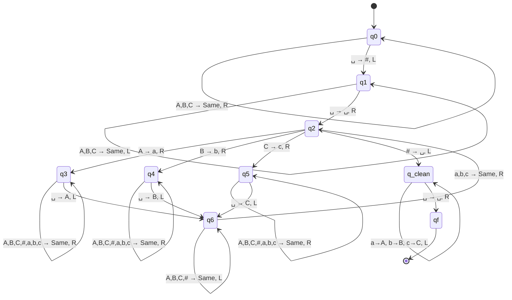

# Exercise 4: String Copying Routine

## 1. Problem Statement
Determine a Turing Machine (DMTQ) that generates a copy of a string composed of the symbols `{A, B, C}`. 
For example, if the initial tape configuration contains the input string `AABCA`, the machine must eventually halt with the tape reading exactly `AABCAAABCA`.

---

## 2. Deep Methodological Breakdown

String copying is fundamentally different from bitwise operations. A Turing Machine has no internal RAM or variables. It cannot "hold" a 5-character string in its states. To copy a string, the TM is forced to copy it exactly one character at a time. This introduces a major logistical problem: **How does the machine remember where it left off?**

### The Concept of Delimiters and Markers
To prevent the TM from getting lost during its constant back-and-forth travel, we must employ two strategies:
1. **The Delimiter (`#`):** We need a physical wall to separate the original string from the new copy we are building. Otherwise, the new letters will blend into the old ones, and the machine will infinitely copy its own copy.
2. **The Markers (`a`, `b`, `c` or `Ā`, `B̄`, `C̄`):** When the machine reads a letter and carries it over to the new side, it must "cross out" the letter in the original side so it doesn't accidentally copy it twice. Once the entire string is copied, a cleanup phase will un-cross the letters.

### The Algorithm (5 Phases)
This machine is massive, but structurally elegant when broken into phases.

**Phase 1: Place the Delimiter**
The machine boots up at the start of the string. Its first job is to establish the workspace.
1. Scan Right over all `A`, `B`, `C` characters.
2. Upon hitting the first empty $\sqcup$ symbol, safely replace it with the `#` delimiter.
3. Now, "rewind". Travel all the way back Left across the string until hitting the left-bounding wall ($\sqcup$ at index -1, or bouncing on index 0). Step right onto the first character of the string to begin Phase 2.

**Phase 2: Read and Mark (The Router)**
The machine looks at the current character.
1. Is it `A`? Overwrite it with a marked `a`, and enter a specific sub-routine state: `Carry A`.
2. Is it `B`? Overwrite it with a marked `b`, and enter state: `Carry B`.
3. Is it `C`? Overwrite it with a marked `c`, and enter state: `Carry C`.
4. Is it `#`? This is the terminating condition! If you see `#` where you expect a letter, it means every single letter to its left has been marked. The copy is mathematically complete! Jump to Phase 5.

**Phase 3: Carry to Workspace**
*(Let's assume we are in the `Carry A` state)*
1. Force the head to move Right. Ignore everything: `A`, `B`, `C`, `#`, `a`, `b`, `c`. Just keep moving Right.
2. The moment you hit a $\sqcup$, you have found the end of the workspace. Write the symbol you are carrying (`A`).
3. Enter Phase 4 (Return).

**Phase 4: Return to the Marked Letters**
1. Move Left. Ignore everything: `A`, `B`, `C`, `#`. Just keep moving Left.
2. Your beacon is the markers! The moment you hit a marked character (`a`, `b`, or `c`), you know exactly where you left off. 
3. Stop moving left. Take exactly one step Right to land on the next uncopied letter, and loop entirely back to Phase 2 (Read and Mark).

**Phase 5: Cleanup**
1. The copy is complete, but the input string is currently ruined (it looks like `a a b c a # A A B C A`).
2. Sweep Left across the original string.
3. Convert $a \to A$, $b \to B$, $c \to C$.
4. Replace the `#` with a $\sqcup$ (or just leave it depending on strict exercise requirements, but erasing it is cleaner).
5. Accept.

---

## 3. Formal Definition (High-Level State Design)

Writing an exhaustive $\delta$ table for this machine requires dozens of trivial transitions. We provide the rigorous State Map instead to prove understanding.

* **Alphabet ($\Gamma$):** $\{A, B, C, a, b, c, \#, \sqcup\}$

**State Map:**
* **$q_{init}$**: Move R to $\sqcup$, write `#`, transition to $q_{ret}$.
* **$q_{ret}$**: Move L over $A, B, C$ until hitting the tape wall. Transition to $q_{read}$.
* **$q_{read}$**: 
  * Reads $A \to$ writes $a$, goes to $q_{carryA}$.
  * Reads $B \to$ writes $b$, goes to $q_{carryB}$.
  * Reads $C \to$ writes $c$, goes to $q_{carryC}$.
  * Reads $\# \to$ goes to $q_{cleanup}$.
* **$q_{carryA}$**: Moves right over $A,B,C,a,b,c,\#$. On $\sqcup$, writes $A$. Goes to $q_{backtrack}$.
* **$q_{backtrack}$**: Moves left over $A,B,C,\#$. On $a,b,c$, moves Right one step and goes to $q_{read}$.
* **$q_{cleanup}$**: Moves left, converting $a \to A$, $b \to B$, $c \to C$, changing `#` to space, and halts on the left boundary.

---

## 4. State Diagram

