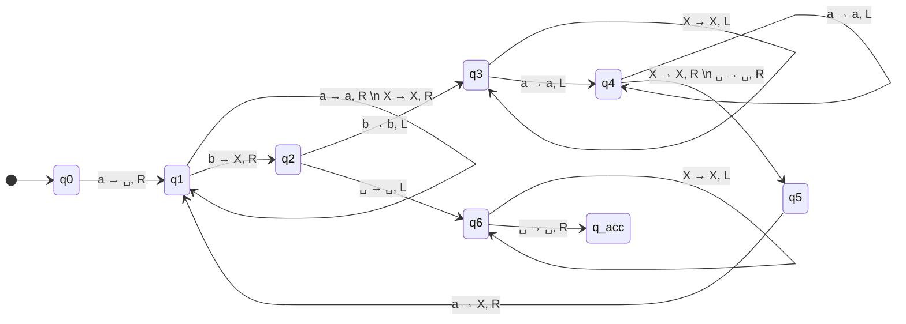

# Exercise 5: TM Tracing and Halting

## 1. Problem Statement
Given the extensive execution table (transition function $\delta$) of an unknown Turing Machine $M$, we must:
1. Draw the corresponding state diagram.
2. Provide a step-by-step trace of the configurations for the input string `aabb`.
3. Prove whether the machine $M$ always halts.
4. Deduce the language that the machine computes.

**The Formally Defined Machine:**
$M = (\{q_0...q_6, q_{acc}, q_{rej}\}, \{a, b\}, \{a, b, X, \sqcup\}, \delta, q_0, q_{acc}, q_{rej})$

*(Standard transitions are provided in the source problem, any missing transition maps to $q_{rej}$)*.

---

## 2. The State Diagram

By reading the table row by row, we reconstruct the machine visual logic. As per standard convention, arrows pointing to the Reject state ($q_{rej}$) are omitted for clarity.

> [!important] High-Level Analysis
> Before tracing, look at the diagram. What is it doing?
> 1. It crosses out the very first `a` and turns it into a $\sqcup$. (This creates an artificial left-wall boundary!).
> 2. It scans right to find the first `b` and crosses it out with an `X`.
> 3. It scans left, bumps into the wall it created, steps right, crosses out the next `a` with an `X`.
> 4. Repeats. It is methodically crossing off pairs of `a` and `b` from the outside in!

---

## 3. Tracing Configurations for `aabb`

A **Configuration** is an exact temporal snapshot. Format: `[Left Tape] [State] [Right Tape]`.

1. **$q0 a a b b$** $\rightarrow$ Start at leftmost 'a'. Machine reads `a`. The rule says overwrite with blank, move right to $q_1$.
2. **$\sqcup q1 a b b$** $\rightarrow$ In $q_1$, reading `a`. Rule: skip 'a's, move right.
3. **$\sqcup a q1 b b$** $\rightarrow$ Inside $q_1$, finds the first `b`. Rule: Turn to `X`, move right to $q_2$.
4. **$\sqcup a X q2 b$** $\rightarrow$ Inside $q_2$, reading `b`. Assumes we overshot. Move left to $q_3$.
5. **$\sqcup a q3 X b$** $\rightarrow$ Inside $q_3$, reading `X`. Rule: Scan left over markers. 
6. **$\sqcup q3 a X b$** $\rightarrow$ Inside $q_3$, reading `a`. Hit valid data. Move left to $q_4$.
7. **$q4 \sqcup a X b$** $\rightarrow$ Hits the left boundary blank! Bounces right into $q_5$.
8. **$\sqcup q5 a X b$** $\rightarrow$ Back on the first remaining `a`. Rule: Mark as `X`, move right to $q_1$. First pair is entirely erased!
9. **$\sqcup X q1 X b$** $\rightarrow$ Inside $q_1$ looking for the next `b`. Scans over `X`.
10. **$\sqcup X X q1 b$** $\rightarrow$ Finds the second `b`. Marks as `X`, moves right to $q_2$.
11. **$\sqcup X X X q2 \sqcup$** $\rightarrow$ In $q_2$, hits tape end $\sqcup$! This means all `b`s are gone. Reverses into $q_6$ for cleanup checking.
12. **$\sqcup X X q6 X$** $\rightarrow$ Scans left over all `X`s to ensure no garbage is left behind.
13. **$\sqcup X q6 X X$**
14. **$\sqcup q6 X X X$**
15. **$q6 \sqcup X X X$** $\rightarrow$ Hits the left boundary blank again. Rule: Step right, accept.
16. **$\sqcup q_{acc} X X X$** $\rightarrow$ **ACCEPT!**

---

## 4. Proof of Halting

**Does M always halt? YES.**

The proof requires evaluating the algorithmic progression mathematically:
1. **Strictly Decreasing Search Space:** The input string is finite. On every successful major loop ($q_1 \to q_2 \to q_3 \to q_4 \to q_5$), the machine permanently consumes exactly one `a` and exactly one `b`, replacing them with non-letter markers (`X` or $\sqcup$). 
2. **Absence of Stationary Infinite Loops:** There are no loops in the table that allow the head to stay in the exact same state without moving (`S`), nor are there oscillatory patterns that don't consume input.
3. **Implicit Rejection Traps:** If the string is unbalanced (e.g., more `a`s than `b`s) or out of order (e.g., `ba`), the machine will eventually look for a character it expects, fail to find it, trigger an undefined rule, and crash into $q_{rej}$.
Because every path strictly leads to consumption of a finite string or immediate rejection, the machine definitively halts for all possible inputs.

---

## 5. Deduced Language Context

Because the machine forces all `a`s to be processed before `b`s (it expects to pass over `a`s in $q_1$ before finding a `b`), and tightly couples the erasure of one `a` to exactly one `b`, it recognizes strings where there is an identical number of consecutive `a`s followed by identical consecutive `b`s.

This is the standard context-free language:
**$L = \{ a^n b^n \mid n \ge 1 \}$**
