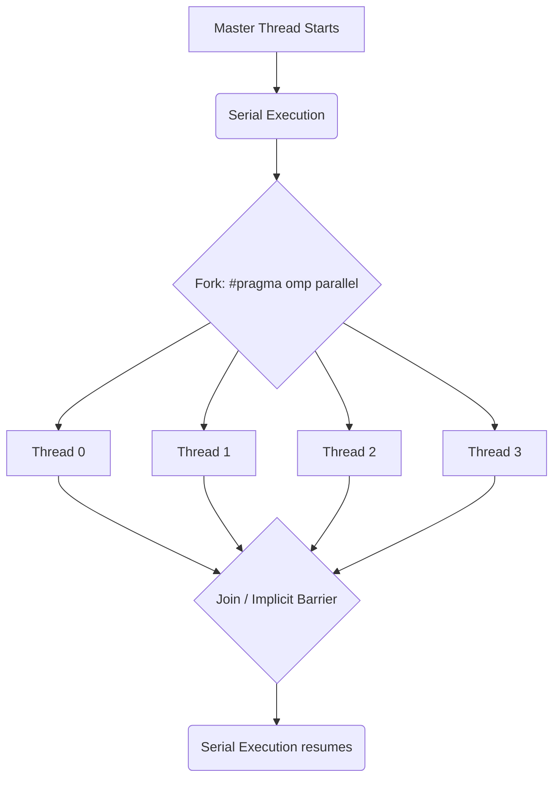

# 3.1 OpenMP and the Fork-Join Model

## What is OpenMP?

**OpenMP (Open Multi-Processing)** is an Application Programming Interface (API) that supports multi-platform shared-memory multiprocessing programming in C, C++, and Fortran. It is the de facto standard for parallelizing code on a single machine where all CPU cores share the same physical RAM.

### Key Characteristics

- **Shared-Memory:** All threads share the same physical RAM. If Thread 0 modifies a variable `X` in shared memory, Thread 1 can immediately see that change. This is what distinguishes OpenMP from distributed-memory models like MPI, where each process has its own private memory and must explicitly send/receive data via messages.
- **Compiler Directives (Pragmas):** OpenMP relies on `#pragma omp ...` directives. If a compiler doesn't support OpenMP (or the `-fopenmp` flag is omitted), it simply ignores the pragma as a comment, and the code runs serially. This is an elegant **incremental parallelism** design — you can add parallelism to existing serial code one pragma at a time without rewriting the program architecture.
- **Thread-Based:** OpenMP creates **threads** (lightweight execution units within a single process). All threads share the same address space, file descriptors, and process resources. Threads are much cheaper to create than processes, typically requiring only a few microseconds to fork.

### Why OpenMP Over Other Approaches?

| Approach | Pros | Cons | Best For |
|:---|:---|:---|:---|
| **OpenMP** | Easy to add to existing C code, shared memory is simple, incremental parallelism | Limited to one machine, requires careful synchronization | Single-node multi-core parallelism |
| **MPI** | Scales to thousands of nodes, distributed memory avoids contention | Harder to program, requires explicit message passing | Large cluster/supercomputer parallelism |
| **pthreads** | Maximum control over threads | Extremely verbose, error-prone, no loop-level directives | Low-level thread management |
| **C++ Threads** | Standard C++11, portable | No automatic loop scheduling, manual synchronization | General C++ concurrency |

---

## The Fork-Join Execution Model

OpenMP programs begin as a single thread — the **Master Thread** (always Thread 0). This is the "serial" part of the program. When the master thread encounters a parallel region (marked by `#pragma omp parallel`), it **forks** — creating a team of worker threads. All threads in the team execute the code inside the parallel region concurrently. When they hit the end of the parallel block, they synchronize at an **implicit barrier** and **join** back into just the master thread, which continues serial execution.



### Understanding the Fork-Join Flow

1. **Serial Phase:** Only Thread 0 exists. It executes initialization, I/O, and any code outside parallel regions.
2. **Parallel Phase:** Thread 0 forks $P-1$ additional threads (where $P$ is typically the number of CPU cores). All $P$ threads execute the parallel region simultaneously. Each thread has its own stack and program counter, but they all share the same heap and global variables.
3. **Join Phase:** At the end of the parallel region, there is an **implicit barrier**. All threads must arrive at this barrier before any can proceed. The fastest thread waits for the slowest. After the barrier, all worker threads are destroyed, and only Thread 0 continues.

This pattern repeats for every parallel region in the program. The overhead of forking and joining threads is non-trivial (typically 10–100 microseconds), so parallel regions should contain enough work to amortize this cost.

---

## Essential Pragmas and Functions

### Compilation

```bash
gcc -fopenmp program.c -o program
```

The `-fopenmp` flag tells GCC to recognize OpenMP pragmas and link the OpenMP runtime library (`libgomp`). **If you omit this flag, the code compiles successfully but runs purely serially** — no parallelization occurs, and all pragmas are silently ignored as comments. This is a common source of confusion: "I added the pragma but my program didn't get faster!" — check your compilation flags.

### Core Functions

| Function | Returns | Notes |
|:---|:---|:---|
| `omp_get_thread_num()` | ID of the calling thread (0 to N-1) | Thread 0 is always the master |
| `omp_get_num_threads()` | Total number of threads in the current team | Returns 1 outside a parallel region |
| `omp_set_num_threads(n)` | Sets the number of threads for subsequent parallel regions | Can also use `export OMP_NUM_THREADS=4` |

### Core Directives

| Directive | Meaning |
|:---|:---|
| `#pragma omp parallel` | Creates a parallel region — the foundation of all OpenMP code |
| `#pragma omp parallel for` | Combines `parallel` + `for` — distributes loop iterations across threads |
| `#pragma omp master` | Only Thread 0 executes the following block; other threads **skip it** (no barrier) |
| `#pragma omp single` | The *first* thread to reach this block executes it; other threads **wait at the implicit barrier** |
| `#pragma omp barrier` | Explicit synchronization point — all threads must arrive before any proceed |

> [!warning] `master` vs. `single` — A Common Trap
> - `#pragma omp master`: Only Thread 0 executes. Other threads **skip and continue** (no barrier). This means they might race ahead and access data that Thread 0 hasn't finished computing yet.
> - `#pragma omp single`: One arbitrary thread executes. Other threads **wait at the barrier** after the block. This is safer when the single-executed block modifies shared data that others need.
> - **Rule of thumb:** Use `single` when other threads depend on the result of the block. Use `master` when the block is independent (e.g., printing a debug message).

---

## Hello World Example (Lab 3, Exercise 2)

```c
#include <stdio.h>
#include <omp.h>

int main() {
    #pragma omp parallel
    {
        printf("Hello from thread %d of %d\n",
               omp_get_thread_num(),
               omp_get_num_threads());
    }
    return 0;
}
```

### Key Observation: Non-Deterministic Thread Ordering

When running this program multiple times, the order of messages is **non-deterministic** (random). You might see:

```
Hello from thread 0 of 4
Hello from thread 2 of 4
Hello from thread 3 of 4
Hello from thread 1 of 4
```

And the next run might produce a completely different order. This is because threads are **scheduled by the operating system**. Whichever thread gets CPU time first calls `printf` first. The OS decides based on factors you cannot predict: current system load, CPU cache state, interrupt timing, etc.

> [!important] Golden Rule of Parallelism
> **Never assume thread execution order.** Your program must produce correct results regardless of which thread runs first, second, or last. If your logic depends on a specific ordering, you must use explicit synchronization (see [[3.2 Synchronization and Race Conditions]]).

---

## Setting the Number of Threads

There are three ways (in order of precedence, highest to lowest):

1. **In code:** `omp_set_num_threads(4);` before the parallel region.
2. **Via pragma:** `#pragma omp parallel num_threads(4)`.
3. **Environment variable:** `export OMP_NUM_THREADS=4` (set before running the program).

If none is set, OpenMP typically defaults to the number of CPU cores visible to the OS (reported by `nproc` on Linux).

---

*Next: [[3.2 Synchronization and Race Conditions]] →*
