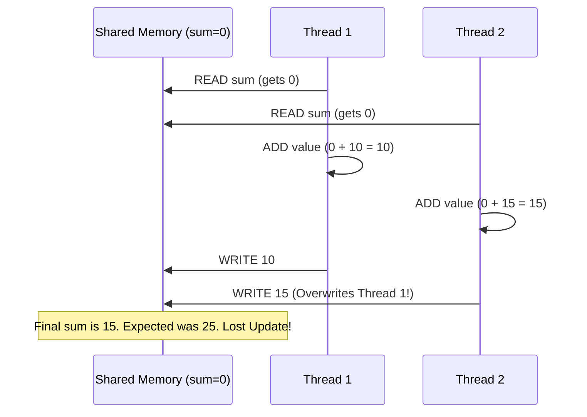

# 3.2 Synchronization and Race Conditions

## The Race Condition — The Enemy of Parallelism

When multiple threads read and write to the same shared variable at the same time without coordination, the final result becomes unpredictable and incorrect. This is a **Race Condition** — the most common and dangerous bug in parallel programming. It is called a "race" because the correctness of the result depends on the **timing** of thread execution, which is non-deterministic.

### Why Race Conditions Are Insidious

Race conditions are particularly dangerous because:
1. **They are non-deterministic:** Running the same program with the same input can produce different results each time.
2. **They are hard to reproduce:** The bug might only appear under specific system loads or thread scheduling conditions.
3. **They can appear to work correctly:** If the OS happens to schedule threads in a "safe" order, the race condition doesn't manifest. This gives false confidence during testing, only to fail catastrophically in production.

### The Anatomy of a Race Condition: Pi Calculation (Lab 3, Exercise 4)

Consider the statement `sum += value`. In C, this looks like a single operation, but at the CPU level, it is actually **three distinct steps**:

1. **READ** `sum` from memory into a CPU register.
2. **ADD** `value` to the register.
3. **WRITE** the new total back to memory.

Between these steps, another thread can interleave its own operations:



This is called a **Lost Update**. Thread 1's contribution of 10 was completely erased because Thread 2 read the *old* value (0) before Thread 1 wrote back its result. With 4 threads and millions of iterations, the final Pi value will be wildly incorrect — and different every run.

---

## Fixing Race Conditions

There are three main ways to fix race conditions in OpenMP, each with different performance trade-offs. Choosing the right one is critical for both correctness and performance.

### A. `#pragma omp critical` — The Brute Force Lock

This creates a **global lock** (mutex). Only one thread can enter the critical section at a time. All others must wait their turn.

```c
#pragma omp parallel for
for (int i = 0; i < N; i++) {
    double x = (i + 0.5) * step;
    double value = 4.0 / (1.0 + x * x);
    #pragma omp critical
    {
        sum += value;
    }
}
```

**How it works:** When Thread 1 enters the critical section, it acquires the lock. Threads 2, 3, and 4 arrive and see the lock is taken — they spin-wait (busy-waiting) or sleep until Thread 1 releases the lock upon exiting the section.

**Performance impact — Severe:** If 4 threads reach the loop, 1 does the math and addition, while 3 sit idle waiting. This completely destroys parallel scaling, effectively turning your parallel loop back into a slow serial loop. In fact, it's often **slower** than pure serial code because of the lock acquisition overhead.

> [!danger] When to Use
> Use `critical` only when: (1) the critical section involves multiple related operations that must be atomic together, or (2) the critical section is executed rarely (not inside a tight loop). Never use `critical` inside a hot loop for simple accumulation — use `reduction` instead.

### B. `#pragma omp atomic` — The Hardware-Level Lock

This is a highly optimized, **hardware-level lock** for a *single specific memory operation* (like `++`, `+=`, `-=`, etc.). It uses the CPU's atomic instructions (e.g., `LOCK XADD` on x86) rather than a software mutex, making it much faster than `critical`.

```c
#pragma omp parallel for
for (int i = 0; i < N; i++) {
    int v = data[i];
    #pragma omp atomic
    histogram[v]++;  // Single memory update, atomically protected
}
```

**Performance impact — Moderate:** Still forces threads to wait for each other at the memory level (only one atomic operation can execute at a time on the same memory location), but the wait is much shorter than a `critical` section because there's no software lock to acquire.

**Limitations:** `atomic` only works on single, simple memory operations. You cannot use it to protect a multi-statement block or operations that involve more than one memory location.

### C. `reduction(operator:variable)` — The Best Way

This is the **holy grail** of parallel accumulation (used in Lab 3, Exercises 4 and 5). Instead of all threads fighting over one global variable, OpenMP does the following behind the scenes:

1. **Create private copies:** Each thread gets its own private, local copy of the reduction variable, initialized to the **identity value** of the operator.
2. **Compute freely:** Threads furiously compute and accumulate into their *local* copy without any locks, waiting, or synchronization.
3. **Merge at the end:** After the loop, at the implicit barrier, OpenMP automatically and safely merges all local copies into the global variable using the specified operator.

```c
#pragma omp parallel for reduction(+:sum)
for (int i = 0; i < N; i++) {
    double x = (i + 0.5) * step;
    sum += 4.0 / (1.0 + x * x);  // No race! Each thread has its own "sum"
}
// After the loop, OpenMP adds all thread-local sums into the global sum
```

**Performance impact — Excellent:** Threads never wait for each other during the computation phase. The only synchronization is the final merge, which is a simple tree-reduction taking $O(\log P)$ time for $P$ threads — negligible.

### Reduction Identity Values

| Operator | Identity Value | Why? |
|:---:|:---:|:---|
| `+` | 0 | 0 + x = x |
| `*` | 1 | 1 * x = x |
| `max` | Smallest possible value | Any real value will be larger |
| `min` | Largest possible value | Any real value will be smaller |
| `&&` | 1 (true) | 1 && x = x |
| `\|\|` | 0 (false) | 0 \|\| x = x |

---

## Variable Scoping in OpenMP

Understanding which variables are shared and which are private is essential for avoiding race conditions.

### The Default Rules

Inside a `#pragma omp parallel` region:
- **Shared by default:** Global variables, static variables, and variables declared *outside* the parallel region.
- **Private by default:** Variables declared *inside* the parallel region (each thread gets its own stack-allocated copy).
- Loop iteration variable in `#pragma omp parallel for` is automatically private.

### The Pi Example Scoping

```c
double sum = 0.0;       // SHARED by default — danger!
double step = 1.0/N;    // SHARED by default — OK (read-only)

#pragma omp parallel for reduction(+:sum)
for (int i = 0; i < N; i++) {
    double x = (i + 0.5) * step;  // PRIVATE — declared inside loop
    sum += 4.0 / (1.0 + x * x);
}
```

> [!warning] The `x` Variable Pitfall
> Notice that `x` is declared *inside* the loop. This is critical. If `x` was declared **before** the `#pragma`, it would be shared by default, and threads would overwrite each other's `x` values, creating a massive race condition on `x` itself! Always declare temporary variables inside the parallel region to make them implicitly private.

### Explicit Scoping Clauses

You can override the defaults:

```c
#pragma omp parallel for private(temp) shared(data) reduction(+:sum)
```

- `private(var)`: Each thread gets its own uninitialized copy.
- `firstprivate(var)`: Each thread gets its own copy, initialized with the value from before the parallel region.
- `lastprivate(var)`: The value from the last iteration is copied back to the master thread's variable.
- `shared(var)`: All threads access the same variable (use with caution!).

---

## Comparison of Synchronization Methods

| Method | Scope | Performance | Use Case |
|:---|:---|:---|:---|
| `critical` | Multi-statement block | Very slow (software mutex) | Complex operations that must be atomic together |
| `atomic` | Single memory operation | Moderate (hardware lock) | Simple increments/decrements in hot loops |
| `reduction` | Accumulation operations | Excellent (no locks during compute) | Sums, products, min/max across loop iterations |

> [!abstract] Decision Rule
> - If you're accumulating (sum, max, min) → **always use `reduction`**.
> - If you're doing a single atomic memory update (increment histogram bin) → **use `atomic`**.
> - If you need to protect a multi-line critical section → **use `critical`** (but try to restructure to avoid it).

---

*Previous: [[3.1 OpenMP and the Fork-Join Model]] | Next: [[3.3 Loop Scheduling and Load Balancing]] →*
