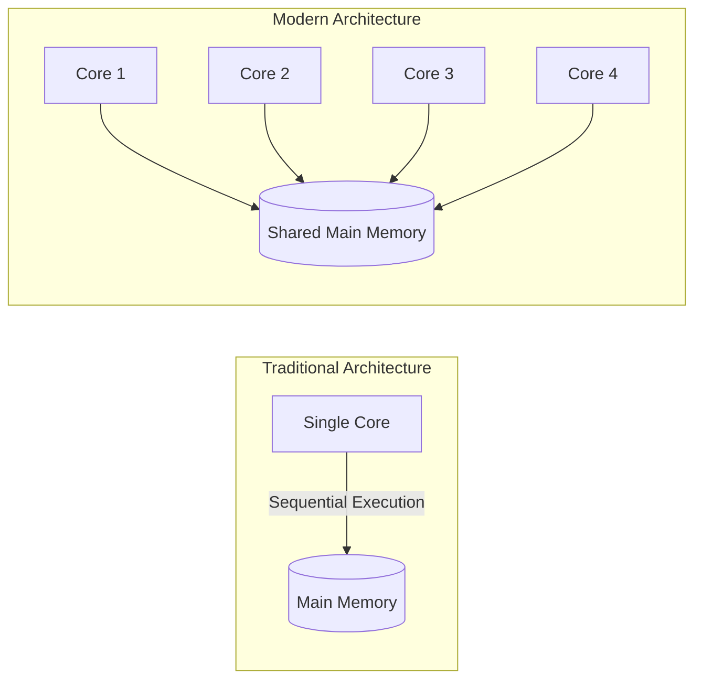
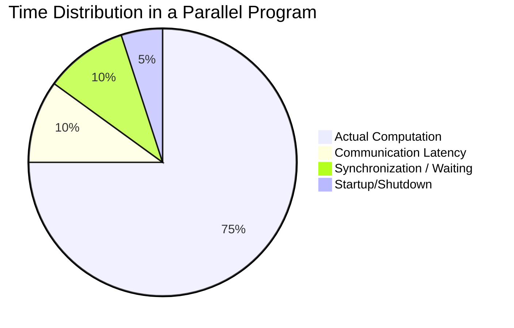

# 1. Introduction to Parallel Computing Fundamentals

## The Evolution of Computer Architecture
To understand why parallel computing is necessary, we must first look at how computer architectures have evolved.

### Traditional vs. Modern Computers
* **Traditional Computers (Single-Core):** Historically, computers contained a single processing unit (CPU). This single core executed instructions **sequentially**—meaning one instruction had to finish completely before the next one could begin. 
* **Modern Computers (Multi-Core):** Today, almost all modern processors (even in smartphones) contain multiple CPU cores (typically 4, 8, 16, or more). This allows for **parallel instruction execution**, meaning multiple operations can occur simultaneously across different cores. Each core can execute its instructions independently while sharing access to the main memory.

## Why Parallelize? 
There are two fundamental constraints in computational science that make single-core execution insufficient:

1. **Speed Limitations (Time Constraint):** A single core is simply too slow to solve modern, large-scale problems within a *reasonable time*. A "reasonable time" varies depending on the context—it might mean overnight, over a lunch break, or within the 3-4 year duration of a PhD thesis. If a simulation takes 10 years on a single core, it is practically unsolvable without parallelism.
2. **Memory Requirements (Resource Constraint):** Large-scale problems often demand more memory (RAM) than a single machine or core can handle. Examples include:
    * Physics simulations with massive computational domains.
    * Molecular dynamics simulations tracking millions of particles.
    * Remote sensing processing extremely high-resolution satellite imagery.
    * Deep learning models with billions of parameters.

**The Solution:** Distribute the workload across **multiple cores** (within a single machine) or **multiple nodes** (multiple separate computers linked over a network).

## Serial vs. Parallel Processing

### Serial Processing
In a serial execution model, a problem is broken down into a sequence of discrete instructions. These are fed to a single processor one after the other. 
* **The Bottleneck:** Only *one* instruction executes at any given time. If you run a program on a modern 8-core CPU serially, 1 core does 100% of the work while the other 7 cores remain **idle and unused**, resulting in massively wasted hardware resources.

### Parallel Processing
In a parallel execution model, a large problem is divided into **smaller, independent sub-problems**. These sub-problems are assigned to different processing units and solved concurrently (at the same time).
* **The Key Insight:** Parallelization trades sequential execution time for concurrent execution, significantly reducing the total time to solution.

> [!example] The Satellite Image Analogy
> **Scenario:** You need to process 1,000 satellite images for land cover classification. Each image takes 10 seconds to process.
> * **Serial Approach:** Process image 1, wait for it to finish, process image 2... Total time = 1000 x 10s = 10,000 seconds (**~2.8 hours**).
> * **Parallel Approach (8 cores):** Process 8 images simultaneously. Total time = (1000 / 8) x 10s = 1,250 seconds (**~21 minutes**).
> * **Result:** An 8x speedup!

## The Hidden Cost: Parallel Overhead

> [!warning] Important Rule
> You should **not** always convert serial code to parallel. For very small problems, the overhead of managing the parallel environment can actually make the code run *slower* than the serial version!

To achieve a speedup, you must account for **Parallel Overhead**—the extra time spent managing the parallel tasks rather than doing actual computation. 

### Sources of Overhead
1. **Startup Time:** The OS and program take time to initialize the parallel environment, spawn threads, or allocate MPI ranks.
2. **Synchronizations:** Cores often have to wait for each other at designated "barriers" to ensure data consistency before moving to the next step.
3. **Communication:** In distributed systems, sending data across a network (e.g., using MPI) takes significantly longer than reading from local memory.
4. **Library/Compiler Overhead:** The runtime environment (like OpenMP) requires CPU cycles just to manage the thread scheduling.
5. **Termination Time:** Safely joining threads and shutting down parallel processes at the end of a program takes time.

