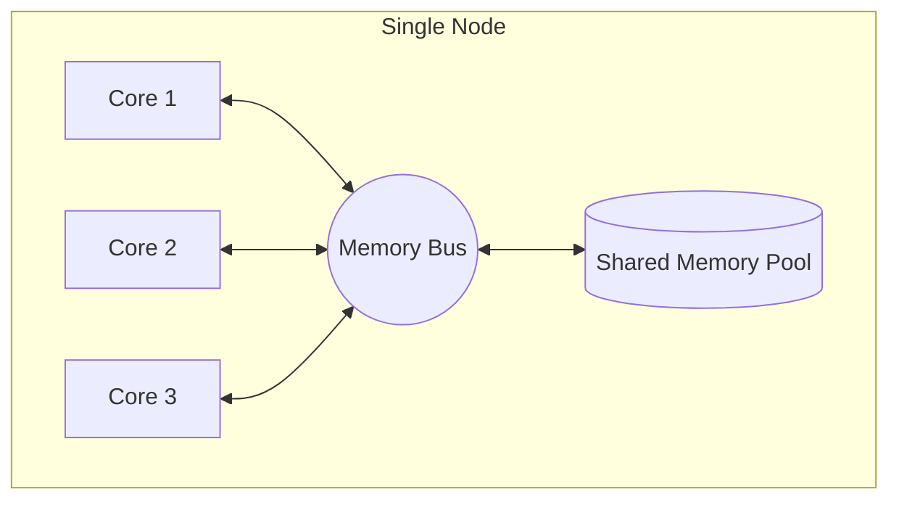
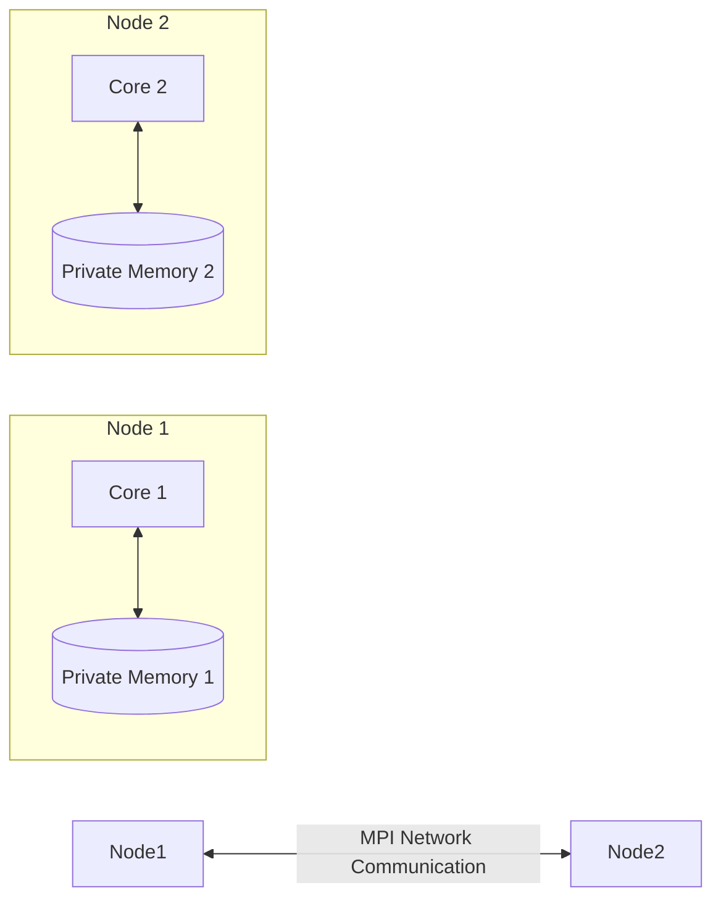

# 2. Parallel Memory Models

Understanding how processors access memory is the most critical step in parallel programming. There are three primary memory architectures you will encounter in High-Performance Computing (HPC).

## 1. Shared Memory Model
In a shared memory system, all processor cores share access to the **same global pool of memory** (RAM). This is the standard architecture found inside a single laptop, desktop, or an individual compute node within a supercomputer cluster.

* **Visibility:** Any change made to a memory location by one core is immediately visible to all other cores.
* **Programming Standard:** **OpenMP** (Open Multi-Processing) is the standard API used for shared-memory parallel programming. It is ideal for loop-level parallelization.

> [!example] Analogy: Shared Memory
> Imagine 8 workers (cores) sitting around a single large table. On the table is a stack of 1,000 satellite images (the shared memory). All workers can reach into the same stack, grab an image, and put it back. Because they share the table, if one worker draws on an image, all other workers can instantly see the drawing.

### Pros and Cons
* **Benefit:** Fast, seamless data sharing. You don't have to write code to move data around.
* **Drawback (Memory Contention):** As you add more cores, they all try to access the same memory bus simultaneously. This causes a traffic jam called **memory contention**, creating a severe performance bottleneck and limiting scalability.

## 2. Distributed Memory Model
In a distributed memory system, each core (or node) has its own **private, local memory**. Processors cannot directly access the memory of other processors. 

* **Communication:** If Core A needs data from Core B, Core A must explicitly ask for it, and Core B must explicitly send it over a physical network.
* **Programming Standard:** **MPI** (Message Passing Interface) is the standard protocol for distributed-memory parallelism.

> [!example] Analogy: Distributed Memory
> Imagine 8 workers, but this time they are in entirely different buildings (nodes). Each worker has their own small stack of 125 images in their own office (local memory). If Worker 1 needs to see an image from Worker 2, they cannot just look at it; they must scan it and email it over the internet (Network Communication via MPI).

### Pros and Cons
* **Benefit:** Excellent scalability. Because there is no shared memory bus, there is no memory contention. You can link thousands of nodes together.
* **Drawback:** Highly complex to program. The developer must manually dictate every instance of data packaging, sending, and receiving.

## 3. Hybrid Memory Model
Modern supercomputers almost exclusively use a **Hybrid Memory Architecture** to get the best of both worlds. 

* **How it works:** A supercomputer consists of thousands of distinct "nodes" connected by a network (Distributed). However, *inside* each node, there are multiple CPU cores sharing a single pool of RAM (Shared).
* **Programming:** To maximize efficiency, developers write code that uses OpenMP *within* the node (to avoid network overhead) and MPI *between* the nodes (to scale massively).

### Pros and Cons
* **Benefit:** Ultimate scalability combined with fast local sharing. It minimizes memory contention while allowing limitless hardware expansion.
* **Drawback:** The highest level of programming complexity, requiring mastery of both OpenMP and MPI in the same codebase.

> [!tip] Summary Table
> | Model | Benefit | Drawback | Standard API |
> | :--- | :--- | :--- | :--- |
> | **Shared** | Fast, easy data sharing | Memory contention limits scaling | OpenMP |
> | **Distributed** | Infinite scalability, no contention | Explicit network coding required | MPI |
> | **Hybrid** | Best scalability + fast local sharing | Must program in two paradigms at once | OpenMP + MPI |
