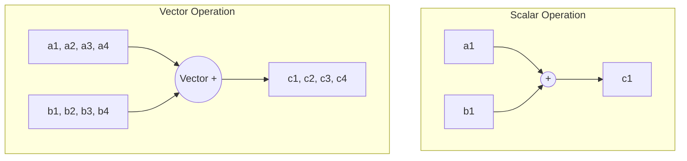

# 3. Data and Task Parallelism

Parallelism can generally be categorized by *what* is being distributed across the processors: the data itself, or the instructions (tasks) being performed.

## Data Parallelism
Data parallelism involves distributing chunks of a large dataset across multiple processors. Every processor executes the **exact same code**, but on **different pieces of data**.

> [!info] Array Example
> If you have an array `[a, b, c, d]`, Node 1 gets `[a, b]` and Node 2 gets `[c, d]`. Both nodes apply the exact same mathematical formula to their respective chunks.

### Forms of Data Parallelism

#### 1. SIMD (Single Instruction, Multiple Data)
SIMD operates at the deepest hardware level. It means the CPU carries out the *exact same instruction* simultaneously across multiple data points in a single clock cycle. This is also known as **Vectorization**.
* **Scalar Operation (Non-vectorized):** Adding `A + B` requires looping through every element one by one.
* **Vector Operation (SIMD):** Adding vectors `A + B` pushes chunks of the array into specialized CPU registers and adds them all at once.
* **Implementation:** Languages like Python (via NumPy) and R use vectorized operations under the hood. For compiled languages (C++, Fortran), the compiler automatically handles vectorization if you write clean loops and use specific compilation flags.

#### 2. SPMD (Single Program, Multiple Data)
SPMD is a higher-level software concept. You write one single script or program, and you run that identical program on multiple cores or nodes. The program uses logic (like checking its MPI Rank ID) to determine which slice of the dataset it should process. 
* **Example:** Calculating wind direction for thousands of coordinates. Every core runs `wind_calc.py`, but Core 0 processes coordinates 1-100, Core 1 processes 101-200, etc.

## Task Parallelism
Task parallelism involves distributing different *functions* or *instructions* across processors. They may be operating on the same data, but they are doing entirely different things.

* **Example:** In a weather application, Core 1 calculates Wind Speed, Core 2 calculates Humidity, and Core 3 calculates Atmospheric Pressure—all simultaneously for the same geographic area.

### Pipelining (A Strategy for Task Parallelism)
Pipelining is a specific form of task parallelism analogous to a factory assembly line. Data flows one way through a sequence of operations.
* Instead of Core 1 doing all three steps for Image A, then all three steps for Image B...
* **Core 1** Generates the image, passes it to **Core 2**, which Colors it, and passes it to **Core 3**, which Resizes it. 

## The Prerequisite for Parallelism: Independence
For code to be parallelized, the tasks **must be independent**. If one computation relies on the result of another, they cannot run at the same time.

> [!danger] The Loop Rule (Data Dependency)
> Iterations must **not** depend on previous results.
> 
> **NOT Parallel (Recursive Dependency):**
> `a[i] = a[i-1] + b[i]`
> *Core 2 cannot calculate `a[2]` until Core 1 finishes calculating `a[1]`.*
> 
> **Parallelizable (Independent):**
> `a[i] = b[i] + c[i]`
> *Core 1 and Core 2 can calculate `a[1]` and `a[2]` completely independently.*

## Implementation Tools
* **Compiled Languages (C++, Fortran):** Require explicit parallel programming via OpenMP (Shared) or MPI (Distributed), activated via compiler flags (e.g., `-fopenmp`).
* **Scripting Languages (Python, R):** Typically rely on specialized libraries (like `multiprocessing`, `mpi4py`, or built-in vectorization via `NumPy`) that abstract away the lower-level hardware management.
