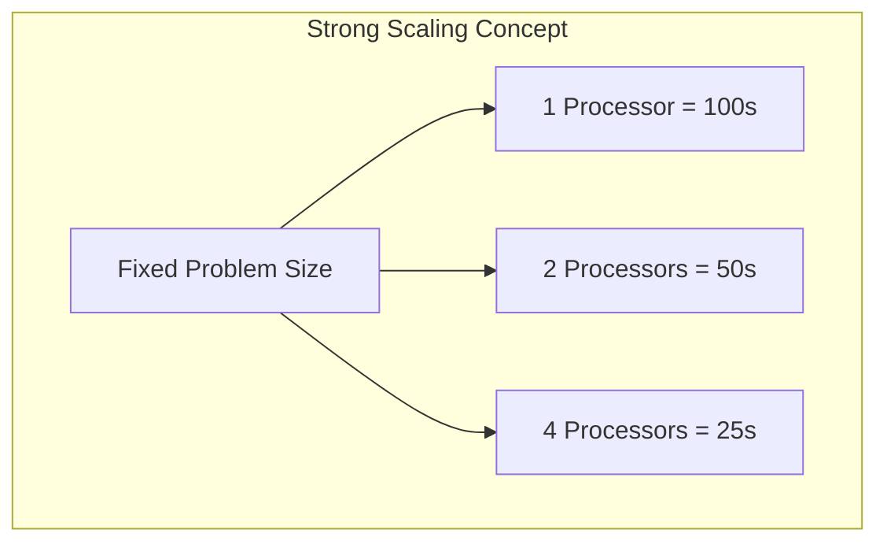
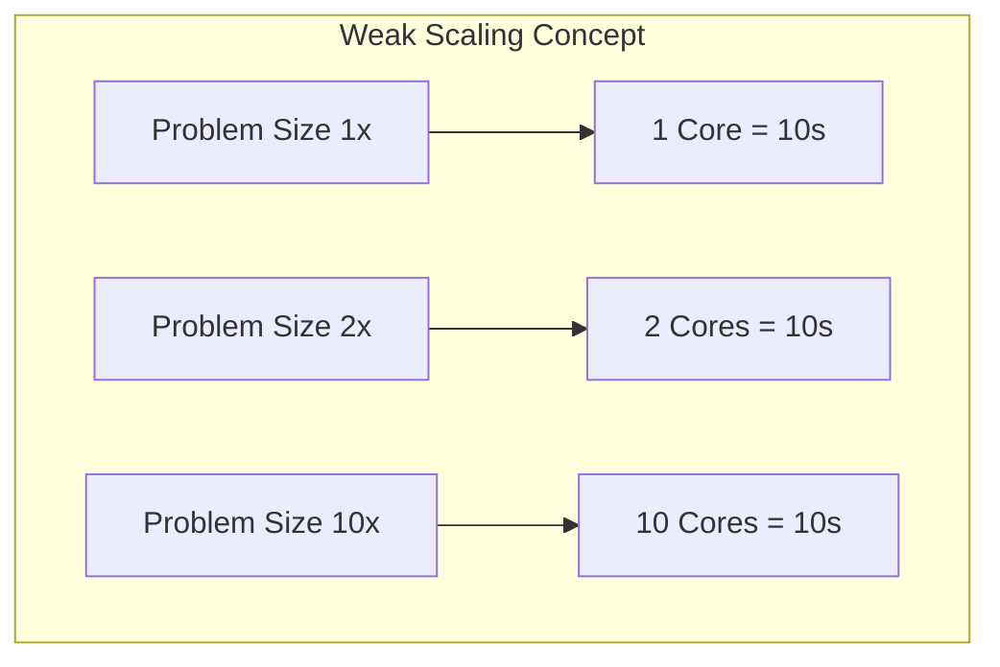

# 4. Quantifying Parallel Performance and Scaling

Converting serial code to parallel code is difficult, time-consuming, and prone to bugs. Before undertaking this effort, you must use predictive modeling to ensure the transition is computationally "worth it." We measure this using Speedup, Efficiency, and Scalability.

## Core Metrics

### 1. Speedup ($S$)
Speedup is the ratio of how long a program takes to run serially versus how long it takes to run in parallel. It answers the question: *How much faster did my code get?*

$$ S = \frac{T_s}{T_p} $$
* $T_s$: Execution time of the serial code.
* $T_p$: Execution time of the parallel code on $N$ processors.

**Ideal Case (Linear Speedup):** $S = N$. If you double the number of processors, the execution time should be cut exactly in half. (e.g., 4 processors yields a 4x speedup). In reality, this is rarely achieved due to overhead and serial code segments.

### 2. Parallel Efficiency ($E$)
Efficiency measures the fraction of time that processors are usefully utilized, rather than waiting or handling overhead. It answers the question: *Am I wasting hardware?*

$$ E = \frac{S}{N} = \frac{T_s}{N \times T_p} $$
* $N$: Number of processors.

**Linear Scaling:** A program that scales perfectly has an efficiency of 1.0 (or 100%).
**The Rule of Thumb:** In the HPC industry, you generally want your application to maintain an efficiency of **> 80%**. If efficiency drops below this, adding more cores is a waste of expensive resources.

## Scalability: Strong vs. Weak Scaling

Scalability measures how effectively a program can utilize an increasing number of processors. There are two distinct ways to evaluate this.

### Strong Scaling: "Can I get results faster?"
In Strong Scaling, the **total problem size is fixed**, and you increase the number of processors.
* **Goal:** Decrease the time-to-solution.
* **Analogy:** You have exactly one 1GB high-res video to process. You keep adding GPUs to see how fast you can get that single 1GB video finished.
* **Ideal Behavior:** Time to solution decreases as $1/N$. 
* **Reality:** Diminishing returns occur. Eventually, the problem is divided into such small pieces that the communication overhead (e.g., nodes talking to each other) takes longer than the actual computation.

### Weak Scaling: "Can I run a larger problem?"
In Weak Scaling, the **problem size increases proportionally** to the number of processors. The *work per core* remains constant.
* **Goal:** Solve a vastly larger problem in the same amount of time.
* **Analogy:** Monitoring security cameras. 1 core monitors 1 camera. If you add 99 more cameras, you add 99 more cores. 
* **Ideal Behavior:** The time-to-solution remains completely **constant** (independent of core count). 

> [!note] Amdahl's Law and Limits of Scalability
> *Background Concept:* Amdahl's Law dictates that the maximum theoretical speedup of a system is strictly limited by the portion of the code that *cannot* be parallelized. 
> * **Example:** If only 50% of your code is parallelizable, your maximum theoretical speedup is 2x—even if you throw one million processors at the problem.
