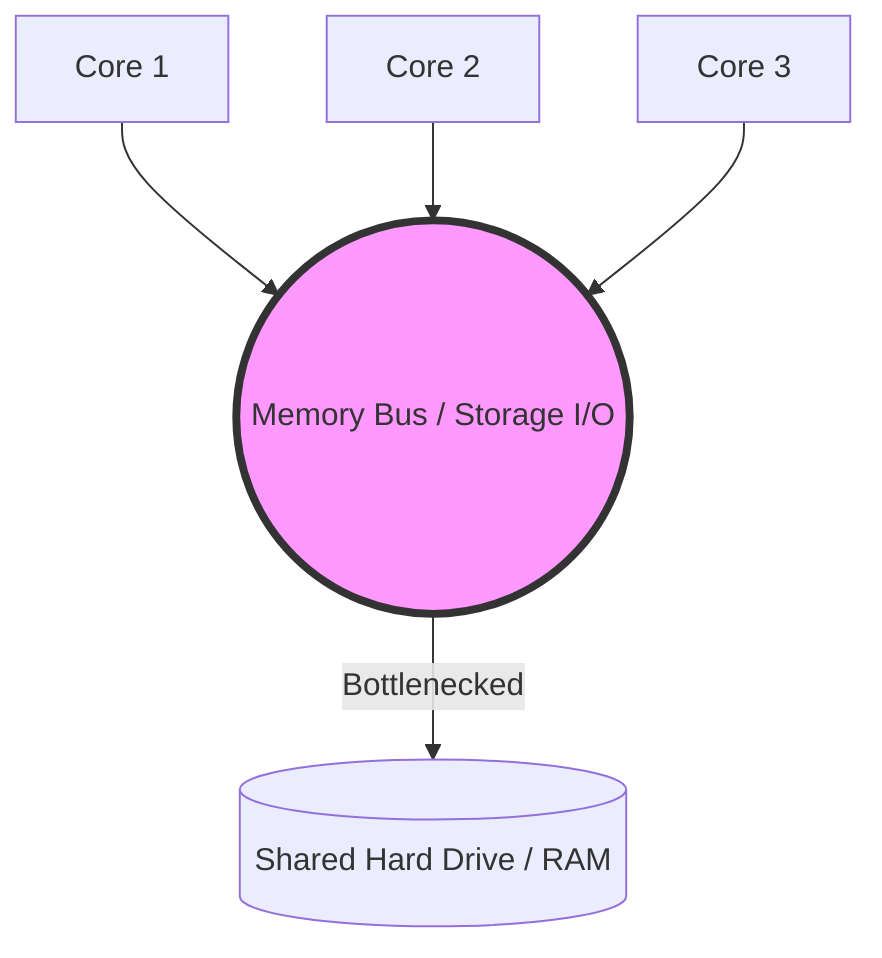

# 5. Fundamental Limits to Parallel Scaling

In theoretical models, scaling is often assumed to be linear. However, **the idealization gap** dictates that ideal scaling ($E=1.0$) is practically never achieved. Even highly optimized parallel code contains sequential segments and physical constraints. 

There are three primary categories of scalability obstacles: Algorithmic Dependencies, Systemic Bottlenecks, and Parallel Overheads.

## 1. Algorithmic Dependencies (Data Dependency)
Many algorithms require operations to be performed in a strict chronological order.
* **Image Filtering Example:** If applying a filter to a pixel requires the mathematical result of the pixel immediately to its left, you cannot parallelize the row. Core 2 cannot process Pixel 2 until Core 1 finishes Pixel 1.
* **Impact:** This forces processors to remain completely idle, acting as spectators while a single "master" thread computes the required sequential segment.

## 2. Systemic Bottlenecks
Hardware is finite. When parallel processes compete for finite physical resources, it forces them to queue up and access those resources sequentially. This is known as **Resource Serialization**.
* **Memory Bandwidth:** You might have 64 cores on a CPU, but they all share the same physical wires (the bus) to the RAM. If all 64 cores request massive blocks of data at once, the path to the RAM saturates. The cores must wait.
* **I/O Systems (Disk Reading/Writing):** If 1,000 MPI processes try to read a file from a standard, non-parallel file system, the hard drive can only serve a few requests at a time. The CPU cores will sit idle ("I/O bound") waiting for data to arrive from the disk.

## 3. Parallel Overheads

### Startup / Shutdown Overhead
Initializing a massive parallel environment takes time. Allocating memory for 1,000 MPI ranks, establishing network sockets, and distributing the initial instructions is costly. If the actual mathematical computation is very brief, the startup overhead will dominate the runtime, making parallelization useless.

### Inter-Process Communication (IPC) Latency
In distributed systems, nodes must exchange data. 
* **Computer Vision Context:** If Node 1 tracks a car moving out of its frame and into Node 2's frame, Node 1 must send the "bounding box" coordinates over the network. Network data transfer is orders of magnitude slower than CPU calculations.
* **Optimization Strategy:** Advanced programmers use "non-blocking" communications to hide latency—commanding the system to start transferring data in the background while the CPU moves on to calculate other independent tasks.

### Load Imbalance
This occurs when you have an **Asymmetric Work Distribution**. If some workers finish their tasks faster than others, they hit a synchronization point (a barrier) and sit idle, waiting for the slowest worker to finish.
* **Analogy:** 
    * Node 1 processes a video frame of a completely empty road. (Finishes in 1 millisecond).
    * Node 2 processes a video frame of a crowded intersection with 50 cars and pedestrians. (Finishes in 500 milliseconds).
* **Result:** Node 1 reaches the MPI barrier and idles (wasting CPU cycles) for 499 milliseconds while Node 2 struggles to finish.

```mermaid
gantt
    title Load Imbalance Demonstration
    dateFormat X
    axisFormat %s
    
    section Processors
    Rank 0 (Empty Road)     : done, 0, 1
    Rank 0 IDLE (Waiting)   : crit, 1, 10
    Rank 1 (Crowded Road)   : active, 0, 10
    
    section Synchronization
    Sync Point (Barrier) : milestone, 10, 10
```

