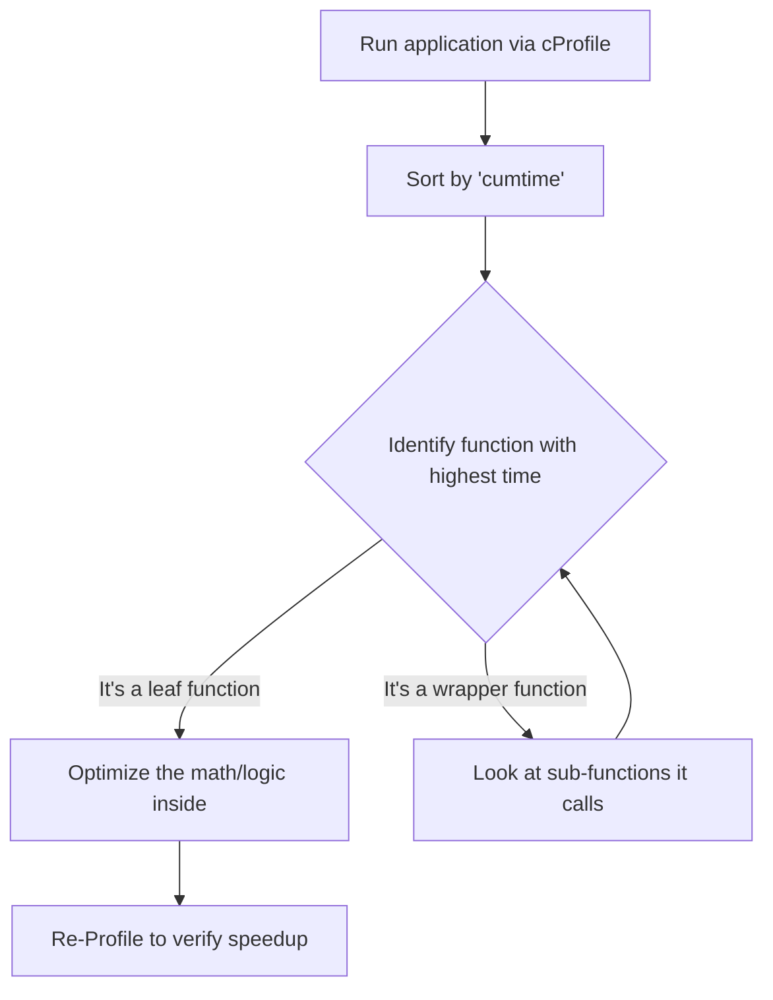

# 6. Program Profiling and Bottleneck Identification

> [!danger] Fundamental Rule of Optimization
> **Never** attempt to optimize an algorithm before performing an empirical profile. Guessing where your code is slow almost always leads to wasted time optimizing the wrong things.

## The Pareto Principle (The 80/20 Rule)
In High-Performance Computing, execution time is rarely distributed evenly. According to the Pareto Principle, **roughly 80% of a program's execution time is concentrated in only 20% of the code.**
* **The "Vital Few" Strategy:** Your goal is to identify that specific 20% (the bottleneck) and focus your development efforts exclusively there. This maximizes your Return on Investment (ROI) for time spent refactoring code.

## Introduction to Profilers
**Profiling** is the systematic measurement of a program's execution at runtime. A profiler uses instrumentation (diagnostic monitoring code) to measure the exact execution duration and call frequency of every constituent function in your application.

Additionally, high-performance compilers (like GCC for C/C++) can actually take the data generated by a profiler (`-fprofile-use`) to automatically optimize instruction scheduling and branch prediction during a second compilation.

## Profiling in Python: `profile` vs. `cProfile`
Python provides two primary built-in modules for deterministic, function-level profiling:

1. **`profile`:** Implemented in pure Python. It adds a significant amount of overhead to the execution. It is generally only used if you are building your own custom profiling tools and need to extend the module.
2. **`cProfile`:** A C-extension that provides **minimal overhead**. This is the standard tool used by professionals for long-running, high-performance simulations.

### Command-Line Implementation
To avoid altering your production source code, it is best practice to invoke the profiler directly from the command line.

```bash
python -m cProfile -s cumtime myscript.py
```
* `-m cProfile`: Runs the cProfile module.
* `-s cumtime`: Sorts the output by cumulative time (the most useful metric for finding bottlenecks).
* `-o [file]`: (Optional) Directs the diagnostic report to an external file instead of the terminal.

## Case Study: Interpreting the Output

### The Simulation Script
Consider this Python script simulating computational loads:
```python
import time

def fast():
    pass # Negligible computational cost

def slow():
    time.sleep(2) # Simulated heavy computation

def main():
    fast()
    slow()
    slow()

if __name__ == "__main__":
    main()
```

### The Tabular Diagnostic Output
Running `cProfile` generates a table. Understanding these columns is critical.

| ncalls | tottime | percall | cumtime | filename:lineno(function) |
| :--- | :--- | :--- | :--- | :--- |
| 1 | 0.000 | 0.000 | 2.009 | {built-in method exec} |
| 1 | 0.000 | 0.000 | 2.009 | simulation.py:8(main) |
| 2 | 0.000 | 0.000 | 2.009 | simulation.py:5(slow) |
| 2 | **2.009** | 1.004 | 2.009 | {built-in method time.sleep} |
| 1 | 0.000 | 0.000 | 0.000 | simulation.py:2(fast) |

### Interpreting the Columns
* **`ncalls`**: How many times the function was invoked. (e.g., `slow()` was called 2 times).
* **`tottime`**: The total duration spent **strictly within** the function itself, *excluding* any time spent in sub-functions it called. 
* **`cumtime` (Cumulative Time)**: The total duration spent in this function **AND all sub-functions it called**. 
    * *Tip: Look at `main()`. Its `tottime` is 0.000 because `main()` itself has no math in it; it just calls other functions. But its `cumtime` is 2.009s because that's the total runtime of the sub-functions.*
* **`percall`**: The average time per call. Calculated as `tottime / ncalls` or `cumtime / ncalls`.
* **`filename:lineno(function)`**: The exact location of the code to target for refactoring.

### Analysis Conclusion
By looking at the profile:
1. `slow()` was executed 2 times, each lasting ~1.005s.
2. The `tottime` shows that `time.sleep()` is the primary bottleneck.
3. `fast()` has negligible time.
**Action:** Performance tuning should ignore `fast()` completely and focus exclusively on reducing the sleep duration or finding a way to call `slow()` fewer times.


