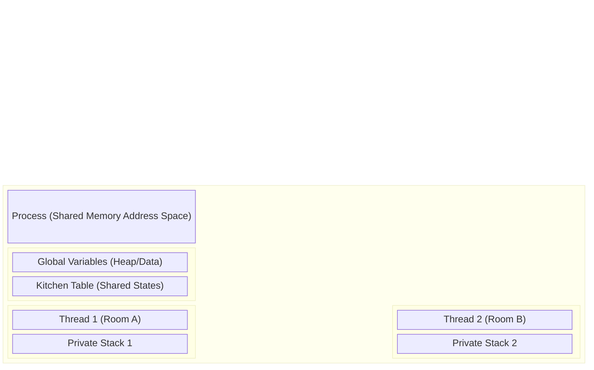
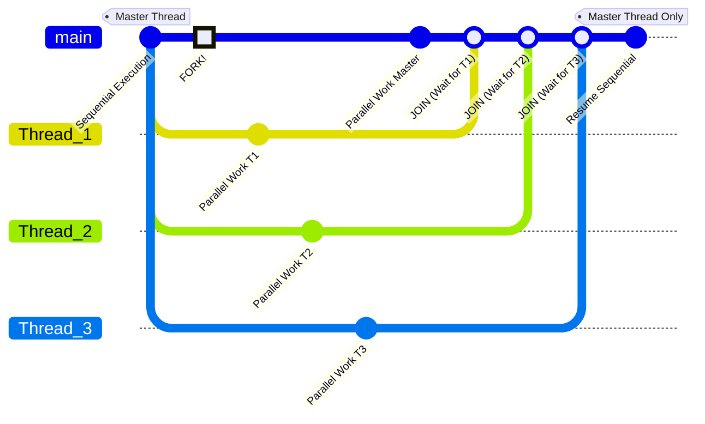

# Chapter 1. Foundations and Concepts

## 1. Process vs Thread Architecture
To understand how OpenMP optimizes computational workloads, you must first deeply understand the difference between **Processes** and **Threads** at the Operating System level.

### The Heavyweight Process (MPI Paradigm)
A **Process** is an independent, isolated execution environment created by the Operating System. When you run a program, the OS allocates a completely private memory address space (Heap, Stack, Code, Data) exclusively for that process.
* **Isolation:** Process A cannot read or write to Process B's memory. If Process A crashes, Process B is completely unaffected.
* **Creation Overhead:** Spawning a new process is expensive. The OS has to duplicate file descriptors, allocate new memory pages, and set up new tracking structures.
* **Communication:** Because processes are isolated, they must communicate over a network or via OS-level Inter-Process Communication (IPC). This is called **Message Passing** (used in MPI - Message Passing Interface) and is inherently slow due to data copying and network latency.

### The Lightweight Process: Threads (OpenMP Paradigm)
A **Thread** (often called a Lightweight Process or LWP) is the smallest sequence of programmed instructions that can be managed independently by the OS scheduler.
OpenMP achieves parallelism exclusively through threads. 
* **Shared Memory:** Multiple threads exist *within* the resources of a single parent process. They all share the same Code, Heap, and Global Data.
* **Lightweight:** Spawning a thread is extremely fast because the OS does not need to allocate a new memory address space; it only needs to assign a new Stack and register set for the thread.
* **Communication:** Threads communicate simply by reading and writing to the shared memory variables. This is instantaneous compared to network-based Message Passing.

### The Apartment Analogy
Imagine the **Process** as a shared student apartment:
* **Shared Memory (Common Areas):** The living room, kitchen, and bathroom. Every inhabitant (thread) can see and interact with the objects here (e.g., the TV, the kitchen table). If one thread moves the sofa, all other threads immediately see the new position.
* **Private Memory (Private Rooms):** Every student has their own bedroom. Things inside this room are strictly private. No other student can see or modify them. In threading, this represents the **Stack** (local variables).
* **Communication:** To communicate, a student leaves a note on the shared kitchen table. They don’t need to use a phone or walk outside (which would be the equivalent of network communication in MPI).



---

## 2. The OpenMP Fork-Join Model
OpenMP programs are built on the **Master-Worker Paradigm**, specifically utilizing the **Fork-Join execution model**.

### Step-by-Step Execution
1. **Sequential Start:** Every OpenMP program begins execution as a standard, single-threaded program. This initial thread is called the **Master Thread** (always assigned ID 0).
2. **The FORK:** When the Master Thread encounters a parallel directive (e.g., `#pragma omp parallel`), it generates a "team" of worker threads. The Master Thread becomes part of this team. The workload inside the parallel block is distributed among them.
3. **Parallel Execution:** All threads in the team execute the block of code simultaneously on different CPU cores.
4. **The JOIN:** At the end of the parallel block, there is an implicit **Barrier**. All threads wait here until the last thread finishes its work. Once all are done, the worker threads are suspended or destroyed, and the Master Thread continues executing the rest of the program sequentially.



> [!TIP] Hardware Mapping
> Typically, the OS maps the number of OpenMP threads directly to the number of physical or logical CPU cores. If you have an 8-core machine, generating 8 threads ensures a 1:1 map, maximizing efficiency. Generating 64 threads on an 8-core machine causes **oversubscription**, leading to massive context-switching overhead and terrible performance.

---

## 3. Compiling and Environment Control

### OpenMP is an API, not just a library
OpenMP (Open Multi-Processing) is an Application Program Interface composed of three distinct pillars:
1. **Compiler Directives (Pragmas):** `#pragma omp ...` These instruct the compiler on *how* to parallelize the code.
2. **Runtime Library Routines:** Functions like `omp_get_thread_num()` called during execution.
3. **Environment Variables:** External OS variables like `OMP_NUM_THREADS` that configure the runtime before execution.

### Enabling OpenMP (The Compiler Flag)
Because OpenMP heavily relies on Pragmas, it is fundamentally tied to your compiler. You **cannot** simply link it like a standard `.so` or `.dll` file. You must explicitly activate it using a compiler flag. 
* **GCC / Clang:** `gcc -fopenmp main.c -o my_app`
* **Intel (OneAPI):** `icx -qopenmp main.c -o my_app`

> [!WARNING] The Fallback Mechanism (Transparent Parallelism)
> If you forget the `-fopenmp` flag, the compiler will safely ignore the `#pragma` lines (treating them as comments). Your program will compile perfectly but will run **100% sequentially**. Always double-check your Makefile or build script!

### Including the Header
To access the Runtime Library Routines, you must include the header:
```c
#include <omp.h>
```
*Note: If your code uses absolutely no OpenMP functions (only `#pragma` directives), it will technically compile without this header. However, omitting it is terrible practice.*

### Querying the Environment
Inside a parallel region, threads need to know their identity.
* `omp_get_num_threads()`: Returns the total size of the current team.
* `omp_get_thread_num()`: Returns the specific ID (Rank) of the calling thread. Range is `0` to `N-1`. 

### Hierarchy of Thread Control
How does the program decide how many threads to spawn during a Fork? It follows a strict hierarchy of precedence (1 overrides 2, 2 overrides 3):
1. **Clause:** `#pragma omp parallel num_threads(4)` (Highest Priority)
2. **Runtime Call:** `omp_set_num_threads(4);` in the C code.
3. **Environment Variable:** `export OMP_NUM_THREADS=4` in the Linux terminal.
4. **System Default:** The number of logical cores on the machine. (Lowest Priority)

> [!CAUTION] The Sequential Query Mistake
> Calling `omp_get_num_threads()` *outside* a `#pragma omp parallel` block will **always return 1**, because outside the block, only the Master Thread exists. You must query the team size *inside* the parallel block!
