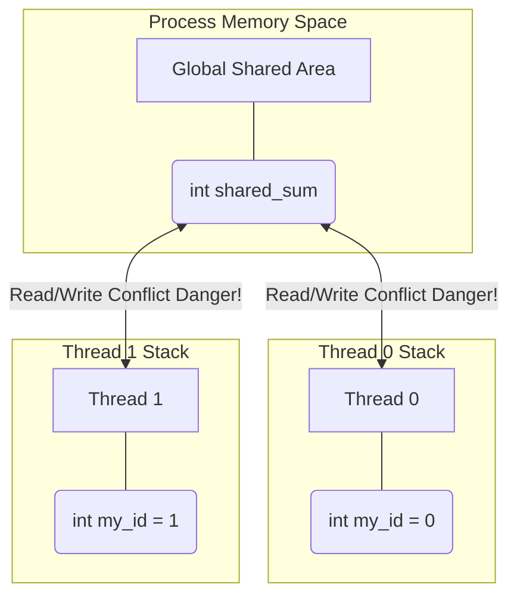

# Chapter 2. Data Environment and Variable Scoping

## 1. Shared vs Private Variables
Because threads live within the same process, variable scoping becomes the most critical part of OpenMP programming. Every variable accessed inside a parallel region must have a explicitly or implicitly defined **Data-Sharing Attribute**.

### Shared Variables
* **Definition:** There is exactly **one** memory location for this variable for the entire team of threads.
* **Behavior:** If Thread 0 writes a value to it, Thread 1 will instantly see that new value.
* **The Danger:** If multiple threads attempt to write to a shared variable at the exact same millisecond, you trigger a **Race Condition**, corrupting the data.

### Private Variables
* **Definition:** Every thread receives its very own, isolated local copy of the variable.
* **Behavior:** The variable is allocated on the individual thread's private Stack. If Thread A modifies its copy, Thread B knows nothing about it.
* **Initialization:** By default, private variables are **uninitialized** (they contain garbage memory), even if the original variable had a value before the parallel block.



### Implementing Scope via Clauses
You assign these attributes by attaching clauses to the `#pragma`.

```c
int a = 10;
int b = 20;

#pragma omp parallel private(a) shared(b)
{
    // 'a' is a brand new integer here. Its value is NOT 10. It is garbage data.
    // 'b' points directly to the original 'b' in the master thread.
    
    int tid = omp_get_thread_num(); // 'tid' is automatically private
    a = tid; // Perfectly safe
    b = b + a; // DANGEROUS! Race Condition on 'b'!
}
```

---

## 2. Firstprivate and Default None

### The `firstprivate` Clause
Sometimes you want the safety of a `private` variable, but you also want it to inherit the value it had right before the parallel block started.
`firstprivate(var)` instructs the compiler to:
1. Create a private copy of `var` on each thread's stack.
2. Initialize that private copy with the value of the original `var` from the Master thread.

```c
int factor = 5;

#pragma omp parallel firstprivate(factor)
{
    // Every thread starts with factor = 5.
    // They can modify it safely without affecting other threads.
    factor += omp_get_thread_num();
}
```

### The Best Practice: `default(none)`
If you do not explicitly define a scope, OpenMP attempts to guess. Generally, variables declared *outside* the block default to `shared`, and variables declared *inside* the block default to `private`. 
**Relying on these defaults is incredibly dangerous and leads to bugs that are near impossible to trace.**

Professional HPC developers always enforce explicit scoping using `default(none)`.

```c
int x, y, z;
// If you forget to list a variable in the clauses, 
// default(none) forces the compiler to throw an ERROR, saving you from a bug.
#pragma omp parallel default(none) shared(x, y) private(z)
{
    z = x + y;
}
```
