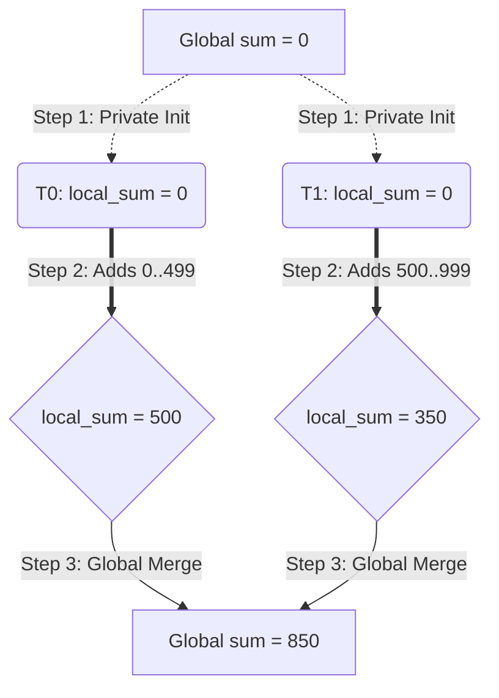

# Chapter 3. Work-Sharing Constructs

## 1. Loop Parallelization
Creating a team of threads is useless if they all execute the exact same instructions on the exact same data. We need to divide the work. The most common method in HPC is distributing the iterations of a `for` loop.

### The `#pragma omp parallel for` Directive
This combined directive does two things:
1. Performs a **Fork** (creates the threads).
2. Automatically partitions the loop iterations and assigns them to the available threads.

```c
#pragma omp parallel for
for (int i = 0; i < 1000; i++) {
    A[i] = B[i] + C[i];
}
```
*Behind the scenes:* If you have 4 threads, OpenMP automatically gives iterations 0–249 to T0, 250–499 to T1, etc.

### Rules of the Canonical Form
OpenMP is a compile-time tool. For it to partition a loop, it must be able to calculate the exact number of iterations *before* the loop even begins executing. This is called the **Canonical Form**.

* **Allowed:** Standard `for` loops with clear bounds and predictable increments (`i++`, `i--`, `i+=2`).
* **Forbidden:** 
    * `while` loops (end condition is unknown).
    * Loops with `break` or `return` inside them (creates premature exits).
    * Modifying the loop index variable (`i`) inside the loop body.

### Breaking Loop Dependencies
Iterations **must be independent**. If iteration `i` relies on the result of iteration `i-1`, this is a **Loop-Carried Dependency**. Parallelizing this will cause a Race Condition because Thread 1 might try to calculate `i=250` before Thread 0 has finished calculating `i=249`.

**Fixing Race Conditions (Breaking Dependencies):**
Sometimes dependencies are superficial. 
```c
// DANGEROUS: 'j' creates a race condition.
int j = 5;
#pragma omp parallel for
for (int i = 0; i < MAX; i++) {
    j += 2;
    A[i] = big(j);
}
```
*Solution:* Express the dependency mathematically based purely on the loop index `i`.
```c
// SAFE: Calculate 'j' independently for each iteration.
#pragma omp parallel for
for (int i = 0; i < MAX; i++) {
    int j = 5 + 2 * (i + 1); // 'j' is private and safe
    A[i] = big(j);
}
```

---

## 2. Reductions and Accumulators
The most famous dependency problem is the "Accumulator Problem," where we want to sum an array into a single shared variable.

### The Problem
```c
double total = 0.0;
#pragma omp parallel for
for (int i=0; i<1000; i++) {
    total += array[i]; // MASSIVE RACE CONDITION!
}
```

### The Solution: `reduction(operator:variable)`
The `reduction` clause is a piece of compiler magic that automates a 3-step safe summation protocol.

1. **Initialization:** The compiler creates a temporary, hidden `private` copy of the target variable for each thread. It initializes this copy to the mathematical identity of the operator (e.g., `0` for addition, `1` for multiplication).
2. **Local Accumulation:** Inside the loop, threads update their private, isolated copies. There are no locks, no waiting, and zero race conditions.
3. **Final Merge:** At the implicit barrier at the end of the loop, OpenMP safely locks the original shared variable and merges all the private copies into it using the specified operator.



**Common Reduction Operators:**
* Arithmetic: `+` (init 0), `*` (init 1), `-` (init 0)
* Logic/Bitwise: `&`, `|`, `^`
* Utility: `max` (init: smallest possible number), `min` (init: largest possible number)
[[Qs1]]
---

## 3. Loop Scheduling Policies
By default, OpenMP divides loop iterations into equal, predictable blocks. However, if some iterations take significantly longer to compute than others (e.g., rendering complex vs empty pixels in a raytracer), threads will finish at different times. 

Fast threads will hit the end-of-loop barrier and sit idle, wasting CPU cycles waiting for the slow thread. This is called a **Load Imbalance**. We solve this using the `schedule(type [,chunk])` clause.

### The Four Policies
1. **`schedule(static, chunk)`**: 
   * **Behavior:** Divides iterations into pieces of size `chunk` and deals them out round-robin style at compile-time.
   * **Pros:** Absolute lowest overhead. The compiler does the math once.
   * **Cons:** Cannot adapt if iterations vary wildly in execution time.
2. **`schedule(dynamic, chunk)`**:
   * **Behavior:** Acts like a central Task Queue. Threads are assigned one chunk. When they finish, they return to the queue and request another chunk.
   * **Pros:** Perfect load balancing. Fast threads dynamically steal more work.
   * **Cons:** High overhead due to the synchronization required to manage the shared task queue.
3. **`schedule(guided, chunk)`**:
   * **Behavior:** Similar to dynamic, but the chunk size starts huge and exponentially shrinks down to the minimum `chunk` size.
   * **Pros:** Greatly reduces the queue-management overhead of dynamic while still offering good load balancing at the end of the loop.
4. **`schedule(auto)`**:
   * **Behavior:** Gives full control to the compiler and runtime to pick the best strategy.

```mermaid
gantt
    title Static vs Dynamic Execution Timeline
    dateFormat  s
    axisFormat %S
    
    section STATIC (Imbalanced)
    Thread 0 (Idle waiting) : a1, 0, 3s
    Thread 1 (Heavy Work) : a2, 0, 7s
    Thread 2 (Idle waiting) : a3, 0, 4s
    
    section DYNAMIC (Balanced)
    Thread 0 : b1, 0, 3s
    Thread 0 (Takes more work) : b4, 3, 2s
    Thread 1 : b2, 0, 4s
    Thread 2 : b3, 0, 4s
    Thread 2 (Takes more work) : b5, 4, 1s
```


*Tip: If you profile your code and see a metric like "High Barrier Wait Time", your first step should be switching from static to dynamic scheduling.
