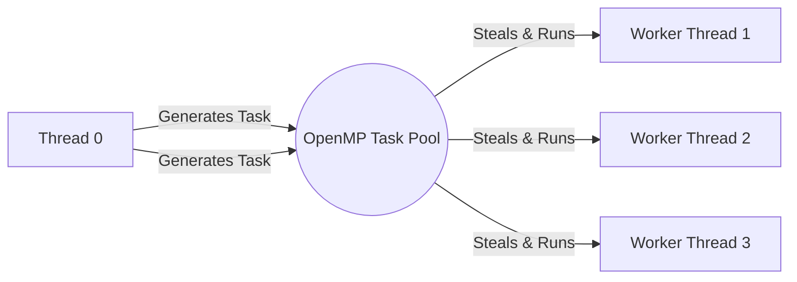

# Chapter 5. Task Parallelism

## 1. Introduction to OpenMP Tasks
Loop parallelization (`parallel for`) is great for **Data Parallelism**, but it has a fatal flaw: it requires the Canonical Form (predictable iterations). 

What if your workload is irregular?
* `while` loops (end condition unknown).
* Traversing complex data structures (Linked Lists, Trees, Graphs).
* Recursive algorithms (Divide-and-conquer like Quicksort).

To solve this, OpenMP 3.0 introduced **Task Parallelism**.

### What is a Task?
A Task is a specific instance of executable code and its data environment. Think of it like a sticky note with a recipe written on it. 
When a thread encounters a `#pragma omp task` directive, it packages the code inside that block into a "Task" and pushes it to a central **OpenMP Task Pool**.

**Work Stealing:** Idle threads constantly monitor this pool. When a thread has no work, it "steals" a pending task from the pool and executes it. This allows highly dynamic, asynchronous execution.



---

## 2. Task Synchronization and Execution

### The Single Creator Pattern
To prevent every thread in the team from generating the exact same tasks (which would result in executing the list $N$ times), we use the **Single Creator Pattern**. We combine `#pragma omp parallel` (to create the worker team) with `#pragma omp single` (so only ONE thread acts as the task generator).

### The Linked List Traversal
This is the canonical example of Tasking. Watch the variable scoping carefully:

```c
#pragma omp parallel 
{
    // Only one thread traverses the list to generate tasks
    #pragma omp single 
    {
        Node *p = head;
        while (p != NULL) {
            
            // Generate a task for this specific node
            #pragma omp task firstprivate(p)
            {
                process_heavy_work(p); // Executed later by any available worker thread
            }
            p = p->next; // Master moves to the next node immediately
        }
    } // Implicit barrier: all workers must finish all tasks before leaving
}
```

> [!CAUTION] Why `firstprivate(p)` is mandatory
> When the master thread generates the task, it pushes it to the pool and immediately executes `p = p->next;`. 
> If `p` was shared, by the time a worker thread pulls the task from the pool 50 milliseconds later, the master thread has already modified `p` to point to the end of the list! 
> `firstprivate(p)` takes a "snapshot" of the pointer at the exact moment the task is created, guaranteeing the worker processes the correct node.

### Taskwait for Recursion
When dealing with recursive tasks (like Fibonacci), a parent task often needs the mathematical result of its child tasks to compute its own final answer.
`#pragma omp taskwait` suspends the current thread until all **direct child tasks** it spawned have finished. Without this, the parent would try to return a sum using uncalculated variables.
