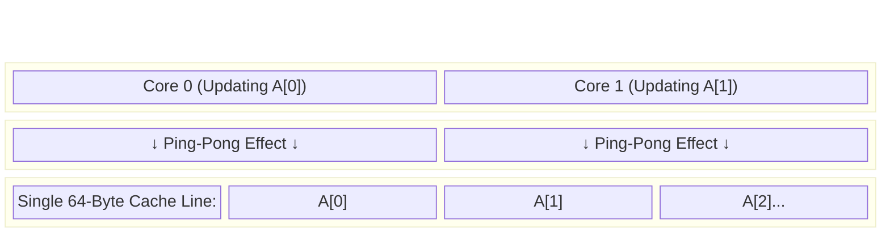

# Chapter 6. Advanced Topics and Optimization

## 1. Nested Parallelism and Loop Collapsing

### Nested Parallelism
Nested parallelism occurs when a thread that is already inside an active parallel region encounters another `#pragma omp parallel` directive, essentially forking a new sub-team of threads.

**The Default Danger:**
By default, OpenMP **disables** nested parallelism. If it encounters a nested fork, it will execute it sequentially with a team size of 1. 
Why? To prevent catastrophic **Oversubscription**. If you have an 8-core CPU, and your initial team of 8 threads each spawns a nested team of 8 threads, you suddenly have 64 active threads fighting for 8 cores. The OS context-switching overhead will grind your program to a halt.

If you strictly control hardware mapping (using NUMA nodes or Thread Affinity), you can enable it:
* Env Var: `export OMP_NESTED=true`
* C Runtime: `omp_set_max_active_levels(2);`

### Loop Collapsing: The Better Alternative
Often, developers try to use nested parallelism for multi-dimensional arrays (like Matrix multiplication). This is heavy and inefficient. 

Instead of nesting, use the `collapse(n)` clause. This instructs the compiler to logically fuse `n` nested loops into one massive, flat 1D loop, and distribute those iterations across a single team of threads.

```c
// Fuses a 10x10 matrix loop into a single loop of 100 iterations.
#pragma omp parallel for collapse(2)
for (int i=0; i<10; i++) {
    for (int j=0; j<10; j++) {
        Matrix[i][j] = i + j;
    }
}
```

---

## 2. False Sharing and Hardware Considerations

### The Hardware Trap
Sometimes, you write perfect OpenMP code. There are no race conditions, you used private variables, and your CPU usage is at 100%. Yet, the parallel version is *slower* than the sequential version.
You have likely fallen victim to **False Sharing**.

### How Caching Works
CPUs do not read single bytes from RAM. To be efficient, they load chunks of memory called **Cache Lines** (typically 64 bytes long) into the L1/L2 Cache.

### The Conflict
Imagine a shared array `A`. Thread 0 is responsible for updating `A[0]`, and Thread 1 is responsible for updating `A[1]`. There is no mathematical race condition here.
However, `A[0]` and `A[1]` sit right next to each other in memory. The CPU will load both into the exact same 64-byte Cache Line.

1. Thread 0 writes to `A[0]`.
2. At the hardware level, modifying any part of a cache line marks the *entire* 64-byte line as "Invalid" for all other cores.
3. Thread 1 tries to write to `A[1]`, but its cache line was just invalidated by Thread 0. Thread 1 has to suffer a massive latency penalty to reload the cache line from Main Memory.
4. Thread 1 writes to `A[1]`, invalidating Thread 0's cache.
This creates a devastating "Ping-Pong" effect across the system bus.



### How to fix it
1. **Use Reductions:** Reductions use completely isolated private variables that naturally sit far apart in memory (on different thread stacks).
2. **Padding:** If using shared arrays/structs, add "dummy" variables to artificially push the data elements so far apart that they are forced to load into different hardware cache lines.

```c
// Adding 8 Longs (64 bytes) of dummy data guarantees the next 'count' 
// is pushed completely off the current cache line.
struct {
    int count;
    long padding[8]; 
} counters[NUM_THREADS];
```

***

### Detecting Silent Killers (Tools)
Race conditions and False Sharing are silent. The compiler will not warn you. To detect them during your research or assignments, use dynamic analysis tools:
1. Compile with GCC's ThreadSanitizer: `gcc -fopenmp -fsanitize=thread main.c`
2. Run your application through **Valgrind Helgrind** or **Intel Inspector** to dynamically trace memory accesses and pinpoint the exact line of code causing the conflict.
