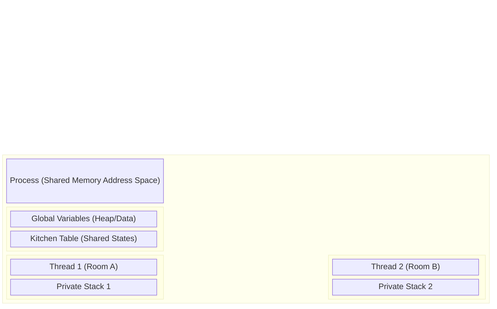
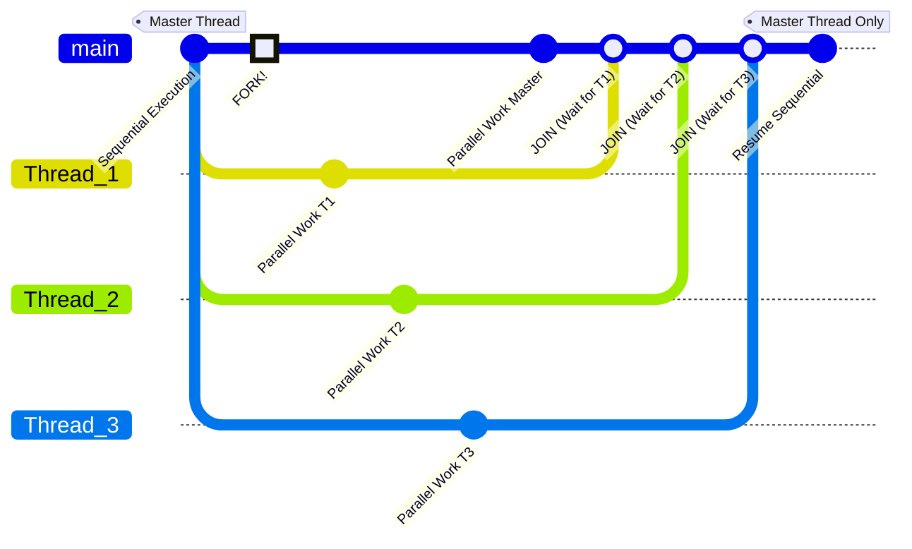
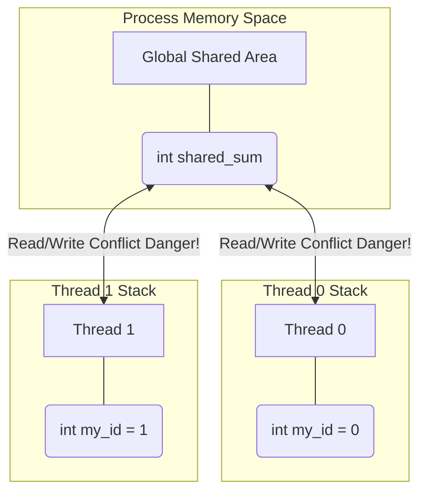
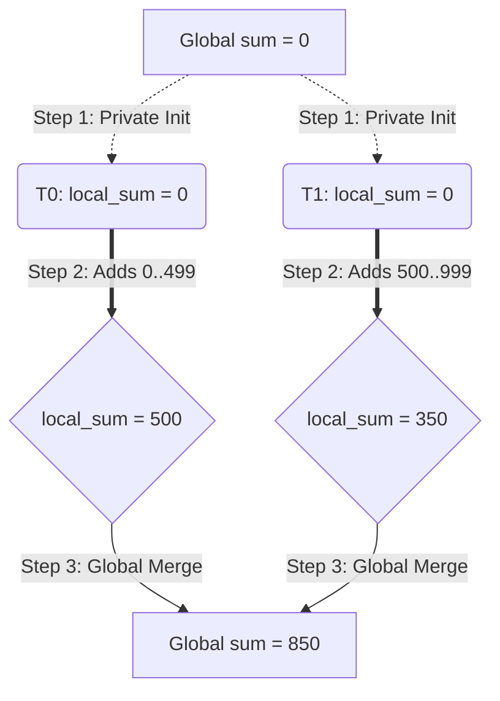
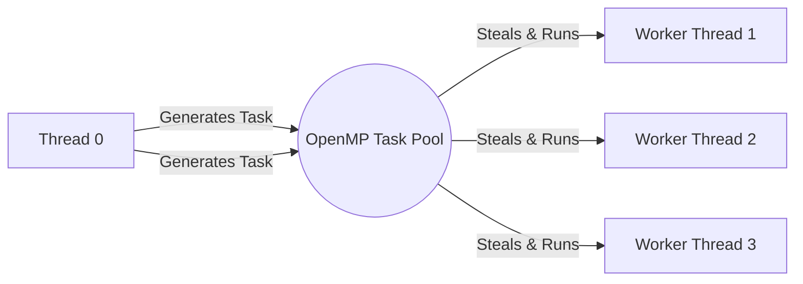
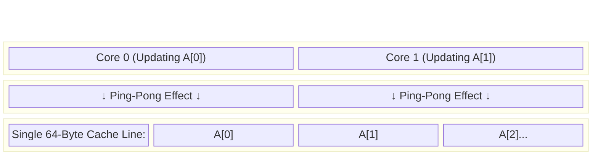

Here is the complete, extensively detailed, and structured Obsidian vault containing the notes for the High Performance Computing (OpenMP) course. 

I have expanded significantly on the core concepts, included the underlying OS knowledge necessary to truly grasp the material, added troubleshooting sections, and converted all visual analogies into high-quality Mermaid diagrams. 

***

# Vault Structure

```text
High Performance Computing {
    Chapter 1. Foundations and Concepts
        - 1. Process vs Thread Architecture
        - 2. The OpenMP Fork-Join Model
        - 3. Compiling and Environment Control

    Chapter 2. Data Environment and Variable Scoping
        - 1. Shared vs Private Variables
        - 2. Firstprivate and Default None

    Chapter 3. Work-Sharing Constructs
        - 1. Loop Parallelization
        - 2. Reductions and Accumulators
        - 3. Loop Scheduling Policies

    Chapter 4. Synchronization and Mutual Exclusion
        - 1. Race Conditions and Critical Regions
        - 2. Atomic Operations
        - 3. Barriers and Execution Constraints

    Chapter 5. Task Parallelism
        - 1. Introduction to OpenMP Tasks
        - 2. Task Synchronization and Execution

    Chapter 6. Advanced Topics and Optimization
        - 1. Nested Parallelism and Loop Collapsing
        - 2. False Sharing and Hardware Considerations
}
```

***

# Chapter 1. Foundations and Concepts

## 1. Process vs Thread Architecture
To understand how OpenMP optimizes computational workloads, you must first deeply understand the difference between **Processes** and **Threads** at the Operating System level.

### The Heavyweight Process (MPI Paradigm)
A **Process** is an independent, isolated execution environment created by the Operating System. When you run a program, the OS allocates a completely private memory address space (Heap, Stack, Code, Data) exclusively for that process.
* **Isolation:** Process A cannot read or write to Process B's memory. If Process A crashes, Process B is completely unaffected.
* **Creation Overhead:** Spawning a new process is expensive. The OS has to duplicate file descriptors, allocate new memory pages, and set up new tracking structures.
* **Communication:** Because processes are isolated, they must communicate over a network or via OS-level Inter-Process Communication (IPC). This is called **Message Passing** (used in MPI - Message Passing Interface) and is inherently slow due to data copying and network latency.

### The Lightweight Process: Threads (OpenMP Paradigm)
A **Thread** (often called a Lightweight Process or LWP) is the smallest sequence of programmed instructions that can be managed independently by the OS scheduler.
OpenMP achieves parallelism exclusively through threads. 
* **Shared Memory:** Multiple threads exist *within* the resources of a single parent process. They all share the same Code, Heap, and Global Data.
* **Lightweight:** Spawning a thread is extremely fast because the OS does not need to allocate a new memory address space; it only needs to assign a new Stack and register set for the thread.
* **Communication:** Threads communicate simply by reading and writing to the shared memory variables. This is instantaneous compared to network-based Message Passing.

### The Apartment Analogy
Imagine the **Process** as a shared student apartment:
* **Shared Memory (Common Areas):** The living room, kitchen, and bathroom. Every inhabitant (thread) can see and interact with the objects here (e.g., the TV, the kitchen table). If one thread moves the sofa, all other threads immediately see the new position.
* **Private Memory (Private Rooms):** Every student has their own bedroom. Things inside this room are strictly private. No other student can see or modify them. In threading, this represents the **Stack** (local variables).
* **Communication:** To communicate, a student leaves a note on the shared kitchen table. They don’t need to use a phone or walk outside (which would be the equivalent of network communication in MPI).



---

## 2. The OpenMP Fork-Join Model
OpenMP programs are built on the **Master-Worker Paradigm**, specifically utilizing the **Fork-Join execution model**.

### Step-by-Step Execution
1. **Sequential Start:** Every OpenMP program begins execution as a standard, single-threaded program. This initial thread is called the **Master Thread** (always assigned ID 0).
2. **The FORK:** When the Master Thread encounters a parallel directive (e.g., `#pragma omp parallel`), it generates a "team" of worker threads. The Master Thread becomes part of this team. The workload inside the parallel block is distributed among them.
3. **Parallel Execution:** All threads in the team execute the block of code simultaneously on different CPU cores.
4. **The JOIN:** At the end of the parallel block, there is an implicit **Barrier**. All threads wait here until the last thread finishes its work. Once all are done, the worker threads are suspended or destroyed, and the Master Thread continues executing the rest of the program sequentially.



> [!TIP] Hardware Mapping
> Typically, the OS maps the number of OpenMP threads directly to the number of physical or logical CPU cores. If you have an 8-core machine, generating 8 threads ensures a 1:1 map, maximizing efficiency. Generating 64 threads on an 8-core machine causes **oversubscription**, leading to massive context-switching overhead and terrible performance.

---

## 3. Compiling and Environment Control

### OpenMP is an API, not just a library
OpenMP (Open Multi-Processing) is an Application Program Interface composed of three distinct pillars:
1. **Compiler Directives (Pragmas):** `#pragma omp ...` These instruct the compiler on *how* to parallelize the code.
2. **Runtime Library Routines:** Functions like `omp_get_thread_num()` called during execution.
3. **Environment Variables:** External OS variables like `OMP_NUM_THREADS` that configure the runtime before execution.

### Enabling OpenMP (The Compiler Flag)
Because OpenMP heavily relies on Pragmas, it is fundamentally tied to your compiler. You **cannot** simply link it like a standard `.so` or `.dll` file. You must explicitly activate it using a compiler flag. 
* **GCC / Clang:** `gcc -fopenmp main.c -o my_app`
* **Intel (OneAPI):** `icx -qopenmp main.c -o my_app`

> [!WARNING] The Fallback Mechanism (Transparent Parallelism)
> If you forget the `-fopenmp` flag, the compiler will safely ignore the `#pragma` lines (treating them as comments). Your program will compile perfectly but will run **100% sequentially**. Always double-check your Makefile or build script!

### Including the Header
To access the Runtime Library Routines, you must include the header:
```c
#include <omp.h>
```
*Note: If your code uses absolutely no OpenMP functions (only `#pragma` directives), it will technically compile without this header. However, omitting it is terrible practice.*

### Querying the Environment
Inside a parallel region, threads need to know their identity.
* `omp_get_num_threads()`: Returns the total size of the current team.
* `omp_get_thread_num()`: Returns the specific ID (Rank) of the calling thread. Range is `0` to `N-1`. 

### Hierarchy of Thread Control
How does the program decide how many threads to spawn during a Fork? It follows a strict hierarchy of precedence (1 overrides 2, 2 overrides 3):
1. **Clause:** `#pragma omp parallel num_threads(4)` (Highest Priority)
2. **Runtime Call:** `omp_set_num_threads(4);` in the C code.
3. **Environment Variable:** `export OMP_NUM_THREADS=4` in the Linux terminal.
4. **System Default:** The number of logical cores on the machine. (Lowest Priority)

> [!CAUTION] The Sequential Query Mistake
> Calling `omp_get_num_threads()` *outside* a `#pragma omp parallel` block will **always return 1**, because outside the block, only the Master Thread exists. You must query the team size *inside* the parallel block!

***

# Chapter 2. Data Environment and Variable Scoping

## 1. Shared vs Private Variables
Because threads live within the same process, variable scoping becomes the most critical part of OpenMP programming. Every variable accessed inside a parallel region must have a explicitly or implicitly defined **Data-Sharing Attribute**.

### Shared Variables
* **Definition:** There is exactly **one** memory location for this variable for the entire team of threads.
* **Behavior:** If Thread 0 writes a value to it, Thread 1 will instantly see that new value.
* **The Danger:** If multiple threads attempt to write to a shared variable at the exact same millisecond, you trigger a **Race Condition**, corrupting the data.

### Private Variables
* **Definition:** Every thread receives its very own, isolated local copy of the variable.
* **Behavior:** The variable is allocated on the individual thread's private Stack. If Thread A modifies its copy, Thread B knows nothing about it.
* **Initialization:** By default, private variables are **uninitialized** (they contain garbage memory), even if the original variable had a value before the parallel block.



### Implementing Scope via Clauses
You assign these attributes by attaching clauses to the `#pragma`.

```c
int a = 10;
int b = 20;

#pragma omp parallel private(a) shared(b)
{
    // 'a' is a brand new integer here. Its value is NOT 10. It is garbage data.
    // 'b' points directly to the original 'b' in the master thread.
    
    int tid = omp_get_thread_num(); // 'tid' is automatically private
    a = tid; // Perfectly safe
    b = b + a; // DANGEROUS! Race Condition on 'b'!
}
```

---

## 2. Firstprivate and Default None

### The `firstprivate` Clause
Sometimes you want the safety of a `private` variable, but you also want it to inherit the value it had right before the parallel block started.
`firstprivate(var)` instructs the compiler to:
1. Create a private copy of `var` on each thread's stack.
2. Initialize that private copy with the value of the original `var` from the Master thread.

```c
int factor = 5;

#pragma omp parallel firstprivate(factor)
{
    // Every thread starts with factor = 5.
    // They can modify it safely without affecting other threads.
    factor += omp_get_thread_num();
}
```

### The Best Practice: `default(none)`
If you do not explicitly define a scope, OpenMP attempts to guess. Generally, variables declared *outside* the block default to `shared`, and variables declared *inside* the block default to `private`. 
**Relying on these defaults is incredibly dangerous and leads to bugs that are near impossible to trace.**

Professional HPC developers always enforce explicit scoping using `default(none)`.

```c
int x, y, z;
// If you forget to list a variable in the clauses, 
// default(none) forces the compiler to throw an ERROR, saving you from a bug.
#pragma omp parallel default(none) shared(x, y) private(z)
{
    z = x + y;
}
```

***

# Chapter 3. Work-Sharing Constructs

## 1. Loop Parallelization
Creating a team of threads is useless if they all execute the exact same instructions on the exact same data. We need to divide the work. The most common method in HPC is distributing the iterations of a `for` loop.

### The `#pragma omp parallel for` Directive
This combined directive does two things:
1. Performs a **Fork** (creates the threads).
2. Automatically partitions the loop iterations and assigns them to the available threads.

```c
#pragma omp parallel for
for (int i = 0; i < 1000; i++) {
    A[i] = B[i] + C[i];
}
```
*Behind the scenes:* If you have 4 threads, OpenMP automatically gives iterations 0–249 to T0, 250–499 to T1, etc.

### Rules of the Canonical Form
OpenMP is a compile-time tool. For it to partition a loop, it must be able to calculate the exact number of iterations *before* the loop even begins executing. This is called the **Canonical Form**.

* **Allowed:** Standard `for` loops with clear bounds and predictable increments (`i++`, `i--`, `i+=2`).
* **Forbidden:** 
    * `while` loops (end condition is unknown).
    * Loops with `break` or `return` inside them (creates premature exits).
    * Modifying the loop index variable (`i`) inside the loop body.

### Breaking Loop Dependencies
Iterations **must be independent**. If iteration `i` relies on the result of iteration `i-1`, this is a **Loop-Carried Dependency**. Parallelizing this will cause a Race Condition because Thread 1 might try to calculate `i=250` before Thread 0 has finished calculating `i=249`.

**Fixing Race Conditions (Breaking Dependencies):**
Sometimes dependencies are superficial. 
```c
// DANGEROUS: 'j' creates a race condition.
int j = 5;
#pragma omp parallel for
for (int i = 0; i < MAX; i++) {
    j += 2;
    A[i] = big(j);
}
```
*Solution:* Express the dependency mathematically based purely on the loop index `i`.
```c
// SAFE: Calculate 'j' independently for each iteration.
#pragma omp parallel for
for (int i = 0; i < MAX; i++) {
    int j = 5 + 2 * (i + 1); // 'j' is private and safe
    A[i] = big(j);
}
```

---

## 2. Reductions and Accumulators
The most famous dependency problem is the "Accumulator Problem," where we want to sum an array into a single shared variable.

### The Problem
```c
double total = 0.0;
#pragma omp parallel for
for (int i=0; i<1000; i++) {
    total += array[i]; // MASSIVE RACE CONDITION!
}
```

### The Solution: `reduction(operator:variable)`
The `reduction` clause is a piece of compiler magic that automates a 3-step safe summation protocol.

1. **Initialization:** The compiler creates a temporary, hidden `private` copy of the target variable for each thread. It initializes this copy to the mathematical identity of the operator (e.g., `0` for addition, `1` for multiplication).
2. **Local Accumulation:** Inside the loop, threads update their private, isolated copies. There are no locks, no waiting, and zero race conditions.
3. **Final Merge:** At the implicit barrier at the end of the loop, OpenMP safely locks the original shared variable and merges all the private copies into it using the specified operator.



**Common Reduction Operators:**
* Arithmetic: `+` (init 0), `*` (init 1), `-` (init 0)
* Logic/Bitwise: `&`, `|`, `^`
* Utility: `max` (init: smallest possible number), `min` (init: largest possible number)

---

## 3. Loop Scheduling Policies
By default, OpenMP divides loop iterations into equal, predictable blocks. However, if some iterations take significantly longer to compute than others (e.g., rendering complex vs empty pixels in a raytracer), threads will finish at different times. 

Fast threads will hit the end-of-loop barrier and sit idle, wasting CPU cycles waiting for the slow thread. This is called a **Load Imbalance**. We solve this using the `schedule(type [,chunk])` clause.

### The Four Policies
1. **`schedule(static, chunk)`**: 
   * **Behavior:** Divides iterations into pieces of size `chunk` and deals them out round-robin style at compile-time.
   * **Pros:** Absolute lowest overhead. The compiler does the math once.
   * **Cons:** Cannot adapt if iterations vary wildly in execution time.
2. **`schedule(dynamic, chunk)`**:
   * **Behavior:** Acts like a central Task Queue. Threads are assigned one chunk. When they finish, they return to the queue and request another chunk.
   * **Pros:** Perfect load balancing. Fast threads dynamically steal more work.
   * **Cons:** High overhead due to the synchronization required to manage the shared task queue.
3. **`schedule(guided, chunk)`**:
   * **Behavior:** Similar to dynamic, but the chunk size starts huge and exponentially shrinks down to the minimum `chunk` size.
   * **Pros:** Greatly reduces the queue-management overhead of dynamic while still offering good load balancing at the end of the loop.
4. **`schedule(auto)`**:
   * **Behavior:** Gives full control to the compiler and runtime to pick the best strategy.

```mermaid
gantt
    title Static vs Dynamic Execution Timeline
    dateFormat  s
    axisFormat %S
    
    section STATIC (Imbalanced)
    Thread 0 (Idle waiting) : a1, 0, 3s
    Thread 1 (Heavy Work) : a2, 0, 7s
    Thread 2 (Idle waiting) : a3, 0, 4s
    
    section DYNAMIC (Balanced)
    Thread 0 : b1, 0, 3s
    Thread 0 (Takes more work) : b4, 3, 2s
    Thread 1 : b2, 0, 4s
    Thread 2 : b3, 0, 4s
    Thread 2 (Takes more work) : b5, 4, 1s
```


*Tip: If you profile your code and see a metric like "High Barrier Wait Time", your first step should be switching from static to dynamic scheduling.*

***

# Chapter 4. Synchronization and Mutual Exclusion

## 1. Race Conditions and Critical Regions
When you cannot break a dependency or use a reduction, you must enforce **Mutual Exclusion**—ensuring only one thread can access a resource at a time.

### `#pragma omp critical`
A Critical Region defines a block of code that allows only one thread to enter at a time.
* If Thread 1 is inside the critical block, Thread 2 must pause and wait outside until Thread 1 completely exits the block.
* **Pros:** Can contain any valid C code, multiple variables, array updates, or heavy function calls.
* **Cons (The Serialization Trap):** It forces parallel threads to operate sequentially. If heavily used inside a loop, it will completely destroy your performance, making the code run *slower* than a non-parallelized program due to locking overhead.

```c
#pragma omp parallel
{
    double local_res = do_heavy_math();
    
    #pragma omp critical
    {
        // Only one thread allowed in here at a time!
        global_sum += local_res;
        log_to_file("Added to sum");
    }
}
```

---

## 2. Atomic Operations
For incredibly simple operations (like incrementing a counter), using a `critical` block is overkill. Instead, we use `#pragma omp atomic`.

### How it works
Atomic operations do not use software locks. They leverage specialized, low-level **Hardware Instructions** on the CPU to ensure the memory update happens in a single, uninterruptible clock cycle.

* **Restrictions:** It only applies to the **single statement** immediately following it. It only supports basic updates: `x++`, `x += expr`, `x *= expr`, etc.
* **Performance:** Vastly superior to `critical`.

> [!TIP] The Hierarchy of Choice
> When faced with a shared variable update, follow this order of preference:
> 1. Can I use a **Reduction**? If yes, do it. It is the fastest.
> 2. Can I use an **Atomic** operation? If yes, use it.
> 3. Use **Critical** only as a last resort for complex logic.

---

## 3. Barriers and Execution Constraints

### The Barrier Concept
A barrier is a synchronization point where threads must stop and wait. No thread is allowed to execute the code past the barrier until *every single thread* in the team has arrived at the barrier.

**Implicit Barriers:**
OpenMP is designed to be safe by default. It automatically inserts hidden barriers at the end of:
* `#pragma omp parallel` regions.
* `#pragma omp for` loops.
* `#pragma omp single` blocks.

**Explicit Barriers:**
If you have complex logic requiring synchronization *inside* a continuous parallel block, you can manually trigger one:
`#pragma omp barrier`

### Thread-Specific Constraints: `master` vs `single`
Sometimes, you want only one thread to do a specific job (like printing a report or initializing a library) while the rest of the team is active.

1. **`#pragma omp master`**
   * Executes **only** by Thread 0.
   * **NO implicit barrier** at the end. The other threads will simply skip this block and keep running at full speed.
2. **`#pragma omp single`**
   * Executes by the **first thread that arrives** at the block (could be T0, T3, whoever gets there first).
   * **HAS an implicit barrier** at the end. All other threads will wait at the end of this block until the chosen thread finishes the task.

### Removing Barriers: The `nowait` clause
If you have two completely independent loops back-to-back, the implicit barrier at the end of the first loop is a waste of time. You can remove it using the `nowait` clause.

```c
#pragma omp parallel
{
    // Threads will finish their chunk of this loop, and immediately move on.
    #pragma omp for nowait
    for(int i=0; i<N; i++) A[i] = i*2;
    
    // SAFE: Array B only relies on Array C, not Array A.
    #pragma omp for
    for(int i=0; i<N; i++) B[i] = C[i] + 5; 
}
```

> [!WARNING] The Danger of Nowait
> Only use `nowait` if there are absolutely ZERO data dependencies between the two loops. If Loop 2 tries to read a variable calculated in Loop 1, and a fast thread has bypassed the barrier, it will read uncalculated, garbage data!

***

# Chapter 5. Task Parallelism

## 1. Introduction to OpenMP Tasks
Loop parallelization (`parallel for`) is great for **Data Parallelism**, but it has a fatal flaw: it requires the Canonical Form (predictable iterations). 

What if your workload is irregular?
* `while` loops (end condition unknown).
* Traversing complex data structures (Linked Lists, Trees, Graphs).
* Recursive algorithms (Divide-and-conquer like Quicksort).

To solve this, OpenMP 3.0 introduced **Task Parallelism**.

### What is a Task?
A Task is a specific instance of executable code and its data environment. Think of it like a sticky note with a recipe written on it. 
When a thread encounters a `#pragma omp task` directive, it packages the code inside that block into a "Task" and pushes it to a central **OpenMP Task Pool**.

**Work Stealing:** Idle threads constantly monitor this pool. When a thread has no work, it "steals" a pending task from the pool and executes it. This allows highly dynamic, asynchronous execution.



---

## 2. Task Synchronization and Execution

### The Single Creator Pattern
To prevent every thread in the team from generating the exact same tasks (which would result in executing the list $N$ times), we use the **Single Creator Pattern**. We combine `#pragma omp parallel` (to create the worker team) with `#pragma omp single` (so only ONE thread acts as the task generator).

### The Linked List Traversal
This is the canonical example of Tasking. Watch the variable scoping carefully:

```c
#pragma omp parallel 
{
    // Only one thread traverses the list to generate tasks
    #pragma omp single 
    {
        Node *p = head;
        while (p != NULL) {
            
            // Generate a task for this specific node
            #pragma omp task firstprivate(p)
            {
                process_heavy_work(p); // Executed later by any available worker thread
            }
            p = p->next; // Master moves to the next node immediately
        }
    } // Implicit barrier: all workers must finish all tasks before leaving
}
```

> [!CAUTION] Why `firstprivate(p)` is mandatory
> When the master thread generates the task, it pushes it to the pool and immediately executes `p = p->next;`. 
> If `p` was shared, by the time a worker thread pulls the task from the pool 50 milliseconds later, the master thread has already modified `p` to point to the end of the list! 
> `firstprivate(p)` takes a "snapshot" of the pointer at the exact moment the task is created, guaranteeing the worker processes the correct node.

### Taskwait for Recursion
When dealing with recursive tasks (like Fibonacci), a parent task often needs the mathematical result of its child tasks to compute its own final answer.
`#pragma omp taskwait` suspends the current thread until all **direct child tasks** it spawned have finished. Without this, the parent would try to return a sum using uncalculated variables.

***

# Chapter 6. Advanced Topics and Optimization

## 1. Nested Parallelism and Loop Collapsing

### Nested Parallelism
Nested parallelism occurs when a thread that is already inside an active parallel region encounters another `#pragma omp parallel` directive, essentially forking a new sub-team of threads.

**The Default Danger:**
By default, OpenMP **disables** nested parallelism. If it encounters a nested fork, it will execute it sequentially with a team size of 1. 
Why? To prevent catastrophic **Oversubscription**. If you have an 8-core CPU, and your initial team of 8 threads each spawns a nested team of 8 threads, you suddenly have 64 active threads fighting for 8 cores. The OS context-switching overhead will grind your program to a halt.

If you strictly control hardware mapping (using NUMA nodes or Thread Affinity), you can enable it:
* Env Var: `export OMP_NESTED=true`
* C Runtime: `omp_set_max_active_levels(2);`

### Loop Collapsing: The Better Alternative
Often, developers try to use nested parallelism for multi-dimensional arrays (like Matrix multiplication). This is heavy and inefficient. 

Instead of nesting, use the `collapse(n)` clause. This instructs the compiler to logically fuse `n` nested loops into one massive, flat 1D loop, and distribute those iterations across a single team of threads.

```c
// Fuses a 10x10 matrix loop into a single loop of 100 iterations.
#pragma omp parallel for collapse(2)
for (int i=0; i<10; i++) {
    for (int j=0; j<10; j++) {
        Matrix[i][j] = i + j;
    }
}
```

---

## 2. False Sharing and Hardware Considerations

### The Hardware Trap
Sometimes, you write perfect OpenMP code. There are no race conditions, you used private variables, and your CPU usage is at 100%. Yet, the parallel version is *slower* than the sequential version.
You have likely fallen victim to **False Sharing**.

### How Caching Works
CPUs do not read single bytes from RAM. To be efficient, they load chunks of memory called **Cache Lines** (typically 64 bytes long) into the L1/L2 Cache.

### The Conflict
Imagine a shared array `A`. Thread 0 is responsible for updating `A[0]`, and Thread 1 is responsible for updating `A[1]`. There is no mathematical race condition here.
However, `A[0]` and `A[1]` sit right next to each other in memory. The CPU will load both into the exact same 64-byte Cache Line.

1. Thread 0 writes to `A[0]`.
2. At the hardware level, modifying any part of a cache line marks the *entire* 64-byte line as "Invalid" for all other cores.
3. Thread 1 tries to write to `A[1]`, but its cache line was just invalidated by Thread 0. Thread 1 has to suffer a massive latency penalty to reload the cache line from Main Memory.
4. Thread 1 writes to `A[1]`, invalidating Thread 0's cache.
This creates a devastating "Ping-Pong" effect across the system bus.



### How to fix it
1. **Use Reductions:** Reductions use completely isolated private variables that naturally sit far apart in memory (on different thread stacks).
2. **Padding:** If using shared arrays/structs, add "dummy" variables to artificially push the data elements so far apart that they are forced to load into different hardware cache lines.

```c
// Adding 8 Longs (64 bytes) of dummy data guarantees the next 'count' 
// is pushed completely off the current cache line.
struct {
    int count;
    long padding[8]; 
} counters[NUM_THREADS];
```

***

### Detecting Silent Killers (Tools)
Race conditions and False Sharing are silent. The compiler will not warn you. To detect them during your research or assignments, use dynamic analysis tools:
1. Compile with GCC's ThreadSanitizer: `gcc -fopenmp -fsanitize=thread main.c`
2. Run your application through **Valgrind Helgrind** or **Intel Inspector** to dynamically trace memory accesses and pinpoint the exact line of code causing the conflict.