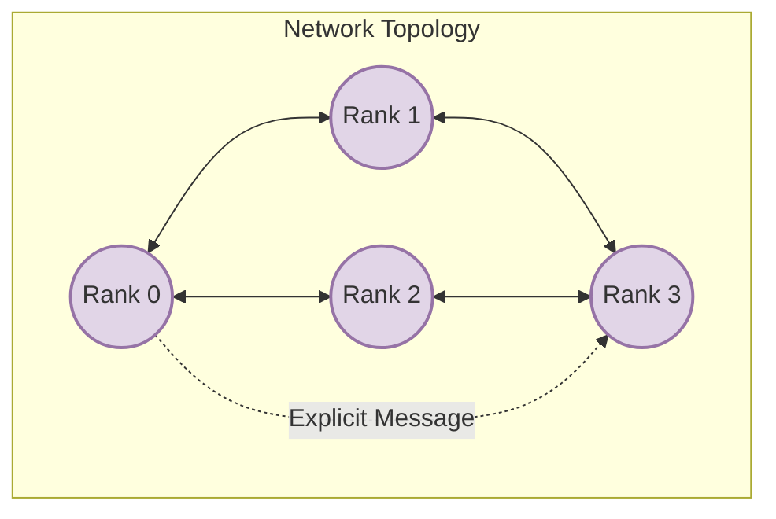
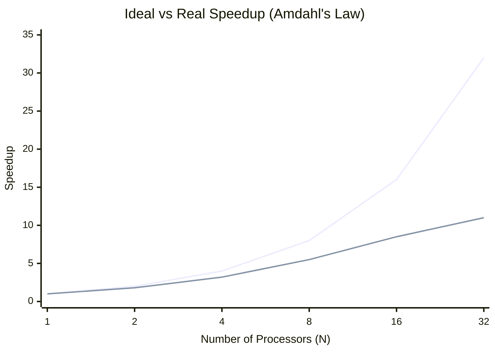

# Chapter 1: Foundations of Parallel Computing

## 1.1. Why Parallel Computing Matters

> [!info] Background Knowledge: The Need for Speed
> In the early days of computing, processors became faster every year due to increases in clock speed (Moore's Law). However, physical limits—primarily heat dissipation and quantum tunneling—forced the industry to stop increasing clock speeds and instead increase the *number of processing cores*. To take advantage of modern hardware, code must be written to execute in parallel.

### The Three Main Drivers of Parallel Computing

1. **Computational Bottlenecks:**
   Complex simulations (like Molecular Dynamics, STF-Trans, or computational fluid dynamics) require trillions of mathematical operations. On a single CPU core, executing sequentially, these can take weeks, months, or even years. By splitting the problem across thousands of cores, we reduce runtime to hours or days.
2. **Memory Limitations:**
   A single standard workstation typically has between 16 GB to 128 GB of RAM. However, large datasets (e.g., massive climate models, remote sensing satellite data, deep learning training sets) can easily reach terabytes. Parallel computing allows us to pool the RAM of hundreds of interconnected machines to hold datasets that simply cannot fit into a single machine.
3. **Real-World Applications:**
   Modern scientific computing relies on HPC for:
   *   *Climate Modeling*: Simulating global weather patterns over decades.
   *   *Molecular Dynamics*: Simulating atomic interactions to design new drugs.
   *   *Remote Sensing*: Processing high-resolution images from satellites.

### Serial vs Parallel Execution

```mermaid
gantt
    title Serial vs Parallel Execution Time
    dateFormat  s
    axisFormat %s
    
    section Serial Execution
    Task 1 (T1) :a1, 0, 3s
    Task 2 (T2) :a2, after a1, 3s
    Task 3 (T3) :a3, after a2, 3s
    
    section Parallel Execution
    Task 1 (T1) :b1, 0, 3s
    Task 2 (T2) :b2, 0, 3s
    Task 3 (T3) :b3, 0, 3s
```

> [!tip] The Core Concept
> In the parallel model, tasks T1, T2, and T3 run simultaneously. The **Time Saved** is the difference between the total serial runtime and the longest parallel task runtime.

---

## 1.2. The Distributed Memory Model

To scale beyond a single motherboard, supercomputers use a **Distributed Memory Architecture**. 

### The Paradigm
* **Private Address Space:** Each process (or "rank") runs in total isolation. Process 0 cannot natively read a variable stored in Process 1's RAM. They are entirely separate entities, often physically located on different motherboards (nodes).
* **Explicit Message Passing:** Because memory is private, data must be actively packaged by the sender and actively received by a receiver over a physical network (like Ethernet or InfiniBand). This is called explicit message passing.

### Terminology

* **Rank:** The unique identifier given to a process. If you launch a program with $N$ processes, they are numbered from $0$ to $N - 1$.
* **Communicator:** A conceptual grouping of processes. A message is sent within the context of a communicator.

> [!warning] A Common Pitfall
> Programmers coming from multithreading (like Java threads or OpenMP) often assume variables are shared. In MPI, if Rank 0 modifies `x = 5`, `x` remains unchanged for Rank 1 unless Rank 0 explicitly sends `x` to Rank 1.

---

## 1.3. Parallel Performance Concepts

To measure how well a parallel program performs, we look at scaling and overhead.

### Scaling Types
1. **Strong Scaling:** The *total problem size* remains fixed, but the number of processors increases. 
   * *Goal:* Decrease the time to solution.
   * *Challenge:* As you add processors, each processor gets a smaller piece of the work. Eventually, communication overhead overtakes computation time.
2. **Weak Scaling:** The problem size *per processor* remains fixed. As you add more processors, the total problem size grows proportionally.
   * *Goal:* Solve a larger, more complex problem in the same amount of time.

### Amdahl's Law
Amdahl's law defines the theoretical limit of Strong Scaling. It states that the maximum speedup is strictly limited by the sequential (non-parallelizable) portion of the program.

*   If 5% of your code is serial (e.g., I/O operations, initialization), the absolute maximum theoretical speedup you can achieve, even with infinite processors, is $20x$ ($1 / 0.05$).

### Overhead Equation
The total execution time of a parallel program can be broken down:
$$T_{execution} = T_{comp} + T_{comm} + T_{idle}$$

*   **$T_{comp}$**: Time spent doing actual mathematical computation.
*   **$T_{comm}$**: Time spent sending and receiving data over the network.
*   **$T_{idle}$**: Time a process spends waiting doing nothing (e.g., waiting for data to arrive, or waiting at a synchronization barrier).

> [!tip] The Golden Rule of MPI Optimization
> The entire goal of MPI optimization is to maximize $T_{comp}$ while aggressively minimizing $T_{comm}$ and $T_{idle}$.
