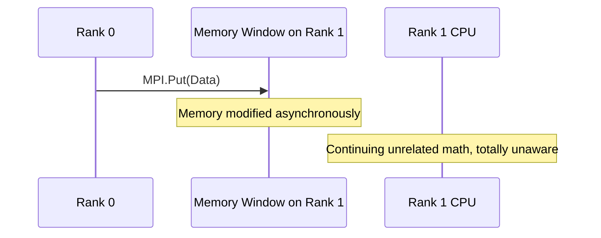

# Chapter 10: Advanced Topics

## 10.1. One Sided Communication

Also known as **Remote Memory Access (RMA)**.
Standard point-to-point requires active participation from both sides (Send and Recv). RMA decouples this synchronization.

### The Mechanism
1.  A rank exposes a chunk of its memory to the public, creating a **Memory Window**.
2.  Other ranks can execute `MPI.Put()` (write data into the window) or `MPI.Get()` (read data from the window).
3.  The target rank *does not need to call any function or even know this is happening*.

**Use Case:** Highly irregular data structures where ranks cannot predict when or if their neighbors need data.

---

## 10.2. Hybrid Parallelism and The Future of MPI

Modern supercomputers are clusters of highly dense nodes. A single node might have 128 CPU cores and 4 GPUs. Using MPI to manage 128 processes on the *same* motherboard creates massive software overhead.

### The Gold Standard: MPI + X
*   **MPI + OpenMP (Threads):** 
    Use MPI to communicate *between* separate motherboards over the network.
    Use OpenMP to spawn lightweight threads *inside* the motherboard to share RAM natively.
*   **MPI + CUDA (GPUs):**
    Use MPI to coordinate data movement, leveraging features like **GPUDirect RDMA**, which allows Rank 0's GPU to pipe data straight across the network to Rank 1's GPU, completely bypassing the host CPU RAM for massive bandwidth improvements.

> *"Parallelism is not a luxury; it is the only way to scale."
