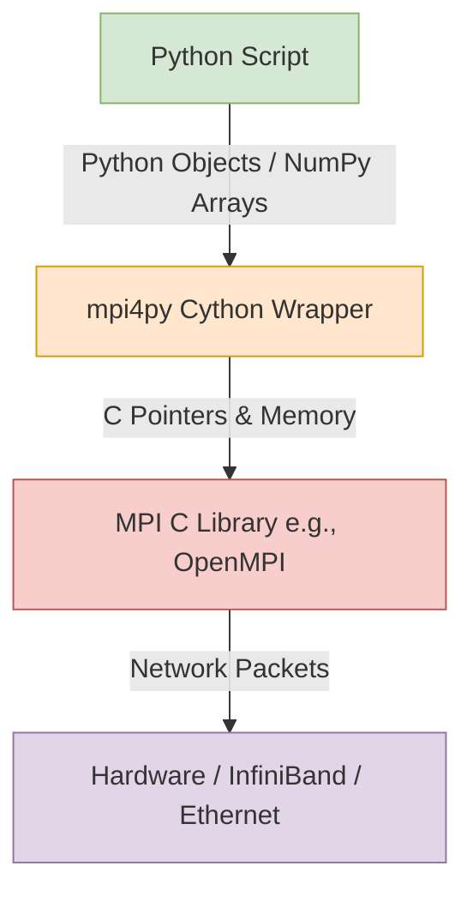

# Chapter 2: MPI Fundamentals

## 2.1. Introduction to Message Passing Interface

**What is MPI?**
MPI (Message Passing Interface) is not a specific programming language or a standalone software. It is a **standardized API** (Application Programming Interface) for communication between processes in a distributed memory architecture. 

**Implementations**
Because it is a standard, different organizations have written their own optimized implementations under the hood:
*   **OpenMPI**: A widely used open-source implementation.
*   **MPICH**: Another major open-source implementation, often the base for others.
*   **Intel MPI**: A proprietary, highly tuned implementation for Intel hardware.

### Why use `mpi4py`?
C and Fortran are the native languages of MPI. However, Python is dominant in data science and machine learning. `mpi4py` bridges this gap. It provides a "Pythonic" wrapper around the highly optimized C/C++ MPI libraries using Cython.



---

## 2.2. Environment and Launching MPI

MPI programs cannot be launched like standard Python scripts (`python script.py`). If you do that, it will just run a single serial process that is completely unaware of the cluster.

You must use a **Launcher** to spawn the processes simultaneously and inject the necessary environment variables so they can discover each other over the network.

### The Execution Command
```bash
mpiexec -n <num_procs> python script.py
```
*(Note: `mpirun` is often an alias for `mpiexec` and they usually function identically).*

**What happens when you run this?**
1. The `mpiexec` daemon looks at the `-n` flag (e.g., `-n 4`).
2. It launches exactly 4 independent instances of the Python interpreter.
3. It assigns a unique Rank (0 to 3) to each instance.
4. All 4 processes begin executing `script.py` from line 1 simultaneously.

> [!warning] SPMD Architecture Reminder
> MPI uses the **Single Program, Multiple Data** (SPMD) model. Every single rank runs the exact same script. It is up to you (the programmer) to use `if` statements to make different ranks do different things.

---

## 2.3. Anatomy of an MPI Program

Here is the fundamental "Hello World" of MPI using Python.

```python
from mpi4py import MPI

# Get the default communicator
comm = MPI.COMM_WORLD

# Get process details
rank = comm.Get_rank()
size = comm.Get_size()

print(f"Hello from rank {rank} out of {size} processes!")
```

### Line-by-Line Breakdown:
1. `from mpi4py import MPI`: This initializes the MPI environment under the hood. As soon as this line executes, the Python process connects to the MPI daemon.
2. `MPI.COMM_WORLD`: This is a global object representing the "universe" of all processes that were launched together by `mpiexec`.
3. `comm.Get_rank()`: Asks the communicator, "Who am I?" Returns an integer from $0$ to $N - 1$.
4. `comm.Get_size()`: Asks the communicator, "How many of us are there in total?" Returns $N$.

---

## 2.4. The MPI Communicator Model

A **Communicator** defines the scope of communication. 

*   It acts as a restricted "context" or "channel". 
*   Messages sent within one communicator **cannot leak** or be intercepted by processes in a different communicator.
*   By default, everyone starts inside `MPI.COMM_WORLD`.

```mermaid
graph TD
    subgraph MPI.COMM_WORLD
        subgraph Sub-Communicator (Local Group)
            R2((Rank 2))
            R3((Rank 3))
            R2 -- Local Msg --> R3
        end
        R0((Rank 0))
        R1((Rank 1))
    end
```

### Customization
As programs get complex, you might want to split the world up (e.g., Rank 0-3 handle user I/O, Ranks 4-100 do heavy math). You can use `comm.Split()` to create these custom sub-communicators. We will cover this deeply in Chapter 6.
