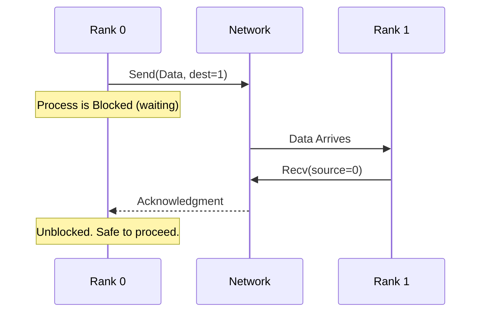
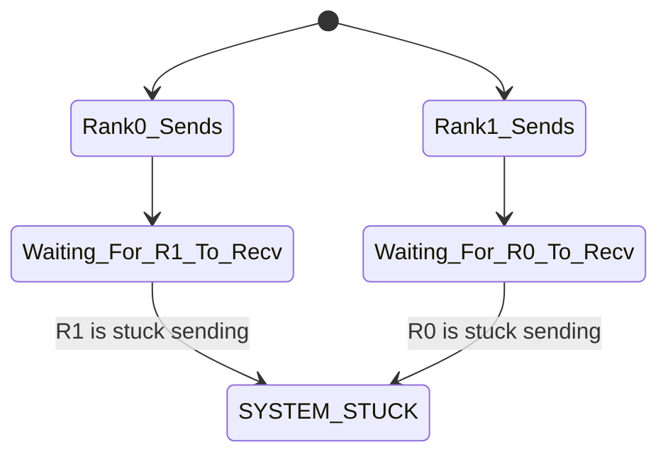

# Chapter 3: Point to Point Communication

## 3.1. Blocking Send and Receive Operations

Point-to-Point communication is the most basic mechanism: one sender, one receiver. Data moves via a strictly **matching pair** of operations: a `Send` and a `Receive`.

### The Envelope
Every message in MPI is wrapped in an "envelope" that allows the receiver to identify it, much like mailing a letter. The envelope contains:
1. **Source/Destination:** Which rank is sending, and which rank is receiving.
2. **Tag:** An integer ID that allows you to distinguish between different types of messages (e.g., Tag 1 = Data, Tag 2 = Stop Signal).
3. **Communicator:** The context of the message.

### Blocking Semantics
When you call a standard blocking Send, the function **will not return control** to Python until it is safe to overwrite the data buffer you sent. 



> [!important] Buffering Mechanics
> "Safe to reuse" does not necessarily mean the other side has *received* it yet. MPI might copy the message into a hidden OS network buffer and return immediately if the message is small. However, you should *never rely on this hidden buffering*.

---

## 3.2. mpi4py Performance and Serialization

In `mpi4py`, the capitalization of the first letter of the function dictates its internal mechanics and determines whether your code will be fast or excruciatingly slow.

### Lowercase Methods (`send`, `recv`)
*   **What it does:** Communicates generic Python objects (Lists, Dictionaries, custom classes).
*   **How it works:** It uses Python's `pickle` library to serialize the object into a byte-stream, sends it over the network, and the receiver unpickles it.
*   **Performance:** **Very High Overhead / Slow.** Never use this for heavy mathematical arrays inside tight loops.

### Uppercase Methods (`Send`, `Recv`)
*   **What it does:** Communicates contiguous memory buffers, specifically **NumPy arrays**.
*   **How it works:** It bypasses Python serialization entirely. It passes the raw C-pointer of the NumPy array directly to the underlying C MPI library.
*   **Performance:** **Near-native C speed.**

### Example: High-Performance NumPy Communication

```python
import numpy as np
from mpi4py import MPI

comm = MPI.COMM_WORLD
rank = comm.Get_rank()

if rank == 0:
    # Sender side
    data = np.arange(10, dtype='i') # Array of integers
    # Syntax: [data_buffer, MPI_Datatype]
    comm.Send([data, MPI.INT], dest=1, tag=77)

elif rank == 1:
    # Receiver side
    # MUST pre-allocate an empty array of the exact expected size and type
    data = np.empty(10, dtype='i')
    comm.Recv([data, MPI.INT], source=0, tag=77)
    print("Received:", data)
```

> [!tip] Type Matching is Mandatory
> Notice `MPI.INT`. In uppercase methods, the sender and receiver must agree on the fundamental data type, otherwise you will encounter fatal memory corruption.

---

## 3.3. Non Blocking Communication and Latency Hiding

Blocking communication is like making a phone call: you are frozen holding the phone until the other person picks up. 
**Non-blocking** communication is like sending an email: you hit send, the system handles the delivery in the background, and you immediately go back to work.

### The Mechanism
1.  Initiate with `Isend()` or `Irecv()` (The 'I' stands for Immediate).
2.  The function returns a `Request` object immediately. The network transfer begins in the background.
3.  Do unrelated computational work (Overlap).
4.  Call `Request.Wait()` to finalize the transfer and ensure it completed.

```mermaid
gantt
    title Computation / Communication Overlap
    dateFormat  s
    axisFormat %s
    
    section Rank 0
    Isend() Initiated :crit, a1, 0, 1s
    Compute other data :active, a2, after a1, 5s
    Network Transfer (Background) :done, a3, after a1, 4s
    Wait() (Sync point) :crit, a4, after a2, 1s
```



By hiding the network latency behind useful CPU computations, you dramatically improve parallel efficiency.

---

## 3.4. Deadlocks and Safe Communication

A **Deadlock** is a catastrophic state where two or more processes are waiting for each other indefinitely. The program freezes permanently.

### The Classic Deadlock Scenario
If both ranks execute a blocking `Send` to each other at the same time, neither can reach their `Recv` statement.



### Prevention Strategies
1. **Ordered Pairs:** Structure logic so Even ranks send first, Odd ranks receive first.
2. **Non-Blocking:** Use `Isend` so control returns and you can reach the `Recv`.
3. **Combined Call:** `Sendrecv()` is a safe atomic operation provided by MPI specifically for swapping data without deadlocking.
