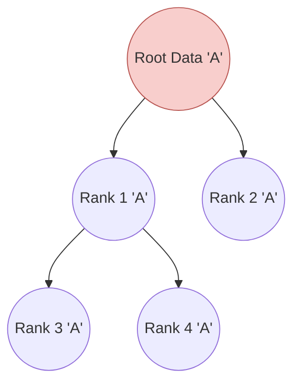
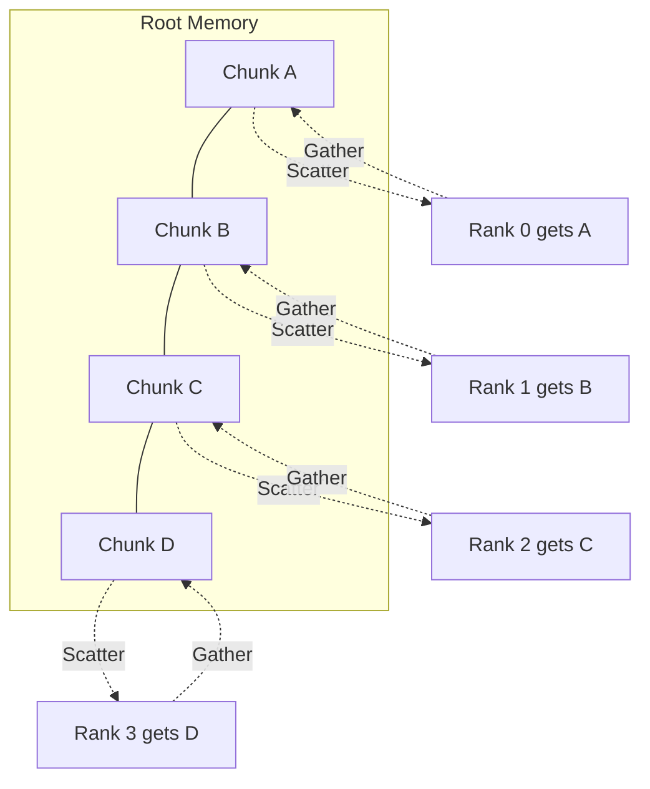
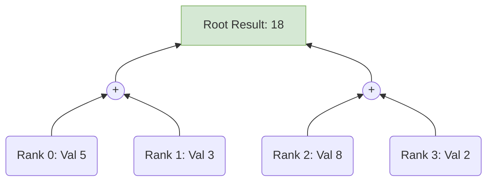

# Chapter 4: Collective Communication

While point-to-point covers two processes, **Collective Communication** involves *every single process* inside the communicator.

> [!warning] Mandatory Participation
> If a collective function like `Bcast` or `Reduce` is called, *every rank in the communicator must execute that line of code*. If one rank branches off and misses the call, the entire system will deadlock waiting for it.

## 4.1. Broadcast Scatter and Gather

### Broadcast (`Bcast`)
*   **Purpose:** One "Root" process copies the identical payload to all other processes.
*   **Use Case:** Sharing an initial configuration dictionary, distributing trained neural network weights.
*   **Complexity:** MPI optimizes this under the hood. Instead of Root sending $N$ times iteratively ($O(N)$), it uses a binary tree distribution pattern, making the time complexity $O(\log P)$.

### Scatter and Gather
*   **`Scatter()`**: Takes a large array on the Root and chops it into distinct chunks, sending a different chunk to each rank.
*   **`Gather()`**: The exact reverse. Collects chunks from all ranks and stitches them back together sequentially on the Root.

> [!tip] Scatter load balancing
> Using `numpy.array_split()` is an excellent way to prepare arrays for a `scatter` operation, as it automatically handles arrays that don't divide perfectly by the number of ranks.

---

## 4.2. Reduction Operations

When all processes have computed a local value, you often need to aggregate them mathematically (Sum, Min, Max).

### `Reduce()`
Combines values from all ranks using a specified MPI operator, but the final answer is only available on the **Root** rank.

### `Allreduce()`
Identical to `Reduce`, but when the calculation is finished, the root broadcasts the result back out. **Every rank receives the final answer.**
*   *Use Case:* Normalizing a dataset where every rank needs to divide its local data by the global sum.

---

## 4.3. Advanced Collectives and Synchronization

### `Alltoall()`
A complete data transpose. Every rank sends a different chunk to every other rank. It is extremely network-intensive. Used heavily in Fast Fourier Transforms (FFTs) across distributed memory.

### `Scan()`
A prefix sum (cumulative operation).
If Ranks 0, 1, 2, 3 hold values 1, 1, 1, 1:
*   Rank 0 gets `1`
*   Rank 1 gets `1+1 = 2`
*   Rank 2 gets `1+1+1 = 3`
*   Rank 3 gets `1+1+1+1 = 4`

> [!warning] Load Imbalance in Collectives
> Collective operations are intrinsically blocking. The entire group can only move as fast as the slowest rank. If Rank 2 has a heavy workload and takes 10 extra seconds, all other ranks will sit idle at the `Reduce` call waiting for Rank 2.
