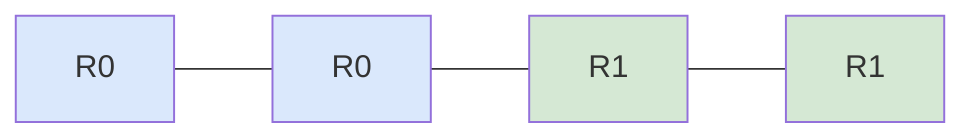
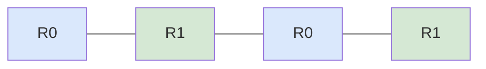

# Chapter 5: Domain Decomposition

## 5.1. Load Distribution and Indexing

To utilize multiple processors, we must decompose the computational domain (data) into sub-domains. The goal is to distribute $N$ items among $P$ processes as evenly as possible.

### Uniform Distribution Math
If the data divides evenly:
`chunk_size = N // size`

Each rank must compute its **Local Indices** (start and end pointers) to operate on the correct part of the dataset.

```python
chunk_size = N // size
start = rank * chunk_size
end = (rank + 1) * chunk_size

# Handling the remainder for the last rank
if rank == size - 1:
    end = N
```

```mermaid
graph LR
    subgraph Total Workload N = 100
        R0[Rank 0: 0-25] --> R1[Rank 1: 25-50] --> R2[Rank 2: 50-75] --> R3[Rank 3: 75-100]
    end
```

---

## 5.2. Parallelizing Array Operations

In distributed memory HPC, a **"Global Array"** is usually just a concept on paper. In reality, it never exists in memory at all.

> [!danger] Out of Memory Error
> **Never** do `data = np.zeros(N)` on every rank if $N = 10^9$. If 100 ranks all try to allocate 8GB, you will instantly crash the node's RAM.

### The Correct Workflow
1.  **Compute Local Size:** Use the domain decomposition math above.
2.  **Allocate Local Memory:** `local_slice = np.zeros(my_chunk_size)`
3.  **Local Computation:** `local_sum = np.sum(local_slice)`
4.  **Global Aggregation:** Use `comm.allreduce()` to find the global state.

```python
# Example: Parallel Average Calculation
local_data = np.random.random(N // size) 
local_sum = np.sum(local_data)

global_sum = comm.allreduce(local_sum, op=MPI.SUM)
global_avg = global_sum / N
```

---

## 5.3. Distribution Patterns

When dealing with arrays or loops that are "embarrassingly parallel" (tasks have no dependencies on each other), you must choose how to distribute the indices.

### 1. Contiguous Block Distribution
Data is divided into large consecutive chunks.
*   *Advantage:* **Spatial Locality.** CPU Caches love sequential memory access. If computing element $i$ involves element $i+1$, this is highly efficient.



### 2. Cyclic (Stride) Distribution
Indices are dealt out like a deck of cards (e.g., Rank 0 gets 0, 2, 4. Rank 1 gets 1, 3, 5).
*   *Advantage:* **Load Balancing.** If the computation gets harder at higher indices, block distribution would unfairly burden the last rank. Cyclic distribution ensures everyone gets a mix of easy and hard indices.


