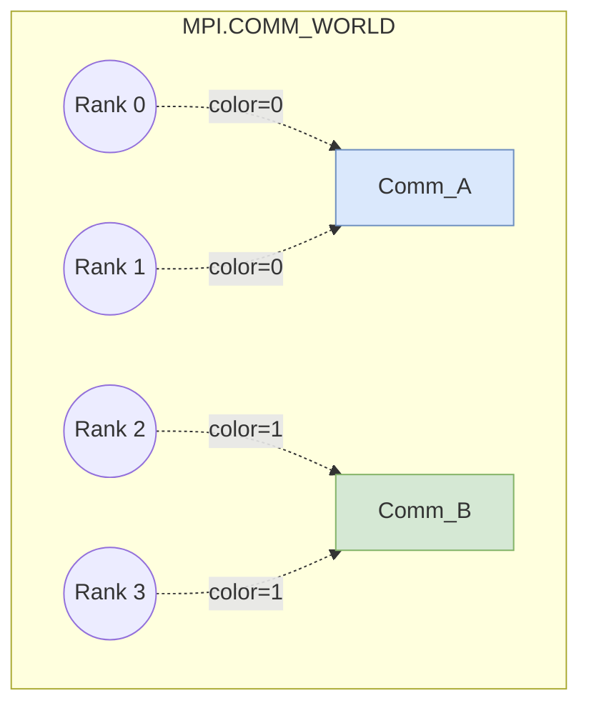

# Chapter 6: Synchronization and Process Control

## 6.1. Barrier Synchronization

A `Barrier()` is a literal stop sign in your code. No process is allowed to pass the barrier until **every** process in the communicator has reached it.

```mermaid
gantt
    title Barrier Synchronization Timeline
    dateFormat s
    axisFormat %s
    
    section Ranks
    Rank 0 Compute :a1, 0, 4s
    Rank 0 Wait at Barrier :crit, a2, after a1, 2s
    
    Rank 1 Compute :b1, 0, 2s
    Rank 1 Wait at Barrier :crit, b2, after b1, 4s
    
    Rank 2 Compute :c1, 0, 6s
    
    Barrier Passed :done, c2, after c1, 0s
```



*   **When to use:** Before parallel file I/O (to ensure everyone is ready to write), or before starting a benchmark timer.
*   **The Cost:** Barriers are the enemy of performance. In the graph above, Ranks 0 and 1 are wasting CPU cycles doing completely nothing while waiting for Rank 2. This represents a massive hit to parallel efficiency due to **Load Imbalance**.

---

## 6.2. Advanced Communicator Operations

`MPI.COMM_WORLD` is just the starting point. We can split it into smaller sub-groups using `Comm_split()`.

### `Comm_split(color, key)`
Processes pass an integer `color`. All processes that pass the same `color` are grouped into a new sub-communicator.



**Why do this?**
*   **Logic Isolation:** A `Bcast` executed inside `Comm_A` will only be received by Ranks 0 and 1. Rank 2 and 3 are completely unaffected.
*   **Topologies:** You can use specialized functions like `Create_cart()` to map a 1D list of ranks into a 2D or 3D grid layout, which is highly useful for spatial data (like images or fluid grids).

---

## 6.3. Controlling Process Behavior

Because every process executes the exact same script (SPMD), we rely heavily on `if rank == X:` blocks. The most famous architecture built this way is the **Master-Worker Pattern**.

### Master-Worker Architecture

*   **Master (Rank 0):** Handles "administrative" tasks. It reads configuration files, loads datasets, talks to the user, writes results to the disk, and dispatches work assignments to the workers.
*   **Workers (Ranks 1 to N-1):** The muscle. They wait for a message from the Master containing data, execute heavy calculations, send the result back, and wait for more.

```python
if rank == 0:
    # --- MASTER ROLE ---
    data = load_huge_dataset("data.bin")
    # Send chunks to workers...
    # Receive results and compile...
else:
    # --- WORKER ROLE ---
    my_part = comm.recv(source=0)
    result = heavy_compute(my_part)
    comm.send(result, dest=0)
```
