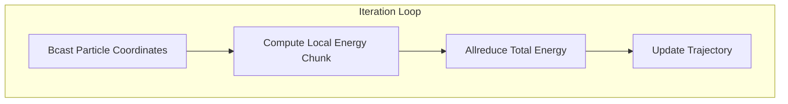

# Chapter 7: Case Study Monte Carlo Simulation

## 7.1. Parallelizing a Physics Simulation

To understand how these concepts tie together, consider a Molecular Dynamics simulation that calculates the total energy of a particle system using the **Lennard-Jones potential**.

*   **The Bottleneck:** To find total energy, we must calculate the pairwise distance between every single particle and every other particle. For $N$ particles, this requires mathematically comparing $N \times N$ pairs. The complexity is $O(N^2)$.
*   **The Strategy:** Instead of one processor checking all pairs, each MPI rank takes a *subset* of the particles and calculates their energy against the rest of the system.



---

## 7.2. Data Consistency and Synchronization

In Monte Carlo simulations, particles move randomly. 
> [!danger] The Divergence Problem
> If Rank 0 generates a random move for a particle, and Rank 1 generates its own random move, the two ranks now have completely different views of where the particles are. The system state has diverged, and the math is ruined.

**The Solution:**
Only **one** rank (usually Rank 0) is allowed to generate the random displacements. It then enforces its decision on the rest of the cluster using `Bcast()`. 


---

## 7.3. Implementation and Performance Measurement

### The Implementation Loop

```python
# 1. Root decides the move
if rank == 0:
    new_coords = old_coords + np.random.uniform(-0.1, 0.1, 3)

# 2. Sync coordinates to all workers (Forces Consistency)
comm.Bcast(new_coords, root=0)

# 3. Parallel computation of LJ Potential (Distributes O(N^2) load)
local_energy = compute_energy_slice(my_start, my_end, new_coords)

# 4. Global aggregation (Summing up local chunks)
total_energy = comm.allreduce(local_energy, op=MPI.SUM)
```

### Measuring Performance

To measure efficiency, we calculate the **Speedup**:
`Speedup = Time(Serial) / Time(Parallel)`

Use `MPI.Wtime()` for high-precision, wall-clock timing. 
> [!tip] Profiling best practice
> Only time the actual mathematical loop! Exclude the time it takes Python to boot up or load the initial array from the hard drive, as I/O times vary wildly and ruin benchmark accuracy.

We evaluate two regimes:
*   **Strong Scaling Profile:** Did doubling the cores cut the time in half for our fixed particle count?
*   **Weak Scaling Profile:** If we double the number of cores *and* double the number of particles, did the execution time remain flat?
