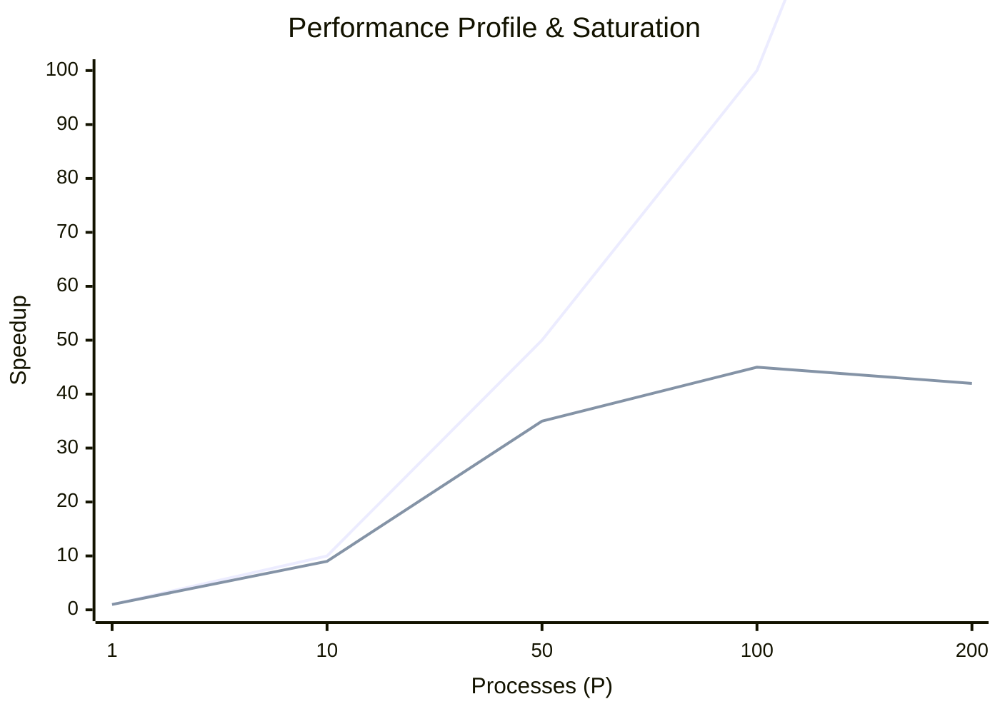

# Chapter 9: Optimization and Debugging

## 9.1. Identifying Performance Bottlenecks

Do not guess why your code is slow. Profile it.
Total Time breaks down into $T_{comp} + T_{comm} + T_{wait}$.

### The Saturation Point
As you add more processes, $T_{comp}$ drops, but $T_{comm}$ increases because there are more network messages flying around. Eventually, the communication overhead dominates, and the speedup curve flattens out or even drops. This is the **Saturation Point**.


*(Notice how performance drops at 200 processes due to network congestion).*

---

## 9.2. Message Batching and Overlap

**Network Latency** is the time it takes for the very first byte of a message to physically travel across the wire. Latency is high, while Bandwidth (the size of the pipe) is large.

> [!important] The Chatty Inefficiency
> Sending 1,000 separate messages of 1 Integer each is incredibly slow because you pay the high Latency penalty 1,000 times. 

**The Optimization: Batching**
Combine those 1,000 integers into a single NumPy array and send it once. You pay the latency penalty exactly once.

```mermaid
graph TD
    subgraph Inefficient (Chatty)
        A1[Msg 1] --> Dest1[ ]
        A2[Msg 2] --> Dest2[ ]
        A3[Msg 3] --> Dest3[ ]
    end
    subgraph Optimized (Batched)
        B1[Combined Data Packet] --> Dest[ ]
    end
```

**Memory Optimization:** Avoid using `comm.gather()` for massive multidimensional arrays. Gathering 100GB of data to Rank 0 will crash it. Instead, utilize parallel file systems (like MPI-IO or HDF5) to have each rank write its chunk directly to disk.

---

## 9.3. Debugging Distributed Code

Debugging parallel programs is notoriously difficult due to **Heisenbugs**—bugs like race conditions or deadlocks that change behavior or disappear entirely when you try to attach a debugger or slow the code down.

### The Validation Workflow
1.  **Serial First:** Run with `mpiexec -n 1`. If the math is wrong here, it's a normal programming bug, not an MPI bug. Fix it first.
2.  **Small Scale:** Run on 2 or 4 processes. Verify domain decomposition boundary conditions.
3.  **Deterministic Seeds:** In stochastic models (like Monte Carlo), use `np.random.seed(42 + rank)`. This ensures that every run behaves exactly identically, making bugs reproducible.

### Logging Best Practices
Normal `print()` statements from 100 ranks will jumble text together unintelligibly on the terminal. Always tag your prints:
`print(f"[Rank {rank}] Reached Checkpoint A")`

If the program hangs (deadlocks), trace your logs. If Rank 0 reached Checkpoint A, but Rank 1 never did, you know exactly where the communication breakdown occurred.
