Here is the complete, comprehensive, and fully expanded Obsidian vault structure based on the provided slides and your instructions. 

This material has been completely restructured and expanded to fill in all missing background context, explain complex mathematical and architectural concepts, and provide best practices for high-performance computing using Python (`mpi4py`).

***

# High Performance Computing Vault

```text
Course {
    Chapter 1: Foundations of Parallel Computing
        - 1.1. Why Parallel Computing Matters
        - 1.2. The Distributed Memory Model
        - 1.3. Parallel Performance Concepts

    Chapter 2: MPI Fundamentals
        - 2.1. Introduction to Message Passing Interface
        - 2.2. Environment and Launching MPI
        - 2.3. Anatomy of an MPI Program
        - 2.4. The MPI Communicator Model

    Chapter 3: Point to Point Communication
        - 3.1. Blocking Send and Receive Operations
        - 3.2. mpi4py Performance and Serialization
        - 3.3. Non Blocking Communication and Latency Hiding
        - 3.4. Deadlocks and Safe Communication

    Chapter 4: Collective Communication
        - 4.1. Broadcast Scatter and Gather
        - 4.2. Reduction Operations
        - 4.3. Advanced Collectives and Synchronization

    Chapter 5: Domain Decomposition
        - 5.1. Load Distribution and Indexing
        - 5.2. Parallelizing Array Operations
        - 5.3. Distribution Patterns

    Chapter 6: Synchronization and Process Control
        - 6.1. Barrier Synchronization
        - 6.2. Advanced Communicator Operations
        - 6.3. Controlling Process Behavior

    Chapter 7: Case Study Monte Carlo Simulation
        - 7.1. Parallelizing a Physics Simulation
        - 7.2. Data Consistency and Synchronization
        - 7.3. Implementation and Performance Measurement

    Chapter 8: Data Types and Efficiency
        - 8.1. Data Types and Memory Safety
        - 8.2. Halo and Ghost Region Updates
        - 8.3. MPI Wildcards

    Chapter 9: Optimization and Debugging
        - 9.1. Identifying Performance Bottlenecks
        - 9.2. Message Batching and Overlap
        - 9.3. Debugging Distributed Code

    Chapter 10: Advanced Topics
        - 10.1. One Sided Communication
        - 10.2. Hybrid Parallelism and The Future of MPI
}
```

***

# Chapter 1: Foundations of Parallel Computing

## 1.1. Why Parallel Computing Matters

> [!info] Background Knowledge: The Need for Speed
> In the early days of computing, processors became faster every year due to increases in clock speed (Moore's Law). However, physical limits—primarily heat dissipation and quantum tunneling—forced the industry to stop increasing clock speeds and instead increase the *number of processing cores*. To take advantage of modern hardware, code must be written to execute in parallel.

### The Three Main Drivers of Parallel Computing

1. **Computational Bottlenecks:**
   Complex simulations (like Molecular Dynamics, STF-Trans, or computational fluid dynamics) require trillions of mathematical operations. On a single CPU core, executing sequentially, these can take weeks, months, or even years. By splitting the problem across thousands of cores, we reduce runtime to hours or days.
2. **Memory Limitations:**
   A single standard workstation typically has between 16 GB to 128 GB of RAM. However, large datasets (e.g., massive climate models, remote sensing satellite data, deep learning training sets) can easily reach terabytes. Parallel computing allows us to pool the RAM of hundreds of interconnected machines to hold datasets that simply cannot fit into a single machine.
3. **Real-World Applications:**
   Modern scientific computing relies on HPC for:
   *   *Climate Modeling*: Simulating global weather patterns over decades.
   *   *Molecular Dynamics*: Simulating atomic interactions to design new drugs.
   *   *Remote Sensing*: Processing high-resolution images from satellites.

### Serial vs Parallel Execution

```mermaid
gantt
    title Serial vs Parallel Execution Time
    dateFormat  s
    axisFormat %s
    
    section Serial Execution
    Task 1 (T1) :a1, 0, 3s
    Task 2 (T2) :a2, after a1, 3s
    Task 3 (T3) :a3, after a2, 3s
    
    section Parallel Execution
    Task 1 (T1) :b1, 0, 3s
    Task 2 (T2) :b2, 0, 3s
    Task 3 (T3) :b3, 0, 3s
```

> [!tip] The Core Concept
> In the parallel model, tasks T1, T2, and T3 run simultaneously. The **Time Saved** is the difference between the total serial runtime and the longest parallel task runtime.

---

## 1.2. The Distributed Memory Model

To scale beyond a single motherboard, supercomputers use a **Distributed Memory Architecture**. 

### The Paradigm
* **Private Address Space:** Each process (or "rank") runs in total isolation. Process 0 cannot natively read a variable stored in Process 1's RAM. They are entirely separate entities, often physically located on different motherboards (nodes).
* **Explicit Message Passing:** Because memory is private, data must be actively packaged by the sender and actively received by a receiver over a physical network (like Ethernet or InfiniBand). This is called explicit message passing.

### Terminology

* **Rank:** The unique identifier given to a process. If you launch a program with $N$ processes, they are numbered from $0$ to $N - 1$.
* **Communicator:** A conceptual grouping of processes. A message is sent within the context of a communicator.

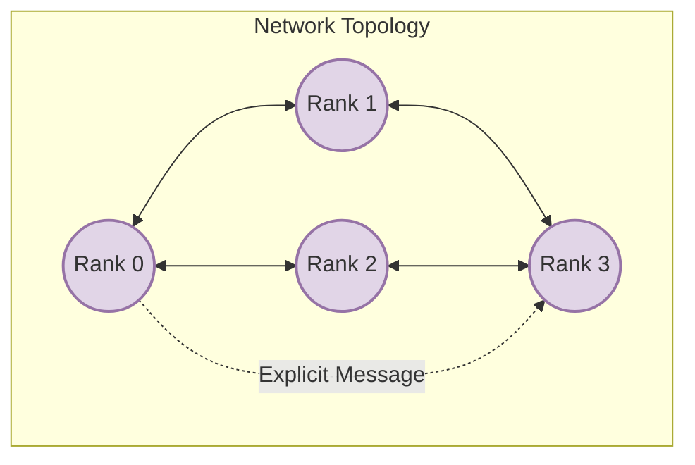

> [!warning] A Common Pitfall
> Programmers coming from multithreading (like Java threads or OpenMP) often assume variables are shared. In MPI, if Rank 0 modifies `x = 5`, `x` remains unchanged for Rank 1 unless Rank 0 explicitly sends `x` to Rank 1.

---

## 1.3. Parallel Performance Concepts

To measure how well a parallel program performs, we look at scaling and overhead.

### Scaling Types
1. **Strong Scaling:** The *total problem size* remains fixed, but the number of processors increases. 
   * *Goal:* Decrease the time to solution.
   * *Challenge:* As you add processors, each processor gets a smaller piece of the work. Eventually, communication overhead overtakes computation time.
2. **Weak Scaling:** The problem size *per processor* remains fixed. As you add more processors, the total problem size grows proportionally.
   * *Goal:* Solve a larger, more complex problem in the same amount of time.

### Amdahl's Law
Amdahl's law defines the theoretical limit of Strong Scaling. It states that the maximum speedup is strictly limited by the sequential (non-parallelizable) portion of the program.

*   If 5% of your code is serial (e.g., I/O operations, initialization), the absolute maximum theoretical speedup you can achieve, even with infinite processors, is $20x$ ($1 / 0.05$).

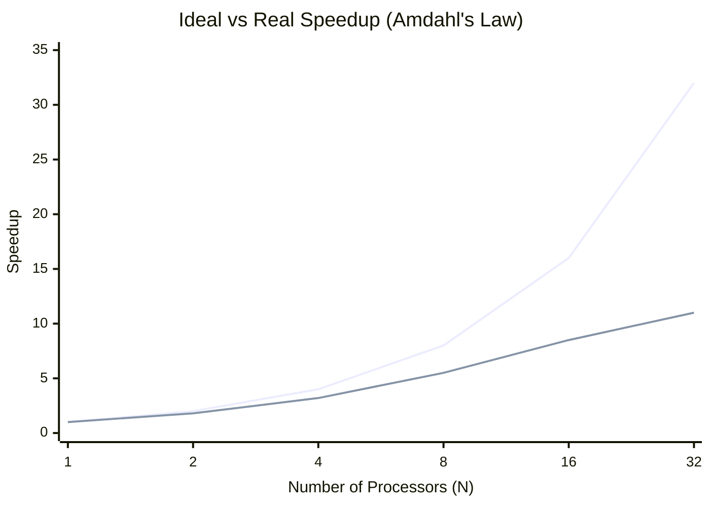

### Overhead Equation
The total execution time of a parallel program can be broken down:
$$T_{execution} = T_{comp} + T_{comm} + T_{idle}$$

*   **$T_{comp}$**: Time spent doing actual mathematical computation.
*   **$T_{comm}$**: Time spent sending and receiving data over the network.
*   **$T_{idle}$**: Time a process spends waiting doing nothing (e.g., waiting for data to arrive, or waiting at a synchronization barrier).

> [!tip] The Golden Rule of MPI Optimization
> The entire goal of MPI optimization is to maximize $T_{comp}$ while aggressively minimizing $T_{comm}$ and $T_{idle}$.

***

# Chapter 2: MPI Fundamentals

## 2.1. Introduction to Message Passing Interface

**What is MPI?**
MPI (Message Passing Interface) is not a specific programming language or a standalone software. It is a **standardized API** (Application Programming Interface) for communication between processes in a distributed memory architecture. 

**Implementations**
Because it is a standard, different organizations have written their own optimized implementations under the hood:
*   **OpenMPI**: A widely used open-source implementation.
*   **MPICH**: Another major open-source implementation, often the base for others.
*   **Intel MPI**: A proprietary, highly tuned implementation for Intel hardware.

### Why use `mpi4py`?
C and Fortran are the native languages of MPI. However, Python is dominant in data science and machine learning. `mpi4py` bridges this gap. It provides a "Pythonic" wrapper around the highly optimized C/C++ MPI libraries using Cython.

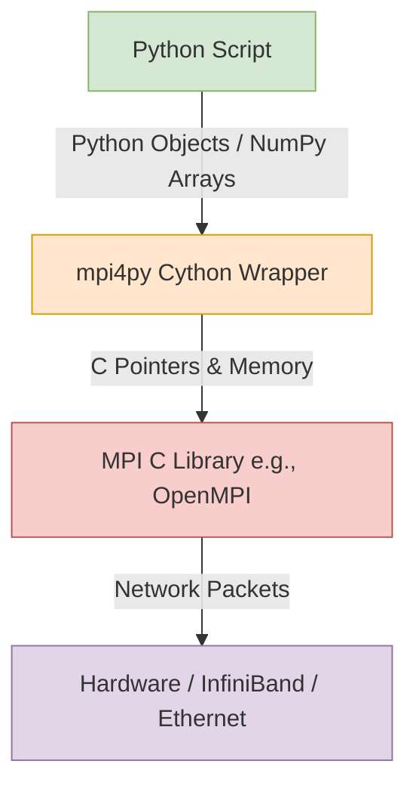

---

## 2.2. Environment and Launching MPI

MPI programs cannot be launched like standard Python scripts (`python script.py`). If you do that, it will just run a single serial process that is completely unaware of the cluster.

You must use a **Launcher** to spawn the processes simultaneously and inject the necessary environment variables so they can discover each other over the network.

### The Execution Command
```bash
mpiexec -n <num_procs> python script.py
```
*(Note: `mpirun` is often an alias for `mpiexec` and they usually function identically).*

**What happens when you run this?**
1. The `mpiexec` daemon looks at the `-n` flag (e.g., `-n 4`).
2. It launches exactly 4 independent instances of the Python interpreter.
3. It assigns a unique Rank (0 to 3) to each instance.
4. All 4 processes begin executing `script.py` from line 1 simultaneously.

> [!warning] SPMD Architecture Reminder
> MPI uses the **Single Program, Multiple Data** (SPMD) model. Every single rank runs the exact same script. It is up to you (the programmer) to use `if` statements to make different ranks do different things.

---

## 2.3. Anatomy of an MPI Program

Here is the fundamental "Hello World" of MPI using Python.

```python
from mpi4py import MPI

# Get the default communicator
comm = MPI.COMM_WORLD

# Get process details
rank = comm.Get_rank()
size = comm.Get_size()

print(f"Hello from rank {rank} out of {size} processes!")
```

### Line-by-Line Breakdown:
1. `from mpi4py import MPI`: This initializes the MPI environment under the hood. As soon as this line executes, the Python process connects to the MPI daemon.
2. `MPI.COMM_WORLD`: This is a global object representing the "universe" of all processes that were launched together by `mpiexec`.
3. `comm.Get_rank()`: Asks the communicator, "Who am I?" Returns an integer from $0$ to $N - 1$.
4. `comm.Get_size()`: Asks the communicator, "How many of us are there in total?" Returns $N$.

---

## 2.4. The MPI Communicator Model

A **Communicator** defines the scope of communication. 

*   It acts as a restricted "context" or "channel". 
*   Messages sent within one communicator **cannot leak** or be intercepted by processes in a different communicator.
*   By default, everyone starts inside `MPI.COMM_WORLD`.

```mermaid
graph TD
    subgraph MPI.COMM_WORLD
        subgraph Sub-Communicator (Local Group)
            R2((Rank 2))
            R3((Rank 3))
            R2 -- Local Msg --> R3
        end
        R0((Rank 0))
        R1((Rank 1))
    end
```

### Customization
As programs get complex, you might want to split the world up (e.g., Rank 0-3 handle user I/O, Ranks 4-100 do heavy math). You can use `comm.Split()` to create these custom sub-communicators. We will cover this deeply in Chapter 6.

***

# Chapter 3: Point to Point Communication

## 3.1. Blocking Send and Receive Operations

Point-to-Point communication is the most basic mechanism: one sender, one receiver. Data moves via a strictly **matching pair** of operations: a `Send` and a `Receive`.

### The Envelope
Every message in MPI is wrapped in an "envelope" that allows the receiver to identify it, much like mailing a letter. The envelope contains:
1. **Source/Destination:** Which rank is sending, and which rank is receiving.
2. **Tag:** An integer ID that allows you to distinguish between different types of messages (e.g., Tag 1 = Data, Tag 2 = Stop Signal).
3. **Communicator:** The context of the message.

### Blocking Semantics
When you call a standard blocking Send, the function **will not return control** to Python until it is safe to overwrite the data buffer you sent. 

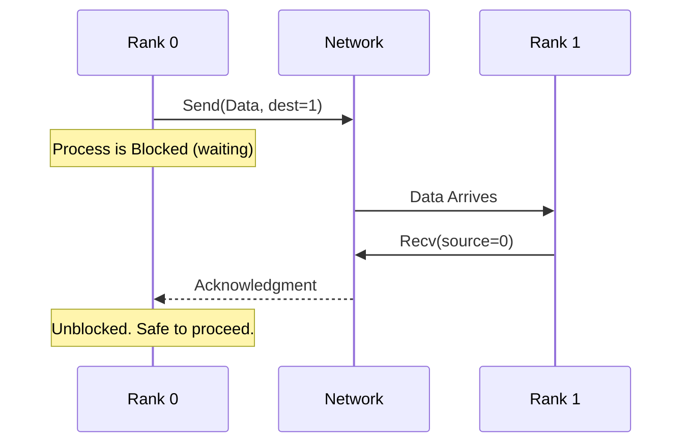

> [!important] Buffering Mechanics
> "Safe to reuse" does not necessarily mean the other side has *received* it yet. MPI might copy the message into a hidden OS network buffer and return immediately if the message is small. However, you should *never rely on this hidden buffering*.

---

## 3.2. mpi4py Performance and Serialization

In `mpi4py`, the capitalization of the first letter of the function dictates its internal mechanics and determines whether your code will be fast or excruciatingly slow.

### Lowercase Methods (`send`, `recv`)
*   **What it does:** Communicates generic Python objects (Lists, Dictionaries, custom classes).
*   **How it works:** It uses Python's `pickle` library to serialize the object into a byte-stream, sends it over the network, and the receiver unpickles it.
*   **Performance:** **Very High Overhead / Slow.** Never use this for heavy mathematical arrays inside tight loops.

### Uppercase Methods (`Send`, `Recv`)
*   **What it does:** Communicates contiguous memory buffers, specifically **NumPy arrays**.
*   **How it works:** It bypasses Python serialization entirely. It passes the raw C-pointer of the NumPy array directly to the underlying C MPI library.
*   **Performance:** **Near-native C speed.**

### Example: High-Performance NumPy Communication

```python
import numpy as np
from mpi4py import MPI

comm = MPI.COMM_WORLD
rank = comm.Get_rank()

if rank == 0:
    # Sender side
    data = np.arange(10, dtype='i') # Array of integers
    # Syntax: [data_buffer, MPI_Datatype]
    comm.Send([data, MPI.INT], dest=1, tag=77)

elif rank == 1:
    # Receiver side
    # MUST pre-allocate an empty array of the exact expected size and type
    data = np.empty(10, dtype='i')
    comm.Recv([data, MPI.INT], source=0, tag=77)
    print("Received:", data)
```

> [!tip] Type Matching is Mandatory
> Notice `MPI.INT`. In uppercase methods, the sender and receiver must agree on the fundamental data type, otherwise you will encounter fatal memory corruption.

---

## 3.3. Non Blocking Communication and Latency Hiding

Blocking communication is like making a phone call: you are frozen holding the phone until the other person picks up. 
**Non-blocking** communication is like sending an email: you hit send, the system handles the delivery in the background, and you immediately go back to work.

### The Mechanism
1.  Initiate with `Isend()` or `Irecv()` (The 'I' stands for Immediate).
2.  The function returns a `Request` object immediately. The network transfer begins in the background.
3.  Do unrelated computational work (Overlap).
4.  Call `Request.Wait()` to finalize the transfer and ensure it completed.

```mermaid
gantt
    title Computation / Communication Overlap
    dateFormat  s
    axisFormat %s
    
    section Rank 0
    Isend() Initiated :crit, a1, 0, 1s
    Compute other data :active, a2, after a1, 5s
    Network Transfer (Background) :done, a3, after a1, 4s
    Wait() (Sync point) :crit, a4, after a2, 1s
```

By hiding the network latency behind useful CPU computations, you dramatically improve parallel efficiency.

---

## 3.4. Deadlocks and Safe Communication

A **Deadlock** is a catastrophic state where two or more processes are waiting for each other indefinitely. The program freezes permanently.

### The Classic Deadlock Scenario
If both ranks execute a blocking `Send` to each other at the same time, neither can reach their `Recv` statement.

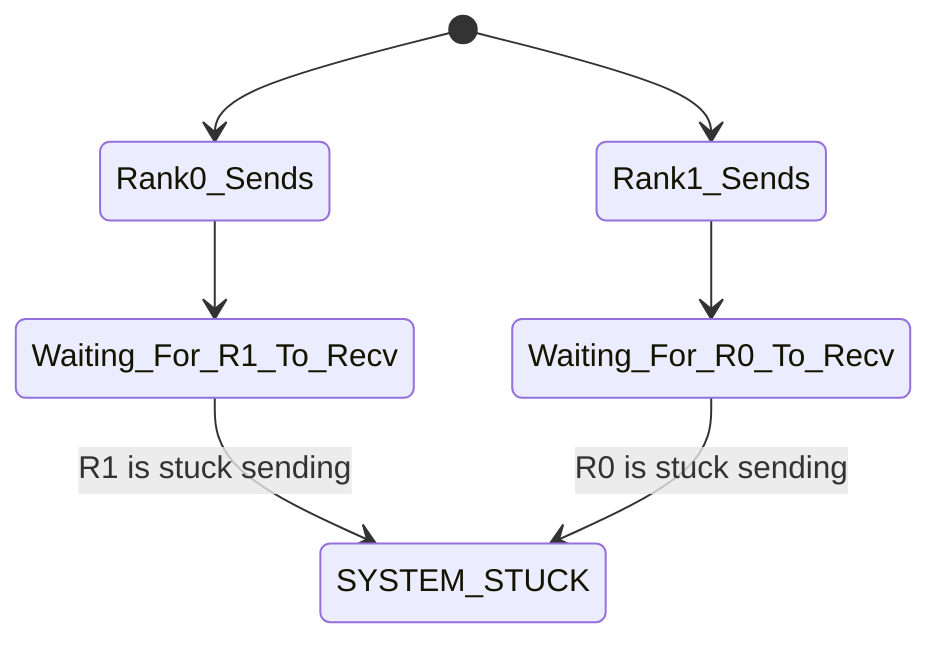

### Prevention Strategies
1. **Ordered Pairs:** Structure logic so Even ranks send first, Odd ranks receive first.
2. **Non-Blocking:** Use `Isend` so control returns and you can reach the `Recv`.
3. **Combined Call:** `Sendrecv()` is a safe atomic operation provided by MPI specifically for swapping data without deadlocking.

***

# Chapter 4: Collective Communication

While point-to-point covers two processes, **Collective Communication** involves *every single process* inside the communicator.

> [!warning] Mandatory Participation
> If a collective function like `Bcast` or `Reduce` is called, *every rank in the communicator must execute that line of code*. If one rank branches off and misses the call, the entire system will deadlock waiting for it.

## 4.1. Broadcast Scatter and Gather

### Broadcast (`Bcast`)
*   **Purpose:** One "Root" process copies the identical payload to all other processes.
*   **Use Case:** Sharing an initial configuration dictionary, distributing trained neural network weights.
*   **Complexity:** MPI optimizes this under the hood. Instead of Root sending $N$ times iteratively ($O(N)$), it uses a binary tree distribution pattern, making the time complexity $O(\log P)$.

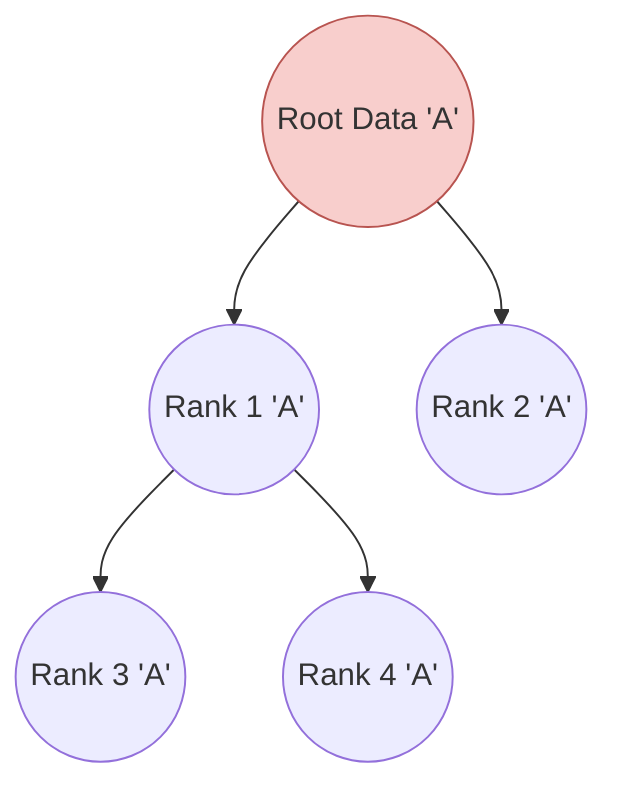

### Scatter and Gather
*   **`Scatter()`**: Takes a large array on the Root and chops it into distinct chunks, sending a different chunk to each rank.
*   **`Gather()`**: The exact reverse. Collects chunks from all ranks and stitches them back together sequentially on the Root.

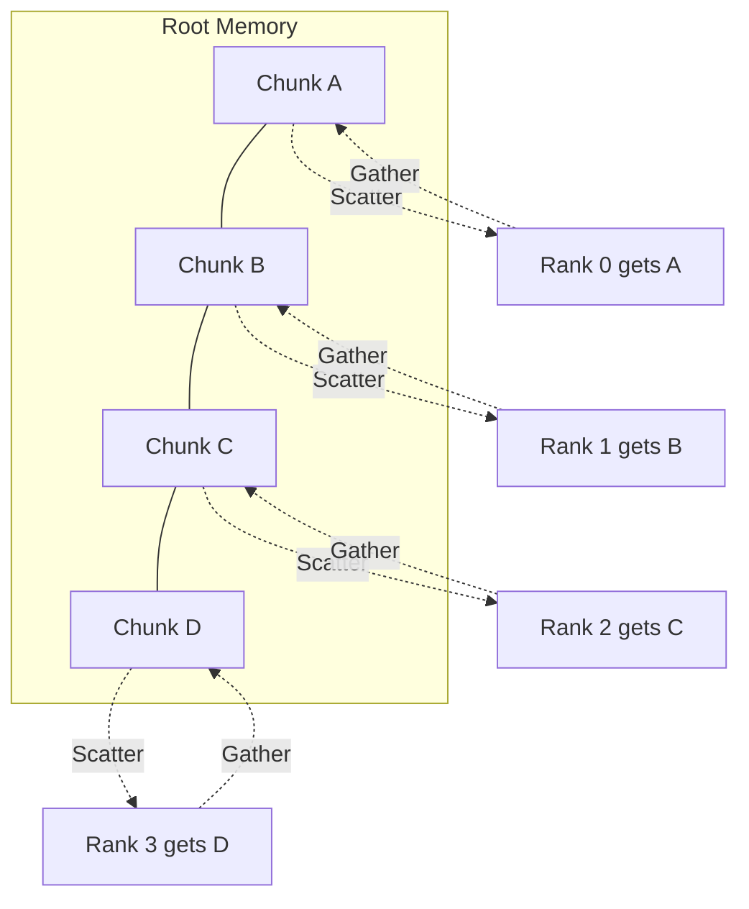

> [!tip] Scatter load balancing
> Using `numpy.array_split()` is an excellent way to prepare arrays for a `scatter` operation, as it automatically handles arrays that don't divide perfectly by the number of ranks.

---

## 4.2. Reduction Operations

When all processes have computed a local value, you often need to aggregate them mathematically (Sum, Min, Max).

### `Reduce()`
Combines values from all ranks using a specified MPI operator, but the final answer is only available on the **Root** rank.

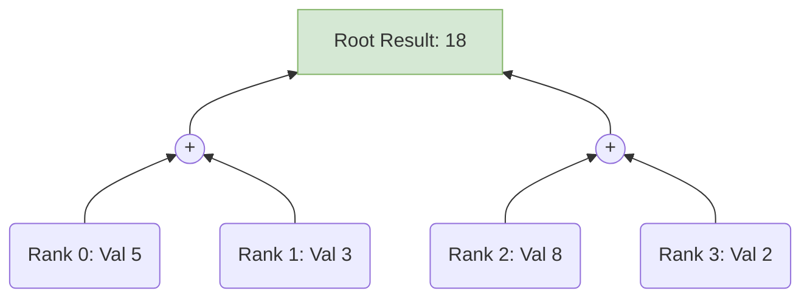

### `Allreduce()`
Identical to `Reduce`, but when the calculation is finished, the root broadcasts the result back out. **Every rank receives the final answer.**
*   *Use Case:* Normalizing a dataset where every rank needs to divide its local data by the global sum.

---

## 4.3. Advanced Collectives and Synchronization

### `Alltoall()`
A complete data transpose. Every rank sends a different chunk to every other rank. It is extremely network-intensive. Used heavily in Fast Fourier Transforms (FFTs) across distributed memory.

### `Scan()`
A prefix sum (cumulative operation).
If Ranks 0, 1, 2, 3 hold values 1, 1, 1, 1:
*   Rank 0 gets `1`
*   Rank 1 gets `1+1 = 2`
*   Rank 2 gets `1+1+1 = 3`
*   Rank 3 gets `1+1+1+1 = 4`

> [!warning] Load Imbalance in Collectives
> Collective operations are intrinsically blocking. The entire group can only move as fast as the slowest rank. If Rank 2 has a heavy workload and takes 10 extra seconds, all other ranks will sit idle at the `Reduce` call waiting for Rank 2.

***

# Chapter 5: Domain Decomposition

## 5.1. Load Distribution and Indexing

To utilize multiple processors, we must decompose the computational domain (data) into sub-domains. The goal is to distribute $N$ items among $P$ processes as evenly as possible.

### Uniform Distribution Math
If the data divides evenly:
`chunk_size = N // size`

Each rank must compute its **Local Indices** (start and end pointers) to operate on the correct part of the dataset.

```python
chunk_size = N // size
start = rank * chunk_size
end = (rank + 1) * chunk_size

# Handling the remainder for the last rank
if rank == size - 1:
    end = N
```

```mermaid
graph LR
    subgraph Total Workload N = 100
        R0[Rank 0: 0-25] --> R1[Rank 1: 25-50] --> R2[Rank 2: 50-75] --> R3[Rank 3: 75-100]
    end
```

---

## 5.2. Parallelizing Array Operations

In distributed memory HPC, a **"Global Array"** is usually just a concept on paper. In reality, it never exists in memory at all.

> [!danger] Out of Memory Error
> **Never** do `data = np.zeros(N)` on every rank if $N = 10^9$. If 100 ranks all try to allocate 8GB, you will instantly crash the node's RAM.

### The Correct Workflow
1.  **Compute Local Size:** Use the domain decomposition math above.
2.  **Allocate Local Memory:** `local_slice = np.zeros(my_chunk_size)`
3.  **Local Computation:** `local_sum = np.sum(local_slice)`
4.  **Global Aggregation:** Use `comm.allreduce()` to find the global state.

```python
# Example: Parallel Average Calculation
local_data = np.random.random(N // size) 
local_sum = np.sum(local_data)

global_sum = comm.allreduce(local_sum, op=MPI.SUM)
global_avg = global_sum / N
```

---

## 5.3. Distribution Patterns

When dealing with arrays or loops that are "embarrassingly parallel" (tasks have no dependencies on each other), you must choose how to distribute the indices.

### 1. Contiguous Block Distribution
Data is divided into large consecutive chunks.
*   *Advantage:* **Spatial Locality.** CPU Caches love sequential memory access. If computing element $i$ involves element $i+1$, this is highly efficient.

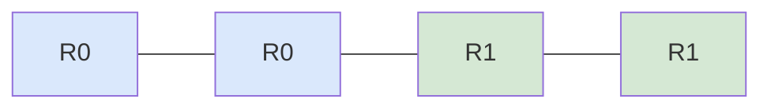

### 2. Cyclic (Stride) Distribution
Indices are dealt out like a deck of cards (e.g., Rank 0 gets 0, 2, 4. Rank 1 gets 1, 3, 5).
*   *Advantage:* **Load Balancing.** If the computation gets harder at higher indices, block distribution would unfairly burden the last rank. Cyclic distribution ensures everyone gets a mix of easy and hard indices.

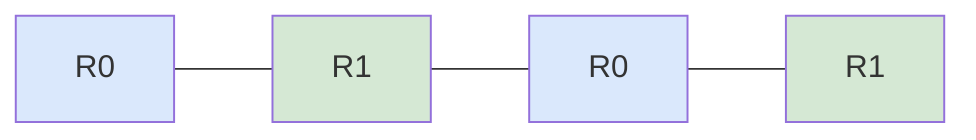

***

# Chapter 6: Synchronization and Process Control

## 6.1. Barrier Synchronization

A `Barrier()` is a literal stop sign in your code. No process is allowed to pass the barrier until **every** process in the communicator has reached it.

```mermaid
gantt
    title Barrier Synchronization Timeline
    dateFormat s
    axisFormat %s
    
    section Ranks
    Rank 0 Compute :a1, 0, 4s
    Rank 0 Wait at Barrier :crit, a2, after a1, 2s
    
    Rank 1 Compute :b1, 0, 2s
    Rank 1 Wait at Barrier :crit, b2, after b1, 4s
    
    Rank 2 Compute :c1, 0, 6s
    
    Barrier Passed :done, c2, after c1, 0s
```

*   **When to use:** Before parallel file I/O (to ensure everyone is ready to write), or before starting a benchmark timer.
*   **The Cost:** Barriers are the enemy of performance. In the graph above, Ranks 0 and 1 are wasting CPU cycles doing completely nothing while waiting for Rank 2. This represents a massive hit to parallel efficiency due to **Load Imbalance**.

---

## 6.2. Advanced Communicator Operations

`MPI.COMM_WORLD` is just the starting point. We can split it into smaller sub-groups using `Comm_split()`.

### `Comm_split(color, key)`
Processes pass an integer `color`. All processes that pass the same `color` are grouped into a new sub-communicator.

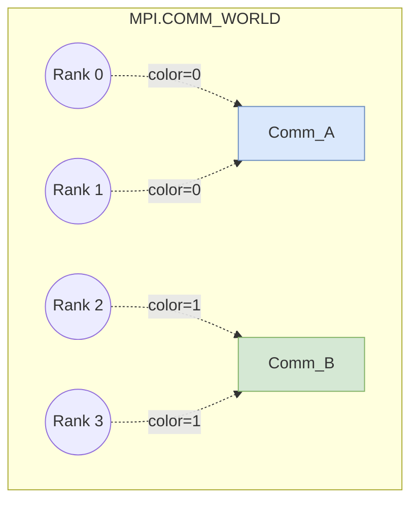

**Why do this?**
*   **Logic Isolation:** A `Bcast` executed inside `Comm_A` will only be received by Ranks 0 and 1. Rank 2 and 3 are completely unaffected.
*   **Topologies:** You can use specialized functions like `Create_cart()` to map a 1D list of ranks into a 2D or 3D grid layout, which is highly useful for spatial data (like images or fluid grids).

---

## 6.3. Controlling Process Behavior

Because every process executes the exact same script (SPMD), we rely heavily on `if rank == X:` blocks. The most famous architecture built this way is the **Master-Worker Pattern**.

### Master-Worker Architecture

*   **Master (Rank 0):** Handles "administrative" tasks. It reads configuration files, loads datasets, talks to the user, writes results to the disk, and dispatches work assignments to the workers.
*   **Workers (Ranks 1 to N-1):** The muscle. They wait for a message from the Master containing data, execute heavy calculations, send the result back, and wait for more.

```python
if rank == 0:
    # --- MASTER ROLE ---
    data = load_huge_dataset("data.bin")
    # Send chunks to workers...
    # Receive results and compile...
else:
    # --- WORKER ROLE ---
    my_part = comm.recv(source=0)
    result = heavy_compute(my_part)
    comm.send(result, dest=0)
```

***

# Chapter 7: Case Study Monte Carlo Simulation

## 7.1. Parallelizing a Physics Simulation

To understand how these concepts tie together, consider a Molecular Dynamics simulation that calculates the total energy of a particle system using the **Lennard-Jones potential**.

*   **The Bottleneck:** To find total energy, we must calculate the pairwise distance between every single particle and every other particle. For $N$ particles, this requires mathematically comparing $N \times N$ pairs. The complexity is $O(N^2)$.
*   **The Strategy:** Instead of one processor checking all pairs, each MPI rank takes a *subset* of the particles and calculates their energy against the rest of the system.

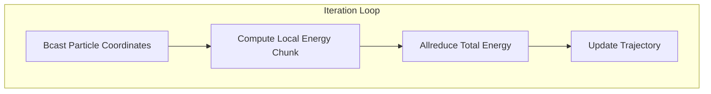

---

## 7.2. Data Consistency and Synchronization

In Monte Carlo simulations, particles move randomly. 
> [!danger] The Divergence Problem
> If Rank 0 generates a random move for a particle, and Rank 1 generates its own random move, the two ranks now have completely different views of where the particles are. The system state has diverged, and the math is ruined.

**The Solution:**
Only **one** rank (usually Rank 0) is allowed to generate the random displacements. It then enforces its decision on the rest of the cluster using `Bcast()`. 


---

## 7.3. Implementation and Performance Measurement

### The Implementation Loop

```python
# 1. Root decides the move
if rank == 0:
    new_coords = old_coords + np.random.uniform(-0.1, 0.1, 3)

# 2. Sync coordinates to all workers (Forces Consistency)
comm.Bcast(new_coords, root=0)

# 3. Parallel computation of LJ Potential (Distributes O(N^2) load)
local_energy = compute_energy_slice(my_start, my_end, new_coords)

# 4. Global aggregation (Summing up local chunks)
total_energy = comm.allreduce(local_energy, op=MPI.SUM)
```

### Measuring Performance

To measure efficiency, we calculate the **Speedup**:
`Speedup = Time(Serial) / Time(Parallel)`

Use `MPI.Wtime()` for high-precision, wall-clock timing. 
> [!tip] Profiling best practice
> Only time the actual mathematical loop! Exclude the time it takes Python to boot up or load the initial array from the hard drive, as I/O times vary wildly and ruin benchmark accuracy.

We evaluate two regimes:
*   **Strong Scaling Profile:** Did doubling the cores cut the time in half for our fixed particle count?
*   **Weak Scaling Profile:** If we double the number of cores *and* double the number of particles, did the execution time remain flat?

***

# Chapter 8: Data Types and Efficiency

## 8.1. Data Types and Memory Safety

MPI is fundamentally written in C, which is a strongly-typed system. When using uppercase buffer communications in NumPy, memory safety is fully in your hands.

### Type Mismatches
The data type the sender specifies **must** be exactly what the receiver expects. 
If Rank 0 sends 4 bytes interpreting them as an Integer, but Rank 1 reads those 4 bytes as a Float, the bits will be misinterpreted, leading to garbage data or a segmentation fault (CRASH).


### Standard Mappings
Always use the `dtype` argument in your NumPy arrays to guarantee safety.
*   `np.int32` maps to `MPI.INT`
*   `np.float64` maps to `MPI.DOUBLE`
*   `np.char` maps to `MPI.CHAR`

---

## 8.2. Halo and Ghost Region Updates

In scientific grid-based simulations (like computational fluid dynamics or weather modeling), data is divided geographically.
However, to calculate physical derivatives (like the flow of air from cell A to cell B), an inner cell needs to know the value of its immediate neighbors.

If Rank 1 owns the left half of the grid, and Rank 2 owns the right half, the boundary cells on Rank 1 need the values from Rank 2's boundary cells.

### The Solution: Ghost Cells
Each rank allocates extra padding around its true data slice, called a "Halo" or "Ghost Region". At the end of every time step, processes execute a **Halo Exchange**, swapping their boundaries.

```mermaid
graph LR
    subgraph Rank 1 Memory
        D1[Local Data] --> G1[Ghost Cell from R2]
    end
    subgraph Rank 2 Memory
        G2[Ghost Cell from R1] <-- D2[Local Data]
    end
    D1 -. "Halo Sync" .-> G2
    D2 -. "Halo Sync" .-> G1
```

**Optimization Tip:** This border exchange is the perfect place to use **Non-Blocking** communication (`Isend`/`Irecv`). You can initiate the boundary swap, calculate the math for the safe *interior* cells, and then `Wait()` on the boundaries to finish.

---

## 8.3. MPI Wildcards

Sometimes, Master/Worker loops are dynamic. The Master does not know which Worker will finish its task first. If it hardcodes `Recv(source=1)`, it might block forever while Worker 2 has already finished and is sitting idle.

### `MPI.ANY_SOURCE`
Instead of specifying a rank, tell the receiver to accept a message from whoever arrives first.

### `MPI.ANY_TAG`
Used to accept any type of message. We use the `MPI.Status()` object to inspect the envelope *after* it arrives to figure out what it was.

```python
# The "First Come, First Served" Pattern
status = MPI.Status()

# Block until ANY process sends a message
data = comm.recv(source=MPI.ANY_SOURCE, tag=MPI.ANY_TAG, status=status)

# Inspect the status object to find out who sent it
sender = status.Get_source()
tag = status.Get_tag()

if tag == DATA_TAG:
    print(f"Got data from {sender}")
elif tag == STOP_TAG:
    print(f"Rank {sender} is shutting down.")
```

***

# Chapter 9: Optimization and Debugging

## 9.1. Identifying Performance Bottlenecks

Do not guess why your code is slow. Profile it.
Total Time breaks down into $T_{comp} + T_{comm} + T_{wait}$.

### The Saturation Point
As you add more processes, $T_{comp}$ drops, but $T_{comm}$ increases because there are more network messages flying around. Eventually, the communication overhead dominates, and the speedup curve flattens out or even drops. This is the **Saturation Point**.

```mermaid
xychart-beta
    title "Performance Profile & Saturation"
    x-axis "Processes (P)" [1, 10, 50, 100, 200]
    y-axis "Speedup" 0 --> 100
    line "Ideal Linear" [1, 10, 50, 100, 200]
    line "Real Code" [1, 9, 35, 45, 42]
```
*(Notice how performance drops at 200 processes due to network congestion).*

---

## 9.2. Message Batching and Overlap

**Network Latency** is the time it takes for the very first byte of a message to physically travel across the wire. Latency is high, while Bandwidth (the size of the pipe) is large.

> [!important] The Chatty Inefficiency
> Sending 1,000 separate messages of 1 Integer each is incredibly slow because you pay the high Latency penalty 1,000 times. 

**The Optimization: Batching**
Combine those 1,000 integers into a single NumPy array and send it once. You pay the latency penalty exactly once.

```mermaid
graph TD
    subgraph Inefficient (Chatty)
        A1[Msg 1] --> Dest1[ ]
        A2[Msg 2] --> Dest2[ ]
        A3[Msg 3] --> Dest3[ ]
    end
    subgraph Optimized (Batched)
        B1[Combined Data Packet] --> Dest[ ]
    end
```

**Memory Optimization:** Avoid using `comm.gather()` for massive multidimensional arrays. Gathering 100GB of data to Rank 0 will crash it. Instead, utilize parallel file systems (like MPI-IO or HDF5) to have each rank write its chunk directly to disk.

---

## 9.3. Debugging Distributed Code

Debugging parallel programs is notoriously difficult due to **Heisenbugs**—bugs like race conditions or deadlocks that change behavior or disappear entirely when you try to attach a debugger or slow the code down.

### The Validation Workflow
1.  **Serial First:** Run with `mpiexec -n 1`. If the math is wrong here, it's a normal programming bug, not an MPI bug. Fix it first.
2.  **Small Scale:** Run on 2 or 4 processes. Verify domain decomposition boundary conditions.
3.  **Deterministic Seeds:** In stochastic models (like Monte Carlo), use `np.random.seed(42 + rank)`. This ensures that every run behaves exactly identically, making bugs reproducible.

### Logging Best Practices
Normal `print()` statements from 100 ranks will jumble text together unintelligibly on the terminal. Always tag your prints:
`print(f"[Rank {rank}] Reached Checkpoint A")`

If the program hangs (deadlocks), trace your logs. If Rank 0 reached Checkpoint A, but Rank 1 never did, you know exactly where the communication breakdown occurred.

***

# Chapter 10: Advanced Topics

## 10.1. One Sided Communication

Also known as **Remote Memory Access (RMA)**.
Standard point-to-point requires active participation from both sides (Send and Recv). RMA decouples this synchronization.

### The Mechanism
1.  A rank exposes a chunk of its memory to the public, creating a **Memory Window**.
2.  Other ranks can execute `MPI.Put()` (write data into the window) or `MPI.Get()` (read data from the window).
3.  The target rank *does not need to call any function or even know this is happening*.

```mermaid
sequenceDiagram
    participant Rank 0
    participant Memory Window on Rank 1
    participant Rank 1 CPU
    
    Rank 0->>Memory Window on Rank 1: MPI.Put(Data)
    Note over Memory Window on Rank 1: Memory modified asynchronously
    Note over Rank 1 CPU: Continuing unrelated math, totally unaware
```

**Use Case:** Highly irregular data structures where ranks cannot predict when or if their neighbors need data.

---

## 10.2. Hybrid Parallelism and The Future of MPI

Modern supercomputers are clusters of highly dense nodes. A single node might have 128 CPU cores and 4 GPUs. Using MPI to manage 128 processes on the *same* motherboard creates massive software overhead.

### The Gold Standard: MPI + X
*   **MPI + OpenMP (Threads):** 
    Use MPI to communicate *between* separate motherboards over the network.
    Use OpenMP to spawn lightweight threads *inside* the motherboard to share RAM natively.
*   **MPI + CUDA (GPUs):**
    Use MPI to coordinate data movement, leveraging features like **GPUDirect RDMA**, which allows Rank 0's GPU to pipe data straight across the network to Rank 1's GPU, completely bypassing the host CPU RAM for massive bandwidth improvements.

> *"Parallelism is not a luxury; it is the only way to scale."*