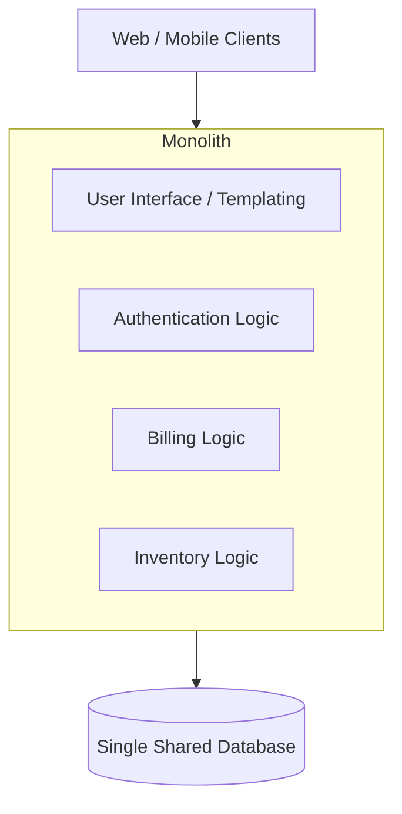

# 01.2. Monolithic Architecture Limitations

> [!abstract] Definition
> A monolithic architecture is the traditional unified model for the design of a software program. "Monolithic" means composed all in one piece.

## Structure of a Monolith
In a monolith, the User Interface, Business Logic, and Data Access layers are compiled into a single codebase, deployed as a single binary or application instance, and typically backed by a single, massive relational database.

## Critical Limitations

While monoliths are excellent for early-stage startups due to their simplicity, they become severe bottlenecks as the application and team size grow.

### 1. The "All or Nothing" Deployment (Slow Deployments)
Because everything is tightly coupled in one codebase, a developer changing a single line of code in the "Billing" module requires the *entire* application to be rebuilt, re-tested, and re-deployed. This slows down release cycles significantly.

### 2. Vertical vs. Horizontal Scaling Constraints
A monolith scales strictly as a single unit. If the "Inventory" module is experiencing heavy traffic, you cannot scale just the Inventory module. You must duplicate the *entire* monolith across multiple servers. This wastes immense CPU and RAM resources on modules that do not need scaling.

### 3. The "Blast Radius" (Lack of Fault Isolation)
In a tightly coupled monolith, a memory leak or a fatal bug in an obscure, non-critical feature (e.g., generating a PDF receipt) can crash the entire server process. If the process dies, the entire application—including critical features like login and checkout—goes offline. 

### 4. Technological Lock-in
If a monolith is built in Java 8, every single module must be written in Java 8. It is exceptionally difficult to adopt new, better-suited languages (like using Python for a machine learning module) without undertaking a massive rewrite of the entire system.