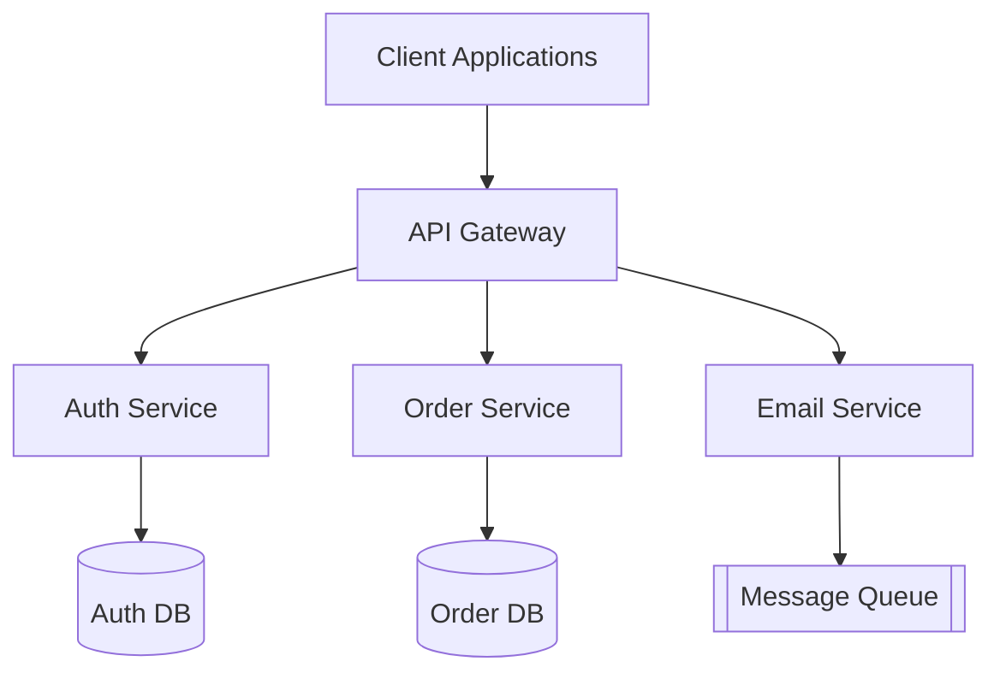

# 01.3. Microservices Core Characteristics

> [!abstract] Overview
> Microservices architecture is an approach to developing a single application as a suite of small, autonomous services, each running in its own process and communicating with lightweight mechanisms (usually HTTP REST APIs).

## Core Defining Traits

To qualify as a true microservice (and not just a "distributed monolith"), a component must exhibit the following characteristics:

### 1. Single Responsibility (Bounded Context)
A microservice executes **one specific business task** and does it perfectly. 
*Example: An "Email Service" is strictly responsible for rendering and sending emails. It knows nothing about user billing or product inventory.*

### 2. Extreme Autonomy and Independence
A microservice must be completely independent of other services. 
* **Independent Deployment**: You must be able to deploy a new version of the Email Service without restarting or deploying any other service.
* **Independent Data**: Ideally, each microservice owns its own database. The Billing service cannot directly query the User service's database using SQL; it must ask the User service via an API call.

### 3. Asynchronous and Scalable by Design
Microservices are built to scale independently. If the "Order Processing" service is overwhelmed during Black Friday, you can spin up 50 instances of the Order service while leaving the "User Profile" service at just 2 instances.

> [!tip] Reminder for Students
> Code structure does not define a microservice. You can have beautifully separated folders in a project, but if they are deployed together and share a single database, it is still a monolith. **Microservices are defined by their deployment and network boundaries.**