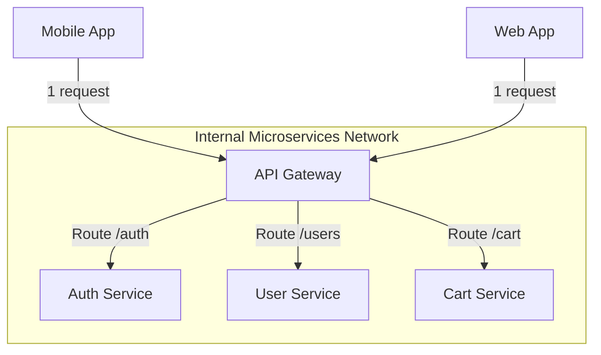

# 01.5. API Gateway Pattern and Responsibilities

> [!abstract] The Problem
> If you have 50 microservices, a mobile app cannot possibly memorize 50 different IP addresses. Furthermore, it would be inefficient for the mobile app to make 50 separate HTTP requests to authenticate, fetch user data, and fetch order data.

## What is an API Gateway?
An API Gateway is a server that acts as the single point of entry into a microservices architecture. It sits between the client applications and the internal microservices.

## Core Responsibilities

1. **Request Routing**: The Gateway inspects the URL (e.g., `/api/users`) and forwards the request to the exact internal IP address of the User Service.
2. **Authentication & Authorization**: Instead of every single microservice validating a JWT token independently, the Gateway validates the token once at the edge. If the token is invalid, the Gateway rejects the request before it ever reaches the internal network.
3. **Rate Limiting & Throttling**: The Gateway protects backend services from DDoS attacks or spam by limiting how many requests a single IP can make per second.
4. **Response Aggregation (BFF - Backend for Frontend)**: The Gateway can take a single request from a mobile app, make three internal requests to three different services, combine the JSON results, and send one clean response back to the client.

> [!example] Real-World Implementations
> Industry-standard API Gateways include **Kong**, **Traefik**, **Nginx**, and cloud-managed solutions like **AWS API Gateway**.