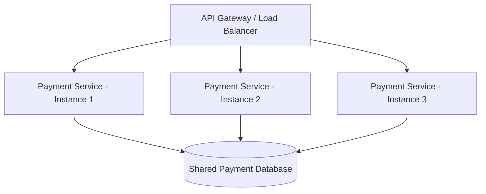

# 01.6. Service Layer and Microservice Replication

> [!info] The Execution Environment
> The Service Layer is where your actual business logic lives. In our context, this is where you deploy your Django REST Framework applications.

## Characteristics of the Service Layer

### 1. Specific Business Logic
Each microservice in the service layer implements a highly specific domain. For example, a "Payment Service" contains only the logic required to process credit cards, issue refunds, and communicate with Stripe or PayPal.

### 2. Replication for Scalability and Availability
A single instance of a microservice represents a single point of failure and a throughput bottleneck. To achieve high availability and scalability, microservices are **replicated**.

* **What is Replication?** Running multiple identical clones (instances) of the same microservice simultaneously.
* **How it works**: The API Gateway or a Load Balancer distributes incoming HTTP requests evenly across these clones (Round Robin, Least Connections, etc.).
* **The Stateless Rule**: For replication to work seamlessly, the service must be **stateless**. If Instance A saves user data in its local computer memory, and the next request goes to Instance B, the data will be missing. State must always be delegated to an external database or cache (like Redis).

### Popular Frameworks
While this vault focuses on **Django** (Python), the beauty of microservices is polyglot architecture. The service layer can easily consist of a mix of:
* Python: Django, FastAPI
* Java/Kotlin: Spring Boot
* TypeScript: NestJS, Express
* Go: Fiber, Gin