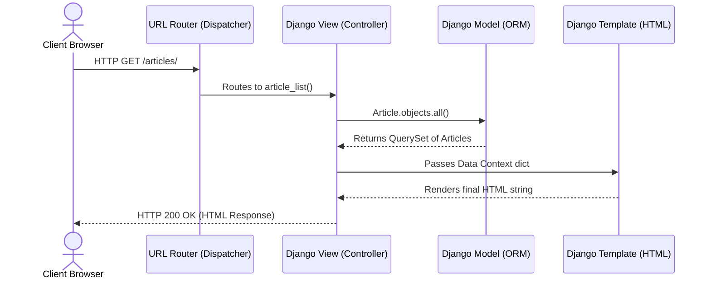

# 02.2. Django Architectural Philosophy and MVT Pattern

> [!info] Introduction to Django
> Created in 2005, Django is a high-level, open-source Python web framework. Its philosophy is "The web framework for perfectionists with deadlines," aiming for rapid development, built-in security, and extreme scalability.

## The MVT Architecture

Django is heavily inspired by the classic **MVC (Model-View-Controller)** pattern used in traditional software engineering. However, Django uses its own terminology: the **MVT (Model-View-Template)** pattern.

### Why MVT?
In traditional MVC, the developer writes a "Controller" that routes traffic and orchestrates logic. In Django, **the framework itself acts as the Controller**. The developer is only responsible for the Model, the View, and the Template.

### 1. The Model (Data Access Layer)
* **Equivalent to MVC**: Model
* **Role**: Represents the database schema as Python classes. It handles data validation, behaviors, and interacts with the database via Django's Object-Relational Mapping (ORM) engine, eliminating the need to write raw SQL.

### 2. The View (Business Logic Layer)
* **Equivalent to MVC**: Controller
* **Role**: The View is a Python function (or class) that receives the HTTP Web Request. It contains the business logic. It queries the **Model** for data, applies rules, and passes that data to the **Template** to be rendered, ultimately returning an HTTP Web Response.

### 3. The Template (Presentation Layer)
* **Equivalent to MVC**: View
* **Role**: A text file (usually HTML) containing Django Template Language (DTL) tags. It defines *how* the data should be presented to the user. It contains no business logic, only presentation formatting.

> [!tip] Terminology Trap
> The most confusing part for beginners: What MVC calls a "View" (the UI), Django calls a "Template". What MVC calls a "Controller" (the logic), Django calls a "View". Memorize this distinction early!