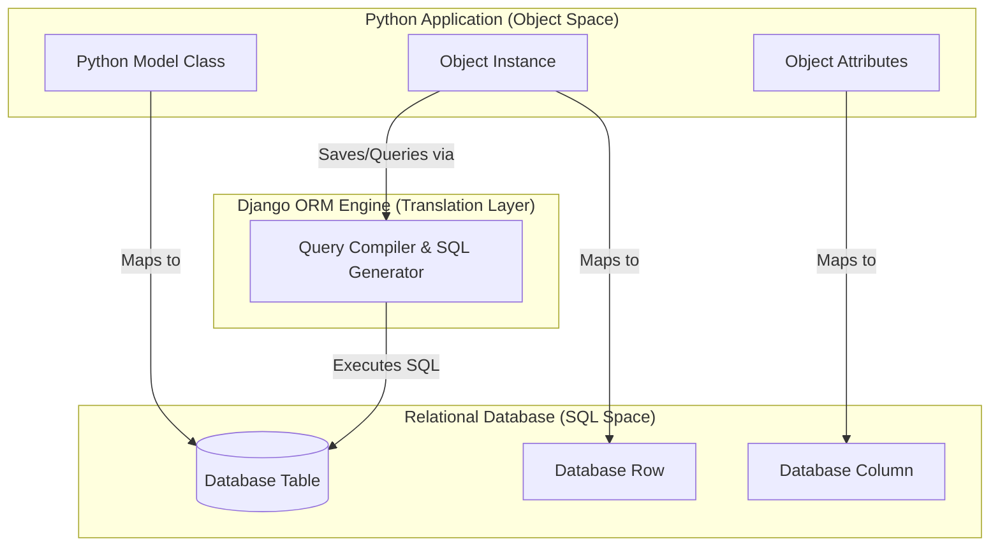

# 3.1. Object-Relational Mapping Principles

## 1. Background and Context
When building backend applications, developers face an architectural disconnect between application code and relational databases. This is known as the **Object-Relational Impedance Mismatch**. 
* **Object-Oriented Programming (OOP)** is based on concepts like classes, instances, inheritance, encapsulation, and associations.
* **Relational Database Management Systems (RDBMS)** are based on mathematical relations (tables), attributes (columns), tuples (rows), and relational algebra.

To bridge this conceptual gap, we use an **Object-Relational Mapper (ORM)**. The ORM acts as a translation layer, transforming object-oriented operations into SQL queries and mapping raw SQL database rows back into application objects.

## 2. Django's ORM Mapping Paradigms
Django implements the **Active Record Pattern**, where each model class represents a database table, and an instance of that class represents a single row in the database.

| Object-Oriented Concept (Python) | Relational Database Concept (SQL) | Example |
| :--- | :--- | :--- |
| **Model Class** (inheriting `models.Model`) | **Table** | `class Patient(models.Model)` $\rightarrow$ Table `app_patient` |
| **Class Attribute** (subclass of `models.Field`) | **Column** | `email = models.EmailField()` $\rightarrow$ Column `email` |
| **Object Instance** (instantiated python object) | **Row / Tuple** | `patient_john = Patient(id=1)` $\rightarrow$ Row with ID 1 |
| **QuerySet** (Django's database querying API) | **SQL Query Result Set** | `Patient.objects.all()` $\rightarrow$ `SELECT * FROM app_patient` |

## 3. Advantages and Trade-offs of an ORM

### Advantages
1. **Database Abstraction & Portability**: You write database operations in Python. If you switch the database engine from SQLite (development) to PostgreSQL (production), the ORM changes the dialect automatically without rewriting code.
2. **Security**: Django's ORM parameterizes queries automatically. This neutralizes the risk of **SQL Injection (SQLi)** attacks because data inputs are never directly concatenated into raw SQL strings.
3. **Rapid Development**: Standard operations (CRUD) do not require writing repetitive, error-prone SQL code.
4. **Schema Migrations**: Schema updates are managed inside Python code, tracking changes over time.

### Trade-offs & Limitations
1. **The N+1 Query Problem**: This occurs when retrieving a list of parent items along with their children. If you fetch 100 books and access each book's author, the ORM might execute 1 query to get the books, followed by 100 queries to get each author. This can be resolved using optimization methods like `select_related` and `prefetch_related`.
2. **Performance Overhead**: Compiling Python code into SQL queries and parsing database records into Python objects introduces computational overhead compared to optimized, raw SQL queries.
3. **Complex Queries**: While the ORM is powerful, highly analytical queries containing multiple subqueries, window functions, or complex joins can be difficult to express cleanly in Python, sometimes requiring raw SQL.

## 4. Common Misunderstandings & Student Traps
* **Thinking the Database updates instantly**: Instantiating a model object in Python (e.g., `p = Patient(name="Alice")`) does not write to the database. The record is only saved when `.save()` is called or if `Patient.objects.create()` is used.
* **Lazy Evaluation Confusion**: QuerySets are lazy. Writing `patients = Patient.objects.all()` does not trigger a database access. The actual database query runs only when the QuerySet is evaluated (e.g., during iteration, slicing, or conversion to a list).