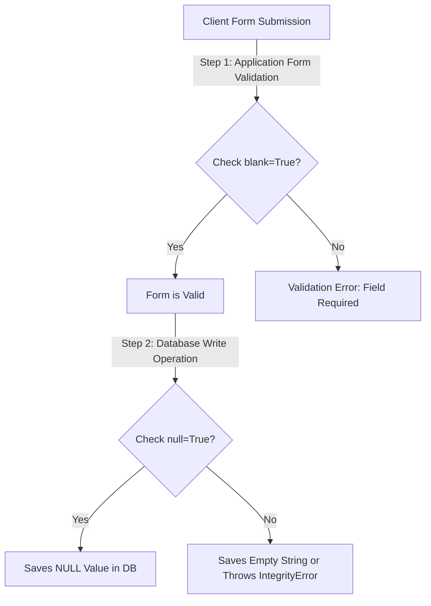

# 3.3. Database Schema Field Options

## 1. Key Field Configuration Parameters
Field options customize the validation, representation, and constraints of database columns.

### `null` vs. `blank`
The distinction between `null` and `blank` is a common source of confusion in Django development.

* **`null`**: A database-level concept. If `null=True`, Django generates the database column with the `NULL` constraint, allowing empty records in that column.
* **`blank`**: An application-level validation concept. If `blank=True`, Django's form validation allows the field to be submitted empty. If `blank=False`, Django forms require a value.

| Setting Configurations | Database Behavior | Form / API Input Behavior | Common Use Cases |
| :--- | :--- | :--- | :--- |
| `null=False, blank=False` | `NOT NULL` constraint | Required field | Standard mandatory fields (e.g., Username, Email). |
| `null=True, blank=True` | Allows `NULL` values | Optional field | Optional numeric, date, or relational fields. |
| `null=False, blank=True` | `NOT NULL` constraint | Optional field | **Avoid for Dates/Numbers**. Used for standard string fields (`CharField`, `TextField`) where empty submissions are saved as empty strings (`""`) rather than `NULL`. |
| `null=True, blank=False` | Allows `NULL` values | Required field | Rarely used. Requires form input on submission, but permits NULL in direct database operations. |



## 2. Additional Field Constraints and Modifiers

### `default`
Defines a default fallback value if none is provided.
```python
is_verified = models.BooleanField(default=False)
```
* **Tip**: If assigning a dynamic default value (like a timezone-aware timestamp or UUID), pass the callable function reference itself (e.g., `timezone.now`) rather than executing it (do not use `timezone.now()`). Executing it will evaluate the timestamp once when Django compiles, setting the same static date for every record created until the server restarts.

### `unique`
Enforces a unique constraint on the column at the database level.
```python
registration_id = models.CharField(max_length=50, unique=True)
```

### `choices`
Restricts field inputs to a pre-defined set of key-value pairs. Django generates select widgets and applies form-level choices validation automatically.
```python
class Patient(models.Model):
    GENDER_CHOICES = [
        ('M', 'Male'),
        ('F', 'Female'),
        ('O', 'Other'),
    ]
    gender = models.CharField(max_length=1, choices=GENDER_CHOICES, default='M')
```

### `auto_now` vs. `auto_now_add`
Used for date and time fields to handle audit trails:
* **`auto_now`**: Updates the field to the current timestamp **every time** the model instance is saved (`p.save()`). This is used for "last modified" fields.
* **`auto_now_add`**: Sets the field to the current timestamp **only once** when the model instance is first created. This is used for "created at" timestamps.
* **Trap**: Both options set `editable=False` and `blank=True` automatically. You cannot override these values manually during creation or updates without removing these options.