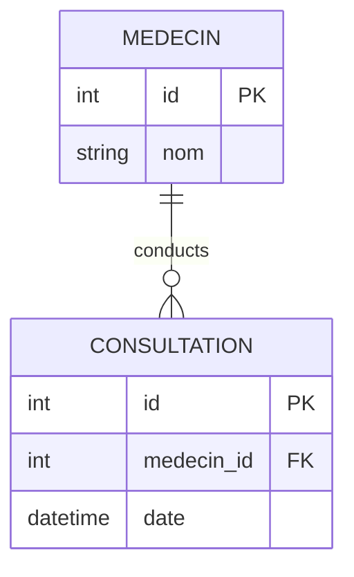

# 3.5. Model Relationships One-to-Many Relationships

## 1. Declaring One-to-Many Relationships
In relational database design, a **One-to-Many** relationship is established by adding a foreign key column to the "many" table that reference the primary key of the "one" table.

In Django, this is represented using the `models.ForeignKey` field, which must be declared on the model representing the "many" side of the relationship.



### Python Implementation
```python
from django.db import models

class Medecin(models.Model):
    nom = models.CharField(max_length=100)
    specialite = models.CharField(max_length=50)

    def __str__(self):
        return f"Dr. {self.nom}"

class Consultation(models.Model):
    medecin = models.ForeignKey(Medecin, on_delete=models.CASCADE, related_name='consultations')
    date = models.DateTimeField()
    diagnostic = models.TextField()

    def __str__(self):
        return f"Consultation on {self.date} with Dr. {self.medecin.nom}"
```

## 2. Deep-Dive: The `on_delete` Parameter
The `on_delete` parameter defines how the database handles referential integrity when a referenced object is deleted. This setting is required for all foreign keys.

* **`models.CASCADE`**: When the referenced object is deleted, also delete the objects pointing to it. 
  * *Example*: Deleting a `Medecin` will delete all of their associated `Consultation` records.
* **`models.PROTECT`**: Prevents deletion of the referenced object by raising a `ProtectedError` if there are any dependent records.
  * *Example*: You cannot delete a `Medecin` if they still have scheduled `Consultation` records on file.
* **`models.SET_NULL`**: Sets the foreign key to `NULL`. This option requires setting `null=True` on the field.
  * *Example*: If a doctor leaves the facility, their consultations remain on file but are set to `NULL` for audit history.
* **`models.SET_DEFAULT`**: Sets the foreign key to its default value. This requires a default value to be configured for the field.
* **`models.DO_NOTHING`**: Takes no action. This relies on backend database triggers to manage the relationship, otherwise it can result in database integrity errors.

## 3. Reverse Relationships and `related_name`
By default, Django provides a reverse relation from the parent model to its children. This default relation uses the child model name lowercase, suffixed with `_set` (e.g., `medecin_instance.consultation_set.all()`).

The `related_name` parameter overrides this default name with a custom descriptor, making your code more readable:
```python
# With related_name='consultations' defined in the field:
doctor = Medecin.objects.get(id=1)
all_consultations = doctor.consultations.all()
```

### Trap to Avoid
If you have multiple foreign keys on a single model pointing to the same target model, Django will raise a validation conflict because the auto-generated `_set` names collide. You must specify a unique `related_name` for each foreign key to resolve this.
```python
class Shift(models.Model):
    # This requires distinct related_names to avoid naming collisions
    primary_doctor = models.ForeignKey(Medecin, on_delete=models.CASCADE, related_name='primary_shifts')
    on_call_doctor = models.ForeignKey(Medecin, on_delete=models.CASCADE, related_name='on_call_shifts')
```